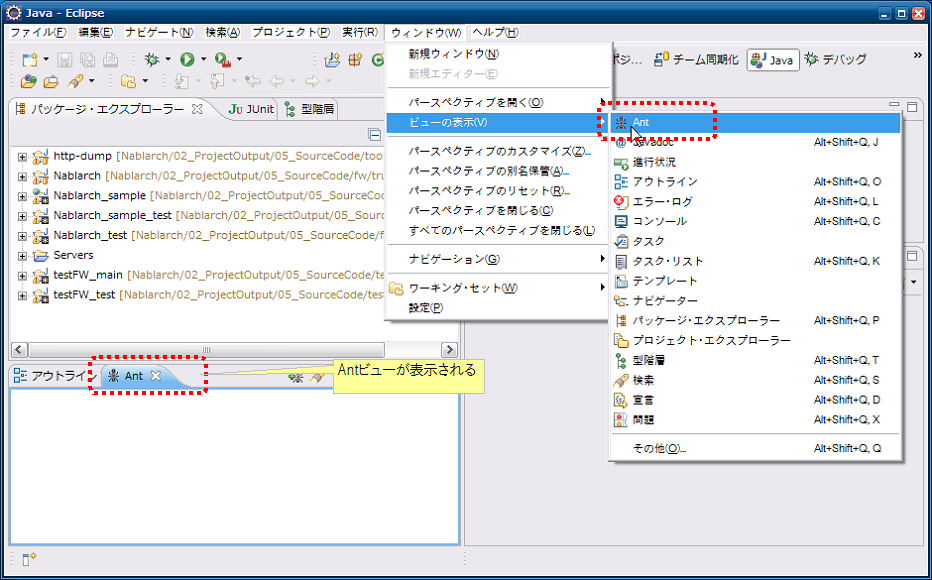
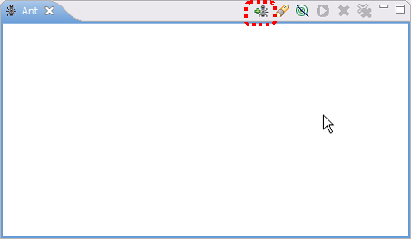
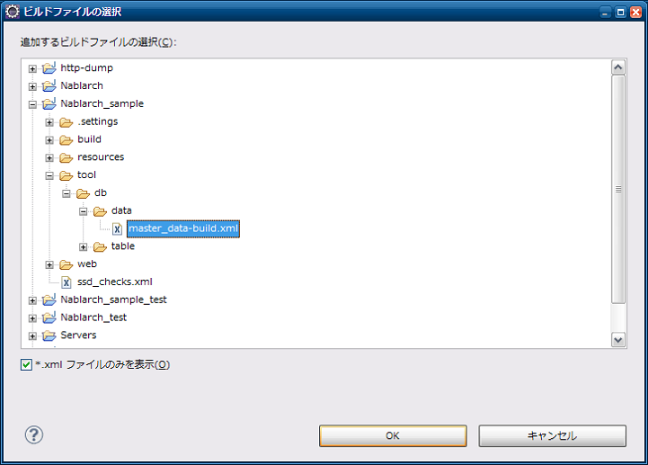

# マスタデータ投入ツール インストールガイド

[マスタデータ投入ツール](../../development-tools/toolbox/toolbox-02-MasterDataSetup.md) のインストール方法について説明する。

## 前提事項

* Eclipseがインストール済みであること
* テーブルが作成済みであること
* バックアップ用スキーマにテーブルが作成済みであること [1]

バックアップ用スキーマおよびそのテーブルの作成については、
『 [マスタデータ復旧機能](../../development-tools/testing-framework/testing-framework-04-MasterDataRestore.md) 』の [環境構築](../../development-tools/testing-framework/testing-framework-04-MasterDataRestore.md#環境構築) を参照。

## 提供方法

本ツールはNablarchのサンプルアプリケーションに同梱して提供する。本ツールのツール構成を下記に示す。

| ファイル名 | 説明 |
|---|---|
| master_data-build.properties | 環境設定用プロパティファイル |
| master_data-build.xml | Antビルドファイル |
| master_data-log.properties | ログ出力プロパティファイル |
| MASTER_DATA.xls | マスタデータファイル |

### プロパティファイルの書き換え

マスタデータ自動復旧機能が使用する、バックアップスキーマ名を設定する。

```bash
# テスト用マスタデータバックアップスキーマ名
masterdata.test.backup-schema=nablarch_test_master
```

その他の設定値については、ディレクトリ構造が変わらない限り修正の必要はない。

### 配置

サンプルアプリケーションと同様に、<mainプロジェクト>/tool/db/data直下に配置する。

## Eclipseとの連携設定

以下の設定をすることでEclipseから本ツールを起動することができる。

### Antビュー起動

ツールバーから、ウィンドウ(Window)→設定(Show View)を選択し、Antビューを開く。



### ビルドファイル登録

＋印のアイコンを押下し、ビルドスクリプトを選択する。



Antビルドファイル(master_data-build.xml)を選択する。



Antビューに登録したビルドファイルが表示されることを確認する。


