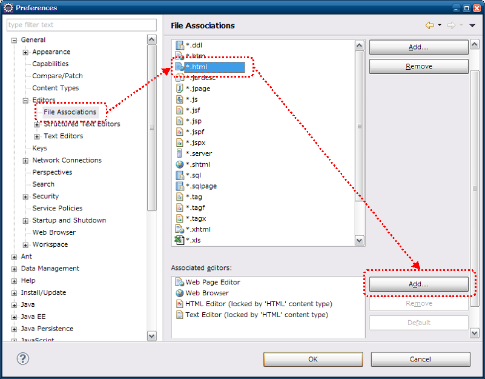
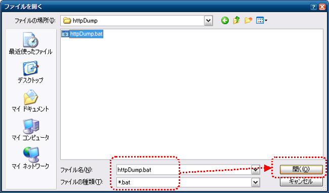

# リクエスト単体データ作成ツール インストールガイド

[リクエスト単体データ作成ツール](../../development-tools/toolbox/toolbox-01-httpdumptool-index.md) のインストール方法について説明する。

## 前提事項

本ツールを使用する際、以下の前提事項を満たす必要がある。

* javaコマンドがパスに含まれていること
* htmlファイルがブラウザに関連付けされていること
* ブラウザのプロキシ設定で、localhostが除外されていること

## 提供方法

本ツールは、Nablarchのサンプルアプリケーションに同梱して提供する。
本ツールのツール構成を下記に示す。

| ファイル名 | 説明 |
|---|---|
| httpDump.bat | 起動バッチファイル（Windows用） |
| nablarch-tfw-X.X.jar | Nablarch Testing Framework のJARファイル（X.Xの部分はバージョン番号） |
| poi-X.X.jar | Apache POI のJARファイル（X.Xの部分はバージョン番号など） |
| jetty.jar | Jetty Server のJARファイル |
| jetty-util.jar | Jetty Utilities のJARファイル |
| servlet-api.jar | Servlet Specification 2.5 API のJARファイル |

各JARファイルへのクラスパスが設定されたhttpDump.batがサンプルアプリケーションの下記パスに配置されている。

```bash
/test/tool/httpDump.bat
```

## Eclipseとの連携

以下の設定をすることでEclipseから本ツールを起動することができる。

### 設定画面起動

ツールバーから、ウィンドウ(Window)→設定(Prefernce)を選択する。
左側のペインから一般(General)→エディタ(Editors)→ファイルの関連付け(File Associations)
を選択、右側のペインから*.htmlを選択し、追加(Add)ボタンを押下する。



### 外部プログラム選択

ラジオボタンから外部プログラム(External program)を選択し、参照(Browse)ボタンを押下する。


### 起動用バッチファイル（シェルスクリプト）選択

Windowsの場合はバッチファイル(httpDump.bat)を、
Linuxの場合はシェルスクリプト(httpDump.sh)を選択する。



### HTMLファイルからの起動方法

Eclipseのパッケージエクスプローラ等からHTMLファイルを右クリックし、
httpDumpで開くことでツールを起動できる。


