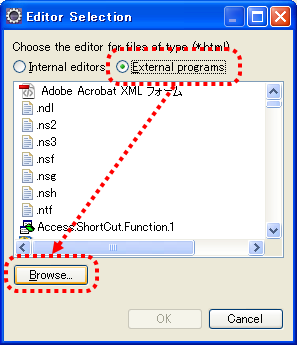
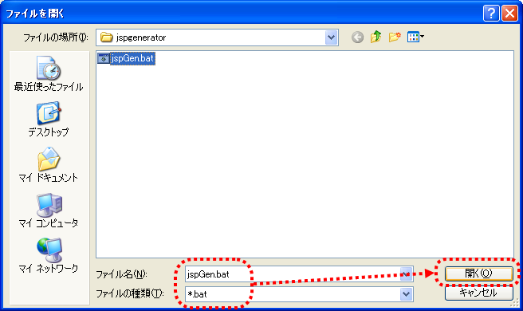

# JSP自動生成ツール インストールガイド

## 前提事項

本ツールを使用する際、以下の前提事項を満たす必要がある。

- javaコマンドがパスに含まれていること

<details>
<summary>keywords</summary>

JSP自動生成ツール, インストール前提条件, javaコマンド, パス設定

</details>

## 提供方法

本ツールはNablarchのサンプルアプリケーションに同梱して提供される。

**ツール構成ファイル**:

| ファイル名 | 説明 |
|---|---|
| jspGen.bat | 起動バッチファイル（Windows用） |
| jspGen.config | JSP自動生成ツールの設定ファイル |
| log.properties | ログ出力設定ファイル |
| nablarch-X.X.jar | Nablarch Application Framework のJARファイル（X.Xはバージョン番号） |
| nablarch-tfw-X.X.jar | Nablarch Testing Framework のJARファイル（X.Xはバージョン番号） |
| nablarch-toolbox-X.X.jar | Nablarch Toolbox のJARファイル（X.Xはバージョン番号） |

各JARファイルへのクラスパスが設定されたjspGen.batの配置先:

```bash
/Nablarch_sample/tool/jspgenerator/jspGen.bat
```

<details>
<summary>keywords</summary>

jspGen.bat, jspGen.config, log.properties, nablarch-X.X.jar, nablarch-tfw-X.X.jar, nablarch-toolbox, ファイル構成, サンプルアプリケーション同梱, 配置パス

</details>

## Eclipseとの連携

EclipseからJSP自動生成ツールを起動するための設定手順:

1. **設定画面起動**: ツールバーからウィンドウ(Window)→設定(Preference)を選択し、左ペインで一般(General)→エディタ(Editors)→ファイルの関連付け(File Associations)を選択する。右ペインで`*.html`を選択し、追加(Add)ボタンを押下する。
   

2. **外部プログラム選択**: ラジオボタンから外部プログラム(External program)を選択し、参照(Browse)ボタンを押下する。
   

3. **バッチファイル選択**: jspGen.batを選択する。Nablarch_sampleでは`/Nablarch_sample/tool/jspgenerator`配下にあらかじめ配置されている。
   

4. **HTMLファイルからの起動**: パッケージエクスプローラ等からHTMLファイルを右クリックし、「jspGenで開く」を選択することでツールを起動できる。
   

5. **生成ファイルの確認**: ツール実行により、HTMLファイルと同一ディレクトリにJSPファイルが生成される。JSPファイルを表示するには、同一ディレクトリを右クリックしてリフレッシュ(Refresh)を選択する。

<details>
<summary>keywords</summary>

Eclipse連携, 外部プログラム, ファイルの関連付け, JSP自動生成, HTMLファイル, jspGenで開く, JSPファイル生成

</details>
