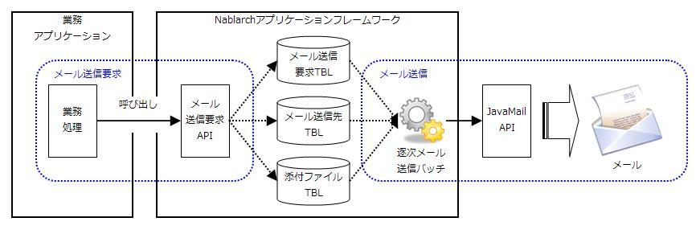

# メール送信処理のアプリケーション構造

## 概要

フレームワークのメール送信処理は、常駐バッチを経由し、業務アプリケーションの処理とは非同期に行う方式を採用している。
その理由は以下の通り。

* 業務アプリケーションから見て、メール送信処理を業務アプリケーションのDBトランザクションに含めることができる。
* メールサーバー障害やネットワーク障害によりメール送信が遅延もしくは失敗しても、業務アプリケーションの処理への影響を与えないようにすることができる。

上記方式を実現するため、本フレームワークは、業務アプリケーションからメール送信の要求データ(以下、メール送信要求)を
受け付けデータベースに格納するAPI(以下、メール送信要求API)と、
メール送信要求に基づいてメールを送信する常駐バッチ(以下、逐次メール送信バッチ)を提供する。

アプリケーションプログラマは、本フレームワークが提供するメール送信要求APIを呼び出すだけでよい。
メール送信要求は、業務アプリケーションがメール送信要求APIを呼び出す毎に一つ作成され、メール送信要求一つにつきメールが一通送信される。

なお、逐次メール送信バッチでは、メール送信ライブラリとして、 [JavaMail API](http://www.oracle.com/technetwork/java/javamail/index.html) を使用する。

本フレームワークのメール送信処理の概要を下図に示す。

## メール送信のパターン

本フレームワークのメール送信要求APIは、下記2パターンのメール送信をサポートしている。

| No | パターン | 説明 |
|---|---|---|
| 1 | 定型メール送信 | 予めデータベースに登録されたテンプレートを元にメールを作成・送信する。 テンプレートの可変部分にはプレースホルダを用意し、メールデータ作成時に 本フレームワークが各プレースホルダを業務アプリケーションから指定された文字列に 置き換える。 |
| 2 | 非定型メール送信 | 任意の件名・本文でメールを作成・送信する。 |

## テーブル定義

本フレームワークのメール送信で使用するテーブル定義を下記に示す。

* テーブル名・カラム名は任意に指定できる。
* データベースの型は、Javaの型に変換可能な型を選択する。

なお、サンプルアプリケーションのテーブル定義はテーブル定義書を参照。

### メール送信要求

| 定義 | Javaの型 | 制約 |
|---|---|---|
| メール送信要求ID | java.lang.String | PK |
| 件名 | java.lang.String |  |
| 送信者メールアドレス | java.lang.String |  |
| 返信先メールアドレス | java.lang.String |  |
| 差戻し先メールアドレス | java.lang.String |  |
| 文字セット | java.lang.String |  |
| ステータス | java.lang.String |  |
| 要求日時 | java.sql.Timestamp |  |
| 送信日時 | java.sql.Timestamp |  |
| 本文 | java.lang.String |  |

### メール送信先

| 定義 | Javaの型 | 制約 |
|---|---|---|
| メール送信要求ID | java.lang.String | PK |
| 連番 | int | PK |
| 送信先区分 | java.lang.String |  |
| メールアドレス | java.lang.String |  |

### メール添付ファイル

| 定義 | Javaの型 | 制約 |
|---|---|---|
| メール送信要求ID | java.lang.String | PK |
| 連番 | int | PK |
| 添付ファイル名 | java.lang.String |  |
| 添付ファイルContent-Type | java.lang.String |  |
| 添付ファイル | byte[] |  |

### メールテンプレート

| 定義 | Javaの型 | 制約 |
|---|---|---|
| メールテンプレートID | java.lang.String | PK |
| 言語 | java.lang.String | PK |
| 件名 | java.lang.String |  |
| 本文 | java.lang.String |  |
| 文字セット | java.lang.String |  |
