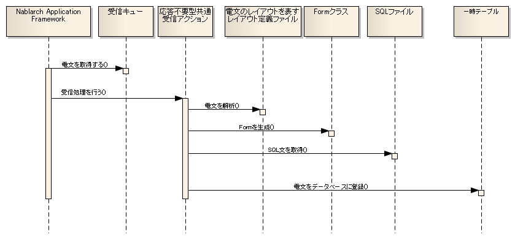

# 応答不要型メッセージ受信処理のアプリケーション構造

## 概要

受信した電文をデータベースの一時テーブル（電文受信テーブル）に保存するための共通アクションクラスが提供されている。このアクションを使用する場合、アプリケーション開発者が作成する必要がある成果物は以下のみ：

1. 電文のレイアウトを表すフォーマット定義ファイル
2. データベースへ電文を登録するためのINSERT文（SQLファイル）
3. データベースへ電文を登録する際に使用するFormクラス
4. 電文を登録するための一時テーブル

各成果物の実装方法は :ref:`mqDelayedReceiveTitle` を参照。

> **注意**: 共通のアクションで保存した電文は、後続処理（常駐バッチ）で処理を行うこと。バッチ処理の実装方法は [../../04_Explanation_batch/index](../nablarch-batch/nablarch-batch-04_Explanation_batch.md) を参照。

keywords

応答不要型メッセージ受信処理, 電文受信テーブル, フォーマット定義ファイル, INSERT文, Formクラス, 常駐バッチ, 共通受信アクション

## クラス構造

keywords

クラス構造, 応答不要型メッセージ受信, クラス図

## 処理の流れ

1. Nablarch Application Frameworkは受信した電文毎に応答不要型共通受信アクションを起動する。
2. 応答不要型共通受信アクションは、フォーマット定義ファイルを元に電文の解析を行う。
3. 解析した電文を元にFormクラスを生成する。
4. SQLファイルから一時テーブルへ電文を登録するためのINSERT文を取得する。
5. FormクラスおよびINSERT文を使用して一時テーブルへ電文を保存する。

keywords

処理の流れ, 電文解析, Formクラス生成, 一時テーブル登録, シーケンス図, 応答不要型共通受信アクション

