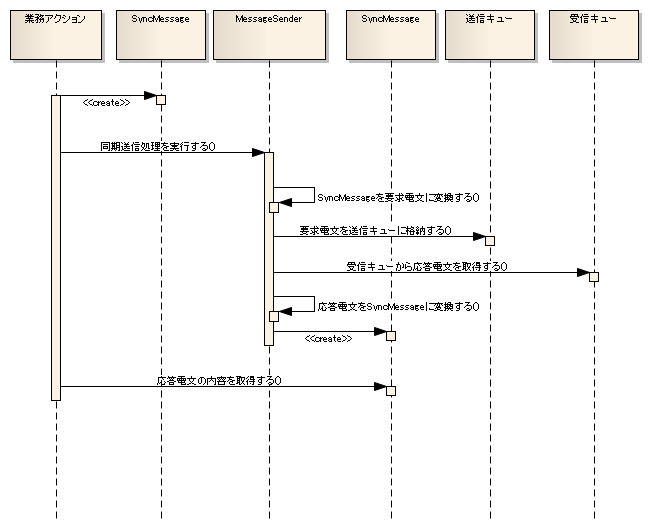

# 同期応答メッセージ送信処理のアプリケーション構造

## 概要

同期応答メッセージ送信にはユーティリティクラス(`MessageSender`)を使用する。アプリケーションプログラマはフォーマット定義ファイルを作成し、フィールド名をキーに持つMap型データを使用して送受信データを受け渡す実装のみ行う。

keywords

MessageSender, SyncMessage, 同期応答メッセージ送信, ユーティリティクラス, フォーマット定義ファイル, Map型データ

## クラス構造

同期応答メッセージ送信には`MessageSender`の以下のメソッドを使用する:

| メソッド | 説明 |
|---|---|
| `SyncMessage sendSync(SyncMessage requestMessage) throws MessageSendSyncTimeoutException` | 同期応答メッセージを送信する。タイムアウトが発生し正常終了しなかった場合は`MessageSendSyncTimeoutException`をスロー。 |

keywords

MessageSender, SyncMessage, MessageSendSyncTimeoutException, sendSync, クラス構造, 同期応答メッセージ送信メソッド

## 処理の流れ

1. 業務ActionはSyncMessageにリクエストIDとリクエストパラメータを設定し、`MessageSender.sendSync()`を呼び出す。
2. `MessageSender`はSyncMessageから要求電文を生成し、送信キューにPUT。
3. 後続処理が送信キューから電文を取得(GET)し、業務処理後に応答電文を受信キューにPUT。
4. `MessageSender`が受信キューから応答電文を取得(GET)。
5. `MessageSender`が応答電文の解析結果をSyncMessageに格納し、業務Actionに返却。

> **注意**: ここでのリクエストIDは送信先システムの機能を一意に識別するIDであり、画面オンライン処理やバッチ処理のリクエストIDとは意味が異なる。このリクエストIDに基づき、要求電文・応答電文のフォーマット、送信キュー名、受信キュー名が決定する。

keywords

MessageSender, SyncMessage, sendSync, 送信キュー, 受信キュー, リクエストID, 処理フロー, 同期応答メッセージ

