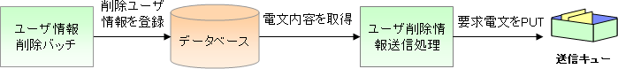

# 応答不要メッセージ送信処理

[ユーザ削除情報電文送信処理](../../guide/mom-messaging/mom-messaging-01-userDeleteInfoMessageSendSpec.md#userdeleteinfomessagesendspec) を例に、応答不要メッセージ送信処理の実装方法を説明する。



> **Note:**
> 電文送信用のデータを保存する処理（上記画像のユーザ情報削除バッチ部分）は、
> データベースへのデータINSERTのみで実現出来るため、本項での説明は行わない。
> 以下のドキュメントを参照し実装を行うこと。

> * >   [業務アプリケーションの実装方法 (バッチ処理編)](../../guide/nablarch-batch/nablarch-batch-04-Explanation-batch.md)
> * >   [業務アプリケーションの実装方法 (画面オンライン処理編)](../../guide/web-application/web-application-04-Explanation.md)
> * >   [データベースアクセス実装例集](../../guide/web-application/web-application-01-DbAccessSpec-Example.md)

## アプリケーション開発者が実装する成果物

[応答不要メッセージ送信処理のアプリケーション構造](../../guide/mom-messaging/mom-messaging-04-explanation-delayed-send-02-basic.md#messagedelayedsenddesign) からわかるように、電文を送信するアクションはNablarchの一部として提供される。
このため、アプリケーション開発者は電文を送信するために必要となる下記成果物のみを作成すれ良い。

* 送信電文を作成するためのデータを保持するテーブル(以降、一時テーブルと呼ぶ)
* 電文のレイアウトを定義したフォーマット定義ファイル
* 下記3種類のSQL文が記述されたSQLファイル

  * 電文送信テーブルからステータスが未送信のデータを取得するためのSELECT文
    条件には、未送信であることを含める必要がある。
  * 電文送信後に、該当データのステータスを処理済みに更新するためのUPDATE文
  * 電文送信に失敗した場合に、該当データのステータスを送信失敗(エラー)に更新するためのUPDATE文
* 一時テーブルの処理ステータスを更新するためのFormクラス

  > **Note:**
> Formクラスは、各アプリケーションプログラマが作成する必要はない。詳細は、 [Formクラスの実装例](../../guide/mom-messaging/mom-messaging-03-mqDelayedSend.md#sendformsample) を参照。

## フォーマット定義ファイル

電文の業務電文部がどのようなレイアウトで構成されているかを表すフォーマット定義ファイルを作成する。
フォーマット定義ファイルは、外部インタフェース設計書を入力元として、フォーマット定義ファイル自動生成ツールを使用して作成する。

* フォーマット定義ファイルのファイル名は、「送信電文のリクエストID + "_SEND.fmt"」とする。

参考として、サンプルで使用しているフォーマット定義ファイルを以下に示す。

```bash
#-------------------------------------------------------------------------------
# ユーザ削除情報電文のフォーマット
#-------------------------------------------------------------------------------
text-encoding:    "MS932" # 文字列型フィールドの文字エンコーディング
record-length:    270     # 各レコードの長さ
file-type:        "Fixed" # 固定長

[userData] # データレコード
1   userId                      X(10)       # ユーザID
11  ?filler1                    X(10)       # 空白領域
21  kanjiName                   N(100)      # 漢字氏名
121 kanaName                    N(100)      # カナ氏名
221 ?filler1                    X(50)       # 空白領域
```

## 一時テーブル

電文を送信するためのデータは、電文の種類ごとに専用の一時テーブルから取得する。
このため、一時テーブルを下記ルールに従い定義すること。

* 主キーは、電文を一意に識別するためのID（採番機能などで採番した一意の値）を格納するカラムとすること
  格納する値及び桁数は各プロジェクトの方式設計に従い定義すること。
* テーブルの属性情報には、送信する電文の各項目に対応するカラムを定義すること。
* 各プロジェクトの方式に合わせて共通項目（登録ユーザIDや登録日時など)を定義する

### 実際のテーブル定義の例

参考として、サンプルアプリケーションで電文を保存するテーブルを以下に示す。

* 主キー

| カラム論理名 | 定義 |
|---|---|
| 送信電文連番 | CHAR(10) |

* 属性項目(電文の項目に対応したカラム)

| カラム論理名 | 定義 |
|---|---|
| ユーザID | CHAR(10) |
| 漢字名称 | NVARCHAR2(100) |
| カナ名称 | NVARCHAR2(100) |
| ステータス | CHAR(1) |

* 共通項目

| カラム論理名 | 定義 |
|---|---|
| 登録ユーザID | CHAR(10) |
| 登録日時 | TIMESTAMP |
| 更新ユーザID | CHAR(10) |
| 更新日時 | TIMESTAMP |
| 登録リクエストID | CHAR(10) |
| 登録実行時ID | CHAR(29) |

## Formクラス

Formクラスは、一時テーブルのステータスを更新するために使用する。
このFormクラスは、ステータス更新専用のクラスとなるため、プロパティとして一時テーブルの属性を全て保持する必要はない。
また、一時テーブルの主キー及びデータ更新時に値を更新する共通項目のカラム名をプロジェクトで統一することにより、
単一のFormクラスで全ての電文送信処理のステータス更新が行えるようになる。

参考として、サンプルで使用しているフォームクラスを以下に示す。

> **Note:**
> サンプルアプリケーションでは以下のルールで統一しているため、
> 単一のFormクラスで全ての応答不要メッセージ送信処理のステータス更新を行うことが出来る。

> * >   主キーは、送信電文連番(物理名:SEND_MESSAGE_SEQUENCE)
> * >   データ更新時に、値を更新するカラムは下記2カラム

>   * >     更新ユーザID(物理名:UPDATED_USER_ID)
>   * >     更新一時(物理名:UPDATED_DATE)

> Formクラスは下記設定例のようにAsyncMessageSendActionSettingsのformClassNameプロパティに指定する。

> ※この設定値は、アーキテクトなどが設定するものであり個々の開発者が設定する必要はない。

```xml
<!-- メッセージ送信アクション用の設定 -->
<component name="asyncMessageSendActionSettings"
    class="nablarch.fw.messaging.action.AsyncMessageSendActionSettings">
  <!-- 使用するFormクラスの設定 -->
  <property name="formClassName"
      value="nablarch.sample.messaging.form.SendMessagingForm" />
</component>
```

```java
package nablarch.sample.messaging.form;

import java.sql.Timestamp;
import java.util.Map;

import nablarch.core.db.statement.autoproperty.CurrentDateTime;
import nablarch.core.db.statement.autoproperty.UserId;

/**
 * メッセージ送信用の一時テーブルを更新するためのFormクラス。
 *
 * @author hisaaki sioiri
 * @since 1.1
 */
public class SendMessagingForm {

    /** 送信電文連番 */
    private String sendMessageSequence;

    /** 更新ユーザID */
    @UserId
    private String updatedUserId;

    /** 更新日時 */
    @CurrentDateTime
    private Timestamp updatedDate;

    /**
     * コンストラクタ。
     * @param data 入力データ
     */
    public SendMessagingForm(Map<String, ?> data) {
        sendMessageSequence = (String) data.get("sendMessageSequence");
        updatedUserId = (String) data.get("updatedUserId");
        updatedDate = (Timestamp) data.get("updatedDate");
    }
}
```

## SQLファイル

[一時テーブル](../../guide/mom-messaging/mom-messaging-03-mqDelayedSend.md#message-send-table) を操作するための下記3種類のSQL文を定義すること。

* 未送信のデータを取得するSELECT文
* ステータスを処理済みに更新するUPDATE文
* ステータスをエラーに更新するUPDATE文

**SQLファイルは、下記ルールに準拠すること**

* SQLファイル名は、「送信電文のリクエストID + ".sql"」であること。
* SQL_IDは、以下のとおりであること。

  | SQLの種類 | SQL_ID |
  |---|---|
  | 未送信のデータを取得するSELECT文 | SELECT_SEND_DATA |
  | ステータスを処理済みに更新するUPDATE文 | UPDATE_NORMAL_END |
  | ステータスをエラーに更新するUPDATE文 | UPDATE_ABNORMAL_END |
* SQLファイルの配置ディレクトリは、下記設定例のようにAsyncMessageSendActionSettingsのsqlFilePackageプロパティに設定されたディレクトリとすること。

  ※この設定値は、アーキテクトなどが設定するものであり個々の開発者が設定する必要はない。

  ```xml
  <!-- メッセージ送信アクション用の設定 -->
  <component name="asyncMessageSendActionSettings"
      class="nablarch.fw.messaging.action.AsyncMessageSendActionSettings">
    <!-- SQLファイルの配置ディレクトリ -->
    <property name="sqlFilePackage" value="nablarch.sample.messaging.sql" />
  </component>
  ```

参考として、サンプルで使用しているSQLファイルを以下に示す。

```sql
--******************************************************************************
-- ユーザ削除情報メッセージ送信用のデータを取得する
--******************************************************************************
SELECT_SEND_DATA =
SELECT
    SEND_MESSAGE_SEQUENCE,
    USER_ID,
    KANJI_NAME,
    KANA_NAME,
    STATUS,
    INSERT_USER_ID,
    INSERT_DATE,
    INSERT_REQUEST_ID,
    INSERT_EXECUTION_ID,
    UPDATED_USER_ID,
    UPDATED_DATE
FROM
    DELETE_USER_SEND_MESSAGE
WHERE
    STATUS = '0'
ORDER BY
    SEND_MESSAGE_SEQUENCE

--******************************************************************************
-- ステータスを送信済みに更新する
--******************************************************************************
UPDATE_NORMAL_END =
UPDATE
    DELETE_USER_SEND_MESSAGE
SET
    STATUS = '1',
    UPDATED_USER_ID = :updatedUserId,
    UPDATED_DATE = :updatedDate
WHERE
    SEND_MESSAGE_SEQUENCE = :sendMessageSequence

--******************************************************************************
-- ステータスをエラーに更新する
--******************************************************************************
UPDATE_ABNORMAL_END =
UPDATE
    DELETE_USER_SEND_MESSAGE
SET
    STATUS = '9',
    UPDATED_USER_ID = :updatedUserId,
    UPDATED_DATE = :updatedDate
WHERE
    SEND_MESSAGE_SEQUENCE = :sendMessageSequence
```
