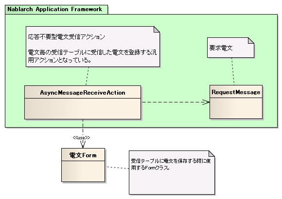

# 応答不要型メッセージ受信処理のアプリケーション構造

本項では、応答不要型メッセージ受信処理における基本的なクラス構造について説明する。

## 概要

Nablarch Application Frameworkでは、複雑になりがちなメッセージング処理を簡潔かつ堅牢に作成できるように以下のような機能を備えている。

* 電文をデータベースの一時テーブルに保存するための共通的なアクションクラスを提供する。

  Nablarchでは、受信した電文をデータベースの一時テーブル(電文受信テーブル)に保存するための共通的なアクションを提供している。
  このアクションを使用することにより、アプリケーション開発者は電文をデータベースに保存するための幾つかの成果物(下記参照)のみを作成すればよく、
  非常に簡易的に電文をテーブルに保存することが可能となっている。

  * 電文のレイアウトを表すフォーマット定義ファイル
  * データベースへ電文を登録するためのINSERT文(SQLファイル)
  * データベースへ電文を登録する際に使用するFormクラス
  * 電文を登録するための一時テーブル

  それぞれの成果物の実装方法及び実装例は、 [応答不要型メッセージ受信処理の実装方法](../../guide/mom-messaging/mom-messaging-03-mqDelayedReceive.md#mqdelayedreceivetitle) にて解説を行なっているため、参照すること。

  > **Note:**
> 共通のアクションで保存した電文は、後続処理（常駐バッチ）で処理を行うこと。
  > バッチ処理の実装方法は、 [業務アプリケーションの実装方法 (バッチ処理編)](../../guide/nablarch-batch/nablarch-batch-04-Explanation-batch.md) を参照。

## クラス構造

## 処理の流れ

① Nablarch Application Frameworkは受信した電文毎に応答不要型共通受信アクションを起動する。
② 応答不要型共通受信アクションは、電文のレイアウトを表すフォーマット定義ファイルを元に電文の解析を行う。
③ ②で解析を行った電文を元にFormクラスを生成する。
④ SQLファイルから一時テーブルへ電文を登録するためのINSERT文を取得する。
⑤ Formクラス及びINSERT文を使用して一時テーブルへ電文を保存する。

