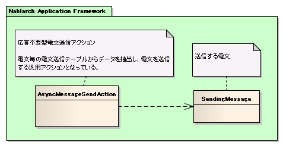
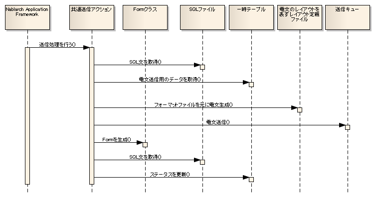

# 応答不要メッセージ送信処理のアプリケーション構造

本項では、応答不要メッセージ送信処理の基本的なクラス構造について説明する。

## 概要

Nablarch Application Frameworkでは、複雑になりがちなメッセージング処理を簡潔かつ堅牢に作成できるように以下のような機能を備えている。

* 電文をデータベースの一時テーブルから送信するための共通的なアクションクラスを提供する。

  Nablarchでは、データベースの一時テーブル(送信する電文のデータを保持するテーブル)から送信対象のデータを取得し、電文の作成及び送信を行う共通的なアクションを提供している。
  このアクションを使用することにより、アプリケーション開発者は電文及びテーブルに依存した幾つかの成果物(下記参照)のみを作成すればよく、
  非常に簡単に電文の送信処理を実装できるようになっている。

  * 電文のレイアウトを表すフォーマット定義ファイル
  * SQLファイル(下記3種類のSQL文を定義する)

    * 電文送信テーブルからステータスが未送信のデータを取得するためのSELECT文
      条件には、未送信であることを含める必要がある。
    * 電文送信後に、該当データのステータスを処理済みに更新するためのUPDATE文
    * 電文送信に失敗した場合に、該当データのステータスを送信失敗(エラー)に更新するためのUPDATE文
  * 送信用の電文を保持するための一時テーブル

  * 一時テーブルの処理ステータス更新用のFormクラス

    > **Note:**
> Formクラスに必要なプロパティは、ステータス更新に必要なテーブル項目に対応するもののみで良い。
    > これにより、一時テーブルのテーブルレイアウトをプロジェクト共通で定義することにより、
    > 単一のFormクラスを全ての応答不要メッセージ送信処理で使用することが出来るようになる。

    > 詳細は、 [応答不要メッセージ送信処理のFormクラス実装方法](../../guide/mom-messaging/mom-messaging-03-mqDelayedSend.md#sendformsample) を参照すること。

  それぞれの成果物の実装方法及び実装例は、 [応答不要メッセージ送信処理の実装方法](../../guide/mom-messaging/mom-messaging-03-mqDelayedSend.md#mqdelayedsendtitle) にて解説を行なっているため、参照すること。

  > **Note:**
> 電文送信テーブルへのデータ登録は、前処理（画面オンライン処理やバッチ処理）で行われる。
  > それぞれのアプリケーション構造や実装方法は、下記リンク先を参照すること。

  > * >   [業務アプリケーションの実装方法 (画面オンライン処理編)](../../guide/web-application/web-application-04-Explanation.md)
  > * >   [業務アプリケーションの実装方法 (バッチ処理編)](../../guide/nablarch-batch/nablarch-batch-04-Explanation-batch.md)

## クラス構造

## 処理の流れ

① SQLファイルから電文送信用のデータを取得するためのSELECT文を取得する。
② 一時テーブルから、電文送信用のデータを取得する。
③ 電文のレイアウトを表すフォーマット定義ファイルを元に送信用の電文を生成する。
④ 電文を送信する。
⑤ 一時テーブルのステータスを更新するためのFormクラスを生成する。
⑥ ステータス更新用のUPDATE文を取得する。
⑦ Formクラス及びUPDATE文を使用して一時テーブルのステータスを更新する。

> **Note:**
> ステータスを更新することにより、以下の事象の発生を防ぐことが出来る。

> * >   同一電文を複数回送信することを防止する。
> * >   エラーとなったデータ（ポイズンデータ）を繰り返し送信しようとし、繰り返し障害となることを防止する。

