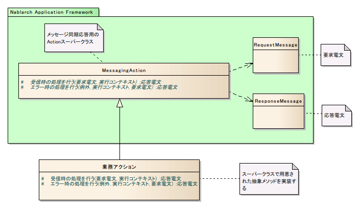
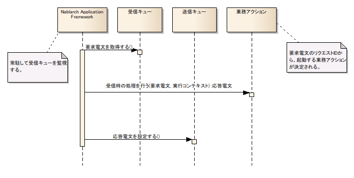

# 同期応答型メッセージ受信処理のアプリケーション構造

本項では、同期応答型メッセージ受信処理で共通の基本的なクラス構造について説明する。

## 概要

Nablarch Application Frameworkでは、複雑になりがちなメッセージング処理を簡潔かつ堅牢に作成できるように以下のような機能を備えている。

* Nablarch共通の実装方法

通常、メッセージング処理の実装を行う場合、MessageDrivenBeanに代表されるように、バッチやオンライン処理とは全く異なる業務実装を要求されることが多い。
Nablarchではこのような差異が抽象化されていて、バッチやオンライン処理と同様に「要求を受け取って応答を返却する」という同一のスタイルでコーディングができる。

* 開始時、エラー発生時、終了時の各イベント時のコールバック

各イベント発生時に、フレームワーク側からに対応するメソッドが起動される。
これにより、業務アプリケーションでのエラー処理漏れやリソース解放漏れを抑止できる。

* 電文読み取り、書き込みの簡易化

設計書から自動生成されたフォーマット定義ファイルを使用することにより、
物理的なレイアウトを意識したプログラミングをしなくてよい。

例えば、「レコード先頭xバイト目からxバイト分を半角数字として取得」するというような処理を
プログラム上でする必要が無く、単に引数で与えられた入力データからそのフィールド名を
指定して取得するだけでよい。また、Entityに変換することで型安全なプログラミングが可能となる。

* 障害発生時の処理

障害発生時の考慮がフレームワーク側で行われいるため、業務処理ではビジネスロジックに注力できる。

## 電文フォーマット定義ファイル

標準的なアプリケーションでは、以下の3つのフォーマット定義ファイルを使用する。

1. **ヘッダーフォーマット定義**

アプリケーション制御情報を含む共通データ領域のデータフォーマットを定義する。
リポジトリ定義ファイルにファイル名を指定する。
なお、ヘッダーフォーマット定義ファイルは要求・応答双方で同じものを使用する。

1. **要求電文フォーマット定義**

要求電文中の業務データ領域のデータフォーマットを定義する。
定義ファイルの名称は、

**(リクエストID) + "_RECEIVE.fmt"**

となる。

1. **応答電文フォーマット定義**

応答電文中の業務データ領域のデータフォーマットを定義する。
定義ファイルの名称は、

**(リクエストID) + "_SEND.fmt"**

となる。

## クラス構造

MessagingAction [1] を継承し以下のメソッドを実装する。

| メソッド | 概要 | 起動タイミング | 要否 |
|---|---|---|---|
|  | 電文受信時の処理を行う。 | 電文受信時 | 必須 |
|  | エラー発生時の処理を行う。 [2] | onReceiveメソッドでエラー発生時 | 必須 |

MessagingActionはDbAccessSupportを継承しているため、サブクラスでも
DbAccessSupportの機能を用いてデータベースアクセスを行うことができる。

エラー発生時の処理は、メイン処理とは別のトランザクションで実行される。
これは、メイン処理でエラーが発生した場合、そのトランザクションはロールバックされて終了するからである。

## メソッド詳細

### 電文受信時のコールバック

`onReceive` メソッドを実装する（必須）。

処理対象リクエストIDの要求電文受信時にフレームワークにより起動される。
本メソッドでは、要求電文を引数として受け取り、処理結果の応答電文を戻り値として返却する。

### エラー発生時のコールバック

`onError` メソッドを実装する（必須）。

本メソッドは、メイン処理でエラー発生時のみ呼び出される。エラーが発生しなかった場合は起動されない。
メイン処理で発生した例外またはエラーは、本メソッドの引数で渡される。

> **Note:**
> 実装すべき処理の例を以下に示す。

> * >   エラーが発生したレコードのステータスを異常終了に更新する。
> * >   相手先システムにエラーを通知する為、エラー電文を作成する。

## 処理の流れ

Nablarch Application Frameworkは、常駐して受信キューを監視する。
要求電文が到達する毎に、以下の処理が実行される。

1. Nablarch Application Frameworkはフレームワーク制御ヘッダのリクエストIDをもとに、業務アクションクラスを起動する。
2. 業務アクションは、要求電文を受け取り業務処理を実行し、応答電文を戻り値として返却する。
3. Nablarch Application Frameworkは、返却された応答電文を送信キューにPUTする。

