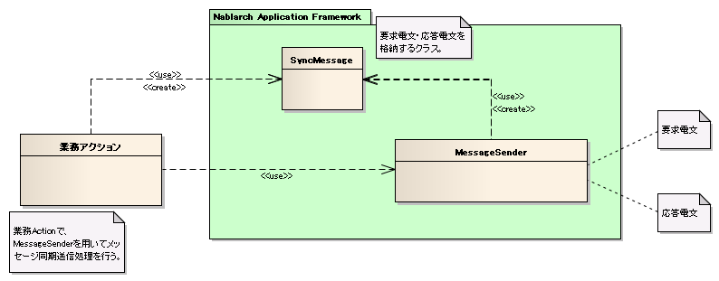

# 同期応答メッセージ送信処理のアプリケーション構造

本項では、同期応答メッセージ送信処理で共通の基本的なクラス構造について説明する。

## 概要

Nablarch Application Frameworkでは、複雑になりがちなメッセージの送信処理を簡潔かつ堅牢に作成できるように以下のような機能を備えている。

* 同期応答メッセージ送信を行うユーティリティクラスを提供する。

  アプリケーションプログラマは、ユーティリティクラスを使用して同期応答メッセージの送信を行う。
  ユーティリティクラスを使用する場合、アプリケーションプログラマはフォーマット定義ファイルを作成し、フィールド名をキーに持つMap型データを使用して、
  送信時と受信時のデータの受け渡しを行う実装のみ行えばよく、簡便に同期応答メッセージの送信処理を作成できるようになっている。

アプリケーションプログラマが作成するフォーマット定義ファイルおよび、ユーティリティを実行するための実装方法及び実装例は、
 [同期応答メッセージ送信処理の実装方法](../../guide/mom-messaging/mom-messaging-03-userSendSyncMessageAction.md#同期応答メッセージ送信処理)にて解説を行なっているため、参照すること。

## クラス構造

同期応答メッセージの送信を行う場合、MessageSenderの以下のメソッドを実行する。

| メソッド | 概要 |
|---|---|
| `SyncMessage sendSync(SyncMessage requestMessage) throws MessageSendSyncTimeoutException` | 同期応答メッセージの送信を行う。 タイムアウトが発生し、同期送信が正常終了しなかった場合は、MessageSendSyncTimeoutExceptionがスローされる。 |

## 処理の流れ

業務ActionはMessageSenderを実行し、同期応答メッセージの送信を行う。
具体的には以下の流れで処理が行われる。

1. 業務Actionは、SyncMessageクラスにリクエストID [1] と要求電文に格納するパラメータを設定し、それを引数にMessageSenderのsendSyncメソッドを実行する。
2. MessageSenderは、引数のSyncMessageから要求電文を生成し、送信キューに格納（PUT）する。
3. 後続の処理は、送信キューから電文を取得（GET）し、業務処理を行った後、受信キューに応答電文を（PUT）する。
4. MessageSenderは、キューから応答電文を取得（GET）する。
5. MessageSenderは、応答電文の解析結果をSyncMessageに格納し、呼び出し元（業務Action）に返却する。

ここで扱うリクエストIDとは、メッセージを送信する相手先システムの機能を一意に識別するために定義するIDのことを指すものであり、画面オンライン処理やバッチ処理で使用するリクエストIDとは意味が異なる点に注意すること。
このリクエストIDにもとづき、要求電文および応答電文のフォーマット、送信キュー名、受信キュー名が決定する。
