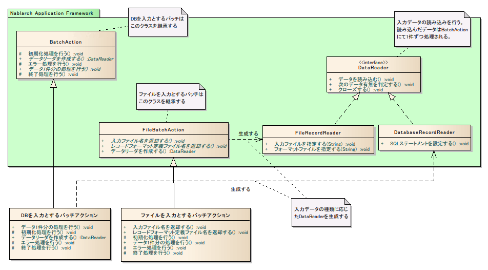
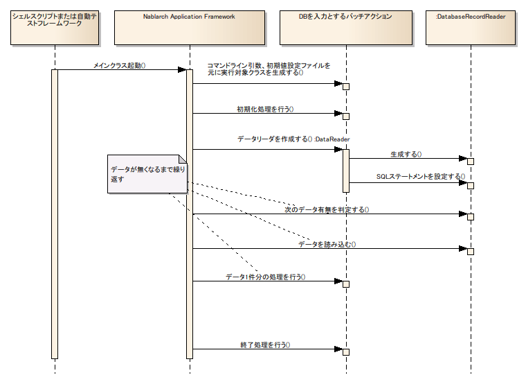

# バッチ共通のアプリケーション構造

## 概要と作業単位

Nablarch Application Frameworkのバッチ処理機能:

- **ループ制御の代行**: フレームワークが作業単位ごとのループを制御する。
- **イベントコールバック**: 開始時・エラー発生時・終了時に対応メソッドが起動される。
- **ファイルI/Oの簡易化**: フォーマット定義ファイルを使用し、物理レイアウトを意識せずフィールド名でデータを取得できる。

バッチ処理はmainメソッドから全処理を実装せず、フレームワーククラスを継承して業務処理を実装する。

### 作業単位

作業単位とは、同一のトランザクションで処理しなければならないデータのまとまりを指す。

- DB入力バッチ: 検索結果1行 = 1作業単位
- ファイル入力バッチ: 1レコード = 1作業単位
- コントロールブレイク: 複数件のまとまりが1作業単位となることがある

<details>
<summary>keywords</summary>

バッチ処理, ループ制御, イベントコールバック, ファイルI/O, 作業単位, トランザクション, BatchAction

</details>

## DBを入力とするバッチを実装する場合



**クラス**: `BatchAction`（またはそのサブクラス）を継承し、以下のメソッドを実装する。

| メソッド | 概要 | 起動タイミング | 要否 |
|---|---|---|---|
| `void initialize(CommandLine command, ExecutionContext context)` | 初期化処理 | メイン処理開始前に1回 | 任意 |
| `DataReader<D> createReader(ExecutionContext context)` | リーダを作成 | 初回データ読み込み時に1回 | 必須 |
| `Result handle(D inputData, ExecutionContext context)` | メイン処理 | 1作業単位の入力毎 | 必須 |
| `void transactionSuccess(D inputData, ExecutionContext context)` | 正常終了時処理 | handleメソッド正常終了時毎 | 任意 |
| `void transactionFailure(D inputData, ExecutionContext context)` | 異常終了時処理 | handleメソッド異常終了時毎 | 任意 |
| `void error(Throwable error, ExecutionContext context)` | エラー発生時処理 | メイン処理でエラー発生後に1回 | 任意 |
| `void terminate(Result result, ExecutionContext context)` | 終了処理 | メイン処理終了後に1回 | 任意 |

> **注意**: `transactionFailure`はメイン処理とは別のトランザクションで実行される（メイン処理のトランザクションはロールバックされるため）。

> **注意**: 型パラメータ`D`はレコードの総称型。DB入力バッチの場合、通常は`SqlRow`となる。

> **注意**: `BatchActionBase`は`DbAccessSupport`を継承しているため、サブクラスでも`DbAccessSupport`の機能でDBアクセス可能。

<details>
<summary>keywords</summary>

BatchAction, BatchActionBase, DbAccessSupport, SqlRow, DataReader, createReader, handle, initialize, transactionSuccess, transactionFailure, error, terminate, DBバッチ, CommandLine, ExecutionContext

</details>

## ファイルを入力とするバッチを実装する場合

**クラス**: `FileBatchAction`を継承する。

DBバッチのメソッド（`createReader`、`handle`を除く）に加え、以下を実装する。

| メソッド | 概要 | 起動タイミング | 要否 |
|---|---|---|---|
| `String getDataFileName()` | 入力ファイル名を返却 | メイン処理開始前に1回 | 必須 |
| `String getFormatFileName()` | レコードフォーマット定義ファイルを返却 | メイン処理開始前に1回 | 必須 |
| `Result do+レコードタイプ名(DataRecord inputData, ExecutionContext ctx)` | レコードタイプごとの処理 | 1作業単位の入力毎 | 必須 |

> **注意**: `createReader`は実装不要（スーパークラスにて実装済み）。`handle`も実装不要（代わりに`do+レコードタイプ名`を実装する）。

<details>
<summary>keywords</summary>

FileBatchAction, getDataFileName, getFormatFileName, DataRecord, FileRecordReader, ファイルバッチ, ExecutionContext

</details>

## 処理の流れ（フレームワーク動作イメージ）



> **注意**: ファイル入力の場合もシーケンス自体は同じ。`DatabaseRecordReader`の代わりに`FileRecordReader`を使用する。

フレームワークの処理制御（擬似コード）:

```java
initialize()                //-- 本処理開始前に一度だけ呼ばれる。
createReader()              //-- 初回データ読み込み時に1度だけ呼ばれる。
try {
  while(reader.hasNext()) {
    try {
      handle()              //-- 入力データ1件毎に繰り返し呼ばれる。
      transactionSuccess()  //-- handleが正常に終了した場合に呼ばれる。
    } catch(e) {
      transactionFailure()  //-- handleで例外が発生した場合に呼ばれる。
    }
  }
} catch(e) {
  error()                   //-- 本処理がエラー終了した場合に、一度だけ呼ばれる。
} finally {
  postProcess()             //-- 本処理が全て終了した後、一度だけ呼ばれる（エラー終了時でも呼ばれる）。
}
```

<details>
<summary>keywords</summary>

initialize, createReader, handle, transactionSuccess, transactionFailure, error, postProcess, DatabaseRecordReader, FileRecordReader, バッチ処理フロー

</details>

## コマンドライン引数

Nablarch Application Frameworkはコマンドライン引数を2種類に解釈する。

| 種別 | 説明 | 取得方法 |
|---|---|---|
| オプション | `-キー名=値` 形式のkey-valueペア | `CommandLine#getParamMap()` |
| 引数 | オプション以外の単一値 | `CommandLine#getArgs()` |

バッチ処理共通のコマンドラインオプション:

| キー名 | 設定値 | 説明 |
|---|---|---|
| `diConfig` | コンポーネント設定ファイルへのパス | バッチ処理はここで指定されたファイルの設定で動作する |
| `requestPath` | リクエストを特定するためのパス | 通常`"ss" + (機能ID) + "." + (アクションクラス名) + "/" + (リクエストID)` |
| `userId` | ユーザID | バッチ処理はここで指定されたユーザIDで実行される |

```bash
java <中略> nablarch.fw.launcher.Main -diConfig=file:./config/batch-config.xml \
                                      -requestPath=ss11AC.B11AC011Action/RB11AC0110 \
                                      -userId=batch_user
```

<details>
<summary>keywords</summary>

CommandLine, getParamMap, getArgs, diConfig, requestPath, userId, コマンドライン引数, バッチ起動, Main

</details>

## 初期化処理（initializeメソッド）

`initialize`メソッドを実装する（任意）。メイン処理実行前にフレームワークから起動される。

実装すべき処理の例:
- コマンドライン引数を処理する
- リソースを取得する
- 開始ログを出力する
- インスタンス変数を初期化する

> **警告**: バッチアクションでインスタンス変数を使用する場合の制約:
> - インスタンス変数を使用するバッチアクションは**マルチスレッド実行できない**。
> - インスタンス変数は`initialize`メソッドで**明示的に初期化しなければならない**。
>
> ただし、`initialize`で初期化され以降値が更新されない（読取専用）場合は、マルチスレッド実行が可能。

<details>
<summary>keywords</summary>

initialize, CommandLine, ExecutionContext, インスタンス変数, マルチスレッド, 初期化処理

</details>

## リーダ作成（createReaderメソッド）

`createReader`メソッドを実装する（必須）。バッチ処理の入力となるデータを読み込むリーダを返却する。通常、入力データはファイルデータベースいずれかとなる。フレームワークはこのメソッドでリーダを取得し、入力データの読み込みに使用する。

<details>
<summary>keywords</summary>

createReader, DataReader, リーダ作成, DatabaseRecordReader, FileRecordReader

</details>

## 1作業単位毎の処理（handleメソッド）

`handle`メソッドを実装する（必須）。フレームワークはリーダから読み込んだ作業単位ごとにこのメソッドを起動する。

戻り値は`nablarch.fw.Result`インタフェース実装クラスのインスタンスを返却する。通常は正常終了（`nablarch.fw.Result.Success`）を返却する。

<details>
<summary>keywords</summary>

handle, Result, Result.Success, 作業単位, バッチメイン処理

</details>

## エラー発生時の処理

### エラーが発生した作業単位に対するエラー処理

`transactionFailure`メソッドを実装する（任意）。`handle`メソッドでエラーが発生するたびに呼び出される。引数にはエラー発生時に処理していたデータが渡される。

> **注意**: このメソッドは`handle`メソッドとは別のトランザクションで実行される。

実装すべき処理の例:
- エラーが発生したレコードのステータスを異常終了に更新する
- 専用のエラーファイルにエラーが発生したレコードを出力する

### エラーが発生したリクエストに対するエラー処理

`error`メソッドを実装する（任意）。本処理がエラー終了した場合に一度だけ呼び出される（マルチスレッドで実行している場合でも1回のみ）。引数のThrowableには`java.util.concurrent.ExecutionException`が渡される。メイン処理で発生した例外またはエラーは`ExecutionException#getCause()`で取得できる。

<details>
<summary>keywords</summary>

transactionFailure, error, ExecutionException, エラー処理, 別トランザクション, マルチスレッド, Throwable, ExecutionContext

</details>

## 終了処理（terminateメソッド）

`terminate`メソッドを実装する（任意）。リーダから全データを読み取った後にフレームワークから起動される。

実装すべき処理の例:
- リソースを解放する
- 処理件数をログ出力する

<details>
<summary>keywords</summary>

terminate, 終了処理, リソース解放

</details>
