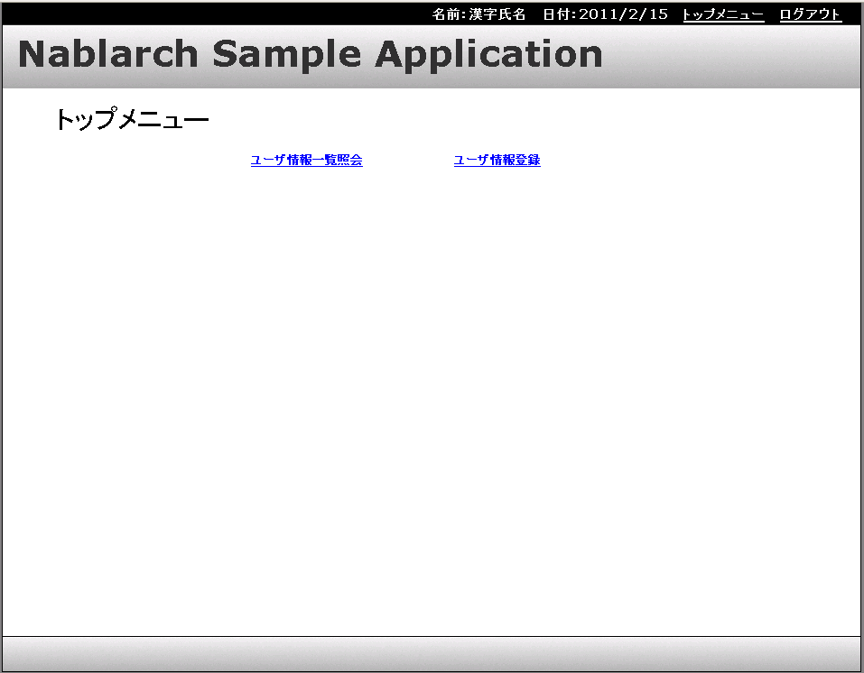

# サンプルアプリケーションの概要

## 画面遷移

本書で取りあげるサンプルアプリケーションは次の機能を持っている。このうち、本書で説明する機能の画面遷移を以下に示す。

詳細はサンプルアプリケーションの設計書を参照。

* ログイン機能
* メニュー機能
* ユーザ情報照会機能
* ユーザ情報登録機能
* ユーザ情報更新機能
* ユーザ情報削除機能
* ユーザ情報一括削除機能

本書では、アプリケーションフレームワークの使用方法を説明するため、一般的によく使用される処理である検索、新規登録、更新を例に説明を進める。このため、
サンプルアプリケーションの中から説明で取り上げる機能は、ユーザ一覧照会機能、ユーザ情報登録機能、ユーザ情報更新機能とする。

ログイン機能もメニュー機能も必ず使用される機能ではあるが、アプリケーションフレームワークの使い方を説明するには、機能が限定されすぎているため、
本書では取り上げない。
また、ユーザ情報削除機能とユーザ情報一括削除機能は、本書で取りあげる機能を利用して実装できるため、特に取り上げることはしない。

## サンプルアプリケーションの機能と説明する処理

サンプルアプリケーションのユーザ情報照会機能、ユーザ情報登録機能、ユーザ情報更新機能には、通常のアプリケーションで頻繁に発生する典型的な処理パターンが含まれている。
そこで本章では、各機能の実装を例に取って、典型的な処理パターンの実装方法について説明する。
ユーザ情報照会機能、ユーザ情報登録機能、ユーザ情報更新機能で説明する処理パターンは下記のとおり。

| 機能 | 処理 |
|---|---|
| ユーザ情報照会機能 | * [画面初期表示(初期表示に必要な情報をデータベースから取得し、画面を表示する)](../../guide/web-application/web-application-02-basic.md#basic) * [一覧検索](../../guide/web-application/web-application-03-listSearch.md#listsearch) |
| ユーザ情報登録機能 | * [入力内容の精査](../../guide/web-application/web-application-04-validation.md#how-to-validate) * [画面遷移](../../guide/web-application/web-application-05-screenTransition.md#screentransition) * [入力画面と確認画面の共通化](../../guide/web-application/web-application-06-sharingInputAndConfirmationJsp.md#sharinginputandconfirmationjsp) * [データベースへの挿入、二重サブミットの防止](../../guide/web-application/web-application-07-insert.md#insert) |
| ユーザ情報更新機能 | * [一覧表示から個別の情報を扱う画面への遷移](../../guide/web-application/web-application-10-submitParameter.md#submitparameter) * [排他制御](../../guide/web-application/web-application-11-exclusiveControl.md#exclusivecontrol) |

## 主な仕様

詳細はサンプルアプリケーションの設計書を参照。

### ユーザ情報照会機能

ユーザ情報照会機能の主な仕様は以下のとおり。

* 検索条件は以下のとおり

  * ログインID
  * 漢字氏名
  * カナ氏名
  * グループ(ドロップダウンリストから選択。リストは表示の度に最新の情報を取得し表示する)
  * ユーザIDロック(ドロップダウンリストから選択。リストは表示の度に最新の情報を取得し表示する)
* 検索条件に対する精査を行う。

  * 検索条件に対する単項目精査を行う。
  * 検索条件は最低1つは設定しなければならない。
* 精査エラーが発生しなかった場合、検索条件に一致する情報を検索する。
* 検索結果が検索上限件数を越えない場合、結果をユーザ情報一覧照会画面に表示する。

  * 検索結果が１ページの表示上限件数を越えた場合、ページング機能によりページ遷移を行える。
  * 検索結果は以下の項目名でソートできる。

    * ログインID
    * 漢字氏名
    * カナ氏名
* 一覧表示されたログインIDリンクをクリックすると、ログインIDに紐付くユーザの以下の情報を表示する。

  * ログインID
  * 漢字氏名
  * カナ氏名
  * メールアドレス
  * 内線番号
  * 携帯電話番号
  * グループ
  * 認可単位

### ユーザ情報登録機能

ユーザ情報登録機能の主な仕様は以下のとおり。

* 登録する情報は以下のとおり

  * ログインID(必須)
  * パスワード(必須)
  * パスワード(確認用)(必須)
  * 漢字氏名(必須)
  * カナ氏名(必須)
  * メールアドレス(必須)
  * 内線番号(ビル番号、個人番号から成る。必須)
  * 携帯電話番号(市外番号、市内番号、加入番号から成る。任意)
  * グループ(ドロップダウンリストから選択。リストは表示の度に最新の情報を取得し表示する。必須)
  * 認可単位(ドロップダウンリストから選択。リストは表示の度に最新の情報を取得し表示する。任意)
* 入力内容に対する精査を行う。

  * 入力内容に対する単項目精査
  * パスワードとパスワード(確認用)は一致しなければならない。
  * 携帯電話番号は全て入力されているか、全て未入力でなければならない。
  * ログインIDは、既に登録されているものは使えない。
  * グループ、認可単位はあらかじめシステムに登録されていなければならない。
* 精査エラーが発生した場合は、ユーザ情報登録画面にエラーメッセージを表示する。
* 精査エラーが発生しなかった場合は、ユーザ情報登録確認画面を表示する。この画面で登録を指示された場合は入力内容をデータベースに登録する。

### ユーザ情報更新機能

ユーザ情報更新機能の主な仕様は以下のとおり。

* 更新画面に初期表示する情報は以下の通り

  * ログインID
  * 漢字氏名
  * カナ氏名
  * メールアドレス
  * 内線番号(ビル番号、個人番号から成る。)
  * 携帯電話番号(市外番号、市内番号、加入番号から成る。)
  * グループ(ドロップダウンリストから選択。リストは表示の度に最新の情報を取得し表示する。)
  * 認可単位(ドロップダウンリストから選択。リストは表示の度に最新の情報を取得し表示する。)
* 更新する情報は以下の通り

  * 漢字氏名(必須)
  * カナ氏名(必須)
  * メールアドレス(必須)
  * 内線番号(ビル番号、個人番号から成る。必須)
  * 携帯電話番号(市外番号、市内番号、加入番号から成る。任意)
  * グループ(ドロップダウンリストから選択。リストは表示の度に最新の情報を取得し表示する。必須)
  * 認可単位(ドロップダウンリストから選択。リストは表示の度に最新の情報を取得し表示する。任意)
* 入力内容に対する精査を行う。

  * 入力内容に対する単項目精査
  * 携帯電話番号は全て入力されているか、全て未入力でなければならない。
  * グループ、認可単位はあらかじめシステムに登録されていなければならない。
* 精査エラーが発生した場合は、ユーザ情報更新画面にエラーメッセージを表示する。
* 精査エラーが発生しなかった場合は、ユーザ情報更新確認画面を表示する。この画面で更新を指示された場合は入力内容をデータベースに更新する。
* 排他制御を行う。排他制御エラーが発生した場合は、ユーザ情報詳細画面にエラーメッセージを表示する。

## サンプルアプリケーションの実行方法

開発環境構築ガイドに従いログインする。

トップメニューで使用したい機能をクリックする。

以下の機能は、ユーザ情報一覧照会の結果から実行できる。

* ユーザ情報更新機能
* ユーザ情報削除機能
* ユーザ情報一括削除機能

