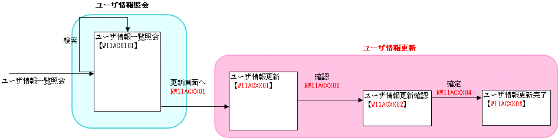
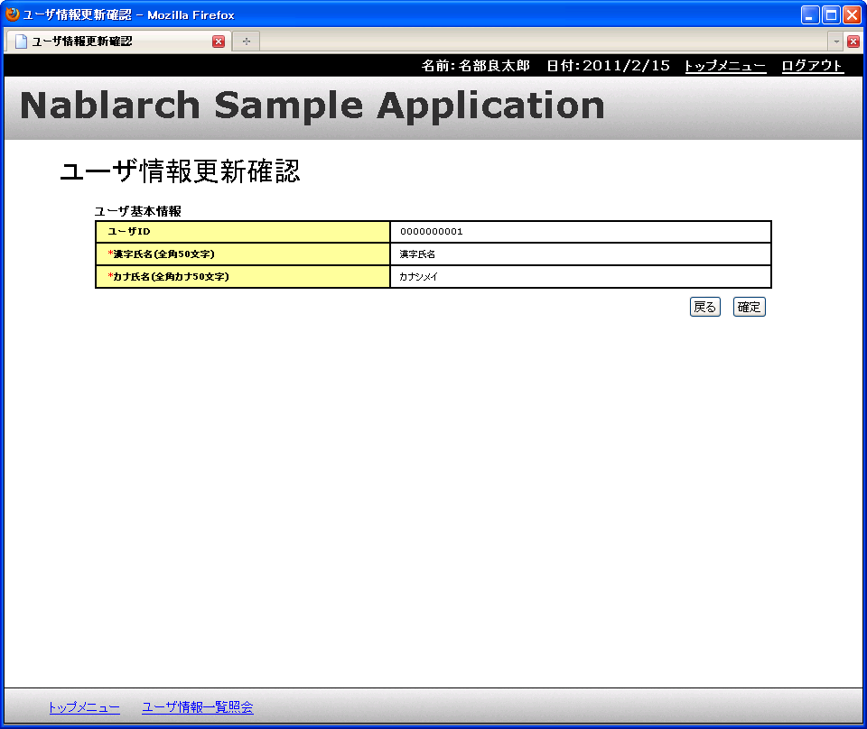
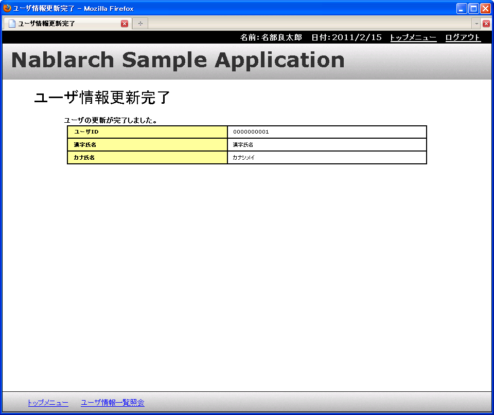

# 説明に使用する機能について

先に示した通り、ここでは簡単なユーザ情報更新機能を実装し、
サンプルアプリケーションの既存のユーザ情報更新機能と差し替える手順により 
Nablarch を使用したアプリケーション開発の手順を説明する。

説明に使用する機能について以下に示す。

## 実施する作業概要

これからの説明では、以下に示す通り、サンプルアプリケーションの更新機能に変更を加える。
この図からわかる通り、追加する機能は非常に簡易な更新機能のみである。
この機能の追加の例で、 Nablarch を使用したアプリケーション開発の基礎を説明していく。

* 作業前の画面遷移図

* 作業後の画面遷移図(赤い部分が差し替え箇所)

## 前提条件

これより先の作業を行うにあたり以下の条件を満たすこと。

* Nablarch Application Frameworkを使用してアプリケーション開発を行うための環境構築が完了していること。

  環境構築については、開発環境構築ガイドを参照。

  ※環境構築が完了していれば、画面開発に必要なテーブルに対応するエンティティオブジェクトがセットされている。

## 既存のユーザ情報更新機能の動作確認

作業に入る前に、まず変更前のサンプルアプリケーションのユーザ情報更新機能の動作を確認する。

以下の手順で、ユーザ情報の更新を行うことができる。

ユーザ情報照会画面で一覧検索を行い、検索結果の一覧の **更新** リンクをクリックする。

ユーザ情報更新画面に遷移するので、入力フォームの値を変更して **確認** ボタンを押下する。

ユーザ情報更新確認画面に遷移するので、更新する値が表示されていることを確認し、 **確定** ボタンを押下する。

ユーザ情報更新完了画面に遷移する。

**a)** と同様に一覧検索を行い、ユーザの情報が更新されていることを確認する。

> **Note:**
> 上記の手順は、今回想定している画面遷移のみの確認である。これ以外の画面遷移や機能も各自で試すとよい。

## ユーザ情報更新機能の仕様

1) 機能概要
更新機能は、データベースに登録されているユーザ情報の漢字氏名、カナ氏名の変更を画面から行う。

主な仕様は以下の通り。

* ユーザ情報更新画面

更新対象となるユーザの現在の登録内容を表示する。

表示項目は、画面イメージを参照。

* ユーザ情報更新確認画面

更新画面の入力項目に対して精査を行う。

精査がOKの場合に更新確認画面に変更内容(更新画面で入力された値)を表示する。

精査がNGの場合は、更新画面に遷移し、エラーメッセージを表示する。

* ユーザ情報更新完了画面

更新内容をデータベースへ反映する。

更新完了画面を表示する。

2) 画面仕様

2)-1 画面イメージ

ユーザ情報更新画面

ユーザ情報更新確認画面

ユーザ情報更新完了画面

2)-2 画面情報

| 画面ID | 画面名称 | リクエスト |  |
|---|---|---|---|
| W11ACXX01 | ユーザ情報更新画面 | RW11ACXX01 | 更新画面初期表示処理 |
|  |  | RW11ACXX03 | 更新画面戻る処理 |
| W11ACXX02 | ユーザ情報更新確認画面 | RW11ACXX02 | 更新入力確認処理 |
| W11ACXX03 | ユーザ情報更新完了画面 | RW11ACXX04 | 更新処理 |

3) 更新対象テーブルの仕様

3)-1 テーブル情報

テーブル論理名：ユーザ

テーブル物理名：USERS

| カラム論理名 | カラム物理名 |
|---|---|
| ユーザID | USER_ID |
| 漢字氏名 | KANJI_NAME |
| カナ氏名 | KANA_NAME |
| メールアドレス | MAIL_ADDRESS |
| 内線電話番号(ビル番号) | EXTENSION_NUMBER_BUILDING |
| 内線電話番号(個人番号) | EXTENSION_NUMBER_PERSONAL |
| 携帯電話番号(市外) | MOBILE_PHONE_NUMBER_AREA_CODE |
| 携帯電話番号(市内) | MOBILE_PHONE_NUMBER_CITY_CODE |
| 携帯電話番号(加入) | MOBILE_PHONE_NUMBER_SBSCR_CODE |
| 登録者ID | INSERT_USER_ID |
| 登録日時 | INSERT_DATE |
| 更新者ID | UPDATED_USER_ID |
| 更新日時 | UPDATED_DATE |

3)-2 テーブルの各カラムに適用する精査仕様

| プロパティ名 | 精査内容 | メッセージID |
|---|---|---|
| 漢字氏名 | 必須 | MSG00010 |
|  | 文字種(全角) | MSG00017 |
|  | 文字列長(50桁以下) | MSG00024 |
| カナ氏名 | 必須 | MSG00010 |
|  | 文字種(全角カナ) | MSG00020 |
|  | 文字列長(50桁以下) | MSG00024 |

> **Note:**
> 上記表の「メッセージID」は、 Nablarch を使用したアプリケーション中で画面等アプリケーションからユーザに
> 通知するメッセージを一意に特定するものである。
> 「メッセージID」を使用することで、画面上に表示するメッセージを容易に管理できる。

> 通常の開発では、上記で示したような簡易な精査でエラーが発生した際のメッセージは、
> 共通エラーメッセージとして定義して実装する。
> 上記メッセージIDも、サンプルアプリケーションの共通エラーメッセージのメッセージIDであり、プログラマは
> 通常強く意識する必要はない。

4) 更新処理仕様

更新対象カラム

| カラム論理名 | カラム物理名 |
|---|---|
| 漢字氏名 | KANJI_NAME |
| カナ氏名 | KANA_NAME |
| 更新者ID | UPDATED_USER_ID |
| 更新日時 | UPDATED_DATE |
