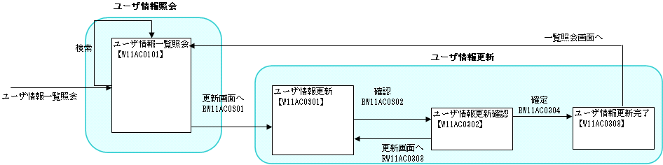
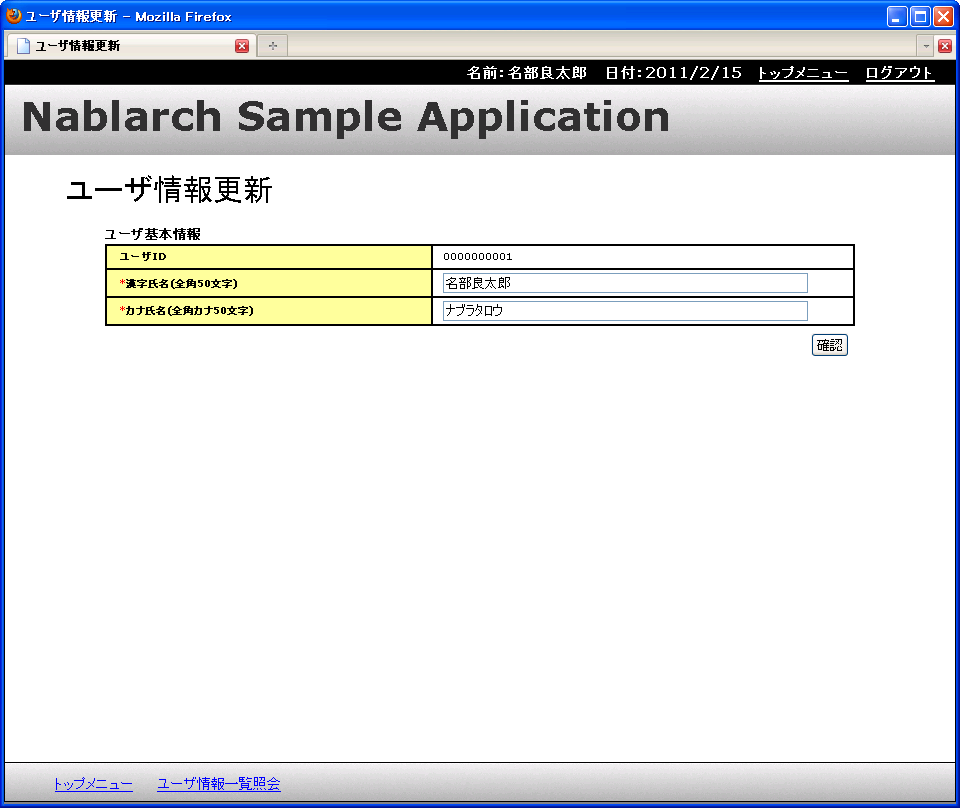

# 説明に使用する機能について

## 実施する作業概要

サンプルアプリケーションのユーザ情報更新機能を独自実装に差し替える。追加する機能は簡易な更新機能のみ。

作業前の画面遷移:

作業後の画面遷移（赤い部分が差し替え箇所）:

keywords

ユーザ情報更新機能, 画面遷移, サンプルアプリケーション差し替え

## 前提条件

- Nablarch Application Frameworkの環境構築が完了していること。環境構築完了後、画面開発に必要なテーブルに対応するエンティティオブジェクトがセットされている。

keywords

環境構築, エンティティオブジェクト, Nablarch Application Framework

## 既存のユーザ情報更新機能の動作確認

既存のユーザ情報更新機能の画面遷移フロー:

1. ユーザ情報照会画面で一覧検索し、**更新**リンクをクリック
2. ユーザ情報更新画面で入力値を変更し**確認**ボタン押下
3. ユーザ情報更新確認画面で更新値を確認後**確定**ボタン押下
4. ユーザ情報更新完了画面に遷移
5. 一覧検索でユーザ情報の更新を確認

keywords

ユーザ情報更新, 画面遷移確認, 更新フロー

## ユーザ情報更新機能の仕様

## 機能概要

| 画面 | 動作 |
|---|---|
| ユーザ情報更新画面 | 更新対象ユーザの現在の登録内容を表示（表示項目は画面イメージを参照） |
| ユーザ情報更新確認画面 | 精査OK→変更内容を確認画面に表示。精査NG→更新画面に戻りエラーメッセージを表示 |
| ユーザ情報更新完了画面 | 更新内容をDBに反映し完了画面を表示 |

## 画面情報

| 画面ID | 画面名称 | リクエストID | リクエスト名称 |
|---|---|---|---|
| W11ACXX01 | ユーザ情報更新画面 | RW11ACXX01 | 更新画面初期表示処理 |
| W11ACXX01 | ユーザ情報更新画面 | RW11ACXX03 | 更新画面戻る処理 |
| W11ACXX02 | ユーザ情報更新確認画面 | RW11ACXX02 | 更新入力確認処理 |
| W11ACXX03 | ユーザ情報更新完了画面 | RW11ACXX04 | 更新処理 |

## 画面イメージ

## 更新対象テーブル (USERS)

| カラム論理名 | カラム物理名 |
|---|---|
| ユーザID | USER_ID |
| 漢字氏名 | KANJI_NAME |
| カナ氏名 | KANA_NAME |
| メールアドレス | MAIL_ADDRESS |
| 内線電話番号(ビル番号) | EXTENSION_NUMBER_BUILDING |
| 内線電話番号(個人番号) | EXTENSION_NUMBER_PERSONAL |
| 携帯電話番号(市外) | MOBILE_PHONE_NUMBER_AREA_CODE |
| 携帯電話番号(市内) | MOBILE_PHONE_NUMBER_CITY_CODE |
| 携帯電話番号(加入) | MOBILE_PHONE_NUMBER_SBSCR_CODE |
| 登録者ID | INSERT_USER_ID |
| 登録日時 | INSERT_DATE |
| 更新者ID | UPDATED_USER_ID |
| 更新日時 | UPDATED_DATE |

## 精査仕様

| プロパティ名 | 精査内容 | メッセージID |
|---|---|---|
| 漢字氏名 | 必須 | MSG00010 |
| 漢字氏名 | 文字種(全角) | MSG00017 |
| 漢字氏名 | 文字列長(50桁以下) | MSG00024 |
| カナ氏名 | 必須 | MSG00010 |
| カナ氏名 | 文字種(全角カナ) | MSG00020 |
| カナ氏名 | 文字列長(50桁以下) | MSG00024 |

> **Note**: メッセージIDはアプリケーション中でユーザに通知するメッセージを一意に特定するもの。通常の開発では、簡易な精査エラー時のメッセージは共通エラーメッセージとして定義して実装する。上記メッセージIDもサンプルアプリケーションの共通エラーメッセージのメッセージIDであり、プログラマは通常強く意識する必要はない。

## 更新処理仕様

更新対象カラム:

| カラム論理名 | カラム物理名 |
|---|---|
| 漢字氏名 | KANJI_NAME |
| カナ氏名 | KANA_NAME |
| 更新者ID | UPDATED_USER_ID |
| 更新日時 | UPDATED_DATE |

keywords

USERS, KANJI_NAME, KANA_NAME, 漢字氏名バリデーション, カナ氏名バリデーション, W11ACXX01, W11ACXX02, W11ACXX03, RW11ACXX01, RW11ACXX02, RW11ACXX03, RW11ACXX04, 精査仕様, 更新機能仕様, MSG00010, MSG00017, MSG00020, MSG00024

