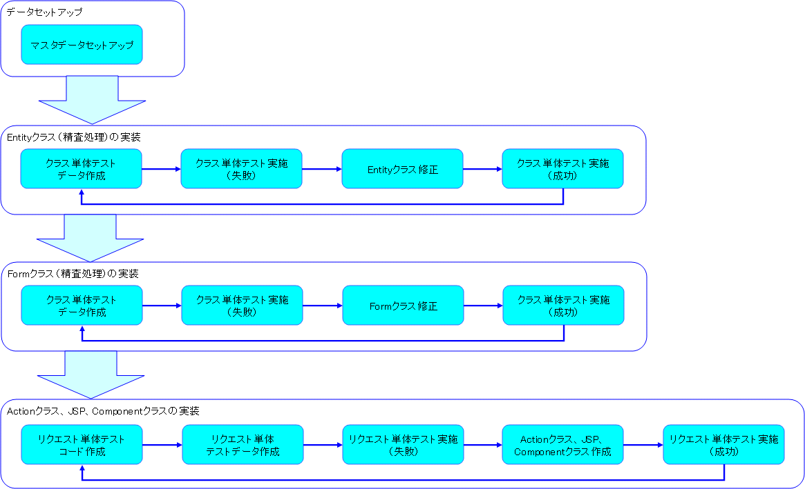

# 開発フロー

## 開発フロー

テストケースから機能をボトムアップに作ることを想定している。

keywords

開発フロー, ボトムアップ開発, テストケース

## 開発手順詳細

1. [process_data_setup](web-application-03_datasetup.md)
2. [process_update_validate_entity](web-application-04_create_entity.md)
3. [process_update_validate_form](web-application-05_create_form.md)
4. [process_update_view](web-application-06_initial_view.md)
5. [process_update_confirm](web-application-07_confirm_view.md)
6. [process_update_complete](web-application-08_complete.md)

keywords

開発手順, ユーザ情報更新, process_data_setup, process_update_validate_entity, process_update_validate_form, process_update_view, process_update_confirm, process_update_complete

