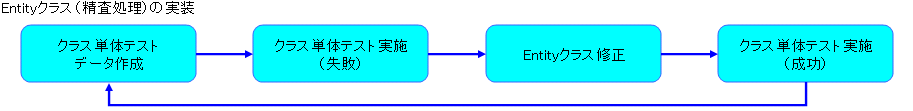
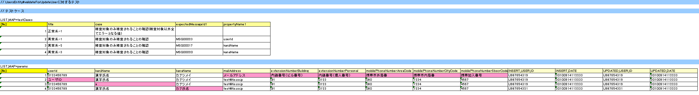
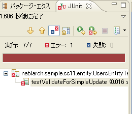
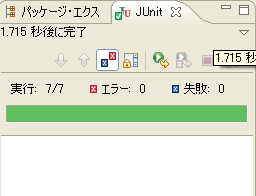

# Entityクラス（精査処理）の実装

Entityクラスの精査処理実装の流れは下記の通り。



> **Note:**
> Entityクラスは、通常 Nablarch Toolbox のEntity自動生成ツールを用いてひな形を作成する。
> 実際のプロジェクトでは、この自動生成が使用できるか確認し、 0 からEntityを実装する際は、
> プロジェクトで規定された Entity の作成方法に従うこと。

1) Entityクラスの実装

入力項目の精査呼び出し処理をEntityクラスに実装する。

a) クラス単体テストデータの作成

サンプルアプリケーションで提供しているEntityクラスのクラス単体テストデータシートに更新機能用のテストデータシート(testValidateForSimpleUpdate)を追加する。

**データシート格納フォルダ**

/Nablarch_sample/test/java/nablarch/sample/ss11/entity 配下

**データシートファイル名**

UsersEntityTest.xls [1]

**シート名**

testValidateForSimpleUpdate [2]

Entityのクラス単体テストデータシートの書き方については、 [Form/Entityのクラス単体テスト](../../development-tools/testing-framework/testing-framework-01-entityUnitTest.md#entityunittest) を参照。

シート名は任意で良いが、説明の為、上記の名称で作成することにする。



> **Warning:**
> Entityクラスを初めて使用する機能の場合、Entityクラスのコンストラクタのテスト、ゲッター/セッターのテストが必要であるため、テストデータを準備する必要がある。

> 本開発手順では、サンプルアプリケーションの登録機能で前述のテストは実施済みである為、説明は割愛する。

> Entityクラスのコンストラクタのテスト、ゲッター/セッターのテストについては、 [Form/Entityのクラス単体テスト](../../development-tools/testing-framework/testing-framework-01-entityUnitTest.md#entityunittest) を参照。

> **Note:**
> Entityクラスを新規に作成する場合は、Entityテストデータ自動作成ツールを使用することにより、初回テストデータ作成の作業負荷を軽減できる。
> ただし、Entityのクラス単体テストに必要なすべてのテストデータをツールで生成できるわけではないため、
> ツールが作成したテストデータを基に必要なテストデータを追加して使用すること。
> Entityテストデータ自動作成ツールの詳細については、Nablarch Toolboxのドキュメントを参照。

b) クラス単体テストコードの作成

サンプルアプリケーションで提供しているEntityクラスのクラス単体テストコードに更新機能用のメソッド(testValidateForSimpleUpdate)を追加する。

**テストクラス作成フォルダ**

/Nablarch_sample/test/java/nablarch/sample/ss11/entity 配下

**テストソースファイル名**

UsersEntityTest.java [3]

**メソッド名**

testValidateForSimpleUpdate

Entityのクラス単体テストコードの書き方については、 [Form/Entityのクラス単体テスト](../../development-tools/testing-framework/testing-framework-01-entityUnitTest.md#entityunittest) を参照。

```java
// ～前略～

/**
 * {@link UsersEntity#validateForSimpleUpdate(nablarch.core.validation.ValidationContext)} のテスト。
 */
@Test
public void testValidateForSimpleUpdate() {
    // 精査実行
    Class<?> entityClass = UsersEntity.class;
    String sheetName = "testValidateForSimpleUpdate";
    String validateFor = "simpleUpdate";
    testValidateAndConvert(entityClass, sheetName, validateFor);
}

// ～後略～
```

( [記載しているサンプルプログラムソースコードの注意事項](../../about/about-nablarch/about-nablarch-aboutThis.md#sourcecode) 参照)

c) クラス単体テスト実施

クラス単体テストを実施し、テストが失敗することを確認する。（精査メソッドを実装していない為）

> **Note:**
> クラス単体テストの実行方法は、テスト対象のクラス(～Test.java)を右クリックし、[実行]→[Junitテスト]を選択する。
> テスト失敗時には下記のように JUnit ビューにエラーが表示される。

> 

d) Entityクラスの修正

Entityクラスに単項目精査の呼び出し処理を実装する。

**ソース格納フォルダ**

/Nablarch_sample/main/java/nablarch/sample/ss11/entity 配下

**ソースファイル名**

UsersEntity.java

①単項目精査を実施するプロパティを指定

②単項目精査を実行するメソッドの引数として上記プロパティを指定

```java
// 【説明】①単項目精査を実施するプロパティを指定
/**
 * ユーザ情報更新時に単項目精査を実施するプロパティ（開発手順用）
 */
private static final String[] SIMPLE_UPDATE_PROPS =
    new String[] {"userId", "kanjiName", "kanaName"};

/**
 * ユーザ情報更新時に実施するバリデーション（開発手順用）
 * @param context バリデーションの実行に必要なコンテキスト
 */
@ValidateFor("simpleUpdate")
public static void validateForSimpleUpdate(ValidationContext<UsersEntity> context) {

    // 【説明】②単項目精査対象項目変数を設定する。
    // 省略対象のプロパティについて単項目精査を実行する。
    ValidationUtil.validate(context, SIMPLE_UPDATE_PROPS);
}
```

( [記載しているサンプルプログラムソースコードの注意事項](../../about/about-nablarch/about-nablarch-aboutThis.md#sourcecode) 参照)

e) クラス単体テスト実施

クラス単体テストを実施し、「ユーザID」、「漢字氏名」、「カナ氏名」精査の呼び出しが行われていることを確認する。

テストが成功した際は、下記のように JUnit ビューの結果に緑のバーが表示される（エラーは表示されない）。


