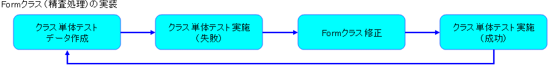
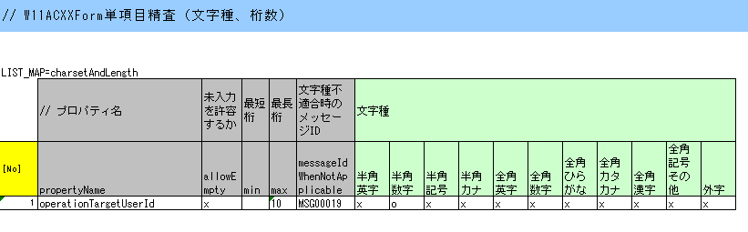
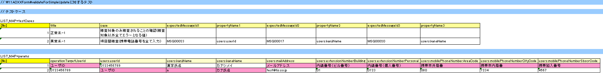
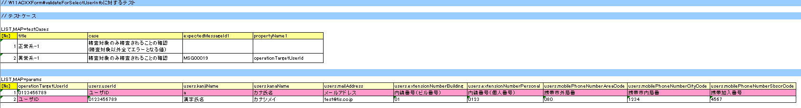

# Formクラスの実装

Formクラスは、以下のステップで実装する。

[1) Formクラスのプロパティの実装](../../guide/web-application/web-application-05-create-form.md#set-property)

[2) Formクラスの精査処理実装](../../guide/web-application/web-application-05-create-form.md#form-validation)

Formクラスのプロパティの実装、Formクラスの精査処理実装は、共に以下に示すFormクラスの精査処理実装の流れに沿って実施する。



1) Formクラスのプロパティの実装

本機能で使用するFormクラスを作成し、プロパティを実装する。
プロパティの実装では、単純にクラスにプロパティを追加するだけではなく、プロパティに対する精査で使用するアノテーション
を setter に追加する実装も行う。

a) Formクラスの作成

本機能で使用するFormクラスを新規に追加し、プロパティ、コンストラクタ、ゲッター/セッターをそれぞれ実装する。

**ソース格納フォルダ**

/Nablarch_sample/main/java/nablarch/sample/ss11AC 配下

**クラス名**

W11ACXXForm

①FormのプロパティとしてoperationTargetUserId（型：String）、users（型：UsersEntity）を実装

②コンストラクタを実装

③ゲッター/セッターを実装

④精査仕様をアノテーションで設定

```java
/**
 * 更新機能（開発手順用）で使用するユーザ情報を保持するフォーム。
 * @author Nablarch Taro
 * @since 1.0
 */
public class W11ACXXForm {

    // 【説明】①プロパティのセット

    /** 更新対象のユーザID */
    private String operationTargetUserId;

    /** ユーザエンティティ */
    private UsersEntity users;

    // 【説明】②コンストラクタの実装
    /**
     * デフォルトコンストラクタ。
     */
    public W11ACXXForm() {
    }

    /**
     * Mapを引数に取るコンストラクタ。
     * @param data 各プロパティのデータを保持したMap
     */
    public W11ACXXForm(Map<String, Object> data) {
        operationTargetUserId = (String) data.get("operationTargetUserId");
        users = (UsersEntity) data.get("users");
    }

    // 【説明】③ゲッター/セッターの実装
    // 【説明】④精査仕様をアノテーションで設定

    /**
     * 更新対象のユーザIDを取得する。
     * @return 更新対象のユーザID
     */
    public String getOperationTargetUserId() {
        return operationTargetUserId;
    }

    /**
     * 更新対象のユーザIDを設定する。
     * @param operationTargetuserId 更新対象のユーザID
     */
    @PropertyName("ユーザID")
    @Required
    @Length(max = 10)
    @SystemChar(charsetDef="numericCharset")
    public void setOperationTargetUserId(String operationTargetuserId) {
        this.operationTargetUserId = operationTargetuserId;
    }

    /**
     * 更新対象のユーザ情報を取得する。
     * @return 更新対象のユーザ情報
     */
    public UsersEntity getUsers() {
        return users;
    }

    /**
     * 更新対象のユーザ情報を設定する。
     * @param users 更新対象のユーザ情報
     */
    @ValidationTarget
    public void setUsers(UsersEntity users) {
        this.users = users;
    }
}
```

( [記載しているサンプルプログラムソースコードの注意事項](../../about/about-nablarch/about-nablarch-aboutThis.md#sourcecode) 参照)

b) クラス単体テストデータの作成

Formクラスのクラス単体テストデータシートを作成し、
プロパティの単項目精査用のテストデータシート(testCharsetAndLength)を追加する。

**データシート格納フォルダ**

/Nablarch_sample/test/java/nablarch/sample/ss11AC 配下

**データシートファイル名**

W11ACXXFormTest.xls [1]

**シート名**

testCharsetAndLength [2]

Formクラスのクラス単体テストデータシートの書き方は、Entityクラスのクラス単体テストデータシートと同じである。
データシートの書き方については、 [Form/Entityのクラス単体テスト](../../development-tools/testing-framework/testing-framework-01-entityUnitTest.md#entityunittest) を参照。

シート名は任意で良いが、説明の為、上記の名称で作成することにする。



> **Note:**
> Formクラスのアクセッサのテストはリクエスト単体テストでカバーできる。

> そのため、Formクラスの単体テストでアクセッサのテストを行う必要はない。

c) クラス単体テストコードの作成

本機能で使用するテストクラスを作成し、単項目精査用のメソッド(testCharsetAndLength)を追加する。

**テストクラス作成フォルダ**

/Nablarch_sample/test/java/nablarch/sample/ss11AC 配下

**テストソースファイル名**

W11ACXXFormTest.java [3]

**メソッド名（単項目精査用）**

testCharsetAndLength

Formクラスのクラス単体テストコードの書き方は、Entityクラスのクラス単体テストコードと同じである。
テストコードの書き方については、 [Form/Entityのクラス単体テスト](../../development-tools/testing-framework/testing-framework-01-entityUnitTest.md#entityunittest) を参照。

```java
/**
 * {@link W11ACXXForm}のテスト。
 * @author Nablarch Taro
 * @since 1.0
 */
public class W11ACXXFormTest extends EntityTestSupport {

    /** テスト対象フォームクラス */
    private static final Class<W11ACXXForm> FORM = W11ACXXForm.class;

    /**
     * 文字種と文字列長のテスト
     */
    @Test
    public void testCharsetAndLength() {
        String sheetName = "testCharsetAndLength";
        String id = "charsetAndLength";
        testValidateCharsetAndLength(FORM, sheetName, id);
    }
}
```

( [記載しているサンプルプログラムソースコードの注意事項](../../about/about-nablarch/about-nablarch-aboutThis.md#sourcecode) 参照)

d) クラス単体テスト実施

クラス単体テストを実施し、単項目精査が行われていることを確認する。

2) Formクラスの精査処理実装

a) クラス単体テストデータの作成

Formクラスのクラス単体テストデータシートを作成し、更新機能用のテストデータシート(testValidateForSimpleUpdate)を追加する。

**データシート格納フォルダ**

/Nablarch_sample/test/java/nablarch/sample/ss11AC 配下

**データシートファイル名**

W11ACXXFormTest.xls [4]

**シート名**

testValidateForSimpleUpdate [5]

Formクラスのクラス単体テストデータシートの書き方については、 [Form/Entityのクラス単体テスト](../../development-tools/testing-framework/testing-framework-01-entityUnitTest.md#entityunittest) を参照。

シート名は任意で良いが、説明の為、上記の名称で作成することにする。



b) クラス単体テストコードの作成

本機能で使用するテストクラスを作成し、更新機能用のメソッド(testValidateForSimpleUpdate)を追加する。

**テストクラス作成フォルダ**

/Nablarch_sample/test/java/nablarch/sample/ss11AC 配下

**テストソースファイル名**

W11ACXXFormTest.java [6]

**メソッド名（更新機能用）**

testValidateForSimpleUpdate

Formクラスのクラス単体テストコードの書き方については、 [Form/Entityのクラス単体テスト](../../development-tools/testing-framework/testing-framework-01-entityUnitTest.md#entityunittest) を参照。

```java
/**
 * {@link W11ACXXForm}のテスト。
 * @author Nablarch Taro
 * @since 1.0
 */
public class W11ACXXFormTest extends EntityTestSupport {

    /** テスト対象フォームクラス */
    private static final Class<W11ACXXForm> FORM = W11ACXXForm.class;

    /**
     * {@link W11ACXXForm#validateForSimpleUpdate(nablarch.core.validation.ValidationContext)} のテスト。
     */
    @Test
    public void testValidateForSimpleUpdate() {
        // 精査実行
        String sheetName = "testValidateForSimpleUpdate";
        String validateFor = "simpleUpdate";

        testValidateAndConvert(FORM, sheetName, validateFor);
    }
}
```

( [記載しているサンプルプログラムソースコードの注意事項](../../about/about-nablarch/about-nablarch-aboutThis.md#sourcecode) 参照)

c) クラス単体テスト実施

クラス単体テストを実施し、更新機能用のテストが失敗することを確認する。（精査メソッドを実装していない為）

> **Note:**
> クラス単体テストの実行方法は、テスト対象のクラス(～Test.java)を右クリックし、[実行]→[Junitテスト]を選択する。

d) Formクラスの修正

Formクラスに単項目精査の呼び出し処理を実装する。

**ソース格納フォルダ**

/Nablarch_sample/main/java/nablarch/sample/ss11AC 配下

**ソースファイル名**

W11ACXXForm.java

①単項目精査を実施するプロパティとして「users」をセット

②単項目精査を実行するメソッドの引数として上記プロパティをセット

```java
// 【説明】①単項目精査を実施するプロパティ「users」をセット
/**
 * ユーザ情報更新時に単項目精査を実施するプロパティ（開発手順用）
 */
private static final String[] SIMPLE_UPDATE_PROPS =
    new String[] {"users"};

/**
 * ユーザ情報更新時に実施するバリデーション（開発手順用）
 * @param context バリデーションの実行に必要なコンテキスト
 */
@ValidateFor("simpleUpdate")
public static void validateForSimpleUpdate(ValidationContext<W11ACXXForm> context) {

    // 【説明】②単項目精査対象項目変数のセット
    // プロパティとして設定したエンティティ内の単項目精査を実行する。
    ValidationUtil.validate(context, SIMPLE_UPDATE_PROPS);
}
```

( [記載しているサンプルプログラムソースコードの注意事項](../../about/about-nablarch/about-nablarch-aboutThis.md#sourcecode) 参照)

e) クラス単体テスト実施

クラス単体テストを実施し、UsersEntityの単項目精査呼び出しが行われていることを確認する。

f) 精査処理の追加

本機能に必要な精査処理を追加する。
実装時の手順は [a) クラス単体テストデータの作成](../../guide/web-application/web-application-05-create-form.md#form-validation-make-testdata)
～ [e) クラス単体テスト実施](../../guide/web-application/web-application-05-create-form.md#form-validation-execute-test) と同じなので、必要なデータのみ以下に記載する。

f)-1 クラス単体テストデータ

**データシート格納フォルダ**

/Nablarch_sample/test/java/nablarch/sample/ss11AC 配下

**データシートファイル名**

W11ACXXFormTest.xls

**シート名**

testValidateForSelectUserInfo



f)-2 クラス単体テストコード

**テストクラス作成フォルダ**

/Nablarch_sample/test/java/nablarch/sample/ss11AC 配下

**テストソースファイル名**

W11ACXXFormTest.java

**メソッド名（更新機能用）**

testValidateForSelectUserInfo

```java
// ～前略～

/**
 * {@link W11ACXXForm#validateForSelectUserInfo(nablarch.core.validation.ValidationContext)} のテスト。
 */
@Test
public void testValidateForSelectUserInfo() {
    // 精査実行
    String sheetName = "testValidateForSelectUserInfo";
    String validateFor = "selectUserInfo";

    testValidateAndConvert(FORM, sheetName, validateFor);
}

// ～後略～
```

( [記載しているサンプルプログラムソースコードの注意事項](../../about/about-nablarch/about-nablarch-aboutThis.md#sourcecode) 参照)

f)-3 Formクラスのソースコード

**ソース格納フォルダ**

/Nablarch_sample/main/java/nablarch/sample/ss11AC 配下

**ソースファイル名**

W11ACXXForm.java

①単項目精査を実施するプロパティとして「operationTargetUserId」をセット

②単項目精査を実行するメソッドの引数として上記プロパティをセット

```java
// 【説明】①単項目精査を実施するプロパティ「operationTargetUserId」をセット
/** ユーザID取得時に精査を実施するプロパティ */
private static final String[] SELECT_USERINFO_PROPS =
    new String[] {"operationTargetUserId"};

/**
 * ユーザID取得時に実施するバリデーション
 * @param context バリデーションの実行に必要なコンテキスト
 */
@ValidateFor("selectUserInfo")
public static void validateForSelectUserInfo(ValidationContext<W11ACXXForm> context) {

    // 【説明】②単項目精査対象項目変数のセット
    // プロパティとして設定したエンティティ内の単項目精査を実行する。
    ValidationUtil.validate(context, SELECT_USERINFO_PROPS);
}
```

( [記載しているサンプルプログラムソースコードの注意事項](../../about/about-nablarch/about-nablarch-aboutThis.md#sourcecode) 参照)
