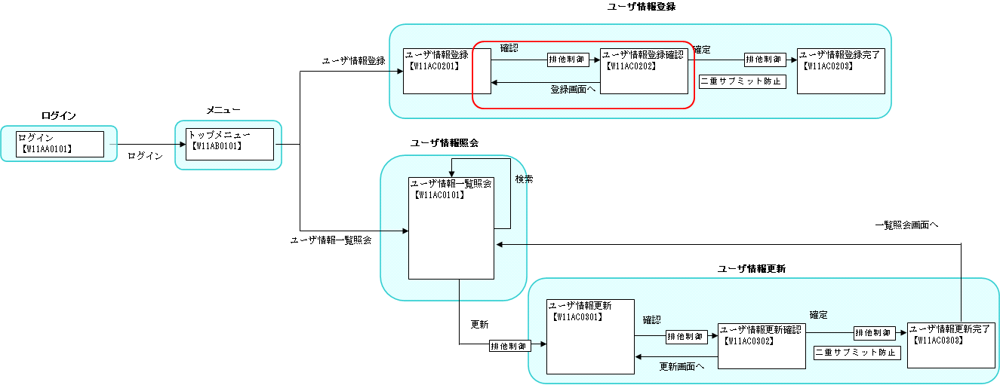

# 画面遷移処理

## 本項で説明する内容

### 説明内容

本項では、以下の内容を説明する。

* 画面遷移処理のJSPへの書き方

### 作成内容

本項で作成するのは、下記画面遷移図の赤丸とその中にある赤文字の遷移の部分である。



編集するソースコードは以下のとおり。

| 名称(右クリック->保存でダウンロード) | ステレオタイプ | 処理内容 |
|---|---|---|
| [W11AC0201.jsp](../../../knowledge/assets/web-application-05-screenTransition/W11AC0201.jsp) [W11AC0202.jsp](../../../knowledge/assets/web-application-05-screenTransition/W11AC0202.jsp) | View | ユーザ情報登録画面に入力した内容及び、登録画面に戻るボタンと、登録処理を行うボタンを表示する。W11AC0202.jsp内でW11AC0201.jspを取り込んでいる。 |

ステレオタイプについては [業務コンポーネントの責務配置](../../about/about-nablarch/about-nablarch-01-NablarchOutline.md#業務コンポーネントの責務配置) を参照。

## 作成手順

### View(JSP)の作成

#### 画面イメージ

作成するJSPの画面イメージを以下に示す。画面左下の"登録画面へ"ボタンと画面右下の"確定"ボタンを押下したときの画面遷移処理の書き方を説明する。


#### ソースコード(実装方法)

アプリケーションフレームワーク提供のカスタムタグを使用する。

n:formタグを使用して、HTMLフォームを作成する。

n:submitタグを使用して、ボタンを指定する。n:submitタグでは、uri属性にサブミットするパスを指定する。

上記を参照し、以下の内容で *W11AC0201.jsp* を作成する。

* W11AC0201.jsp

```./_source/05/W11AC0201.jsp

```

( [記載しているサンプルプログラムソースコードの注意事項](../../about/about-nablarch/about-nablarch-aboutThis.md#注意事項) 参照)

#### "登録画面へ"戻る場合の入力値の復元

登録画面へボタンを押下して前の画面へ戻った場合、入力内容を復元する必要がある。このためには、実装時に以下の点のみ注意しておけばよい。
そうすれば、単純に戻り先の画面へ遷移させれば、入力内容が復元される。

* 入力項目(テキストエリア、ラジオボタンなど)を作成する際は、アプリケーションフレームワーク提供のカスタムタグを使用する。
* n:formタグのwindowScopePrefixes属性に入力項目のカスタムタグのname属性に指定したプレフィックス [(参照)](../../guide/web-application/web-application-04-validation.md#viewjspの作成) を指定する。

## 次に読むもの

* [カスタムタグの使用方法を詳しく知りたい時](../../../fw/reference/02_FunctionDemandSpecifications/03_Common/07_WebView.html)
