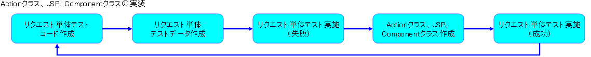
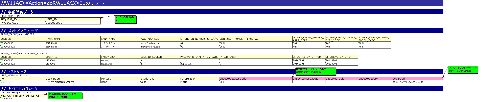
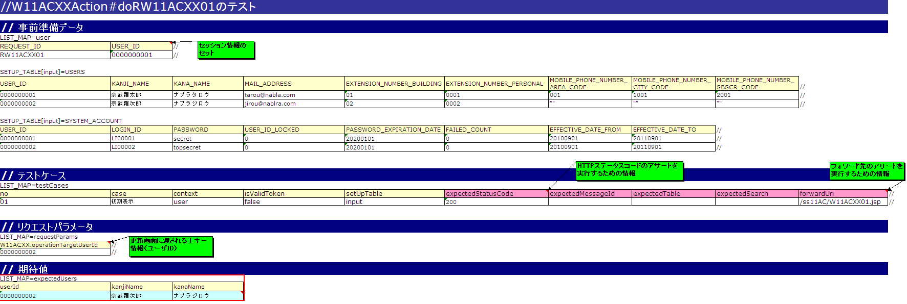

# 更新画面初期表示の実装

更新画面の初期表示は、以下のステップで実装する。

[1) 更新画面の表示](../../guide/web-application/web-application-06-initial-view.md#update-view)

[1)-1 Actionクラスの実装](../../guide/web-application/web-application-06-initial-view.md#update-view-action)

[1)-2 JSPの実装](../../guide/web-application/web-application-06-initial-view.md#update-view-jsp)

[2) 更新画面表示内容の検索処理実装](../../guide/web-application/web-application-06-initial-view.md#update-select)

[2)-1 Componentクラスの実装](../../guide/web-application/web-application-06-initial-view.md#update-select-component)

[2)-2 Actionクラスの実装](../../guide/web-application/web-application-06-initial-view.md#update-select-action)

**1) 更新画面の表示**

画面の実装の流れは下記の通り。



1)-1 Actionクラスの実装

a) リクエスト単体テストコードの作成

サンプルアプリケーションのテストパッケージにリクエスト単体テストクラスを新規に作成する。

実装するクラスは以下の通り。

**テストクラス作成フォルダ**

/Nablarch_sample/test/java/nablarch/sample/ss11AC 配下

**テストクラス名**

W11ACXXActionRequestTest

実装するメソッドは以下の通り。

**① ターゲットクラスのベースURIを返却するメソッド**

String getBaseUri()

**② リクエスト単体テストを実行するメソッド**

void testRW11ACXX01()

リクエスト単体テストコードの作成については、 [リクエスト単体テストの実施方法](../../development-tools/testing-framework/testing-framework-02-requestunittest-index.md#requestunittest) を参照。

```java
/**
 * {@link W11ACXXAction}のテスト
 *
 * @author Nablarch Taro
 * @since 1.0
 */
public class W11ACXXActionRequestTest extends BasicHttpRequestTestTemplate {

    // 【説明】①ターゲットクラスのベースURIを返却する
    /** {@inheritDoc} */
    @Override
    protected String getBaseUri() {
        return "/action/ss11AC/W11ACXXAction/";
    }

    // 【説明】②リクエスト単体テストを実行
    @Test
    public void testRW11ACXX01() {
        execute("testRW11ACXX01");
    }

}
```

( [記載しているサンプルプログラムソースコードの注意事項](../../about/about-nablarch/about-nablarch-aboutThis.md#sourcecode) 参照)

b) リクエスト単体テストデータシートの作成

リクエスト単体テストデータシート(Excelファイル)をリクエスト単体テストコードと同じフォルダに作成する。

リクエスト単体テストデータの作成については、 [リクエスト単体テストの実施方法](../../development-tools/testing-framework/testing-framework-02-requestunittest-index.md#requestunittest) を参照。

**ブック名**

W11ACXXActionRequestTest.xls

**シート名**

testRW11ACXX01

> **Warning:**
> 現在のリクエスト単体テストでは、テストデータとしてテスト共通データシート(シート名：setUpDb)が必須である為、不要な場合でもシートを作成すること。シート内には何も書かなくてよい。



c) リクエスト単体テスト実施

リクエスト単体テストを実施し、テストが失敗することを確認する。（Actionクラスを作成していない為）

コンソールログに以下の内容が出力されれば良い。

ステータスコード404の箇所で処理がENDしていること。

＜出力内容＞

```none
2011-09-28 18:25:28.041 -INFO- root [201109281825279950001] boot_proc = [] proc_sys = [] req_id = [RW11ACXX01] usr_id = [0000000001] @@@@ END @@@@ rid = [RW11ACXX01] uid = [0000000001] sid = [15dbmk0lzycbo1ajvrs2pqesk1] url = [http://127.0.0.1/action/ss11AC/W11ACXXAction/RW11ACXX01] status_code = [404] content_path = [/PAGE_NOT_FOUND_ERROR.jsp]
```

リクエスト単体テストの実施については、 [リクエスト単体テストの実施方法](../../development-tools/testing-framework/testing-framework-02-requestunittest-index.md#requestunittest) を参照。

> **Note:**
> リクエスト単体テストの実行方法は、テスト対象のクラス(～Test.java)を右クリックし、[実行]→[Junitテスト]を選択する。

d) Actionクラスの新規作成

サンプルアプリケーションのパッケージにActionクラスを新規に作成する。

実装するクラス名、メソッド名は以下の通り。

**ソース格納フォルダ**

/Nablarch_sample/main/java/nablarch/sample/ss11AC 配下

**クラス名**

W11ACXXAction

**メソッド名**

"do" ＋ RW11ACXX01（更新画面初期表示のリクエストID）

①ユーザ情報更新画面のJSP：W11ACXX01.jspを指定する。

```java
/**
 * ユーザー更新機能のアクションクラス。
 *
 * @author Nablarch Taro
 * @since 1.0
 */
public class W11ACXXAction {

    /**
     * ユーザ情報更新画面の初期表示。
     *
     * @param req リクエストコンテキスト
     * @param ctx HTTPリクエストの処理に関連するサーバの側の情報
     * @return HTTPレスポンス
     */
    public HttpResponse doRW11ACXX01(HttpRequest req, ExecutionContext ctx) {

        // 【説明】①ユーザ情報更新画面へ遷移
        return new HttpResponse("/ss11AC/W11ACXX01.jsp");
    }
}
```

( [記載しているサンプルプログラムソースコードの注意事項](../../about/about-nablarch/about-nablarch-aboutThis.md#sourcecode) 参照)

e) リクエスト単体テスト実施

リクエスト単体テストを実施し、Actionクラスまで処理が到達していることを確認する。

コンソールログに以下の内容が出力されれば良い。

* Actionクラスまで処理到達

ログ中の「@@@@ DISPATCHING CLASS @@@@」の次に「BEFORE ACTION」が出力されていれば、Actionまで処理が到達している。

＜出力内容＞

```none
2011-09-28 18:26:39.163 -INFO- root [201109281826391630001] boot_proc = [] proc_sys = [] req_id = [RW11ACXX01] usr_id = [0000000001] @@@@ DISPATCHING CLASS @@@@ class = [nablarch.sample.ss11AC.W11ACXXAction]
2011-09-28 18:26:39.179 -DEBUG- root [201109281826391630001] boot_proc = [] proc_sys = [] req_id = [RW11ACXX01] usr_id = [0000000001] **** BEFORE ACTION ****
```

* JSPファイルNOT FOUND

＜出力内容＞

```none
ERROR: PWC6117: File "C:\tisdev\workspace\Nablarch_sample\main\web\ss11AC\W11ACXX01.jsp" not found
```

> **Note:**
> テストを繰り返しながらActionクラスを徐々に完成させる。

1)-2 JSPの実装

a) JSPの自動生成

作成するフォルダ、ファイル名は以下の通り。

**JSP作成フォルダ**

/Nablarch_sample/web/ss11AC 配下

**JSPファイル名**

W11ACXX01.jsp

JSP自動生成ツールを使用して、外部設計で作成した下記の画面HTMLからJSPを自動生成する。

 [ユーザ情報更新画面.html](../../../knowledge/assets/web-application-06-initial-view/ユーザ情報更新画面.html)

作成手順は以下の通り。

①画面HTMLをJSP作成フォルダに移動し、ファイル名をJSPと合わせる。

**HTMLファイル名**

W11ACXX01.html

②JSP自動生成ツールを使用して、画面HTMLからJSPを自動生成する。

JSP自動生成ツールの使用方法は、Nablarch Toolbox のドキュメントを参照。

③不要となったHTMLファイルを削除する。

b) JSPの表示確認１

自動生成されたJSPは、Nablarch提供のカスタムタグの必須属性が出力されている。

カスタムタグの必須属性のうち、画面表示に最低限必要なボタンとリンクのname属性とuri属性のみ値を設定する。

修正前後の [差分](../../../knowledge/assets/web-application-06-initial-view/diff01.html) を示す。

リクエスト単体テストを実行し、HTML(JSP)が出力されること、HTTPステータスコード：200が返却されることを確認する。

出力されたHTMLをWebブラウザで開き、更新画面であることを確認する。

**HTMLの出力先フォルダ**

/Nablarch_sample/tmp/html_dump/W11ACXXActionRequestTest 配下

> **Note:**
> Nablarch提供のカスタムタグについては、 [カスタムタグ実装例集](../../guide/web-application/web-application-CustomTag.md#customtag-example) を参照。

c) JSPの修正

① JSPのメイン領域のカスタムタグを修正する。

修正前後の [差分](../../../knowledge/assets/web-application-06-initial-view/diff02.html) を示す。

漢字氏名の入力エリアのタグ修正例を以下に示す。

＜修正前＞

```none
<tr>
    <th>
        <span class="essential">*</span>漢字氏名<span class="instruct">(全角50文字)</span>
    </th>
    <td>
        <n:text name="kanjiName" size="70" maxlength="50" />
        <n:error name="kanjiName" />
    </td>
</tr>
```

( [記載しているサンプルプログラムソースコードの注意事項](../../about/about-nablarch/about-nablarch-aboutThis.md#sourcecode) 参照)

＜修正後＞

```none
<tr>
    <th>
        <span class="essential">*</span>漢字氏名<span class="instruct">(全角50文字)</span>
    </th>
    <td>
        <%-- 【説明】n:textタグとn:errorタグのname属性を修正する --%>
        <n:text name="W11ACXX.users.kanjiName" size="70" maxlength="50" />
        <n:error name="W11ACXX.users.kanjiName" />
    </td>
</tr>
```

( [記載しているサンプルプログラムソースコードの注意事項](../../about/about-nablarch/about-nablarch-aboutThis.md#sourcecode) 参照)

②<n:form>タグ属性windowScopePrefixesの値を設定する。

ここでは更新取引を行う取引IDから"W11ACXX"というプレフィックスを使用する。

```none
<n:form windowScopePrefixes="W11ACXX">
```

> **Note:**
> ウィンドウスコープについては、以下のリンク先を参照

> * >   [ウィンドウスコープの概念](../../../fw/reference/architectural_pattern/concept.html#windowscope)
> * >   カスタムタグ実装例集 - [ウィンドウスコープの使用法](../../guide/web-application/web-application-basic.md#howto-window-scope)

③その他、画面のタイトル、JSPインクルードで共通化された部分を修正する。

＜修正後＞

```./_download/W11ACXX01_1.jsp

```

( [記載しているサンプルプログラムソースコードの注意事項](../../about/about-nablarch/about-nablarch-aboutThis.md#sourcecode) 参照)

d) JSPの表示確認２

リクエスト単体テストを実行し、d)で行った修正により、レイアウトが崩れていないかを確認する。

出力されたHTMLをWebブラウザで開き、更新画面であることを確認する。

**HTMLの出力先フォルダ**

/Nablarch_sample/tmp/html_dump/W11ACXXActionRequestTest 配下

e) JSP静的チェックツールの実行

[JSP静的解析ツール](../../development-tools/java-static-analysis/java-static-analysis-01-JspStaticAnalysis.md#jsp-static-analysis-tool) を実行し、該当ファイルに静的チェックエラーがないことを確認する。

> **Note:**
> 静的チェックでエラーが出る実装は、クロスサイトスクリプティングの脆弱性を含む可能性があるため、
> 必ず対処が必要になる。
> アプリケーションの機能制約などから、どうしても静的チェックのエラーが回避できない場合は、
> 必ずプロジェクトのアーキテクトに確認し、対処方法を検討すること。

**2) 更新画面表示内容の検索処理実装**

2)-1 Componentクラスの実装

a) リクエスト単体テストコード修正

1) 更新画面の表示- [1)-1 Actionクラスの実装](../../guide/web-application/web-application-06-initial-view.md#update-view-action) で作成した以下のテストクラスのメソッドに検索結果のアサートが実行できるように修正する。

クラス名：W11ACXXActionRequestTest

メソッド名：testRW11ACXX01

＜修正後＞

```java
@Test
public void testRW11ACXX01() {
    execute("testRW11ACXX01", new BasicAdvice() {
        @Override
        public void afterExecute(TestCaseInfo testCaseInfo, ExecutionContext context) {
            String message = testCaseInfo.getTestCaseName();
            String sheetName = testCaseInfo.getSheetName();

            // 更新画面に表示する内容をアサートする
            W11ACXXForm actual = context.getRequestScopedVar("W11ACXX");
            assertObjectPropertyEquals(message, sheetName, "expectedUsers", actual.getUsers());
        }
    });
}
```

( [記載しているサンプルプログラムソースコードの注意事項](../../about/about-nablarch/about-nablarch-aboutThis.md#sourcecode) 参照)

> **Note:**
> 上記ソースコードでは、BasicAdviceクラスを用いてリクエスト単体テストに固有の処理を追加している。
> より詳しいテストメソッドの書き方については [テストメソッドの書き方](../../development-tools/testing-framework/testing-framework-02-requestunittest-index.md#05-02-howtocodingtestmethod) を参照。

> また、assertObjectPropertyEqualsメソッドについては、 [クラスのプロパティを検証したい](../../development-tools/testing-framework/testing-framework-03-Tips.md#how-to-assert-property-from-excel) を参照。

b) リクエスト単体テストデータシート修正

1) 更新画面の表示- [1)-1 Actionクラスの実装](../../guide/web-application/web-application-06-initial-view.md#update-view-action) で作成した以下のシートのデータに対して、検索結果のデータを追加する。

ブック名：W11ACXXActionRequestTest.xls

シート名：testRW11ACXX01



※追加部分は画像の赤枠部分。

> **Note:**
> リクエスト単体テストが一度成功すると、
> [リクエスト単体データ作成ツール](../../development-tools/toolbox/toolbox-01-httpdumptool-01-HttpDumpTool.md)
> を利用することにより、データシートへ記載する必要があるリクエストパラメータのキーと値を自動で作成できる。

c) リクエスト単体テスト実施

リクエスト単体テストを実行し、失敗することを確認する。

この時点では、検索処理の実装をしていない為、失敗する。

d) 検索処理の実装

更新画面の入力項目に表示する値の検索処理をComponentクラスに実装する。実装のポイントは以下の通り。

①更新画面表示内容の検索SQL文の作成

**SQL作成フォルダ**

/Nablarch_sample/resources/nablarch/sample/ss11AC 配下

**SQLファイル名**

CM311ACXComponent.sql

＜検索SQL文＞

```sql
-- ユーザ更新情報検索
SELECT_USER_INFO=
SELECT
    USER_ID,
    KANJI_NAME,
    KANA_NAME
FROM
    USERS
WHERE
    USER_ID = ?
```

( [記載しているサンプルプログラムソースコードの注意事項](../../about/about-nablarch/about-nablarch-aboutThis.md#sourcecode) 参照)

②Componentクラスを新規に作成し、検索処理実行メソッドを実装する。

実装するクラス名、メソッド名は以下の通り。

**ソース格納フォルダ**

/Nablarch_sample/main/java/nablarch/sample/ss11AC 配下

**Componentクラス名**

CM311ACXComponent

**メソッド名**

SqlResultSet selectUsers(String userId)

```java
/**
 * ユーザ情報更新の機能内共通コンポーネントクラス
 *
 * @author Nablarch Taro
 * @since 1.0
 */
public class CM311ACXComponent extends DbAccessSupport {

    // 【説明】②更新画面表示内容の検索処理メソッド

    /**
     * ユーザIDをキーとして、ユーザテーブルに詳細検索を行う。
     *
     * @param userId ユーザID
     * @return 検索結果
     */
    public SqlResultSet selectUsers(String userId) {
        SqlPStatement statement = getSqlPStatement("SELECT_USER_INFO");
        statement.setString(1, userId);
        return statement.retrieve();
    }

}
```

( [記載しているサンプルプログラムソースコードの注意事項](../../about/about-nablarch/about-nablarch-aboutThis.md#sourcecode) 参照)

2)-2 Actionクラスの実装

a) 検索処理の呼び出し実装

Actionクラスに2)-1 Componentクラスの実装で実装した検索処理の呼び出しを実装する。

1) 更新画面の表示- [1)-1 Actionクラスの作成](../../guide/web-application/web-application-06-initial-view.md#update-view-action) で作成したActionクラスのメソッドに対し、以下の処理を追加する。

**ソース格納フォルダ**

/Nablarch_sample/main/java/nablarch/sample/ss11AC 配下

**Actionクラス名**

W11ACXXAction

**メソッド名**

HttpResponse doRW11ACXX01(HttpRequest req, ExecutionContext ctx)

①前画面より渡されるパラメータ：ユーザIDの取得

②取得したユーザIDに紐付く更新画面表示内容の検索処理の呼び出し

③更新画面表示内容をリクエストへセット

```java
public class W11ACXXAction {

    /**
     * ユーザ情報更新画面の初期表示。
     *
     * @param req リクエストコンテキスト
     * @param ctx HTTPリクエストの処理に関連するサーバの側の情報
     * @return HTTPレスポンス
     */
    public HttpResponse doRW11ACXX01(HttpRequest req, ExecutionContext ctx) {

        // 【説明】①リクエストに設定されたデータの精査・ユーザIDの取得
        ValidationContext<W11ACXXForm> formCtx =
            ValidationUtil.validateAndConvertRequest("W11ACXX",
                    W11ACXXForm.class, req, "selectUserInfo");
        if (!formCtx.isValid()) {
            throw new ApplicationException(formCtx.getMessages());
        }
        String userId = formCtx.createObject().getOperationTargetUserId();

        // 【説明】②検索処理の呼び出し
        CM311ACXComponent comp = new CM311ACXComponent();
        SqlResultSet userInfo = comp.selectUsers(userId);

        // 【説明】③更新画面の表示内容をリクエストへセット
        W11ACXXForm form = new W11ACXXForm();
        UsersEntity users = new UsersEntity(userInfo.get(0));
        form.setUsers(users);
        ctx.setRequestScopedVar("W11ACXX", form);

        return new HttpResponse("/ss11AC/W11ACXX01.jsp");
    }
}
```

( [記載しているサンプルプログラムソースコードの注意事項](../../about/about-nablarch/about-nablarch-aboutThis.md#sourcecode) 参照)

b) 更新画面の表示確認

リクエスト単体テストを実行し、出力されたHTMLに更新対象の検索結果が表示されていることを確認する。
