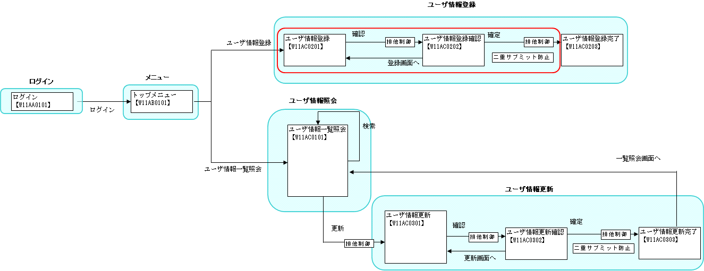
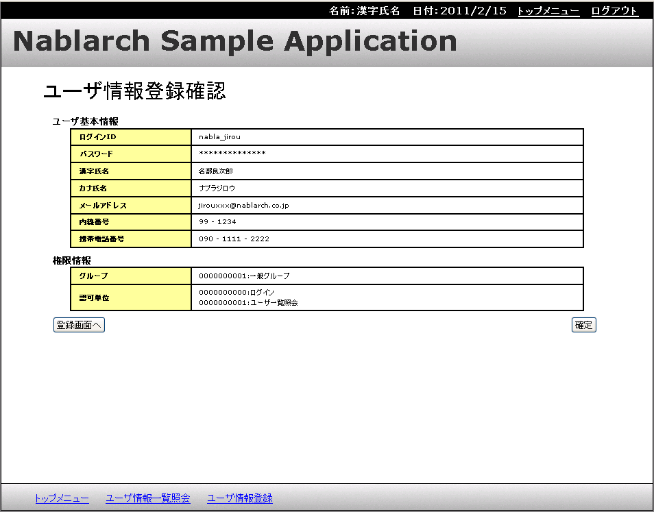

# 入力画面と確認画面の共通化

## 本項で説明する内容

### 説明内容

本項では、以下の内容を説明する。

* 入力画面と確認画面とでJSPファイルを共通化する方法

Nablarch Application Frameworkでは、入力画面と確認画面が1対1に対応するような画面を作成する場合に、
JSPを共通化する機能を提供する。

### 作成内容

本項で作成するのは、下記画面遷移図の赤丸の部分である。



編集するソースコードは以下のとおり。

| 名称(右クリック->保存でダウンロード) | ステレオタイプ | 処理内容 |
|---|---|---|
| [W11AC0201.jsp](../../../knowledge/assets/web-application-06-sharingInputAndConfirmationJsp/W11AC0201.jsp) [W11AC0202.jsp](../../../knowledge/assets/web-application-06-sharingInputAndConfirmationJsp/W11AC0202.jsp) | View | ユーザ情報登録画面に入力した内容及び、登録画面に戻るボタンと、登録処理を行うボタンを表示する。W11AC0202.jsp内でW11AC0201.jspを取り込んでいる。 |

ステレオタイプについては [業務コンポーネントの責務配置](../../about/about-nablarch/about-nablarch-01-NablarchOutline.md#業務コンポーネントの責務配置) を参照。

## 作成手順

### View(JSP)の作成

#### 画面イメージ

作成するJSPの画面イメージを以下に示す。



#### 概要

入力画面と確認画面を共通化する場合、入力画面のJSPに全ての情報を記載する。
確認画面のJSPには、入力画面とJSPを共通化する旨のカスタムタグを記載するだけである。

入力画面と確認画面とで表示内容が異なる箇所については、入力画面のほうに
分岐処理を埋め込んで、入力画面用の表示処理、確認画面用の表示処理を記述する。

#### 入力画面の作成方法

両方の画面に含まれる内容を記述する

入力画面でのみ表示する内容は、n:forInputPageタグを使用して記述する。

確認画面でのみ表示する内容は、n:forConfirmationPageタグを使用して記述する

> **Note:**
> n:textタグ、n:passwordタグ、n:selectタグは、入力画面ではinputタグやselectタグとして出力されるが、
> 確認画面として描画される場合はタグではなく文字列として表示される。詳細については、 [入力項目の確認画面用の出力](../../../fw/reference/02_FunctionDemandSpecifications/03_Common/07/07_FormTag.html#output-for-confirmation-page) を参照。

> **Note:**
> n:forInputPageタグで囲まれた箇所は入力画面でのみ評価され、n:forConfirmationPageタグで囲まれた箇所は確認画面でのみ評価される。詳細については、 [入力画面と確認画面の表示切り替え](../../../fw/reference/02_FunctionDemandSpecifications/03_Common/07/07_FacilitateTag.html#id13) を参照。

上記を参照し、以下の内容で *W11AC0201.jsp* を作成する。

* W11AC0201.jsp

```./_source/06/W11AC0201.jsp

```

( [記載しているサンプルプログラムソースコードの注意事項](../../about/about-nablarch/about-nablarch-aboutThis.md#注意事項) 参照)

#### 確認画面の作成方法

確認画面JSPに、n:confirmationPageタグを使用して、path属性には共通化する入力画面へのパスを指定する

上記を参照し、以下の内容で *W11AC0202.jsp* を作成する。

* W11AC0202.jsp

```./_source/06/W11AC0202.jsp

```

( [記載しているサンプルプログラムソースコードの注意事項](../../about/about-nablarch/about-nablarch-aboutThis.md#注意事項) 参照)

> **Note:**
> 本ソースコードをそのままファイルに保管しようとすると、文字コードに関するエラーが出る。
> 必ず、【説明】で始まるコメント行を削除してからファイルを保管すること。

## 共通化の指針

入力画面と確認画面がほぼ同一の内容であるような、シンプルな登録処理であれば、
入力画面と確認画面を共通化することにより、JSP記述量を減らすことができる。
このような場合は、生産性向上が見込まれるので本機能を使用するべきである。

逆に、複雑な業務で、入力画面と確認画面での差異が大きい場合は、
入力画面と確認画面との場合分けの記述を１画面に詰め込むことになるので
かえって煩雑で保守性の低いコードになる恐れがある。
このような場合には、無理に共通化はせず別々のJSPファイルを作成すべきである。

## 次に読むもの

* [画面共通化のカスタムタグ使用方法を詳しく知りたい時](../../../fw/reference/02_FunctionDemandSpecifications/03_Common/07/07_FacilitateTag.html#webview-inputconfirmationcommon)
