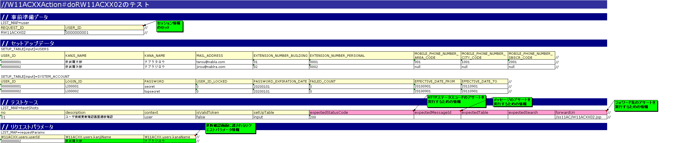
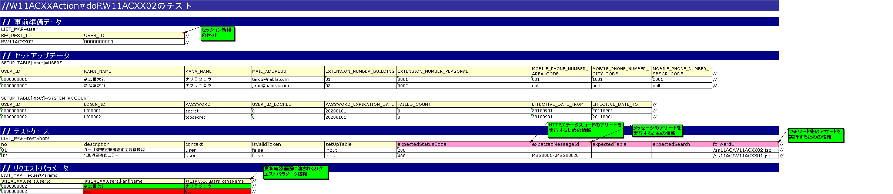

# 確認画面の実装

更新確認画面は、以下のステップで実装する。

[1) 更新確認画面の表示](../../guide/web-application/web-application-07-confirm-view.md#確認画面の実装)

[1)-1 Actionクラスの実装](../../guide/web-application/web-application-07-confirm-view.md#確認画面の実装)

[1)-2 JSPの実装](../../guide/web-application/web-application-07-confirm-view.md#確認画面の実装)

[2) 精査処理呼び出し実装](../../guide/web-application/web-application-07-confirm-view.md#確認画面の実装)

[2)-1 Actionクラスの実装](../../guide/web-application/web-application-07-confirm-view.md#確認画面の実装)

**1) 更新確認画面の実装**

1)-1 Actionクラスの実装

a) リクエスト単体テストコードの追加

更新画面初期表示の実装-1) 更新画面の表示- [1)-1 Actionクラスの作成](../../guide/web-application/web-application-06-initial-view.md#更新画面初期表示の実装) で作成した以下のテストクラスに対して確認画面表示リクエストのテスト実行メソッドを追加する。

**ソース格納フォルダ**

/Nablarch_sample/main/java/nablarch/sample/ss11AC 配下

**テストクラス名**

W11ACXXActionRequestTest

**メソッド名**

void testRW11ACXX02()

```java
// ～前略～

@Test
public void testRW11ACXX02() {
    execute("testRW11ACXX02");
}

// ～後略～
```

( [記載しているサンプルプログラムソースコードの注意事項](../../about/about-nablarch/about-nablarch-aboutThis.md#注意事項) 参照)

b) リクエスト単体テストデータシートの作成

更新画面初期表示の実装-1) 更新画面の表示- [1)-1 Actionクラスの作成](../../guide/web-application/web-application-06-initial-view.md#更新画面初期表示の実装) で作成したリクエスト単体テストデータシート(Excelファイル)に確認画面表示リクエスト用のシートを追加する。

**ブック名**

W11ACXXActionRequestTest.xls

**シート名**

testRW11ACXX02



c) リクエスト単体テスト実施

リクエスト単体テストを実施し、テストが失敗することを確認する。（Actionクラスにメソッドを追加していない為）

d) Actionクラスの修正

更新画面初期表示の実装-1) 更新画面の表示- [1)-1 Actionクラスの作成](../../guide/web-application/web-application-06-initial-view.md#更新画面初期表示の実装) で作成したActionクラスに確認画面表示のメソッドを追加する。

**Actionクラス名**

W11ACXXAction

**メソッド名**

"do" ＋ RW11ACXX02（確認画面表示のリクエストID）

```java
// ～前略～

/**
 * ユーザ情報更新確認画面の表示
 *
 * @param req リクエストコンテキスト
 * @param ctx HTTPリクエストの処理に関連するサーバ側の情報
 * @return HTTPレスポンス
 */
public HttpResponse doRW11ACXX02(HttpRequest req, ExecutionContext ctx) {

    // 【説明】最初は単純にJSPを返却する処理のみ実装
    // ユーザ情報更新確認画面へ遷移
    return new HttpResponse("/ss11AC/W11ACXX02.jsp");
}

// ～後略～
```

( [記載しているサンプルプログラムソースコードの注意事項](../../about/about-nablarch/about-nablarch-aboutThis.md#注意事項) 参照)

e) リクエスト単体テスト実施

リクエスト単体テストを実施し、Actionクラスまで処理が到達していることを確認する。

コンソールログに以下の内容が出力されれば良い。

* Actionクラスまで処理到達

  ログ中の「@@@@ DISPATCHING CLASS @@@@」の次に「BEFORE ACTION」が出力されていれば、Actionまで処理が到達している。

  ＜出力内容＞

  ```none
  2011-09-28 22:33:16.402 -INFO- root [201109282233164020001] boot_proc = [] proc_sys = [] req_id = [RW11ACXX02] usr_id = [0000000001] @@@@ DISPATCHING CLASS @@@@ class = [nablarch.sample.ss11AC.W11ACXXAction]
  2011-09-28 22:33:16.402 -DEBUG- root [201109282233164020001] boot_proc = [] proc_sys = [] req_id = [RW11ACXX02] usr_id = [0000000001] **** BEFORE ACTION ****
    request_parameter = [{
        W11ACXX.users.kanjiName = [奈武羅次郎],
        W11ACXX.users.userId = [0000000002],
        W11ACXX.users.kanaName = [ナブラジロウ]}]
    request_scope = [{
        org.mortbay.jetty.newSessionId = [1i46u2d2w3p9j1nhxinl48tu2m]}]
    session_scope = [{
        user.id = [0000000001],
        commonHeaderLoginDate = [20100914],
        commonHeaderLoginUserName = [リクエスト単体テストユーザ]}]
  2011-09-28 22:33:16.418 -DEBUG- root [201109282233164020001] boot_proc = [] proc_sys = [] req_id = [RW11ACXX02] usr_id = [0000000001] **** DISPATCHING METHOD **** method = [nablarch.sample.ss11AC.W11ACXXAction#dorw11acxx02]
  ```
* JSPファイルNOT FOUND

  ＜出力内容＞

  ```none
  ERROR: PWC6117: File "C:\tisdev\workspace\Nablarch_sample\main\web\ss11AC\W11ACXX02.jsp" not found
  ```

1)-2 JSPの実装

a) JSPの新規作成

更新確認画面のJSP：W11ACXX02.jspを作成する。

更新確認画面はNablarchの提供機能である、入力画面と確認画面の共通化の機能を利用することを想定している為、JSPの記述は以下に示す記述のみ。

```none
<%@ taglib prefix="n" uri="http://tis.co.jp/nablarch" %>
<%-- 【説明】確認画面のテンプレートとして使用するJSPのパスを指定 --%>
<n:confirmationPage path="./W11ACXX01.jsp" />
```

( [記載しているサンプルプログラムソースコードの注意事項](../../about/about-nablarch/about-nablarch-aboutThis.md#注意事項) 参照)

> **Note:**
> 本ソースコードをそのまま貼り付けてファイルを保管しようとすると、文字コードに関するエラーが出る。
> 必ず、【説明】で始まるコメント行を削除してからファイルを保管すること。

b) JSPの修正

前述の通り、確認画面は入力画面と確認画面の共通化の機能を利用する為、更新画面の修正が必要である。

W11ACXX01.jsp(更新画面)に更新確認画面用のタイトル、ボタンを追加する。

更新画面用のタイトル、ボタンは<n:forInputPage>タグで囲み、更新確認画面用のタイトル、ボタンは<n:forConfirmationPage>タグで囲む。

＜修正後のJSP＞

```./_download/W11ACXX01_2.jsp

```

( [記載しているサンプルプログラムソースコードの注意事項](../../about/about-nablarch/about-nablarch-aboutThis.md#注意事項) 参照)

1)-3 JSPの表示確認

b)で行った修正により、更新確認画面が表示されることを確認する。

この時点ではリクエスト単体でデータシートにセットしたリクエスト内容がそのまま表示される [1]。

本来であれば精査処理を行い、精査OKの場合に確認画面が表示される。

1)-3 JSP静的チェックツールの実行

[JSP静的解析ツール](../../development-tools/java-static-analysis/java-static-analysis-01-JspStaticAnalysis.md#jsp静的解析ツール) を実行し、該当ファイルに静的チェックエラーがないことを確認する。

**2) 精査処理呼び出し実装**

2)-1 Actionクラスの作成

a) リクエスト単体データシートの修正

精査呼び出しの確認用データの追加する。

精査呼び出しの確認は全ての項目が精査エラーとなるようなデータで実施する。



b) 精査処理の呼び出し実装

1) 更新確認画面の実装- [1)-1 Actionクラスの実装](../../guide/web-application/web-application-07-confirm-view.md#確認画面の実装) で作成したActionクラスに対して、 [Entityクラス（精査処理）の実装](../../guide/web-application/web-application-04-create-entity.md#entityクラス精査処理の実装) と [Formクラスの実装](../../guide/web-application/web-application-05-create-form.md#formクラスの実装) で作成した精査処理の呼び出し、精査エラー時の遷移先指定を実装する。また、必要なimport文を追加する。

```java
/**
 * ユーザ情報更新確認画面の表示
 *
 * @param req リクエストコンテキスト
 * @param ctx HTTPリクエストの処理に関連するサーバ側の情報
 * @return HTTPレスポンス
 */
// 【説明】精査エラー時の遷移先の指定
@OnError(type = ApplicationException.class, path = "/ss11AC/W11ACXX01.jsp")
public HttpResponse doRW11ACXX02(HttpRequest req, ExecutionContext ctx) {

    // 【説明】精査処理の呼び出し実装
    ValidationContext<W11ACXXForm> formCtx =
        ValidationUtil.validateAndConvertRequest("W11ACXX",
                W11ACXXForm.class, req, "simpleUpdate");
    if (!formCtx.isValid()) {
        throw new ApplicationException(formCtx.getMessages());
    }

    return new HttpResponse("/ss11AC/W11ACXX02.jsp");
}
```

( [記載しているサンプルプログラムソースコードの注意事項](../../about/about-nablarch/about-nablarch-aboutThis.md#注意事項) 参照)

c) リクエスト単体実施

リクエスト単体テストを実施し、以下のようになることを確認する。

精査OKの場合に更新確認画面が出力される。

⇒実行結果が成功であり、更新確認画面のHTMLが出力されること。

精査NGの場合に更新画面が出力される。

⇒実行結果が成功であり、更新画面のHTMLが出力され、エラーメッセージも出力されていること。
