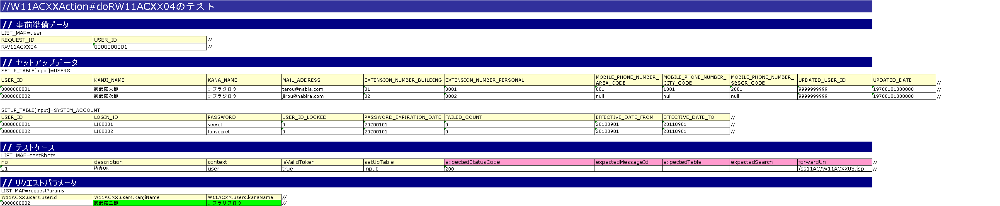
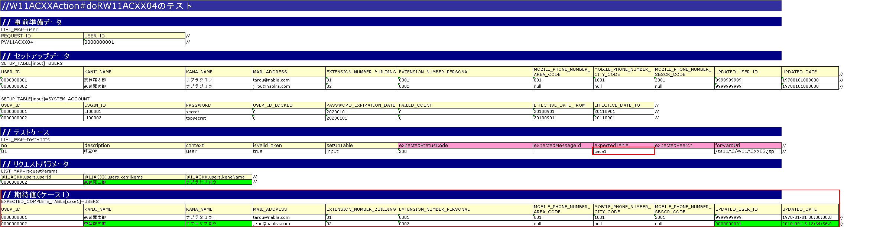

# 完了画面の実装

## 完了画面の実装

## 完了画面の実装

### 1) 更新完了画面の表示

#### 1)-1 Actionクラスの実装

a) テストクラス: `W11ACXXActionRequestTest` にテストメソッド `void testRW11ACXX04()` を追加する。

```java
@Test
public void testRW11ACXX04() {
    execute("testRW11ACXX04");
}
```

b) テストデータブック: `W11ACXXActionRequestTest.xls`、シート: `testRW11ACXX04`



c) リクエスト単体テストを実施し、テストが失敗することを確認する。（Actionクラスにメソッドを追加していない為）

d) **クラス名**: `W11ACXXAction`、**メソッド名**: `doRW11ACXX04`

```java
public HttpResponse doRW11ACXX04(HttpRequest req, ExecutionContext ctx) {
    // 【説明】最初は単純にJSPを返却する処理のみ実装
    return new HttpResponse("/ss11AC/W11ACXX03.jsp");
}
```

e) リクエスト単体テストを実施し、Actionクラスまで処理が到達していることを確認する。

コンソールログに以下の内容が出力されれば良い。

- **Actionクラスまで処理到達**: ログ中の `@@@@ DISPATCHING CLASS @@@@` の次に `BEFORE ACTION` が出力されていれば、Actionまで処理が到達している。

```
2011-09-29 10:14:50.755 -INFO- root [...] @@@@ DISPATCHING CLASS @@@@ class = [nablarch.sample.ss11AC.W11ACXXAction]
2011-09-29 10:14:50.755 -DEBUG- root [...] **** BEFORE ACTION ****
```

- **JSPファイルNOT FOUND**: この時点ではJSPが存在しないため、以下のエラーが出力されることが期待される結果である。

```
ERROR: PWC6117: File "C:\tisdev\workspace\Nablarch_sample\main\web\ss11AC\W11ACXX03.jsp" not found
```

#### 1)-2 JSPの実装

- HTMLテンプレート: `ユーザ情報更新完了画面.html`
- JSPファイル: `W11ACXX03.jsp`

### 2) DB更新処理実装

#### 2)-1 Componentクラスの実装

テストデータシート（ブック: `W11ACXXActionRequestTest.xls`、シート: `testRW11ACXX04`）に更新結果データを追加する。



> **注意**: 更新結果の期待値では漢字氏名・カナ氏名以外に、`UPDATE_USER_ID`（事前準備データのUSER_IDで更新）と`UPDATE_DATE`（コンポーネント設定ファイルに記載された固定業務日付で更新）も更新対象とすること。実行タイミングで変わらない固定値を使用する。

SQLファイル `CM311ACXComponent.sql` に更新SQLを追加:

```sql
UPDATE_USERS=
UPDATE USERS SET 
     KANJI_NAME = :kanjiName, 
     KANA_NAME = :kanaName, 
     UPDATED_USER_ID = :updatedUserId, 
     UPDATED_DATE = :updatedDate 
WHERE 
     USER_ID = :userId
```

**クラス**: `CM311ACXComponent`、**メソッド**: `void updateUsers(UsersEntity users)`

```java
public void updateUsers(UsersEntity users) {
    ParameterizedSqlPStatement updateUsers =
        super.getParameterizedSqlStatement("UPDATE_USERS");
    updateUsers.executeUpdateByObject(users);
}
```

#### 2)-2 Actionクラスの実装

**アノテーション**: `@OnError`, `@OnDoubleSubmission`

> **注意**: `@OnDoubleSubmission`を指定することで二重サブミットを防ぐことができる。

**クラス名**: `W11ACXXAction`、**メソッド名**: `doRW11ACXX04`

```java
@OnError(type = ApplicationException.class, path = "forward:///action/ss11AC/W11AC01Action/RW11AC0102")
@OnDoubleSubmission(path = "forward:///action/ss11AC/W11AC01Action/RW11AC0102")
public HttpResponse doRW11ACXX04(HttpRequest req, ExecutionContext ctx) {
    // 【説明】①精査処理の呼び出し実装
    ValidationContext<W11ACXXForm> formCtx =
        ValidationUtil.validateAndConvertRequest("W11ACXX",
                W11ACXXForm.class, req, "simpleUpdate");
    if (!formCtx.isValid()) {
        throw new ApplicationException(formCtx.getMessages());
    }
    // 【説明】②更新パラメータを持つFormを生成
    W11ACXXForm form = formCtx.createObject();
    // 【説明】③更新実行
    CM311ACXComponent component = new CM311ACXComponent();
    component.updateUsers(form.getUsers());
    return new HttpResponse("/ss11AC/W11ACXX03.jsp");
}
```

<details>
<summary>keywords</summary>

W11ACXXAction, W11ACXXActionRequestTest, CM311ACXComponent, W11ACXXForm, UsersEntity, ParameterizedSqlPStatement, ValidationContext, ValidationUtil, ApplicationException, HttpResponse, HttpRequest, ExecutionContext, @OnDoubleSubmission, @OnError, updateUsers, doRW11ACXX04, executeUpdateByObject, UPDATE_USERS, simpleUpdate, 更新完了画面, DB更新処理, 二重サブミット防止, ユーザテーブル更新, リクエスト単体テスト

</details>
