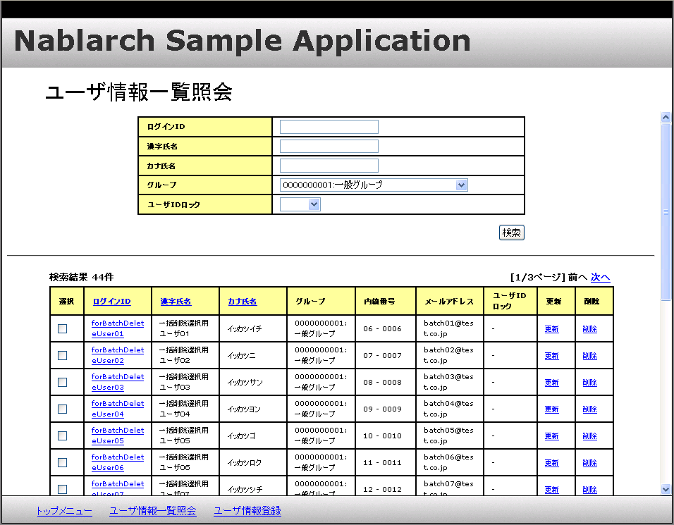

# 一覧表示から個別の情報を扱う画面への遷移

## 本項で説明する内容

### 説明内容

本項では、以下の内容を説明する。

* 検索結果などの一覧表示されているリンクごとに異なる情報をパラメータとして送る方法

### 作成内容

本項で作成するのは、下記画面遷移図の赤丸の部分である。


編集するソースコードは以下のとおり。

| 名称(右クリック->保存でダウンロード) | ステレオタイプ | 処理内容 |
|---|---|---|
| [W11AC03Action.java](../../../knowledge/assets/web-application-10-submitParameter/W11AC03Action.java) | Action | 一覧から送られてきたパラメータを元に検索を行う。検索結果をリクエストに格納、更新画面への遷移を行う。 |
| [W11AC0101.jsp](../../../knowledge/assets/web-application-10-submitParameter/W11AC0101.jsp) [W11AC0301.jsp](../../../knowledge/assets/web-application-10-submitParameter/W11AC0301.jsp) | View | W11AC0101.jspは検索結果の一覧表示および個別の情報のサブミットを行う。 W11AC0301.jspは更新画面に検索結果を初期値として表示する。 |

ステレオタイプについては [業務コンポーネントの責務配置](../../about/about-nablarch/about-nablarch-01-NablarchOutline.md#stereotype) を参照。

## 作成手順

### View(JSP)の作成

#### 画面イメージ

作成するJSPの画面イメージを以下に示す。



#### 概要

一覧に表示された *更新* リンクをクリックすると、そのユーザのキー情報（ユーザID）をサブミットする。

リンク毎に異なるパラメータを送りたい場合、
サブミット用のリンクを表すカスタムタグの内容にパラメータを表すカスタムタグを指定すればよい。

#### パラメータをサブミットするリンクの作成方法

開始タグ(<n:submitLink>)と終了タグ(</n:submit>)でリンクを作成する。

n:submitタグの内容として、<n:param>タグを記述する。

上記を参照し、以下の内容で *W11AC0101.jsp* を作成する。

* W11AC0101.jsp

```./_source/10/W11AC0101.jsp

```

( [記載しているサンプルプログラムソースコードの注意事項](../../about/about-nablarch/about-nablarch-aboutThis.md#sourcecode) 参照)

### 更新画面初期表示までの実装

更新画面の初期表示までには以下の処理を行う必要がある。

送られてきたパラメータの取得

パラメータをキーとした検索

検索結果をリクエストスコープに格納

更新画面の初期表示

上記を参照し、以下の内容で *W11AC03Actionクラス* および *W11AC0301.jsp* を作成する。

* W11AC03Action.java

```java
/**
 * ユーザ更新機能のアクションクラス。
 */
public class W11AC03Action extends DbAccessSupport {

    // ～中略～

    /**
     * ユーザ情報更新画面を表示する。
     *
     * @param req リクエストコンテキスト
     * @param ctx HTTPリクエストの処理に関連するサーバ側の情報
     * @return HTTPレスポンス
     */
    @OnError(type = ApplicationException.class,
             path = "forward:///action/ss11AC/W11AC01Action/RW11AC0102")
    public HttpResponse doRW11AC0301(HttpRequest req, ExecutionContext ctx) {

        // 引継いだユーザIDの取得
        // 【説明】送られてきたパラメータの取得
        ValidationContext<W11AC03Form> userSearchFormContext =
            ValidationUtil.validateAndConvertRequest("W11AC03", W11AC03Form.class, req, "selectUserInfo");
        if (!userSearchFormContext.isValid()) {
            // hidden暗号化を行っていれば発生しないエラー
            throw new ApplicationException(userSearchFormContext.getMessages());
        }

        String userId = userSearchFormContext.createObject().getSystemAccount().getUserId();

        // ～中略～

        // 更新対象ユーザ情報の取得
        // 【説明】パラメータをキーとして検索
        CM311AC1Component comp = new CM311AC1Component();
        SqlResultSet sysAcct = comp.selectSystemAccount(userId);
        SqlResultSet users = comp.selectUsers(userId);
        SqlResultSet permissionUnit = comp.selectPermissionUnit(userId);
        SqlResultSet ugroup = comp.selectUgroup(userId);

        // ～中略～

        // 検索結果をリクエストコープに設定
        ctx.setRequestScopedVar("W11AC03", getWindowScopeObject(sysAcct, users, permissionUnit, ugroup));

        return new HttpResponse("/ss11AC/W11AC0301.jsp");
    }

  /**
     * 更新対象ユーザの検索結果を設定したFormを返す。
     *
     * @param sysAcct システムアカウント情報
     * @param users ユーザ情報
     * @param permissionUnit 認可単位情報
     * @param ugroup グループ情報
     * @return 引数のデータを設定したMap
     */
     // 【説明】検索結果を設定したFormを返すメソッド
    private W11AC03Form getWindowScopeObject(SqlResultSet sysAcct, SqlResultSet users,
            SqlResultSet permissionUnit, SqlResultSet ugroup) {
        W11AC03Form userForm = new W11AC03Form();

        // ～中略～

        return userForm;
    }

～後略～
```

( [記載しているサンプルプログラムソースコードの注意事項](../../about/about-nablarch/about-nablarch-aboutThis.md#sourcecode) 参照)

* W11AC0301.jsp

```./_source/10/W11AC0301.jsp

```

( [記載しているサンプルプログラムソースコードの注意事項](../../about/about-nablarch/about-nablarch-aboutThis.md#sourcecode) 参照)

## 次に読むもの

* [データベースアクセス処理を詳しく知りたい時](../../../fw/reference/02_FunctionDemandSpecifications/01_Core/04_DbAccessSpec.html)
* [データベースアクセス処理の実例を知りたい時](./DB/01_DbAccessSpec_Example.html)
* [カスタムタグの使用方法を詳しく知りたい時](../../../fw/reference/02_FunctionDemandSpecifications/03_Common/07_WebView.html)
