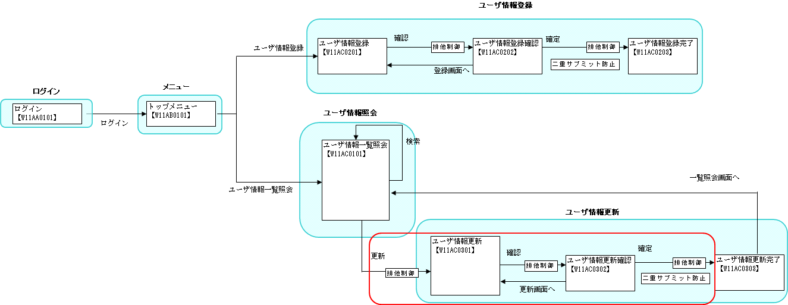

# 排他制御

## 本項で説明する内容

### 説明内容

本項では、以下の内容を説明する。

* 排他制御

### 作成内容

本項で作成するのは、下記画面遷移図の赤丸の部分である。



編集するソースコードは以下のとおり。

| 名称(右クリック->保存でダウンロード) | ステレオタイプ | 処理内容 |
|---|---|---|
| [ExclusiveCtrlSystemAccountContext.java](../../../knowledge/assets/web-application-11-exclusiveControl/ExclusiveCtrlSystemAccountContext.java) | - | 排他制御用の補助クラス。排他制御の実行に必要な情報を保持する。 |
| [W11AC03Action.java](../../../knowledge/assets/web-application-11-exclusiveControl/W11AC03Action.java) | Action | 作成した上記の排他制御補助クラスを使用し、更新処理時に排他制御を行う。 |

ステレオタイプについては [業務コンポーネントの責務配置](../../about/about-nablarch/about-nablarch-01-NablarchOutline.md#業務コンポーネントの責務配置) を参照。

## 作成手順

### 概要

本書で作成する排他制御の仕様は以下のとおりである。

* 楽観ロック
* 排他制御のバージョン番号として、システムアカウントテーブルの **VERSION** 項目の値を使用する。

### 主キークラス(ExclusiveCtrlSystemAccountContext)の作成

主キークラスを作成する手順は以下のとおりである。

Nablarchの提供するExclusiveControlContextクラスを継承

排他制御用テーブルの主キーを列挙型で定義

主キーの値を引数にとるコンストラクタを定義

排他制御に関するテーブルの情報を設定

上記を参照し、以下の内容で *ExclusiveCtrlSystemAccountContext.java* を作成する。

* システムアカウントテーブルの定義

```sql
CREATE TABLE SYSTEM_ACCOUNT
(
    USER_ID                        CHAR(10) NOT NULL,
    -- 主キー以外の業務データは省略。
    VERSION                        NUMBER(10,0) DEFAULT 1 NOT NULL
);
ALTER TABLE SYSTEM_ACCOUNT
    ADD(PRIMARY KEY (USER_ID) USING INDEX);
```

* ExclusiveCtrlSystemAccountContext.java

```java
/**
 * システムアカウント排他制御の制御クラス。
 */
// 【説明】ExclusiveControlContextを継承
public class ExclusiveCtrlSystemAccountContext extends ExclusiveControlContext {

    /**
     * 主キー定義。
     */
    // 【説明】排他制御用テーブルの主キーのカラム名は列挙型で定義
    private enum PK {
        USER_ID
    }

    /**
     * コンストラクタ。
     * @param userId ユーザID
     */
    // 【説明】主キーの値を引数にとるコンストラクタを定義
    public ExclusiveCtrlSystemAccountContext(String userId) {

        // 【説明】バージョン番号を保持するテーブル名を設定
        setTableName("SYSTEM_ACCOUNT");

        // 【説明】バージョン番号のカラム名を設定
        setVersionColumnName("VERSION");

        // 【説明】主キーのカラム名を全て設定
        setPrimaryKeyColumnNames(PK.values());

        // 【説明】排他制御時に使用する行データの指定条件を追加
        appendCondition(PK.USER_ID, userId);
    }
}
```

( [記載しているサンプルプログラムソースコードの注意事項](../../about/about-nablarch/about-nablarch-aboutThis.md#注意事項) 参照)

### Actionの作成

更新取引における排他処理では、次の処理を行う。

主キークラスのインスタンスを生成

生成した主キークラスを指定してバージョン番号を取得(更新画面初期表示時)

バージョン番号のチェック(更新確認処理時)

バージョン番号のチェックおよび更新(データベースへの更新処理時)

上記の処理は、Nablarchで提供している *HttpExclusiveControlUtil* クラスを利用して行うことができる。
以上を参考に、 *W11AC03Action.java* を以下のように作成する。

* バージョン番号の取得

```java
/**
 * ユーザ情報更新画面を表示する。
 *
 * @param req リクエストコンテキスト
 * @param ctx HTTPリクエストの処理に関連するサーバ側の情報
 * @return HTTPレスポンス
 */
@OnError(type = ApplicationException.class,
         path = "forward:///action/ss11AC/W11AC01Action/RW11AC0102")
public HttpResponse doRW11AC0301(HttpRequest req, ExecutionContext ctx) {

    // 引継いだユーザIDの取得
    ValidationContext<W11AC03Form> userSearchFormContext =
        ValidationUtil.validateAndConvertRequest("W11AC03", W11AC03Form.class, req, "selectUserInfo");

    // ～中略～

    String userId = userSearchFormContext.createObject().getSystemAccount().getUserId();

   // バージョン番号の準備(楽観的ロック)
   /* 【説明】
        主キークラスのインスタンスを生成する。
        生成した主キークラスを指定して、バージョン番号を取得する。
        取得したバージョン番号は指定した主キークラスに設定される。 */
    HttpExclusiveControlUtil.prepareVersion(ctx, new ExclusiveCtrlSystemAccountContext(userId));

    // ～中略～

    // 更新画面へ遷移
    return new HttpResponse("/ss11AC/W11AC0301.jsp");
}
```

( [記載しているサンプルプログラムソースコードの注意事項](../../about/about-nablarch/about-nablarch-aboutThis.md#注意事項) 参照)

* バージョン番号のチェック

```java
 /**
  * ユーザ情報更新画面の「確認」イベントの処理を行う。
  *
  * @param req リクエストコンテキスト
  * @param ctx HTTPリクエストの処理に関連するサーバ側の情報
  * @return HTTPレスポンス
  */
 @OnErrors({
    // 【説明】排他制御エラー時の遷移先を指定
     @OnError(type = OptimisticLockException.class,
              path = "forward:///action/ss11AC/W11AC01Action/RW11AC0102"),
     @OnError(type = ApplicationException.class, path = "/ss11AC/W11AC0301.jsp")
 })
 public HttpResponse doRW11AC0302(HttpRequest req, ExecutionContext ctx) {

     // バージョン番号のチェック(楽観的ロック)
     /* 【説明】
         バージョン番号のチェック
         バージョン番号はHttpRequestから取得する。
         バージョンが異なっている場合、OptimisticLockExceptionが送られる。 */
     HttpExclusiveControlUtil.checkVersions(req, ctx);

    // ～中略～

    // 更新確認画面へ遷移
     return new HttpResponse("/ss11AC/W11AC0302.jsp");
}
```

( [記載しているサンプルプログラムソースコードの注意事項](../../about/about-nablarch/about-nablarch-aboutThis.md#注意事項) 参照)

* バージョン番号のチェックおよび更新

```java
 /**
  * 更新確認画面の「確定」イベントの処理を行う。
  *
  * @param req リクエストコンテキスト
  * @param ctx HTTPリクエストの処理に関連するサーバ側の情報
  * @return HTTPレスポンス
  */
 @OnErrors({
    // 【説明】排他制御エラー時の遷移先を指定
     @OnError(type = OptimisticLockException.class,
              path = "forward:///action/ss11AC/W11AC01Action/RW11AC0102"),
     @OnError(type = ApplicationException.class, path = "forward://RW11AC0303")
 })
 @OnDoubleSubmission(path = "forward://RW11AC0303", statusCode = 400)
 public HttpResponse doRW11AC0304(HttpRequest req, ExecutionContext ctx) {

     // バージョン番号の更新(楽観的ロック)
     /* 【説明】
         バージョン番号のチェックおよび更新
         バージョン番号はHttpRequestから取得する。
         バージョンが同じ場合、バージョン番号を更新する。
         バージョンが異なっている場合、OptimisticLockExceptionが送られる。 */
     HttpExclusiveControlUtil.updateVersionsWithCheck(req);

    // ～中略～

    // 更新完了画面へ遷移
     return new HttpResponse("/ss11AC/W11AC0303.jsp");
}
```

( [記載しているサンプルプログラムソースコードの注意事項](../../about/about-nablarch/about-nablarch-aboutThis.md#注意事項) 参照)

## 次に読むもの

* [排他制御機能について詳しく知りたい時](../../../fw/reference/02_FunctionDemandSpecifications/03_Common/08_ExclusiveControl.html)
