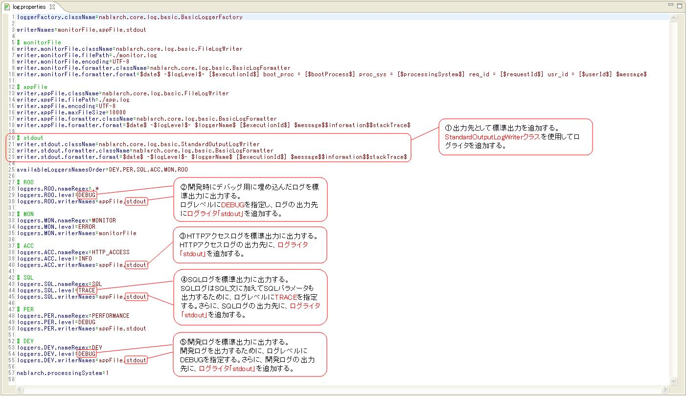

# ログ出力の設定方法とログの見方(画面オンライン処理編)

本フレームワークでは、アプリケーションプログラマが開発時に必要な情報をDEBUGレベルでログ出力している。
このログを開発ログと呼ぶ。

画面オンライン処理の開発時は、開発ログを含めた下記のログを出力し、デバッグ作業に必要な情報を収集する。

| ログの種類 | 説明 |
|---|---|
| HTTPアクセスログ | 画面オンライン処理において、アプリケーションの実行状況を把握するための情報を出力する。 アプリケーションの性能測定に必要な情報、アプリケーションの負荷測定に必要な情報の出力も含む。 さらに、アプリケーションの不正使用を検知するために、全てのリクエスト及びレスポンス情報を出力する証跡ログとしても使用する。 |
| SQLログ | 深刻なパフォーマンス劣化の要因となりやすいSQL文の実行について、パフォーマンスチューニングに使用するために、 SQL文の実行時間とSQL文を出力する。 |
| 開発ログ | アプリケーションプログラマが開発時に必要な情報を出力する。 |

HTTPアクセスログとSQLログの出力内容については、 HttpAccessLog 、 SqlLog を参照。

## 開発時のログ出力の設定方法

開発時は、ログ出力の設定において下記を指定する。
下記の設定により、標準出力(EclipseのConsoleビュー)にログが出力される。

①出力先として標準出力を追加する。
②開発時にデバッグ用に埋め込んだログを標準出力に出力する。
③HTTPアクセスログを標準出力に出力する。
④SQLログを標準出力に出力する。
⑤開発ログを標準出力に出力する。

下記に設定例を示す。



## 開発時のログの見方

サンプルアプリケーションを使用して、開発時のログの見方を説明する。
ログ出力の設定は、 [開発時のログ出力の設定方法](../../guide/web-application/web-application-Web-Log.md#開発時のログ出力の設定方法) の説明で使用した設定例を使用する。

ここでは、下記のケースを取り上げる。

* [リクエスト処理を正常に完了した場合](../../guide/web-application/web-application-Web-Log.md#リクエスト処理を正常に完了した場合)
* [JSPで例外が発生した場合](../../guide/web-application/web-application-Web-Log.md#jspで例外が発生した場合)
* [リクエストURLに対応するアクションが見つからない場合](../../guide/web-application/web-application-Web-Log.md#リクエストurlに対応するアクションが見つからない場合)
* [リクエストURLに対応するアクションのメソッドが見つからない場合](../../guide/web-application/web-application-Web-Log.md#リクエストurlに対応するアクションのメソッドが見つからない場合)

> **Note:**
> 上記ケースでエラーが発生するものについては、あくまで一例であり、全てのケースを網羅しているわけではない。
> 実際の開発時は、 [リクエスト処理を正常に完了した場合](../../guide/web-application/web-application-Web-Log.md#リクエスト処理を正常に完了した場合) を参考に、デバッグ作業に必要な情報を収集する。

### リクエスト処理を正常に完了した場合

ログイン処理の出力例を使用して、1回のリクエスト処理において出力されるログの順番と出力内容を説明する。
説明は、ログの出力例に追記している。

ログイン処理の画面遷移とログの出力例を下記に示す。

#### ログイン処理の画面遷移


#### アクション実行前


#### アクション実行中


#### アクション実行後


> **Note:**
> 上記出力例において、HTTPアクセスログとSQLログのフォーマットは、デフォルトのフォーマットを使用した場合の出力例である。

### JSPで例外が発生した場合

JSPで例外が発生した場合は、「リクエスト処理の終了（END）」の後にスタックトレースが出力される。


### リクエストURLに対応するアクションが見つからない場合

リクエストURLに対応するアクションが見つからない場合は、「ディスパッチ先クラス（DISPATCHING CLASS）」の後にスタックトレースが出力される。


### リクエストURLに対応するアクションのメソッドが見つからない場合

リクエストURLに対応するアクションが見つからない場合は、「ディスパッチ先メソッド（DISPATCHING METHOD）」にエラーメッセージが出力される。


上記出力例のエラーメッセージを下記に示す。

```bash
method not found. class = [nablarch.sample.management.user.UserSearchAction], method signature = [HttpResponse dousers00101(HttpRequest, ExecutionContext)]
```
