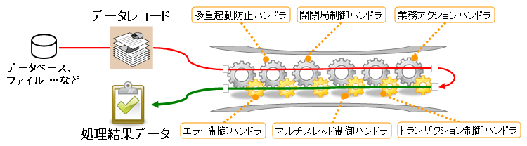

# Nablarch Application Framework 概要

## NAFのアプリケーション処理モデル

## NAFのアプリケーション処理モデル

NAFの処理最小単位: 入力データを受け取り → 処理 → 結果返却。これを繰り返すことでアプリケーション機能を実現する。

- オンライン処理: 入力=ブラウザからのHTTPリクエスト、出力=HTTPレスポンス
- バッチ処理: 入力=ファイルまたはDBのデータレコード、出力=処理結果ステータス

**ハンドラとハンドラキュー**

処理は「トランザクション制御」「応答電文の送信」などのステップに細かく分割され、各ステップは**ハンドラ**と呼ばれるモジュールで実装される。ハンドラは実行順にキュー（**ハンドラキュー**）に配置され、先頭から順に実行される。

処理フロー:
1. 先頭ハンドラが入力データを受け取り、同じ入力データを引数として次のハンドラを呼び出す
2. 以降のハンドラも同様に次のハンドラを呼び出す
3. 末尾の**業務アクションハンドラ**が業務処理を実行し、処理結果をリターンする
4. 各ハンドラは処理結果を受け取り、必要に応じて処理してリターンする
5. 処理結果はハンドラキューを入力データとは逆の方向に遡り、先頭ハンドラまで戻った時点で処理完了

keywords

ハンドラキュー, ハンドラ, 業務アクションハンドラ, アプリケーション処理モデル, 処理フロー, 入力データ, 処理結果

## 標準ハンドラ構成

## 標準ハンドラ構成

NAFが提供するハンドラの種類:

**汎用的に利用できるハンドラ**:
- トランザクション制御ハンドラ
- リクエストディスパッチハンドラ
- 認可制御ハンドラ
- 開閉局制御ハンドラ

**画面オンライン処理専用ハンドラ**:
- HTTPレスポンスハンドラ
- HTTPアクセスログハンドラ
- Nablarchカスタムタグ制御ハンドラ

**バッチ処理専用ハンドラ**:
- プロセス常駐化ハンドラ
- マルチスレッド実行制御ハンドラ
- プロセス多重起動防止ハンドラ

**メッセージング処理専用ハンドラ**:
- 電文応答制御ハンドラ
- 再送電文制御ハンドラ

NAFでは用途ごとに標準的なハンドラキュー構成（**標準ハンドラ構成**）を定義している。基本的にNAFの機能はこれらのハンドラの組み合わせによって実現される。

> **注意**: ここであげた標準ハンドラ構成は、主要なハンドラの一部のみをピックアップしたものであり、実際の構成とは異なる。標準ハンドラ構成の詳細については、「アーキテクチャ解説書」を参照すること。

keywords

標準ハンドラ構成, トランザクション制御ハンドラ, リクエストディスパッチハンドラ, HTTPレスポンスハンドラ, マルチスレッド実行制御ハンドラ, プロセス常駐化ハンドラ, 電文応答制御ハンドラ, 認可制御ハンドラ, 開閉局制御ハンドラ, HTTPアクセスログハンドラ, Nablarchカスタムタグ制御ハンドラ, プロセス多重起動防止ハンドラ, 再送電文制御ハンドラ

## 業務アプリケーションの実装

## 業務アプリケーションの実装

業務アプリケーション開発者が実装するハンドラは**業務アクションハンドラのみ**。それ以外のハンドラはフレームワーク提供のものをそのまま使用できる。

業務アクションハンドラの処理フロー:

1. **入力データの取得**: 入力データの内容はMap形式で取得する（入力精査・DBアクセスなどのライブラリもMapを引数・戻り値として使用する）

2. **入力精査**: 取得したMapに対してフォーム定義に沿った精査処理を実行する
   - **フォームクラス**: システムへの入力項目の精査と値の保持を行うクラス。各項目に宣言的に精査仕様を設定でき、精査ロジックを簡便に実装できる
   - DBアクセスが必要な精査（DB内容との比較など）はビジネスロジックの一部として実装する
   - > **注意**: フォームのうち、RDBMSのテーブルと1対1にひもづき、プロパティとカラムが1対1対応するものを特に**エンティティ**と呼ぶ（テーブル定義に沿って作成する）

3. **ビジネスロジックの実行**: 精査済みのフォーム/エンティティオブジェクトをもとに処理を実行する。複数の業務アクションから共用されるロジックは業務アクションハンドラに直接実装せず、**業務共通コンポーネント**として個別クラスに実装することを推奨する

4. **処理結果の返却**: ビジネスロジックの処理結果を表すオブジェクトを返却する
   - バッチ処理など応答を伴わない場合は、単に**正常終了を表すマーカオブジェクト**をリターンすればよい
   - 業務アクションハンドラから実行時例外が送出された場合、ハンドラキュー上のハンドラが**自動的にトランザクションをロールバック**する
   - 画面オンライン処理: 遷移先JSPのパスを指定した`HttpResponse`オブジェクトを返す
   - 同期応答メッセージング処理: 応答電文の内容と宛先キュー名を指定した`ResponseMessage`オブジェクトを返す
   - これらのオブジェクトはハンドラキュー上の**レスポンスハンドラ**が処理して送信元にレスポンスとして返す

keywords

業務アクションハンドラ, 入力精査, フォーム, エンティティ, 業務共通コンポーネント, HttpResponse, ResponseMessage, ビジネスロジック, トランザクションロールバック, レスポンスハンドラ, マーカオブジェクト, バッチ処理

## 業務コンポーネントの責務配置

## 業務コンポーネントの責務配置

| 名称（クラス接尾辞） | 責務 |
|---|---|
| 業務アクションハンドラ（Action） | フレームワークから直接コールバックされる業務処理のエントリーポイント。取引ごとに1クラス作成する。比較的単純な業務処理はここに直接実装する。複雑な処理や複数の業務・処理形態（バッチと画面オンラインなど）から共用される処理は業務共通コンポーネントに実装する。 |
| 業務共通コンポーネント（Component） | 業務ロジックを実装するクラス。HTTPリクエストオブジェクトや実行コンテキストなど、フレームワークが作成する実行制御基盤オブジェクトに直接依存しないこと。 |
| 業務フォーム（Form） | アプリケーションで使用するデータの保持と外部入力値の精査を担当。単項目入力精査および項目間入力精査を実装する。DBアクセスが必要な精査処理は業務アクションハンドラで実装する。 |
| 業務画面（View） | 画面オンライン処理でのユーザーインタフェース（通常はJSP）。業務処理は実装せず、業務アクションハンドラから渡される処理結果を表示するのみ。 |

> **注意**: 業務アクションハンドラはHTTPリクエストオブジェクトや実行コンテキストなどフレームワークオブジェクトに依存するため、自動テストはリクエスト単体テストで行う必要がある。複雑な内部条件をもつ業務ロジックをActionに実装するとテストデータのセットアップが煩雑になる。この場合は業務処理を業務共通コンポーネントとして切り出してクラス単体テストを実施すること。

各構成要素間の処理フロー（画面オンライン処理）:
- a) View（Webクライアント）からリクエストが送られる
- b) フレームワークがリクエストを受信し、Actionを呼び出す
- c) ActionはバリデーションしてFormを生成し、Componentを呼び出す
- d) Componentがビジネスロジックを実行し、結果をActionに返す
- e) Actionが必要に応じてComponentの戻り値を処理（リクエストスコープへの値格納など）し、フレームワークに処理を返す
- f) フレームワークがViewを処理（JSPをHTMLに変換など）し、クライアントにレスポンスを返す

keywords

Action, Component, Form, View, 業務コンポーネント, 責務配置, ステレオタイプ, リクエスト単体テスト

## 実行コンテキストとスコープ

## 実行コンテキストとスコープ

業務アクションハンドラから業務画面へのデータ渡しや、業務アクションハンドラ間でのデータ保持には、**実行コンテキスト**にデータを保持する。実行コンテキストには以下の3種類のスコープがある。

| スコープ名 | 説明 |
|---|---|
| リクエストスコープ | 1リクエストの処理の間データを保持する。オンライン/メッセージング: ユーザからの1リクエスト処理中。バッチ: 1データの処理中。 |
| セッションスコープ | 複数のリクエスト処理の間データを保持する。オンライン: ログアウトするまでの間。メッセージング: 1リクエスト処理中。バッチ: バッチ開始から終了まで。 |
| ウィンドウスコープ | **画面オンライン処理専用**。セッションスコープと同様に複数リクエスト間でデータを保持するが、複数画面を同時使用した際に画面ごとに別々のデータを保持できる点がセッションスコープと異なる。使用方法は他の2種類のスコープと異なる（:ref:`guide_appendix_windowScope` 参照）。 |

keywords

リクエストスコープ, セッションスコープ, ウィンドウスコープ, 実行コンテキスト, スコープ, データ受け渡し

