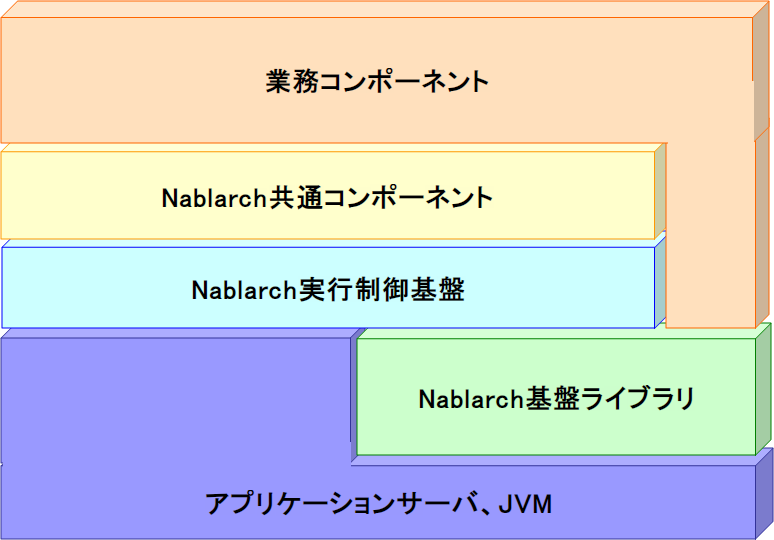

# NAF概要

## NAFの構成

NAFは以下の3モジュール群で構成される。

**1. NAF実行制御基盤**
外部からの処理要求に対して適切な業務処理を選択・実行するフレームワーク。エンタープライズシステムで利用される処理形態に対応した以下の実行制御基盤を提供:
- [architectural_pattern/web_gui](../../processing-pattern/web-application/web-application-web_gui.md)
- [architectural_pattern/batch](../../processing-pattern/nablarch-batch/nablarch-batch-batch-architectural_pattern.md)
- [architectural_pattern/messaging](../../processing-pattern/mom-messaging/mom-messaging-messaging.md)

**2. NAF基盤ライブラリ**
[ログ出力](../../component/libraries/libraries-01_Log.md) 、[データベースアクセス](../../component/libraries/libraries-04_DbAccessSpec.md) 、[core_library/enterprise_messaging](../../component/libraries/libraries-enterprise_messaging.md) などの独立した共通機能モジュール群。

**3. NAF共通コンポーネント**
NAF実行制御基盤およびNAF基盤ライブラリを用いて実装した業務共通機能モジュール群。[認可](../../component/libraries/libraries-04_Permission.md) 、:ref:`開閉局<serviceAvailable>` などの業務機能・運用関連モジュールを含む。

keywords

NAF実行制御基盤, NAF基盤ライブラリ, NAF共通コンポーネント, NAF構成, ログ出力, データベースアクセス, 認可, 開閉局

## Nablarchアプリケーション処理方式

Nablarchアプリケーション処理方式とは、Nablarch標準の方式設計書(アプリケーション処理方式)内で定義されている標準のアプリケーションアーキテクチャである。NAFはこの処理方式で述べられている内容を実現するように設計・実装されている。

Nablarchアプリケーション処理方式はあくまでアプリケーションアーキテクチャであり、厳密にはNAFとは直接関係しない。例えば、Nablarchアプリケーション処理方式に対して、他のOSS製品群をベースとした実装系を実現することも可能である。しかし実際には互いに相補的関係にある。

keywords

Nablarchアプリケーション処理方式, NAFとの関係, アプリケーションアーキテクチャ, 方式設計書, 相補的関係

## Nablarchアプリケーション処理方式の概要

Nablarchアプリケーション・アーキテクチャは **入力処理方式** 、 **出力ライブラリ** 、 **処理方式共通** の3要素で構成される。

**1. 入力処理方式**

本システムへの処理要求を受け付け処理を実行する基本形態。8つの処理方式に分類される:

| No. | 大分類 | 入力インターフェース | 入力処理方式名称 | 概要 |
|---|---|---|---|---|
| 1 | オンライン | 画面 | 画面同期処理方式 | Webブラウザからのリクエストをもとにデータ照会・更新等を行い、処理結果をWebブラウザへ返却 |
| 2 | オンライン | 画面 | 画面非同期処理方式 | Webブラウザからのリクエストをもとに処理し結果を返却。大量データ処理・長時間処理・外部への非同期データ連携を遅延実行 |
| 3 | オンライン | メッセージ | メッセージ同期応答処理方式 | 他システムからの要求電文をもとにデータ照会・更新等を行い、処理結果を送信元システムへ返却 |
| 4 | オンライン | メッセージ | メッセージ非同期応答処理方式 | 他システムからの要求電文をもとに処理し結果を返却。大量データ処理・長時間処理・外部への非同期データ連携を遅延実行 |
| 5 | オンライン | メッセージ | メッセージ無応答処理方式 | 他システムからの要求電文をもとにデータ更新等を行う。送信元への応答なし、全て遅延実行 |
| 6 | オンライン | ファイル | ファイル転送処理方式 | 他システムからの転送ファイルをもとにデータ更新等を行う |
| 7 | オフライン | ー（オフライン） | 都度起動バッチ処理方式 | ジョブスケジューラーからの定刻起動等により大量データを一括実行（一般的なバッチ処理） |
| 8 | オフライン | ー（オフライン） | 常駐バッチ処理方式 | 起動後プロセスを常駐させDBを常駐監視し、インプットデータ登録タイミングで即時実行 |

**2. 出力ライブラリ**

外部へのファイル・メッセージ出力処理方式。4つに分類される:

| No. | 出力媒体 | 処理方式名 | 概要 |
|---|---|---|---|
| 1 | メッセージ | 同期応答メッセージ送信 | 他システムへ要求電文を送信し、処理結果を受信 |
| 2 | メッセージ | 無応答メッセージ送信 | 他システムへ要求電文を送信。処理結果は受信しない |
| 3 | ファイル | ファイル転送 | 他システムへファイルを転送 |
| 4 | メール | メール送信 | 電子メールを送信（外部メールASPサービスを利用しSMTPリレー） |

**3. 処理方式共通**

入力・出力処理方式を問わず共通的に実行される処理方式:
- ログ出力処理方式
- データベースアクセス処理方式
- ファイルアクセス処理方式
- 文字コード処理方式
- メッセージ管理処理方式
- 認証・認可処理方式
- コード管理処理方式
- 採番処理方式
- 日付・日時処理方式
- 国際化処理方式
- **... etc**

keywords

Nablarchアプリケーション処理方式, 入力処理方式, 出力ライブラリ, 処理方式共通, 画面同期処理方式, 画面非同期処理方式, メッセージ同期応答処理方式, メッセージ非同期応答処理方式, メッセージ無応答処理方式, ファイル転送処理方式, 都度起動バッチ処理方式, 常駐バッチ処理方式, 同期応答メッセージ送信, 無応答メッセージ送信, メール送信, SMTPリレー

## NAFによるNablarchアプリケーション処理方式の実装

NablarchアプリケーションにおけるNAFの実装範囲。一部例外（ファイル転送入力処理方式など）はあるものの、Nablarchアプリケーション処理方式の大部分がNAFによって実現されている。

keywords

NAF実装範囲, ファイル転送入力処理方式, Nablarchアプリケーション処理方式 実装範囲

