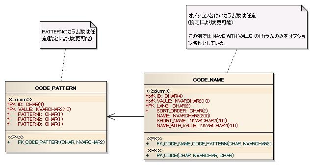

# コード管理

## 概要

アプリケーションで使用するコード値・コード名称を管理する機能。

**対象**: 性別区分（1:男性、2:女性）や年代区分など、コード値とコード名称の関係が**静的なコードのみ**。商品コード・企業コードのような動的に変化するデータのキー値は対象外（マスタ用テーブルで対処する）。

> **警告**: コードの名称を持つテーブルとコード値を持つテーブルにRDBMSの参照整合性制約を設定できない。このようなチェックには :ref:`code_manager_validation` を使用すること。

リポジトリに登録して使用する。初期化処理は :ref:`repository` が実行する。

**クラス**: `nablarch.common.code.BasicCodeManager`, `nablarch.common.code.BasicCodeLoader`, `nablarch.core.cache.BasicStaticDataCache`

コード管理を使用する際は、リポジトリに `"codeManager"` というコンポーネント名で `CodeManager` インタフェースを実装したクラスを登録する必要がある。

```xml
<component name="codeDbManager" class="nablarch.core.db.transaction.SimpleDbTransactionManager">
    <property name="dbTransactionName" value="code"/>
</component>

<component name="codeLoader" class="nablarch.common.code.BasicCodeLoader">
    <property name="dbManager" ref="codeDbManager"/>
    <property name="codePatternSchema">
        <component class="nablarch.common.code.schema.CodePatternSchema">
            <property name="tableName" value="CODE_PATTERN"/>
            <property name="idColumnName" value="ID"/>
            <property name="valueColumnName" value="VALUE"/>
            <property name="patternColumnNames" value="PATTERN1,PATTERN2,PATTERN3"/>
        </component>
    </property>
    <property name="codeNameSchema">
        <component class="nablarch.common.code.schema.CodeNameSchema">
            <property name="tableName" value="CODE_NAME"/>
            <property name="idColumnName" value="ID"/>
            <property name="valueColumnName" value="VALUE"/>
            <property name="langColumnName" value="LANG"/>
            <property name="sortOrderColumnName" value="SORT_ORDER"/>
            <property name="nameColumnName" value="NAME"/>
            <property name="shortNameColumnName" value="SHORT_NAME"/>
            <property name="optionNameColumnNames" value="NAME_WITH_VALUE,OPTION01"/>
        </component>
    </property>
</component>

<component name="codeCache" class="nablarch.core.cache.BasicStaticDataCache">
    <property name="loader" ref="codeLoader"/>
    <property name="loadOnStartup" value="false"/>
</component>

<component name="codeManager" class="nablarch.common.code.BasicCodeManager" autowireType="None">
    <property name="codeDefinitionCache" ref="codeCache"/>
</component>

<component name="initializer" class="nablarch.core.repository.initialization.BasicApplicationInitializer">
    <property name="initializeList">
        <list>
            <component-ref name="codeCache"/>
        </list>
    </property>
</component>
```

<details>
<summary>keywords</summary>

コード管理, コード値, コード名称, CodeManager, 静的コード, code_manager_validation, 参照整合性制約, BasicCodeManager, BasicCodeLoader, BasicStaticDataCache, codeManager, コード管理設定, SimpleDbTransactionManager, BasicApplicationInitializer, loadOnStartup

</details>

## 特徴

**国際化**: 言語ごとに異なるコード名称が取得できる。

**パターン指定によるコード値の取得**: 一部のコード値のみを取得できる。コード値の入力チェックや特定コード値のみを表示するコンボボックスを容易に作成できる。

**高速なコードへのアクセス**: :ref:`static_data_cache` を使用してコード値・コード名称をキャッシュする。キャッシュにデータをロードするタイミングはアプリケーション種別に応じて選択できる。

| アプリケーションの種類 | キャッシュにデータをロードするタイミング |
|---|---|
| Webアプリケーション | 一括ロード |
| バッチアプリケーション | オンデマンドロード |

> **注意**: アプリケーションを再起動せずにコードのキャッシュをリロードすることは本来想定されていない。ただし :ref:`static_data_cache` にはリロード機能が実装されており実際には可能。使用はプロジェクトの責任で行うこと。

**クラス**: `nablarch.common.code.BasicCodeManager`

| プロパティ名 | 型 | 必須 | デフォルト値 | 説明 |
|---|---|---|---|---|
| codeDefinitionCache | StaticDataCache | ○ | | `Code` インタフェースを実装したクラスを保持する `StaticDataCache` を設定する。 |

<details>
<summary>keywords</summary>

国際化, パターン指定, キャッシュ, static_data_cache, 一括ロード, オンデマンドロード, コードキャッシュ, キャッシュリロード, BasicCodeManager, codeDefinitionCache, StaticDataCache, Code インタフェース, コード管理設定

</details>

## インタフェース定義

| インタフェース名 | 概要 |
|---|---|
| `nablarch.common.code.CodeManager` | コードの値と名称を取り扱うインタフェース。コード値・コード名称の取得メソッドとコード値の存在チェックメソッドを持つ |
| `nablarch.common.code.Code` | 単一のコードデータ（コードIDに紐づくデータ）にアクセスするインタフェース |

**クラス**: `nablarch.core.cache.BasicStaticDataCache`

[../01_Core/05_StaticDataCache](libraries-05_StaticDataCache.md) を参照。

> **警告**: このプロパティに設定する `StaticDataLoader` は、`BasicCodeLoader` クラスのように、`StaticDataLoader<Code>` を実装すること。

<details>
<summary>keywords</summary>

CodeManager, Code, nablarch.common.code.CodeManager, nablarch.common.code.Code, コードインタフェース, BasicStaticDataCache, StaticDataLoader, BasicCodeLoader, キャッシュ設定, StaticDataLoader<Code>

</details>

## クラス定義

| クラス名 | 概要 |
|---|---|
| `nablarch.common.code.BasicCodeManager` | コードの値と名称を取り扱うクラス |
| `nablarch.common.code.BasicCodeLoader` | データベースからコードをロードするクラス |
| `nablarch.common.code.BasicCode` | Codeの基本実装クラス。BasicCodeLoaderの内部クラスとして実現する |
| `nablarch.common.code.CodeUtil` | コードの値と名称の取り扱いに使用するユーティリティクラス |

**クラス**: `nablarch.common.code.BasicCodeLoader`

| プロパティ名 | 型 | 必須 | デフォルト値 | 説明 |
|---|---|---|---|---|
| dbManager | SimpleDbTransactionManager | ○ | | コードのロード時に使用する `SimpleDbTransactionManager` クラスを指定する。 |
| codePatternSchema | CodePatternSchema | ○ | | コードパターンテーブルのスキーマ情報。`CodePatternSchema` クラスのインスタンス。 |
| codeNameSchema | CodeNameSchema | ○ | | コード名称テーブルのスキーマ情報。`CodeNameSchema` クラスのインスタンス。 |

<details>
<summary>keywords</summary>

BasicCodeManager, BasicCodeLoader, BasicCode, CodeUtil, nablarch.common.code.BasicCodeManager, nablarch.common.code.BasicCodeLoader, nablarch.common.code.BasicCode, nablarch.common.code.CodeUtil, dbManager, codePatternSchema, codeNameSchema, コードローダー設定

</details>

## コードパターンテーブルの定義

テーブル名・カラム名には制約はなく、設定により任意の名称が使用できる。

| 定義 | Javaの型 | 制約 |
|---|---|---|
| コードID | java.lang.String | ユニークキー |
| コード値 | java.lang.String | ユニークキー |
| パターン | java.lang.String | パターンに含める場合"1"、含めない場合"0"を設定する |

- パターンカラム名は任意に設定可能。複数パターンを使用する場合、パターンの数だけ別々のカラム名でパターンカラムをテーブルに持たせる。

**クラス**: `nablarch.common.code.schema.CodePatternSchema`

| プロパティ名 | 型 | 必須 | デフォルト値 | 説明 |
|---|---|---|---|---|
| tableName | String | ○ | | テーブル名。 |
| idColumnName | String | ○ | | コードIDカラムの名前。 |
| valueColumnName | String | ○ | | コード値カラムの名前。 |
| patternColumnNames | String[] | | | パターンに使用するカラム名の文字列を配列で設定する。パターン機能を使用する場合、設定必須。 |

<details>
<summary>keywords</summary>

コードパターンテーブル, CODE_PATTERN, パターンカラム, テーブル定義, コードID, コード値, CodePatternSchema, tableName, idColumnName, valueColumnName, patternColumnNames, コードパターンテーブル設定

</details>

## コード名称テーブルの定義

| 定義 | Javaの型 | 制約 |
|---|---|---|
| コードID | java.lang.String | ユニークキー |
| コード値 | java.lang.String | ユニークキー |
| 言語 | java.lang.String | ユニークキー |
| ソート順 | java.lang.String | |
| 名称 | java.lang.String | コードの名称 |
| 略称 | java.lang.String | コードの略称 |
| オプション名称 | java.lang.String | コードのオプション名称 |

- オプション名称は1つのコード値に対して複数持つことができ、その数と設定カラム名は任意に設定できる。

**クラス**: `nablarch.common.code.schema.CodeNameSchema`

| プロパティ名 | 型 | 必須 | デフォルト値 | 説明 |
|---|---|---|---|---|
| tableName | String | ○ | | テーブル名。 |
| idColumnName | String | ○ | | コードIDカラムの名前。 |
| valueColumnName | String | ○ | | コード値カラムの名前。 |
| langColumnName | String | ○ | | 言語カラムの名前。 |
| sortOrderColumnName | String | ○ | | ソート順カラムの名前。 |
| nameColumnName | String | ○ | | 名称カラムの名前。 |
| shortNameColumnName | String | ○ | | 略称カラムの名前。 |
| optionNameColumnNames | String[] | | | コードのオプション名称に使用するカラム名の文字列を配列で設定する。指定しなかった場合、オプション名称が取得できない。 |

<details>
<summary>keywords</summary>

コード名称テーブル, CODE_NAME, ソート順, オプション名称, テーブル定義, 略称, 言語, CodeNameSchema, tableName, idColumnName, valueColumnName, langColumnName, sortOrderColumnName, nameColumnName, shortNameColumnName, optionNameColumnNames, コード名称テーブル設定

</details>

## テーブル定義の例

テーブル定義例: 1コードIDあたり3種類のパターン（PATTERN1、PATTERN2、PATTERN3）を定義。コード名称テーブルにはNAME（名称）、SHORT_NAME（略称）、NAME_WITH_VALUE（コード値を含めたオプション名称）のカラムを持つ。



**アノテーション**: `@CodeValue`, `@PropertyName`
**クラス**: `nablarch.common.code.validator.CodeValueValidator`

[バリデーションの機能](libraries-validation-core_library.md) を使用して、コード値が有効であるか（`contains` メソッドの戻り値が `true` であるか）をチェックする。

## エンティティの実装

エンティティのプロパティに `@CodeValue` アノテーションを付けることでバリデーションを実装する。`pattern` 属性には使用するパターンのカラム名を指定する。`pattern` 属性を省略するとコード値として有効かのみチェックする。

```java
public class Customer {

    // その他のプロパティは省略
    private String gender;

    @PropertyName("性別")
    @CodeValue(codeId="0001", pattern="PATTERN1")
    public String setGender(String gender) {
        this.gender = gender;
    }
}
```

[validation_and_convert](libraries-08_02_validation_usage.md) で記述した方法で `ValidationUtil.validateAndConvertRequest` を呼び出すことで、`gender` にパターン外の文字を設定した際のバリデーション結果はエラーになる。

## Validatorの設定

`CodeValueValidator` クラスは `ValidationManager` の `validators` プロパティに追加して使用する。

```xml
<component name="validationManager" class="nablarch.core.validation.ValidationManager">
    <property name="validators">
        <list>
            <component class="nablarch.common.code.validator.CodeValueValidator">
                <property name="messageId" value="MSGXXXXX"/>
            </component>
        </list>
    </property>
</component>
```

## CodeValueValidator の設定

| プロパティ名 | 型 | 必須 | デフォルト値 | 説明 |
|---|---|---|---|---|
| messageId | String | ○ | | コード値のパターンに含まれない文字列が入力された場合のデフォルトエラーメッセージのメッセージID。置き換え文字: `{0}` = プロパティ名称、`{1}` = 使用できるコード値一覧。メッセージの例: `{0}には'{'{1}'}'のいずれかの値を指定してください。` フォーマット後の例: `性別には{"01" , "02"}のいずれかの値を指定してください。` |

> **注意**: このメッセージはコンボボックスで入力するコードが改竄された場合や、テキストボックスでコード値を入力する特殊なケースでのみ使用される。メッセージはこの使用状況を考慮して設計すること。

<details>
<summary>keywords</summary>

テーブル定義例, NAME_WITH_VALUE, SHORT_NAME, PATTERN1, PATTERN2, PATTERN3, NAME, CodeValueValidator, @CodeValue, @PropertyName, codeId, pattern, messageId, コード値バリデーション, ValidationManager, ValidationUtil, code_manager_validation

</details>

## コード値とコード名称のデータ

コードID "0001"（性別区分）とコードID "0002"（バッチの処理状態）を例に示す。

**CODE_PATTERN テーブルのデータ例**:

| ID | VALUE | PATTERN1 | PATTERN2 | PATTERN3 |
|---|---|---|---|---|
| 0001 | 1 | 1 | 0 | 0 |
| 0001 | 2 | 1 | 0 | 0 |
| 0001 | 9 | 0 | 0 | 0 |
| 0002 | 01 | 1 | 0 | 0 |
| 0002 | 02 | 1 | 0 | 0 |
| 0002 | 03 | 0 | 1 | 0 |
| 0002 | 04 | 0 | 1 | 0 |
| 0002 | 05 | 1 | 0 | 0 |

**CODE_NAME テーブルのデータ例**:

| ID | VALUE | SORT_ORDER | LANG | NAME | SHORT_NAME | NAME_WITH_VALUE |
|---|---|---|---|---|---|---|
| 0001 | 1 | 1 | ja | 男性 | 男 | 1:男性 |
| 0001 | 2 | 2 | ja | 女性 | 女 | 2:女性 |
| 0001 | 9 | 3 | ja | 不明 | 不 | 9:不明 |
| 0002 | 01 | 1 | ja | 初期状態 | 初期 | |
| 0002 | 02 | 2 | ja | 処理開始待ち | 待ち | |
| 0002 | 03 | 3 | ja | 処理実行中 | 実行 | |
| 0002 | 04 | 4 | ja | 処理実行完了 | 完了 | |
| 0002 | 05 | 5 | ja | 処理結果確認完了 | 確認 | |
| 0001 | 1 | 2 | en | Male | M | 1:Male |
| 0001 | 2 | 1 | en | Female | F | 2:Female |
| 0001 | 9 | 3 | en | Unknown | U | 9:Unknown |
| 0002 | 01 | 1 | en | Initial State | Initial | |
| 0002 | 02 | 2 | en | Waiting For Batch Start | Waiting | |
| 0002 | 03 | 3 | en | Batch Running | Running | |
| 0002 | 04 | 4 | en | Batch Execute Completed Checked | Completed | |
| 0002 | 05 | 5 | en | Batch Result Checked | Checked | |

<details>
<summary>keywords</summary>

CODE_PATTERN, CODE_NAME, データ例, 性別区分, バッチ処理状態, コードデータ, 0001, 0002

</details>

## コード名称の取得

**クラス**: `nablarch.common.code.CodeUtil`

| メソッド名 | 説明 |
|---|---|
| getName | コード名称を取得する |
| getShortName | コードの略称を取得する |
| getOptionalName | コードのオプション名称を取得する。取得するカラムは第3引数で指定する |

```java
// ThreadContextの言語によって "男性" または "Male" が取得できる
String name = CodeUtil.getName("0001", "1");

// 言語を指定して取得（"男性" が取得できる）
String jaName = CodeUtil.getName("0001", "1", Locale.JAPANESE);

// 略称を取得（"男" または "M" が取得できる）
String shortName = CodeUtil.getShortName("0001", "1");

// オプション名称を取得（第3引数にカラム名を指定）
// "1:男性" または "1:Male" が取得できる
String optName = CodeUtil.getOptionalName("0001", "1", "NAME_WITH_VALUE");
```

<details>
<summary>keywords</summary>

CodeUtil, getName, getShortName, getOptionalName, コード名称取得, 略称取得, オプション名称取得, Locale

</details>

## コード値の取得

コード値リストは、コード名称テーブルのSORT_ORDERカラムの昇順でソートされた順序で返る。ソート順はコード名称テーブルに持つため、言語ごとに異なる順序でコード値を取得できる。

- `getValues(String codeId)`: ThreadContextの言語でソートされたコード値リストを返す
- `getValues(String codeId, Locale locale)`: 指定言語でソートされたコード値リストを返す

```java
// 性別区分(コードID:0001) の全コード値を取得
// ThreadContextの言語によって {"1", "2", "9"} または {"2", "1", "9"} が返る
List<String> genderValues = CodeUtil.getValues("0001");

// バッチ処理状態(コードID:0002) の全コード値を取得
// {"01", "02", "03", "04", "05"} が返る
List<String> stateValues = CodeUtil.getValues("0002");
```

<details>
<summary>keywords</summary>

CodeUtil, getValues, コード値取得, ソート順, 言語指定, コード値一覧, Locale

</details>

## コード値の有効性チェック

**クラス**: `nablarch.common.code.CodeUtil`

`contains(String codeId, String value)`: コード値がコードIDに対して有効かどうかチェックする。

```java
// 性別区分として "1" は有効 → true
CodeUtil.contains("0001", "1");

// 性別区分として "3" は有効でない → false
CodeUtil.contains("0001", "3");
```

<details>
<summary>keywords</summary>

CodeUtil, contains, コード値チェック, バリデーション, 有効性チェック

</details>

## コード値のパターン

コード値の集合に「パターン」を設定し、パターンに含まれるコード値の集合のみを取得・チェックする機能。pattern引数には使用するパターンのカラム名を指定する。

- `getValues(String codeId, String pattern)`: パターンに含まれるコード値リストを返す
- `getValues(String codeId, String pattern, Locale locale)`: 言語指定付き
- `contains(String codeId, String value, String pattern)`: コード値がパターンに含まれるかチェックする

```java
// PATTERN1 に含まれるコード値を取得
// ThreadContextの言語によって {"1", "2"} または {"2", "1"} が返る
List<String> values = CodeUtil.getValues("0001", "PATTERN1");

// パターンに対する有効性チェック
CodeUtil.contains("0001", "1", "PATTERN1"); // PATTERN1で有効 → true
CodeUtil.contains("0001", "3", "PATTERN1"); // PATTERN1で有効でない → false
```

<details>
<summary>keywords</summary>

CodeUtil, getValues, contains, パターン指定, PATTERN1, コード値パターン, パターン有効性チェック

</details>

## 要求（実装済み・未検討）

**実装済み機能**:
- 国際化（言語ごとに異なる名称の取得）
- コード値に対応するコード名称の取得
- 1つのコード値に対して複数のコード名称の取得
- コードIDに対応するコード値を全て取得
- 文字列がコード値として妥当であるかチェック
- パターン指定によるコード値の取得
- コード値がパターンに含まれるかチェック

**未検討**:
- 外部システム用のコード変換（自システムのコード値⇔外部システムのコード値）
- コード値の有効期限管理

<details>
<summary>keywords</summary>

要求, 実装済み, 未検討, 外部システム, コード変換, 有効期限, コード値の有効期限, 外部システム用コード変換

</details>
