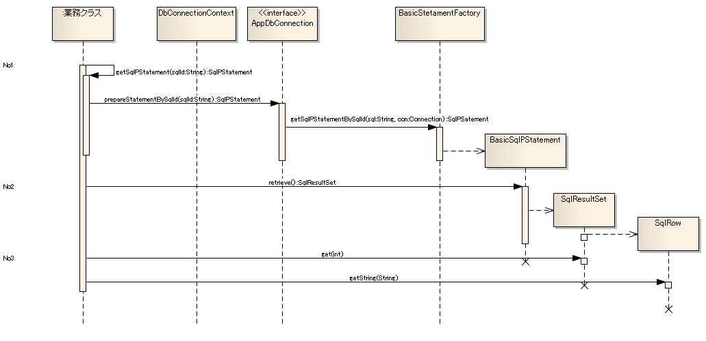

# SQL文実行部品の構造とその使用方法

本章では、SQL文実行部品の中でJDBCのAPIをラップしている機能と簡易検索機能の説明を行う。

## クラス図


### 各クラスの責務

#### インタフェース定義

| インタフェース名 | 概要 |
|---|---|
| nablarch.core.db.statementパッケージ |  |
| StatementFactory | 下記オブジェクトを生成するインタフェース  * java.sql.PreparedStatementのラッパークラス * java.sql.CallableStatementのラッパークラス * ParameterizedSqlPStatement(オブジェクトのフィールドの値の登録用ステートメント)クラス |
| SqlStatement | SqlPStatement、ParameterizedSqlPStatementの親インタフェース。 |
| SqlPStatement | PreparedStatementのラッパー機能のインタフェース。 また、本機能の特徴の１つである [簡易検索機能](../../component/libraries/libraries-04-DbAccessSpec.md#件数指定でデータを取得簡易検索機能できる機能) のインタフェースをもつ。 |
| ResultSetConvertor | java.sql.ResultSetから値を取得するインタフェース。  ResultSet#getObject以外を使用して、SELECT結果の値を取得する必要がある場合には、実装クラスを追加する必要がある。 主に、getObject以外を使用するケースは、データベースのデータタイプに応じてJavaオブジェクトのデータ対応を決め打ちたい場合である。 |
| ParameterizedSqlPStatement | オブジェクトのフィールド値をデータベースに登録するインタフェース。 |
| StatementExceptionFactory | SQLException発生時に送出するExceptionを生成するインタフェース。 |

#### クラス定義

a) nablarch.core.db.statement.StatementFactoryの実装クラス

| クラス名 | 概要 |
|---|---|
| nablarch.core.db.statementパッケージ |  |
| BasicStatementFactory | StatementFactoryの基本実装クラスで、下記オブジェクトを生成する。  * BasicSqlPStatement(java.sql.PreparedStatementラッパークラス)  > **Note:** > [SQLインジェクション対策](../../component/libraries/libraries-04-DbAccessSpec.md#sqlインジェクション対策について) にあるように、 > 本機能ではjava.sql.Statementクラスのラッパークラスの生成機能は提供しない。 |

b) nablarch.core.db.statement.SqlPStatementの実装クラス

| クラス名 | 概要 |
|---|---|
| nablarch.core.db.statementパッケージ |  |
| BasicSqlPStatement | SqlPStatement(SqlStatement)、ParameterizedSqlPStatementの基本実装クラス。  > **Note:** > 本クラスは、データベースベンダーに依存するような実装にはなっていない。 > このため、データベースベンダーに依存する実装が必要にならない限り、 > 本クラスを置き換える必要はない。  > 各プロジェクトにおいてデータベースベンダーに依存する実装が必要となった場合には、 > SqlPStatement及びParameterizedSqlPStatementの実装クラスを追加し差し替えること。 |

c) nablarch.core.db.statement.exception.StatementExceptionFactoryの実装クラス

| クラス名 | 概要 |
|---|---|
| nablarch.core.db.statement.exceptionパッケージ |  |
| BasicSqlStatementExceptionFactory | SqlStatementExceptionFactoryの基本実装クラス。  本クラスでは、下記のSqlStatementExceptionを生成する。  * 発生したSQLExceptionが一意制約違反の場合   DuplicateStatementExceptionを送出する。 * 一意制約違反以外の場合   SqlStatementExceptionを送出する。  > **Note:** > 一意制約違反の判定は、SQLException#getSQLStateまたは、SQLException#getErrorCodeを元に行う。  > 判定に使用する値は、 [BasicSqlStatementExceptionFactoryの設定](../../component/libraries/libraries-04-Statement.md#設定内容詳細) を参照すること。  > **Note:** > 一意制約違反以外の例外をアプリケーションでハンドリングする必要がある場合には、 > SqlStatementExceptionを継承したクラスと、そのFactoryクラスを追加する。 |

d) 検索結果クラス

| クラス名 | 概要 |
|---|---|
| nablarch.core.db.statementパッケージ |  |
| ResultSetIterator | java.sql.ResultSetのラッパー機能のクラス。  ResultSetから1レコード分のデータをSqlRowで取得するインタフェースを提供する。 |
| SqlResultSet | 簡易検索結果が格納されるArrayListのサブクラス。  本クラスは、JDBC経由で検索処理(SELECT文)を実行し際に返却される、java.sql.ResultSetの結果を 全件メモリ上に保持する。  > **Attention:** > 本クラスでは、java.sql.ResultSetの結果を全てメモリ上に保持するため、 > 大量データを検索した場合メモリ不足の原因となる可能性がある。 > 大量データを検索する場合には、PreparedStatementラッパークラスのexecuteQueryを使用し、 > ResultSetIteratorを使用して検索結果を扱うこと。 |
| SqlRow | java.sql.ResultSetの結果の1レコード文のデータが格納されるMapインタフェースの実装クラス。  SqlResultSetの各要素に、本クラスが格納されている。 |

e) SQL文のロードクラス

| クラス名 | 概要 |
|---|---|
| nablarch.core.db.statementパッケージ |  |
| BasicSqlLoader | クラスパス上にある外部ファイルからSQL文を読み込むクラス  本クラスで読み込んだSQL文は、 [静的データのキャッシュ](../../component/libraries/libraries-05-StaticDataCache.md) によりメモリ上にSQLファイル単位に、 KEY:SQL_ID、VALUE:SQL文としてキャッシュされる。 SQLファイル単位にキャッシュを行うため、SQL_IDはSQLファイル内で一意とする必要がある。  SQLファイルに記述するSQL文のルール:  ``` a) SQL_IDとSQL文の1グループは、空行で区切られて記述されている。     1つのSQL文の中に空行はいれてはならない。    また、異なるSQL文との間には必ず空行を入れなくてはならない。    コメント行は、空行とはならない。  b) 1つのSQL文の最初の「=」までがSQL_IDとなる。     SQL_IDとは、SQLファイル内でSQL文を一意に特定するためのIDである。    SQL_IDには、任意の値を設定することが可能となっている。  c) コメントは、「--」で開始されている必要がある。     「--」以降の値は、コメントとして扱い読み込まない。     ※コメントは、行コメントとして扱う。複数行に跨るブロックコメントはサポートしない。  d) SQL文の途中で改行を行っても良い。また、可読性を考慮してスペースやtabなどで桁揃えを行っても良い。 ```  例  ```sql -- ＸＸＸＸＸ取得SQL -- SQL_ID:GET_XXXX_INFO GET_XXXX_INFO = SELECT    COL1,    COL2 FROM    TEST_TABLE WHERE    COL1 = :col1  -- ＸＸＸＸＸ更新SQL -- SQL_ID:UPDATE_XXXX UPDATE_XXXX = UPDATE     TEST_TABLE SET     COL2 = :col2 WHERE     COL1 = :col1 ``` |

f) サポートクラス(業務アプリケーションを簡易的に実装するためのサポートクラス)

| クラス名 | 概要 |
|---|---|
| nablarch.core.db.supportパッケージ |  |
| DbAccessSupport | SQL_IDからStatementオブジェクトを生成するクラス。  データベースアクセスを必要とするクラスでは、本クラスを継承する事により、 簡易的にStatementオブジェクトを生成することが可能となる。  本クラスでは、下記ルールに従いSQLファイルからSQL文を読み込む。  SQLファイル名は、本クラスを継承したデータベースアクセスクラスのクラス名(完全修飾名)と 一致していること。  ``` データベースアクセスクラス名:nablarch.sample.management.user.UserRegisterService SQLファイル名:nablarch/sample/management/user/UserRegisterService.sql ```  [BasicSqlLoader](../../component/libraries/libraries-04-Statement.md#nablarchcoredbstatementパッケージ) を使用した場合、 クラスパス配下のSQLファイルが読み込まれる。 このため、クラスパスが設定されたディレクトリにデータベースアクセスクラスと 同じパッケージを作成しSQLファイルを配置すれば良い。  > **Note:** > 継承モデルを使用できない場合(既にステレオタイプが割り当てられている(既に継承モデルを使用している) > クラスでデータベースアクセスを行う場合になど)は、本クラスを直接インスタンス化して使用すること。  > なお、インスタンス化する際にはデフォルトコンストラクタを使用するのではなく、 > Classオブジェクトを引数に取る下記コンストラクタを呼び出すこと。  > デフォルトコンストラクタを使用してインスタンス化した場合、 > データベースアクセスクラスではなくDbAccessSupportクラスの完全修飾名を元に > SQLファイルをクラスパス配下から検索する点に注意すること。  本クラスでは、下記のインタフェースを提供する。  SQL_IDを元に、SQL文実行用のSqlPStatementを生成する。  SQL_IDを元に、SQL文実行用のParameterizedSqlPStatementを生成する。  SQL_IDと条件をフィールドに保有したオブジェクトを元に、 可変の条件を持つSQL文を構築し、SQL文実行用のParameterizedSqlPStatementを生成する。  SQL_IDを元に件数取得(カウント)用のSQL文を生成して実行する。 ※本メソッドは、条件を必要としないSQL文の場合を使用する。  SQL_IDと条件をフィールドに保有したオブジェクトを元に、 件数取得(カウント)用のSQL文を生成して実行する。  SQL_IDとnablarch.core.db.support.ListSearchInfoを元に、件数取得及び検索を実行する。 |

## 使用例

本章では、簡易検索処理を行う場合のシーケンス、実装例を説明している。

### 簡易検索の場合の処理シーケンス



#### 処理概要

No1.SQL_IDを元にSqlPStatementを取得する。

DbAccessSupport#getSqlPStatementを呼び出し、SqlPStatementを取得する。

No2.SQL文を実行する。

SqlPStatement#retrieveを呼び出し、SQL文を実行する。

> **Note:**
> 本シーケンスでは、条件設定のシーケンスを省略しているが、
> SqlPStatement#setString()等を呼び出しSQL文の実行前に条件を設定すること。

No3.簡易検索結果を処理する。

簡易検索で返却された、SqlResultSetから検索結果の値を取得する。

### 推奨するJavaの実装例(SQL文を外部ファイル化した場合)

* SQLファイルの定義

  SQLファイル名は、クラスパス配下にDbAccessSupportを継承したデータベースアクセスクラスのクラス名で作成する。
  拡張子は、設定ファイルにて任意の値を設定できるが、設定を省略した場合は『.sql』となる。

  SQL文の記述ルールについては、 [SQL文のロードクラス](../../component/libraries/libraries-04-Statement.md#nablarchcoredbstatementパッケージ) を参照にすること。

  本実装例の場合、データベースアクセスクラスのクラス名が『nablarch.sample.user.UserService』となっているため、
  クラスパス配下に『nablarch/sample/user/UserService.sql』を作成する必要がある。

  ```sql
  GET_USER_INFO =
  SELECT USER_ID,
         NAME,
         TEL,
         AGE
    FROM USER_MTR
   WHERE USER_ID = ?
  ```
* Javaの実装

  ```java
  package nablarch.sample.user;
  
  public class UserService extends DbAccessSupport {
  
      /**
       * ユーザ情報を取得する。<br/>
       * @param userId ユーザID
       * @return 指定されたユーザIDに紐づく情報
       */
      public SqlResultSet getUserInfo(String userId) {
  
          // getSqlPStatementを使用してStatementを生成する。
          // getSqlPStatementの引数には、SQL_IDを指定する。
          // 本サンプルの場合は、上記のSQLファイルの定義の部分に
          // 記述されたSQL文を元にStatementが生成される。
          SqlPStatement statement = getSqlPStatement("GET_USER_INFO");
  
          // 条件を設定し、SQL文を実行
          statement.setObject(1, "00001");
          return statement.retrieve();
  
      }
  }
  ```

### Javaの実装例(SQL文指定の場合)

```java
// ******** 注意 ********
// テーブルのスキーマ情報から動的にSQL文を組み立てる必要があるフレームワークの機能において、
// 下記のような実装を行う。
// 通常、SQLインジェクション対策のためSQL文を外部ファイル化するため、
// 各アプリケーション・プログラマはこのような実装を行わない。

// Statementの取得
AppDbConnection connection = DbConnectionContext.getConnection(transaction.getDbTransactionName());
SqlPStatement statement = connection.prepareStatement(
        "SELECT "
          + "USER_ID, "
          + "NAME, "
          + "TEL, "
          + "AGE "
      + "FROM "
          + "USER_MTR "
      + "WHERE "
          + "USER_ID = ?");

// 条件を設定し、SQL文を実行
statement.setObject(1, "00001");
SqlResultSet resultSet = statement.retrieve();

// 検索結果を処理する。
for (SqlRow row : resultSet) {
    String userId = row.getString("user_id");
    String name = row.getString("name");
    String tel = row.getString("tel");
    String age = row.getString("age");
}
```

## 設定ファイル例

```xml
<!-- StatementFactoryの設定 -->
<component name="statementFactory"
           class="nablarch.core.db.statement.BasicStatementFactory">
    <property name="sqlStatementExceptionFactory">
        <!-- BasicSqlStatementExceptionFactoryの設定　-->
        <component class="nablarch.core.db.statement.exception.BasicSqlStatementExceptionFactory">
            <!-- Oracleデータベースの場合の一意制約違反のエラーコード -->
            <property name="duplicateErrorSqlState" value=""/>
            <property name="duplicateErrorErrCode" value="1"/>
        </component>
    </property>
    <property name="fetchSize" value="500"/>
    <property name="queryTimeout" value="600" />
    <!-- ResultSetConvertorの設定 -->

    <!== SQLを外部ファイルからロードするための設定 -->
    <property name="sqlLoader">
        <component class="nablarch.core.db.statement.BasicSqlLoader">
            <property name="fileEncoding" value="utf-8"/>
            <property name="extension" value="sql"/>
        </component>
    </property>
</component>
```

### 設定内容詳細

a) StatementFactoryの設定

| property名 | 設定内容 |
|---|---|
| sqlStatementExceptionFactory(必須) | nablarch.core.db.statement.SqlStatementExceptionFactoryを実装したクラスの設定を行う。  本サンプルでは、「nablarch.core.db.statement.exception.BasicSqlStatementExceptionFactory」を設定している。 |
| resultSetConvertor | nablarch.core.db.statement.ResultSetConvertorを実装したクラスの設定を行う。  本サンプルでは、変換を行わないため設定を行っていない。 SELECT結果のカラムデータを変換する必要がある場合は、ResultSetConvertorの実装クラスを設定する。 |
| fetchSize | プリフェッチサイズを設定する。  本設定値を省略した場合は、デフォルトの設定値である10が適用される。  本設定値を変更することにより、データベースサーバとのラウンドトリップ数を削減でき性能改善が期待できる。 本設定値は、Statement単位で変更が可能となっている。個別のStatementで変更したい場合には、 SqlPStatement#setFetchSizeを呼び出し変更すること。  > **Note:** > SqlPStatement#setFetchSizeを呼び出した場合の変更後の値は、値が変更されたインスタンスでのみ有効となっている。  > ```java > SqlPStatement statement1 = connection.prepareStatement("select * from test"); > // statement1のfetchSizeは、100となる。 > // この値は、再びsetFetchSizeが呼び出されるまで有効である。 > statement1.setFetchSize(100); >  > // AppDbConnection#prepareStatementを呼び出した場合のfetchSizeの値は、設定ファイルの値となる。 > // これは、同一のSQL文であっても同じ振る舞いとなる。 > SqlPStatement statement2 = connection.prepareStatement("select * from test"); > ```  > これは、 [statementReuse](../../component/libraries/libraries-04-Connection.md#設定内容詳細) の設定内容に関わらず、同一の振る舞いとなる。 |
| queryTimeout | クエリータイムアウトの秒数を設定する。  本設定値を省略した場合は、デフォルトの設定値である0（無制限）が適用される。  本設定値を変更することにより、SQLの実行結果を待っている途中で処理をタイムアウトさせることができる。 本設定値は、Statement単位で変更が可能となっている。個別のStatementで変更したい場合には、 SqlPStatement#setQueryTimeoutを呼び出し変更すること。  クエリータイムアウトの詳細は、JDKのJavaDoc(java.sql.Statement#setQueryTimeout(int))及び、 各データベースベンダーのドキュメントを参照すること。  > **Note:** > SqlPStatement#setQueryTimeoutを呼び出した場合の変更後の値は、値が変更されたインスタンスでのみ有効となっている。  > ```java > SqlPStatement statement1 = connection.prepareStatement("select * from test"); > // statement1のqueryTimeoutは、600となる。 > // この値は、再びsetQueryTimeoutが呼び出されるまで有効である。 > statement1.setQueryTimeout(600); >  > // AppDbConnection#prepareStatementを呼び出した場合のqueryTimeoutの値は、設定ファイルの値となる。 > // これは、同一のSQL文であっても同じ振る舞いとなる。 > SqlPStatement statement2 = connection.prepareStatement("select * from test"); > ```  > これは、 [statementReuse](../../component/libraries/libraries-04-Connection.md#設定内容詳細) の設定内容に関わらず、同一の振る舞いとなる。 |
| sqlLoader | nablarch.core.cache.StaticDataLoaderを実装したクラスの設定を行う。  本サンプルでは、「nablarch.core.db.statement.BasicSqlLoader」を設定している。  BasicSqlLoader以外の実装クラスに差し替える場合には、下記仕様に準拠すること:  ``` a) StaticDataLoaderのgeneric型は、Map<String, String>とすること。    例：implements StaticDataLoader<Map<String, String>>  b) StaticDataLoaderで定義されているgetValueメソッドでSQLの読み込み処理を行うこと。     getValueメソッド以外は、nullを返す実装とすること。  c) getValueで返却するデータの形式     a)で説明したように、Map<String, String>を返却すること。    返却するMapのKEY、VALUEには下記の値を格納すること。       KEY:SQL_ID      VALUE:SQL文 ``` |

b) BasicSqlStatementExceptionFactoryの設定

| property名 | 設定内容 |
|---|---|
| 下記propertyのうちどちらか一方を必ず設定すること。 |  |
| duplicateErrorSqlState | 一意制約違反を示すSqlState(SQLException#getSqlStateで返却される値)を設定する。 |
| duplicateErrorErrCode | 一意制約違反を示すErrCode(SQLException#getErrorCodeで返却される値)を設定する。 |

c) BasicSqlLoaderの設定

| property名 | 設定内容 |
|---|---|
| fileEncoding | SQLファイルのエンコーディングを設定する。  本設定値を省略した場合は、JVMのデフォルトエンコーディングが使用される。 |
| extension | SQLファイルの拡張子を設定する。  本設定値を省略した場合は、デフォルトの拡張子である「sql」が使用される。 |
