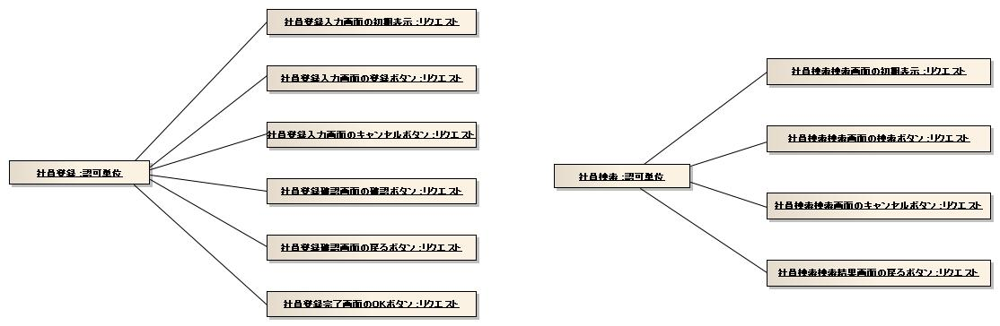
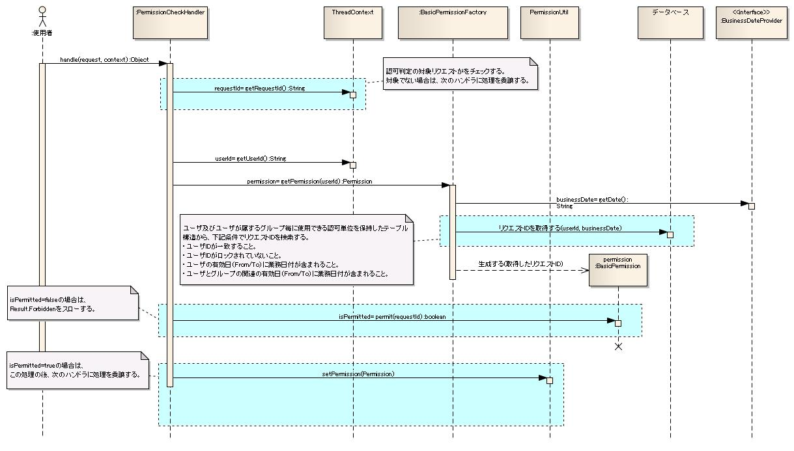

# 認可

## 概要

リクエストに対して認可チェックを行うライブラリ機能。ハンドラとして使用されることを想定しており、[../../handler/PermissionCheckHandler](../handlers/handlers-PermissionCheckHandler.md) と組み合わせて使用する。

> **注意**: 通常、アーキテクトが本機能を使用して認可処理を局所化するため、アプリケーションプログラマは本機能を直接使用しない。

## BasicPermissionFactoryの設定方法

**クラス**: `nablarch.common.handler.PermissionCheckHandler`, `nablarch.common.permission.BasicPermissionFactory`

### XML設定例

```xml
<component name="webFrontController" class="nablarch.fw.web.servlet.WebFrontController">
  <property name="handlerQueue">
    <list>
      <component class="nablarch.fw.RequestHandlerEntry">
        <property name="requestPattern" value="/action//" />
        <property name="handler">
          <component class="nablarch.common.handler.PermissionCheckHandler">
            <property name="permissionFactory" ref="permissionFactory" />
            <property name="ignoreRequestIds" value="RW11AA0101, RW11AA0102, RW99ZZ0601, RW99ZZ0602, RW99ZZ0603, RW99ZZ0604, RW99ZZ0605" />
          </component>
        </property>
      </component>
    </list>
  </property>
</component>

<component name="permissionFactory" class="nablarch.common.permission.BasicPermissionFactory">
  <property name="dbManager">
    <component class="nablarch.core.db.transaction.SimpleDbTransactionManager">
      <property name="dbTransactionName" value="PermissionCheck" />
      <property name="transactionFactory" ref="transactionFactory" />
      <property name="connectionFactory" ref="connectionFactory" />
    </component>
  </property>
  <property name="groupTableSchema">
    <component class="nablarch.common.permission.schema.GroupTableSchema">
      <property name="tableName" value="UGROUP" />
      <property name="groupIdColumnName" value="UGROUP_ID" />
    </component>
  </property>
  <property name="systemAccountTableSchema">
    <component class="nablarch.common.permission.schema.SystemAccountTableSchema">
      <property name="tableName" value="SYSTEM_ACCOUNT" />
      <property name="userIdColumnName" value="USER_ID" />
      <property name="userIdLockedColumnName" value="USER_ID_LOCKED" />
      <property name="effectiveDateFromColumnName" value="EFFECTIVE_DATE_FROM" />
      <property name="effectiveDateToColumnName" value="EFFECTIVE_DATE_TO" />
    </component>
  </property>
  <property name="groupSystemAccountTableSchema">
    <component class="nablarch.common.permission.schema.GroupSystemAccountTableSchema">
      <property name="tableName" value="UGROUP_SYSTEM_ACCOUNT" />
      <property name="groupIdColumnName" value="UGROUP_ID" />
      <property name="userIdColumnName" value="USER_ID" />
      <property name="effectiveDateFromColumnName" value="EFFECTIVE_DATE_FROM" />
      <property name="effectiveDateToColumnName" value="EFFECTIVE_DATE_TO" />
    </component>
  </property>
  <property name="permissionUnitTableSchema">
    <component class="nablarch.common.permission.schema.PermissionUnitTableSchema">
      <property name="tableName" value="PERMISSION_UNIT" />
      <property name="permissionUnitIdColumnName" value="PERMISSION_UNIT_ID" />
    </component>
  </property>
  <property name="permissionUnitRequestTableSchema">
    <component class="nablarch.common.permission.schema.PermissionUnitRequestTableSchema">
      <property name="tableName" value="PERMISSION_UNIT_REQUEST" />
      <property name="permissionUnitIdColumnName" value="PERMISSION_UNIT_ID" />
      <property name="requestIdColumnName" value="REQUEST_ID" />
    </component>
  </property>
  <property name="groupAuthorityTableSchema">
    <component class="nablarch.common.permission.schema.GroupAuthorityTableSchema">
      <property name="tableName" value="UGROUP_AUTHORITY" />
      <property name="groupIdColumnName" value="UGROUP_ID" />
      <property name="permissionUnitIdColumnName" value="PERMISSION_UNIT_ID" />
    </component>
  </property>
  <property name="systemAccountAuthorityTableSchema">
    <component class="nablarch.common.permission.schema.SystemAccountAuthorityTableSchema">
      <property name="tableName" value="SYSTEM_ACCOUNT_AUTHORITY" />
      <property name="userIdColumnName" value="USER_ID" />
      <property name="permissionUnitIdColumnName" value="PERMISSION_UNIT_ID" />
    </component>
  </property>
  <property name="businessDateProvider" ref="businessDateProvider" />
</component>

<component name="businessDateProvider" class="nablarch.core.date.BasicBusinessDateProvider" />
```

### スキーマクラス一覧

| クラス名 | 概要 |
|---|---|
| `nablarch.common.permission.schema.GroupTableSchema` | グループテーブルのスキーマ情報を保持 |
| `nablarch.common.permission.schema.SystemAccountTableSchema` | システムアカウントテーブルのスキーマ情報を保持 |
| `nablarch.common.permission.schema.GroupSystemAccountTableSchema` | グループシステムアカウントテーブルのスキーマ情報を保持 |
| `nablarch.common.permission.schema.PermissionUnitTableSchema` | 認可単位テーブルのスキーマ情報を保持 |
| `nablarch.common.permission.schema.PermissionUnitRequestTableSchema` | 認可単位リクエストテーブルのスキーマ情報を保持 |
| `nablarch.common.permission.schema.GroupAuthorityTableSchema` | グループ権限テーブルのスキーマ情報を保持 |
| `nablarch.common.permission.schema.SystemAccountAuthorityTableSchema` | システムアカウント権限テーブルのスキーマ情報を保持 |

### PermissionCheckHandlerのプロパティ

| プロパティ名 | 必須 | 説明 |
|---|---|---|
| permissionFactory | ○ | Permissionを生成するPermissionFactory |
| ignoreRequestIds | | 認可判定を行わないリクエストID（複数指定はカンマ区切り） |

### BasicPermissionFactoryのプロパティ

| プロパティ名 | 必須 | 説明 |
|---|---|---|
| dbManager | ○ | `nablarch.core.db.transaction.SimpleDbTransactionManager`のインスタンス（[../01_Core/04_DbAccessSpec](libraries-04_DbAccessSpec.md) 参照） |
| groupTableSchema | ○ | グループテーブルのスキーマ情報（GroupTableSchemaのインスタンス） |
| systemAccountTableSchema | ○ | システムアカウントテーブルのスキーマ情報（SystemAccountTableSchemaのインスタンス） |
| groupSystemAccountTableSchema | ○ | グループシステムアカウントテーブルのスキーマ情報（GroupSystemAccountTableSchemaのインスタンス） |
| permissionUnitTableSchema | ○ | 認可単位テーブルのスキーマ情報（PermissionUnitTableSchemaのインスタンス） |
| permissionUnitRequestTableSchema | ○ | 認可単位リクエストテーブルのスキーマ情報（PermissionUnitRequestTableSchemaのインスタンス） |
| groupAuthorityTableSchema | ○ | グループ権限テーブルのスキーマ情報（GroupAuthorityTableSchemaのインスタンス） |
| systemAccountAuthorityTableSchema | ○ | システムアカウント権限テーブルのスキーマ情報（SystemAccountAuthorityTableSchemaのインスタンス） |
| businessDateProvider | ○ | `nablarch.core.date.BusinessDateProvider`実装クラス。有効日（From/To）チェックに使用（:ref:`BusinessDateProvider-label` 参照） |

### GroupTableSchemaのプロパティ

| プロパティ名 | 必須 | 説明 |
|---|---|---|
| tableName | ○ | テーブル名 |
| groupIdColumnName | ○ | グループIDカラムの名前 |

### SystemAccountTableSchemaのプロパティ

| プロパティ名 | 必須 | 説明 |
|---|---|---|
| tableName | ○ | テーブル名 |
| userIdColumnName | ○ | ユーザIDカラムの名前 |
| userIdLockedColumnName | ○ | ユーザIDロックカラムの名前 |
| failedCountColumnName | ○ | 認証失敗回数カラムの名前 |
| effectiveDateFromColumnName | ○ | 有効日(From)カラムの名前 |
| effectiveDateToColumnName | ○ | 有効日(To)カラムの名前 |

### GroupSystemAccountTableSchemaのプロパティ

| プロパティ名 | 必須 | 説明 |
|---|---|---|
| tableName | ○ | テーブル名 |
| groupIdColumnName | ○ | グループIDカラムの名前 |
| userIdColumnName | ○ | ユーザIDカラムの名前 |
| effectiveDateFromColumnName | ○ | 有効日(From)カラムの名前 |
| effectiveDateToColumnName | ○ | 有効日(To)カラムの名前 |

### PermissionUnitTableSchemaのプロパティ

| プロパティ名 | 必須 | 説明 |
|---|---|---|
| tableName | ○ | テーブル名 |
| permissionUnitIdColumnName | ○ | 認可単位IDカラムの名前 |

### PermissionUnitRequestTableSchemaのプロパティ

| プロパティ名 | 必須 | 説明 |
|---|---|---|
| tableName | ○ | テーブル名 |
| permissionUnitIdColumnName | ○ | 認可単位IDカラムの名前 |
| requestIdColumnName | ○ | リクエストIDカラムの名前 |

### GroupAuthorityTableSchemaのプロパティ

| プロパティ名 | 必須 | 説明 |
|---|---|---|
| tableName | ○ | テーブル名 |
| groupIdColumnName | ○ | グループIDカラムの名前 |
| permissionUnitIdColumnName | ○ | 認可単位IDカラムの名前 |

### SystemAccountAuthorityTableSchemaのプロパティ

| プロパティ名 | 必須 | 説明 |
|---|---|---|
| tableName | ○ | テーブル名 |
| userIdColumnName | ○ | ユーザIDカラムの名前 |
| permissionUnitIdColumnName | ○ | 認可単位IDカラムの名前 |

### 初期化設定

BasicPermissionFactoryはInitializableインタフェースを実装しているため、BasicApplicationInitializerのinitializeListへの登録が必要（:ref:`repository_initialize` 参照）。

```xml
<component name="initializer" class="nablarch.core.repository.initialization.BasicApplicationInitializer">
  <property name="initializeList">
    <list>
      <component-ref name="permissionFactory"/>
    </list>
  </property>
</component>
```

<details>
<summary>keywords</summary>

認可チェック, PermissionCheckHandler, ハンドラ, 認可, アーキテクト, アプリケーションプログラマ, BasicPermissionFactory, GroupTableSchema, SystemAccountTableSchema, GroupSystemAccountTableSchema, PermissionUnitTableSchema, PermissionUnitRequestTableSchema, GroupAuthorityTableSchema, SystemAccountAuthorityTableSchema, BasicApplicationInitializer, SimpleDbTransactionManager, BasicBusinessDateProvider, permissionFactory, dbManager, businessDateProvider, groupTableSchema, systemAccountTableSchema, groupSystemAccountTableSchema, permissionUnitTableSchema, permissionUnitRequestTableSchema, groupAuthorityTableSchema, systemAccountAuthorityTableSchema, tableName, groupIdColumnName, userIdColumnName, userIdLockedColumnName, failedCountColumnName, effectiveDateFromColumnName, effectiveDateToColumnName, permissionUnitIdColumnName, requestIdColumnName, 認可チェック設定, テーブルスキーマ設定, 初期化設定

</details>

## 特徴

### グループ単位とユーザ単位を併用した権限設定

- グループに対して権限を設定し、ユーザにグループを割り当てることでグループ単位の権限を設定できる
- ユーザに直接権限を設定することもできるため、イレギュラーな権限付与に対応できる

### 自由度の高いテーブル定義

- テーブル名・カラム名は自由に付けられる
- カラムのデータ型は、フレームワークが規定するJavaの型に変換可能であれば任意の型を使用できる
- プロジェクトの命名規約を使用して本機能に必要なテーブル定義を作成できる

## 特定のリクエストIDを認可判定の対象から除外する方法

ログイン処理など一部の処理を認可判定から除外したい場合は、PermissionCheckHandlerの`ignoreRequestIds`プロパティに除外するリクエストIDをカンマ区切りで指定する。

```xml
<component class="nablarch.common.handler.PermissionCheckHandler">
  <property name="permissionFactory" ref="permissionFactory" />
  <property name="ignoreRequestIds" value="RW11AA0101, RW11AA0102" />
</component>
```

<details>
<summary>keywords</summary>

グループ権限, ユーザ権限, 権限設定, テーブル定義, 認可単位, イレギュラー権限付与, PermissionCheckHandler, ignoreRequestIds, permissionFactory, リクエストID除外

</details>

## 要求

**実装済み**

- 機能（任意のリクエストのかたまり）単位で認可判定の設定が可能
- ユーザに対してグループを設定し、グループ単位で認可判定の設定が可能
- 特定のリクエストIDを認可判定の対象から除外できる
- ユーザに有効日（From/To）を設定できる
- ユーザとグループの関連に有効日（From/To）を設定できる
- 認可判定の結果に応じて画面項目（メニューやボタンなど）の表示・非表示を切り替えられる

**未実装**

- 本機能で使用するマスタデータのメンテナンス
- 本機能で使用するマスタの初期データ一括登録
- 認証機能によりユーザIDがロックされているユーザの認可判定失敗

**未検討**

- データへのアクセス制限
- 機能単位の権限への有効日（From/To）設定

## 使用例

> **注意**: 認可判定のコードはフレームワークが実行するため、通常のアプリケーションでは実装不要。

```java
// PermissionCheckHandlerによりスレッドローカルにPermissionが保持されている
Permission permission = PermissionUtil.getPermission();
if (permission.permit("リクエストID")) {
    // 認可に成功した場合の処理
} else {
    // 認可に失敗した場合の処理
}
```

<details>
<summary>keywords</summary>

認可判定, リクエストID除外, 有効日, グループ設定, 画面表示制御, 実装済み機能, 未実装機能, 未検討, PermissionUtil, Permission, permit

</details>

## 構成

### 概念モデル

本機能では、リクエストIDを使用して認可判定を行う。リクエストIDの体系はアプリケーション毎に設計する。

**認可単位**: ユーザが機能として認識する最小単位の概念。認可単位には認可を実現するために必要なリクエスト（Webアプリケーションであれば画面のイベント）が複数紐付く。





- グループに認可単位を紐付けることでグループ権限、ユーザに認可単位を直接紐付けることでユーザ権限を表す
- グループ権限とユーザ権限が異なる場合は、双方の権限に紐づく認可単位が足し合わされる

**権限設定の例**:

| ユーザ | 説明 |
|---|---|
| Aさん | 人事部グループに紐づいているので、社員登録・社員削除・社員検索・社員情報変更を使用できる。 |
| Bさん | 社員グループに紐づいているので、社員検索・社員情報変更を使用できる。 |
| Cさん | パートナーグループに紐づいているので、社員情報変更のみ使用できる。 |
| Xさん | 部長グループと社員グループに紐づいているので、社員登録・社員削除・社員検索・社員情報変更を使用できる。 |
| Yさん | 社員グループに紐づいているので、社員検索・社員情報変更を使用できる。さらに社員登録認可単位に直接紐づいているので、社員登録も使用できる。 |

> **注意**: 通常は、認可情報のメンテナンス性を考慮してグループ権限を使用し、ユーザ権限はイレギュラーな権限付与にのみ使用する。

### クラス図


**インタフェース**:

| インタフェース名 | 概要 |
|---|---|
| `nablarch.common.permission.Permission` | 認可を行うインタフェース。認可判定の実現方法毎に実装クラスを作成する。 |
| `nablarch.common.permission.PermissionFactory` | Permissionを生成するインタフェース。認可情報の取得先毎に実装クラスを作成する。 |

**実装クラス**:

| クラス名 | 概要 |
|---|---|
| `nablarch.common.permission.BasicPermission` | 保持しているリクエストIDを使用して認可を行うPermissionの基本実装クラス。 |
| `nablarch.common.permission.BasicPermissionFactory` | BasicPermissionを生成するPermissionFactoryの基本実装クラス。DBのユーザおよびユーザが属するグループ毎の認可単位テーブルからユーザに紐付く認可情報を取得する。 |
| `nablarch.common.handler.PermissionCheckHandler` | 認可判定を行うハンドラ。 |
| `nablarch.common.permission.PermissionUtil` | 権限管理に使用するユーティリティ。 |

### シーケンス図



1. `PermissionCheckHandler` はリクエストの度にユーザに紐付く `Permission` を取得し、認可判定後にPermissionをスレッドローカルに格納する
2. 個別アプリケーションで認可判定が必要な場合は、`PermissionUtil` からPermissionを取得して認可判定を行う
3. 認証機能によりユーザIDがロックされている場合は認可失敗となる
4. 認可判定の対象リクエストのチェックは、設定で指定されたリクエストIDを使用する（設定方法は :ref:`ignoreRequestIdsSetting` を参照）
5. ユーザIDとリクエストIDは、PermissionCheckHandlerよりも先に処理するハンドラにより `ThreadContext` に設定しておく必要がある（:ref:`ThreadContextHandler` が設定を行う）

### テーブル定義

テーブル名・カラム名は `BasicPermissionFactory` の設定で指定するため任意の名前を使用できる。データ型もJavaの型に変換可能であれば任意の型を使用できる。

**グループテーブル**:

| 定義 | Javaの型 | 制約 |
|---|---|---|
| グループID | java.lang.String | ユニークキー |

**システムアカウントテーブル**:

| 定義 | Javaの型 | 制約 |
|---|---|---|
| ユーザID | java.lang.String | ユニークキー |
| ユーザIDロック | boolean | |
| 有効日(From) | java.lang.String | 書式yyyyMMdd、未指定時は"19000101" |
| 有効日(To) | java.lang.String | 書式yyyyMMdd、未指定時は"99991231" |

**グループシステムアカウントテーブル**:

| 定義 | Javaの型 | 制約 |
|---|---|---|
| グループID | java.lang.String | ユニークキー |
| ユーザID | java.lang.String | ユニークキー |
| 有効日(From) | java.lang.String | ユニークキー、書式yyyyMMdd、未指定時は"19000101" |
| 有効日(To) | java.lang.String | 書式yyyyMMdd、未指定時は"99991231" |

**認可単位テーブル**:

| 定義 | Javaの型 | 制約 |
|---|---|---|
| 認可単位ID | java.lang.String | ユニークキー |

**認可単位リクエストテーブル**:

| 定義 | Javaの型 | 制約 |
|---|---|---|
| 認可単位ID | java.lang.String | ユニークキー |
| リクエストID | java.lang.String | ユニークキー |

**グループ権限テーブル**:

| 定義 | Javaの型 | 制約 |
|---|---|---|
| グループID | java.lang.String | ユニークキー |
| 認可単位ID | java.lang.String | ユニークキー |

**システムアカウント権限テーブル**:

| 定義 | Javaの型 | 制約 |
|---|---|---|
| ユーザID | java.lang.String | ユニークキー |
| 認可単位ID | java.lang.String | ユニークキー |


> **注意**: システムアカウントテーブルは認証機能と同じテーブルを使用することを想定しているため、パスワード等の認証用データ項目が含まれている。

<details>
<summary>keywords</summary>

Permission, PermissionFactory, BasicPermission, BasicPermissionFactory, PermissionCheckHandler, PermissionUtil, 認可単位, グループ権限, ユーザ権限, システムアカウント, テーブル定義, ThreadContext, ignoreRequestIdsSetting, ThreadContextHandler

</details>
