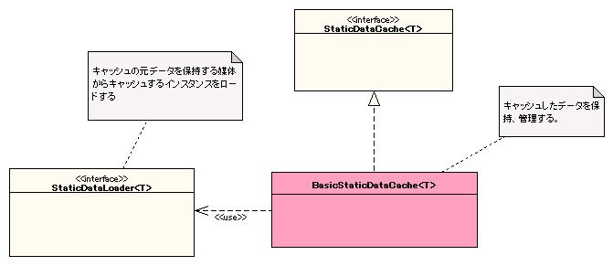

# 静的データのキャッシュ

## 概要

静的データをよりアクセス速度が早い媒体にキャッシュすることで高速化する機構を提供する。

- 本機能は :ref:`repository` に登録して使用する。初期化処理は :ref:`repository` が実行する。
- 本機能は他の機能の一部として使用されることを想定しており、アプリケーションプログラマは直接使用することはない。

一括ロードでは `StaticDataLoader` インタフェースの以下の4メソッドを実装する必要がある。

| メソッド名 | 用途 |
|---|---|
| loadAll | キャッシュするデータを取得する。フレームワークはこのメソッドで返される全てのデータをキャッシュの初期データとして保持する。 |
| getId | データからデータのIDを取得する。返されるオブジェクトは `java.util.Map` のキーとして使用されるため、キャッシュ上で一意でなければならない。複合キーの場合は `equals` と `hashCode` を適切に実装したクラスのインスタンスを返す。 |
| getIndexNames | 作成するインデックス名を全て取得する。フレームワークはこの戻り値から作成するインデックスを決定する。 |
| generateIndexKey | インデックスのキーとなる値を生成する。`getId` がオブジェクトのキャッシュに使用されるのに対し、このメソッドはインデックス上のどのキーにオブジェクトが属するかを示すために使われる。 |

<details>
<summary>keywords</summary>

StaticDataCache, StaticDataLoader, 静的データキャッシュ, キャッシュ初期化, リポジトリ登録, repository, loadAll, getId, generateIndexKey, getIndexNames, 一括ロード, キャッシュ, インデックス

</details>

## 特徴

**静的データキャッシュの実装負荷軽減**: キャッシュを使用する機能を実装する際に必要な実装が、静的データをロードする処理とキャッシュした静的データを使用する処理の2つのみに集約される。

**インデックス機能**: ID以外の特定のキー（インデックスキー）を指定してキャッシュから静的データを取得できる。1つのキーに複数の静的データを紐付けられる。

> **注意**: このコードはフレームワークが行う処理であり、通常のアプリケーションでは実装する必要がない。アプリケーション・プログラマはこのような実装を行わない。

```java
public class ExampleDataLoader implements StaticDataLoader<ExampleData> {

    public Object getId(ExampleData value) {
        return value.getId();
    }

    public Object generateIndexKey(String indexName, ExampleData value) {
        if (indexName.equals("name")) {
            return value.getName();
        } else {
            throw new IllegalArgumentException(
                "invalid indexName: indexName = " + indexName);
        }
    }

    public List<String> getIndexNames() {
        List<String> indexNames = new ArrayList<String>();
        indexNames.add("name");
        return indexNames;
    }

    public List<ExampleData> loadAll() {
        return new SimpleDbTransactionExecutor<List<ExampleData>>(dbManager) {
            @Override
            public List<ExampleData> execute(AppDbConnection connection) {
                SqlPStatement stmt = connection
                    .prepareStatement("select id, name from example_data order by id");
                SqlResultSet results = stmt.retrieve();
                List<ExampleData> objs = new ArrayList<ExampleData>();
                for (SqlRow row : results) {
                    objs.add(createData(row));
                }
                return objs;
            }
        }.doTransaction();
    }
}
```

<details>
<summary>keywords</summary>

StaticDataCache, インデックス機能, インデックスキー, 実装負荷軽減, キャッシュ機能, ExampleDataLoader, StaticDataLoader, SimpleDbTransactionExecutor, AppDbConnection, SqlPStatement, SqlResultSet, SqlRow, IllegalArgumentException, 一括ロード実装例

</details>

## 要求

**実装済み**:
- 任意のクラスの静的データをキャッシュできる
- IDを指定してキャッシュから静的データを取得できる
- 任意のインデックスキーを指定して、キャッシュから複数の静的データを取得できる
- アプリケーション起動時に永続化した媒体から静的データをロードできる
- 静的データが必要になったタイミングで永続化した媒体からロードできる
- プロセスを再起動することなく再ロードできる

**未検討**:
- 頻繁に参照されない静的データをキャッシュから削除することでメモリを節約できる
- 複数のJavaプロセスでキャッシュした静的データを共有できる
- ファイルから静的データをロードできる
- SQL文を記述するだけで、データベース上にある静的データをキャッシュできる

一括ロードを行う場合、`BasicStaticDataCache` の `loadOnStartup` プロパティに `true` を設定する必要がある。その他の設定方法はオンデマンドロード時と同様となる。

```xml
<component name="exampleDataCache" class="nablarch.core.cache.BasicStaticDataCache">
    <property name="loader">
        <component class="nablarch.core.cache.example.ExampleDataLoader" />
    </property>
    <property name="loadOnStartup" value="true"/>
</component>

<component name="staticDataUseExample" class="nablarch.core.cache.example.StaticDataUseExample">
    <property name="cache" ref="exampleDataCache" />
</component>
```

`BasicStaticDataCache` は初期化が必要なため :ref:`repository_initialize` に記述した `Initializable` インタフェースを実装している。以下のように `exampleDataCache` が初期化されるよう設定すること。

```xml
<component name="initializer" class="nablarch.core.repository.initialization.BasicApplicationInitializer">
    <property name="initializeList">
        <list>
            <component-ref name="exampleDataCache"/>
        </list>
    </property>
</component>
```

<details>
<summary>keywords</summary>

実装済み機能, 未検討機能, 再ロード, インデックスキー, キャッシュ要件, BasicStaticDataCache, loadOnStartup, BasicApplicationInitializer, Initializable, 一括ロード設定, キャッシュ初期化設定

</details>

## 構成



**クラス**: `nablarch.core.cache.BasicStaticDataCache` の設定プロパティ。

<details>
<summary>keywords</summary>

StaticDataCache, StaticDataLoader, BasicStaticDataCache, クラス図, クラス構成, nablarch.core.cache.BasicStaticDataCache, loader, loadOnStartup, プロパティ設定

</details>

## インタフェース定義

| インタフェース名 | 概要 |
|---|---|
| `nablarch.core.cache.StaticDataCache` | 静的データのキャッシュを保持するインタフェース |
| `nablarch.core.cache.StaticDataLoader` | 静的データをロードするインタフェース。RDBMSやXMLファイル等の媒体から静的データをロードするクラスはこのインタフェースを実装する |

| プロパティ名 | 必須 | 説明 |
|---|---|---|
| loader | ○ | 静的データをロードする `StaticDataLoader` インタフェースを実装したクラスのインスタンスを指定する。 |
| loadOnStartup | | 一括ロードの要否を設定する。指定しなければ一括ロードしない。 |

<details>
<summary>keywords</summary>

nablarch.core.cache.StaticDataCache, nablarch.core.cache.StaticDataLoader, StaticDataCache, StaticDataLoader, インタフェース定義, loader, loadOnStartup, BasicStaticDataCache, プロパティ設定詳細, 一括ロード設定

</details>

## クラス定義

| クラス名 | 概要 |
|---|---|
| `nablarch.core.cache.StaticDataCache` | StaticDataCacheインタフェースの基本実装クラス。静的データをHashMapに保持する |

静的データは元となるデータが更新された際に再読み込みが必要。アプリケーションの再起動が頻繁に行えない場合、`StaticDataCache` インタフェースの `refresh` メソッドを呼び出すことで再起動なしに再読み込みができる。

> **注意**: このコードはプロジェクトのアーキテクトが作成するものである。通常、各アプリケーション・プログラマはこのような実装を行わない。

```java
public class StaticDataUseExample {
    private StaticDataCache<ExampleData> cache;

    public void setCache(StaticDataCache<ExampleData> cache) {
        this.cache = cache;
    }

    public void refreshAndGetValue(String name) {
        // キャッシュをリロードする
        cache.refresh();

        // キャッシュから静的データを取得する
        // 使用者は、静的データがキャッシュにあるかを意識する必要はない
        List<ExampleData> objs = cache.getValues("name", name);
        for (ExampleData obj : objs) {
            System.out.println(obj);
        }
    }
}
```

<details>
<summary>keywords</summary>

nablarch.core.cache.StaticDataCache, BasicStaticDataCache, HashMap, クラス定義, 基本実装クラス, StaticDataCache, refresh, 静的データ再読み込み, リロード, StaticDataUseExample, アプリ再起動なし更新

</details>

## キャッシュした静的データの取得

`StaticDataCache` インタフェースの実装クラスは :ref:`di-container` の機能でフィールドに設定する。

**IDを指定した静的データの取得**: `StaticDataCache#getValue` または `StaticDataCache#getValues` を使用する。キャッシュにデータが存在しない場合は自動的にデータを取得するため、呼び出し元はキャッシュの状態を意識する必要がない。

**インデックスを使用した静的データの取得**: `StaticDataCache#getValues(indexName, key)` を使用する。1つのキーに複数の静的データを紐付けられる。

```java
public void getByName(String name) {
    List<ExampleData> objs = cache.getValues("name", name);
    for (ExampleData obj : objs) {
        System.out.println("id = " + obj.getId());
        System.out.println("name = " + obj.getName());
    }
}
```

<details>
<summary>keywords</summary>

StaticDataCache, getValue, getValues, di-container, インデックス取得, キャッシュデータ取得

</details>

## キャッシュされるデータを保持するクラス(ExampleData)

```java
public class ExampleData {
    private String id;
    private String name;
    // setter, getterは省略
}
```

<details>
<summary>keywords</summary>

ExampleData, キャッシュデータクラス, StaticDataCache

</details>

## キャッシュしたデータを使用するクラス

```java
public class StaticDataUseExample {
    // DIによりStaticDataを設定
    private StaticDataCache<ExampleData> cache;

    public void setCache(StaticDataCache<ExampleData> cache) {
        this.cache = cache;
    }

    public void getById(String id) {
        ExampleData obj = cache.getValue(id);
        System.out.println("id = " + obj.getId());
        System.out.println("name = " + obj.getName());
    }
}
```

> **警告**: `StaticDataCache#getValue` または `StaticDataCache#getValues` で取得した静的データは、クラスおよびインスタンスのフィールドに保持しないこと。リロード機能が呼ばれた際に更新されない問題があるためである。

<details>
<summary>keywords</summary>

StaticDataUseExample, StaticDataCache, getValue, フィールド保持禁止, リロード

</details>

## キャッシュにデータをロードする方法

オンデマンドロードと一括ロードの2種類のロード方法を提供する。

**オンデマンドロード**: キャッシュにデータがなかった際に自動的にロードする。アプリケーション起動が速い。バッチやテスト時のメッセージなど、使用するデータがキャッシュ全体の一部に偏る場面に有利。


**一括ロード**: アプリケーション起動時に全データをキャッシュにロードする。キャッシュミスヒット時の処理遅延がない。Webアプリケーションのメッセージなど、使用するデータがキャッシュ全体のほぼ全てとなる場面に有利。


いずれの方法でも、キャッシュを使用する実装はデータのロード方法を意識する必要がない。

<details>
<summary>keywords</summary>

オンデマンドロード, 一括ロード, キャッシュロード, 起動時ロード, ロード方式

</details>

## オンデマンドロードの使用方法

データロードの処理は `StaticDataLoader` インタフェースを実装したクラスに実装する。

**IDを指定してデータを取得する場合**: `StaticDataLoader#getValue` メソッドのみを実装すればよい。

**インデックスを指定してデータを取得する場合**: `StaticDataLoader#getValues` と `StaticDataLoader#getId` を実装する必要がある。
- `getValues`: データロードのためにフレームワークから呼び出される
- `getId`: 同一の静的データを二重に保持しないためにフレームワークから呼び出される。静的データを一意に決定する値を返すように実装すること

> **注意**: 下記のコードはフレームワークが行う処理であり、通常のアプリケーションでは実装する必要がない。アプリケーション・プログラマはこのような実装を行わない。

```java
public List<ExampleData> getValues(final String indexName, final Object key) {
    return new SimpleDbTransactionExecutor<List<ExampleData>>(dbManager) {
        @Override
        public List<ExampleData> execute(AppDbConnection connection) {
            if (indexName.equals("name")) {
                String name = (String) key;
                SqlPStatement stmt = connection.prepareStatement(
                    "select id, name from example_data where name = ? order by id");
                stmt.setString(1, (String) name);
                SqlResultSet results = stmt.retrieve();
                List<ExampleData> objs = new ArrayList<ExampleData>();
                for (SqlRow row : results) {
                    objs.add(createData(row));
                }
                return objs;
            } else {
                throw new IllegalArgumentException("invalid indexName: indexName = " + indexName);
            }
        }
    }.doTransaction();
}

public Object getId(ExampleData value) {
    return value.getId();
}
```

<details>
<summary>keywords</summary>

StaticDataLoader, getValue, getValues, getId, オンデマンドロード実装, インデックスロード

</details>

## ExampleDataをロードするクラス

> **注意**: 下記のコードはフレームワークが行う処理であり、通常のアプリケーションでは実装する必要がない。アプリケーション・プログラマはこのような実装を行わない。

```java
public class ExampleDataLoader implements StaticDataLoader<ExampleData> {
    private SimpleDbTransactionManager dbManager;

    public ExampleData getValue(final Object id) {
        return new SimpleDbTransactionExecutor<ExampleData>(dbManager) {
            @Override
            public ExampleData execute(AppDbConnection connection) {
                SqlPStatement stmt = connection.prepareStatement(
                    "select id, name from example_data where id = ? order by id");
                stmt.setString(1, (String) id);
                SqlResultSet results = stmt.retrieve();
                if (results.size() > 0) {
                    return createData(results.get(0));
                } else {
                    return null;
                }
            }
        }.doTransaction();
    }
}
```

<details>
<summary>keywords</summary>

ExampleDataLoader, StaticDataLoader, SimpleDbTransactionExecutor, SimpleDbTransactionManager, フレームワーク実装

</details>

## 設定ファイル

```xml
<!-- cashLoaderの定義 -->
<component name="exampleDataCache" class="nablarch.core.cache.BasicStaticDataCache">
    <property name="loader">
        <component class="nablarch.core.cache.example.ExampleDataLoader" />
    </property>
</component>

<!-- cacheを使用するコンポーネントの定義 -->
<component name="staticDataUseExample" class="nablarch.core.cache.example.StaticDataUseExample">
    <property name="cache" ref="exampleDataCache" />
</component>
<component name="initializer" class="nablarch.core.repository.initialization.BasicApplicationInitializer">
    <property name="initializeList">
        <list>
            <component-ref name="exampleDataCache"/>
        </list>
    </property>
</component>
```

<details>
<summary>keywords</summary>

BasicStaticDataCache, ExampleDataLoader, BasicApplicationInitializer, initializeList, XML設定

</details>
