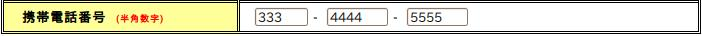

# 入力画面と確認画面の共通化をサポートするカスタムタグ

入力画面と確認画面が1対1に対応する画面であれば、入力画面と確認画面を共通化することで、確認画面のJSPを作成する工数を削減することができる。
マスタメンテナンス画面など、複雑な操作が要求されない画面を大量に、短期間で作成する場合は、この機能が活躍する。

実装の共通化は、入力画面のJSPにおいて行い、確認画面のJSPは入力画面のJSPにフォワードだけを行う。
アクションは、入力画面と確認画面でそれぞれ別々のJSPにフォワードしておき、
仕様変更に伴い入力画面と確認画面を別々に作成する必要が発生した場合にもアクションへの影響を抑える。

確認画面のJSPは、 [confirmationPageタグ](../../component/libraries/libraries-07-TagReference.md#webview-confirmationpagetag) を使用してフォワードを行う。
確認画面の実装例を示す。
入力画面と確認画面のJSPは同じ場所に配置することが多いので、実装例のように相対パスで指定できる。

```jsp
<%-- USER003.jspは入力画面のJSPとする。 --%>
<n:confirmationPage path="./USER003.jsp" />
```

入力項目のカスタムタグでは、入力項目と入力項目に対応する確認画面用の出力機能を提供しているので、
入力画面と確認画面で表示を切り替える機能を提供する。

## 入力画面と確認画面の表示切り替え

入力画面と確認画面の表示切り替えには、入力画面と確認画面のそれぞれにおいてのみボディを評価する下記タグを使用する。

| カスタムタグ | 出力するHTMLタグ |
|---|---|
| [forInputPageタグ](../../component/libraries/libraries-07-TagReference.md#webview-forinputpagetag) | 入力画面のみボディを評価する。 |
| [forConfirmationPageタグ](../../component/libraries/libraries-07-TagReference.md#webview-forconfirmationpagetag) | 確認画面のみボディを評価する。 |

### パスワードの使用例

パスワードの例を下記に示す。
入力画面では確認用の入力があるため2つの入力項目を表示するが、確認画面では一方だけ出力する。


```jsp
<n:password name="systemAccount.newPassword" size="22" maxlength="20" />
<n:forInputPage>
  <br/>
  <n:password name="systemAccount.confirmPassword" size="22" maxlength="20" /><span class="dinstruct">(確認用)</span>
</n:forInputPage>
```

### 携帯電話番号の使用例

携帯電話番号の例を下記に示す。
携帯電話番号は入力項目がハイフンで連結されており、全て入力するかしないかの2択である。
確認画面では入力されていない場合にハイフンを表示させないように制御する。



```jsp
<n:forInputPage>
    <n:text name="users.mobilePhoneNumberAreaCode" size="5" maxlength="3" />&nbsp;-&nbsp;
    <n:text name="users.mobilePhoneNumberCityCode" size="6" maxlength="4" />&nbsp;-&nbsp;
    <n:text name="users.mobilePhoneNumberSbscrCode" size="6" maxlength="4" />
</n:forInputPage>
<n:forConfirmationPage>
  <c:if test="${users.mobilePhoneNumberAreaCode != ''}">
    <n:text name="users.mobilePhoneNumberAreaCode" size="5" maxlength="3" />&nbsp;-&nbsp;
    <n:text name="users.mobilePhoneNumberCityCode" size="6" maxlength="4" />&nbsp;-&nbsp;
    <n:text name="users.mobilePhoneNumberSbscrCode" size="6" maxlength="4" />
  </c:if>
</n:forConfirmationPage>
```

### ボタンの使用例

もう一つ、ボタンの例を下記に示す。
入力画面は確認ボタン、確認画面は登録画面へ戻るボタンと確定ボタンを表示する。

```jsp
<n:forInputPage>
  <n:submit cssClass="buttons" type="button" name="confirm" value="確認" uri="/action/ss11AC/W11AC02Action/RW11AC0202"/>
</n:forInputPage>
<n:forConfirmationPage>
  <n:submit cssClass="buttons" type="button" name="back" value="登録画面へ" uri="/action/ss11AC/W11AC02Action/RW11AC0203"/>
  <n:submit cssClass="buttons" type="button" name="register" value="確定" uri="/action/ss11AC/W11AC02Action/RW11AC0204" allowDoubleSubmission="false"/>
</n:forConfirmationPage>
```

上記に提供しているタグで対応できない場合は、入力画面と確認画面の差異が多いため、この機能の使用に適していない可能性がある。
適していない場合は、無理に1つのJSPで作成しようとせずに、入力画面と確認画面のJSPを分けて開発すること。

## 確認画面での入力項目の表示

ユーザがどの画面にいても素早く目的の画面にアクセスできるように、全画面の共通ヘッダに検索フォームを配置したい場合がある。
しかし、 [confirmationPageタグ](../../component/libraries/libraries-07-TagReference.md#webview-confirmationpagetag) を使用した画面では、確認画面の場合にすべての入力項目のカスタムタグが確認用の出力を行うため、
共通ヘッダの検索フォームも確認用として出力される。
このため、確認画面へ入力項目を表示するために、本機能は [ignoreConfirmationタグ](../../component/libraries/libraries-07-TagReference.md#webview-ignoreconfirmationtag) を提供する。

ignoreConfirmationタグのボディに配置された入力項目のカスタムタグは、常に入力項目として出力される。
ignoreConfirmationタグを使用することで、画面内の一部分を常に入力項目として表示することができる。

ignoreConfirmationタグを使用した検索フォームの実装例を下記に示す。

```jsp
<%-- ignoreConfirmationタグで囲まれた範囲のみ、常に入力項目として表示される。 --%>
<n:ignoreConfirmation>
<n:form>
  <n:text name="searchWords" />
  <n:submit type="button" uri="./CUSTOM00207" name="CUSTOM00207_submit" value="検索" />
</n:form>
</n:ignoreConfirmation>
```
