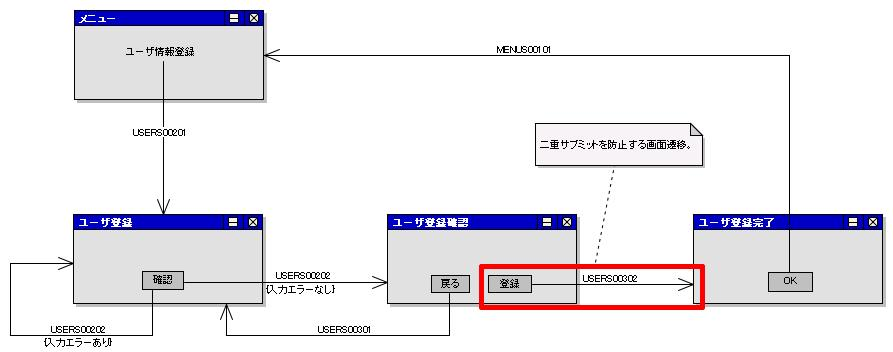

# JSPカスタムタグライブラリの使用方法

## 解説に使用する実装例の説明

## ディスパッチャの設定

[../../../handler/HttpRequestJavaPackageMapping](../handlers/handlers-HttpRequestJavaPackageMapping.md) を使用してURIとアクションを対応付ける。

```xml
<component name="packageMapping" class="nablarch.fw.web.handler.HttpRequestJavaPackageMapping">
    <property name="baseUri" value="/action/"/>
    <property name="basePackage" value="nablarch.sample"/>
</component>
```

URIとメソッドの対応パターン（UserActionの例 — サブディレクトリあり）:

```
# URI
<コンテキストパス>/action/management/user/UserAction/<リクエストID>
# メソッド
nablarch.sample.management.user.UserAction#do<リクエストID>(HttpRequest req, ExecutionContext ctx)
```

URIとメソッドの対応パターン（MenuActionの例 — basePackage直下）:

```
# URI
<コンテキストパス>/action/MenuAction/<リクエストID>
# メソッド
nablarch.sample.MenuAction#do<リクエストID>(HttpRequest req, ExecutionContext ctx)
```

## アクションのシグネチャ

```java
package nablarch.sample.management.user;

public class UserAction {
    public HttpResponse doUSERS00201(HttpRequest req, ExecutionContext ctx) { /* ユーザ登録画面の初期表示 */ }
    public HttpResponse doUSERS00202(HttpRequest req, ExecutionContext ctx) { /* ユーザ登録画面の確認ボタン */ }
    public HttpResponse doUSERS00301(HttpRequest req, ExecutionContext ctx) { /* ユーザ登録確認画面の戻るボタン */ }
    public HttpResponse doUSERS00302(HttpRequest req, ExecutionContext ctx) { /* ユーザ登録確認画面の登録ボタン */ }
}
```

```java
package nablarch.sample;

public class MenuAction {
    public HttpResponse doMENUS00101(HttpRequest req, ExecutionContext ctx) { /* メニュー画面の初期表示 */ }
}
```

> **注意**: USERS00302（登録ボタン）はDBコミットを伴うリクエストのため、二重サブミット防止が必要。



<details>
<summary>keywords</summary>

HttpRequestJavaPackageMapping, UserAction, MenuAction, HttpRequest, ExecutionContext, HttpResponse, ディスパッチャ設定, アクションシグネチャ, URIマッピング, 二重サブミット防止, ユーザ登録機能実装例, basePackage, baseUri

</details>

## カスタムタグ全体に関わる仕様

カスタムタグを使用する場合、Webフロントコントローラのハンドラ設定が必須（:ref:`WebView_NablarchTagHandler` 参照）。

全カスタムタグの基本ルール: [./07_BasicRules](libraries-07_BasicRules.md)

<details>
<summary>keywords</summary>

カスタムタグ基本仕様, Webフロントコントローラ, ハンドラ設定必須, WebView_NablarchTagHandler, 07_BasicRules

</details>

## カスタムタグごとの仕様

## 入力に関するカスタムタグ

提供機能:
- 入力データを保持する
- 入力データを復元する
- 入力項目を確認画面用に出力する
- 値をフォーマットして出力する（[web_view_format](libraries-07_DisplayTag.md) 参照）
- 値を変数に設定する

詳細: [./07_FormTag](libraries-07_FormTag.md)、タグ一覧: [./07_FormTagList](libraries-07_FormTagList.md)

> **注意**: コードの入力に関するカスタムタグは :ref:`code_tag` を参照。

## 表示に関するカスタムタグ

詳細: [./07_DisplayTag](libraries-07_DisplayTag.md)

## フォームのサブミット制御に関するカスタムタグ

提供機能:
- ボタン/リンクによるフォームサブミットのサポート
- JavaScriptによる二重サブミット防止
- トークンによる二重サブミット防止
- ブラウザキャッシュの防止

詳細: [./07_SubmitTag](libraries-07_SubmitTag.md)

## アプリケーション開発を容易にするカスタムタグ

業務アプリケーションで頻出する処理の実装をサポートする。詳細: [./07_FacilitateTag](libraries-07_FacilitateTag.md)

## その他のカスタムタグ

詳細: [./07_OtherTag](libraries-07_OtherTag.md)

<details>
<summary>keywords</summary>

入力カスタムタグ, 表示カスタムタグ, サブミット制御, 二重サブミット防止, トークン, コードタグ, 07_FormTag, 07_FormTagList, 07_DisplayTag, 07_SubmitTag, 07_FacilitateTag, 07_OtherTag

</details>
