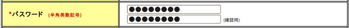

# 入力画面と確認画面の共通化をサポートするカスタムタグ

## 入力画面と確認画面の共通化

入力画面と確認画面が1対1に対応する画面では、確認画面のJSPで :ref:`WebView_ConfirmationPageTag` を使用して入力画面のJSPにフォワードするだけで共通化できる。これにより確認画面のJSPを作成する工数を削減できる。マスタメンテナンス画面など、複雑な操作が要求されない画面を大量に、短期間で作成する場合に特に活躍する機能である。アクションは入力画面と確認画面でそれぞれ別々のJSPにフォワードしておく（仕様変更時の影響を抑えるため）。入力画面と確認画面のJSPは同じ場所に配置することが多いので、相対パスで指定できる。

```jsp
<%-- USER003.jspは入力画面のJSPとする。 --%>
<n:confirmationPage path="./USER003.jsp" />
```

<details>
<summary>keywords</summary>

入力画面と確認画面の共通化, n:confirmationPage, confirmationPage, JSPのフォワード, WebView_ConfirmationPageTag, 確認画面JSP省略, マスタメンテナンス画面, 短期間で大量作成

</details>

## 入力画面と確認画面の表示切り替え

入力画面と確認画面で表示を切り替えるタグ:

| カスタムタグ | 説明 |
|---|---|
| :ref:`WebView_ForInputPageTag` | 入力画面のみボディを評価する |
| :ref:`WebView_ForConfirmationPageTag` | 確認画面のみボディを評価する |

> **注意**: 上記タグで対応できない場合は、入力画面と確認画面の差異が多いため、JSPを分けて開発すること。

**パスワードの例**（入力画面では確認用入力項目を2つ表示、確認画面では1つのみ）:



```jsp
<n:password name="systemAccount.newPassword" size="22" maxlength="20" />
<n:forInputPage>
  <br/>
  <n:password name="systemAccount.confirmPassword" size="22" maxlength="20" /><span class="dinstruct">(確認用)</span>
</n:forInputPage>
```

**携帯電話番号の例**（確認画面では入力されていない場合にハイフンを表示させない）:


```jsp
<n:forInputPage>
    <n:text name="users.mobilePhoneNumberAreaCode" size="5" maxlength="3" />&nbsp;-&nbsp;
    <n:text name="users.mobilePhoneNumberCityCode" size="6" maxlength="4" />&nbsp;-&nbsp;
    <n:text name="users.mobilePhoneNumberSbscrCode" size="6" maxlength="4" />
</n:forInputPage>
<n:forConfirmationPage>
  <c:if test="${users.mobilePhoneNumberAreaCode != ''}">
    <n:text name="users.mobilePhoneNumberAreaCode" size="5" maxlength="3" />&nbsp;-&nbsp;
    <n:text name="users.mobilePhoneNumberCityCode" size="6" maxlength="4" />&nbsp;-&nbsp;
    <n:text name="users.mobilePhoneNumberSbscrCode" size="6" maxlength="4" />
  </c:if>
</n:forConfirmationPage>
```

**ボタンの例**（入力画面は確認ボタン、確認画面は戻るボタンと確定ボタン）:

```jsp
<n:forInputPage> 
  <n:submit cssClass="buttons" type="button" name="confirm" value="確認" uri="/action/ss11AC/W11AC02Action/RW11AC0202"/> 
</n:forInputPage>
<n:forConfirmationPage> 
  <n:submit cssClass="buttons" type="button" name="back" value="登録画面へ" uri="/action/ss11AC/W11AC02Action/RW11AC0203"/>
  <n:submit cssClass="buttons" type="button" name="register" value="確定" uri="/action/ss11AC/W11AC02Action/RW11AC0204" allowDoubleSubmission="false"/>
</n:forConfirmationPage>
```

<details>
<summary>keywords</summary>

入力画面と確認画面の表示切り替え, n:forInputPage, n:forConfirmationPage, forInputPage, forConfirmationPage, WebView_ForInputPageTag, WebView_ForConfirmationPageTag, パスワード入力, 携帯電話番号, ボタン表示切り替え

</details>

## 確認画面での入力項目の表示

:ref:`WebView_ConfirmationPageTag` を使用した確認画面では、すべての入力項目のカスタムタグが確認用の出力を行うため、共通ヘッダの検索フォームも確認用として出力される問題がある。

:ref:`WebView_IgnoreConfirmationTag` を使用することで、ボディ内の入力項目を常に入力項目として出力できる（画面内の一部分を常に入力項目として表示可能）。

```jsp
<%-- ignoreConfirmationタグで囲まれた範囲のみ、常に入力項目として表示される。 --%>
<n:ignoreConfirmation>
<n:form>
  <n:text name="searchWords" />
  <n:submit type="button" uri="./CUSTOM00207" name="CUSTOM00207_submit" value="検索" />
</n:form>
</n:ignoreConfirmation>
```

<details>
<summary>keywords</summary>

n:ignoreConfirmation, ignoreConfirmation, 確認画面での入力項目の表示, 共通ヘッダ検索フォーム, WebView_IgnoreConfirmationTag, 入力項目の強制表示

</details>
