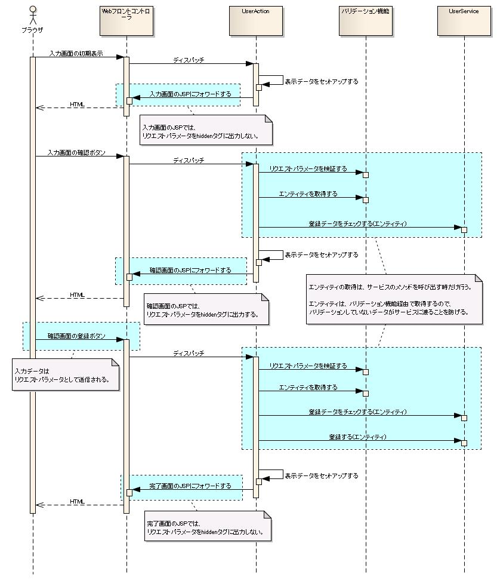

# 入力フォームのname属性

## 入力フォームのname属性

## name属性の指定ルール

- Map型またはオブジェクトのプロパティにアクセスする場合: **ドット区切り**を指定
- List型または配列の要素にアクセスする場合: **角括弧**（括弧内にはインデックス）を指定

```java
public class UserEntity {
    private String name;
    private String remarks;
    // アクセッサは省略。
}
```

暗号化は `Encryptor` インタフェースを実装したクラスが行う。デフォルトのアルゴリズムはAES(128bit)。変更したい場合は `Encryptor` を実装したクラスを `"hiddenEncryptor"` という名前でリポジトリに登録する。

暗号化はformタグ毎に行い、以下をまとめて暗号化し1つのhiddenタグに出力する:
- カスタムタグのhiddenタグで明示的に指定したhiddenパラメータ
- ウィンドウスコープの値
- サブミットを行うタグ（submit、submitLink、button）で指定したリクエストID
- サブミットを行うタグで指定した :ref:`変更パラメータ<WebView_ChangeableParams>`

改竄検知のため、これらのデータから生成したハッシュ値を含める。リクエストIDは異なる画面間での値置き換えによる改竄検知に、ハッシュ値は値の書き換えによる改竄検知に使用する。暗号化結果はBASE64エンコードしてhiddenタグに出力する。

:ref:`変更パラメータ<WebView_ChangeableParams>` は、暗号化する場合と暗号化しない場合で、nablarch_hiddenタグの値が暗号化されることを除き、リクエスト時の動作が同じとなる。

> **注意**: カスタムタグのhiddenパラメータは暗号化に含まれるため、クライアント側JavaScriptで値を操作できない。JavaScript操作が必要な場合は :ref:`WebView_PlainHiddenTag` を使用する。

```html
<%-- JSPの実装例 --%>
<n:plainHidden name="user.id" />

<%-- HTMLの出力例 --%>
<input type="hidden" name="user.id" value="U0000000001" />
```

:ref:`WebView_PlainHiddenTag` に指定された値はhidden暗号化対象とならず、常にHTMLの `input(type="hidden")` タグとして出力される。

> **注意**: 暗号化したhiddenのデータ量は平文比約1.2倍になるが、特に問題ない範囲。

**暗号化に使用する鍵**

鍵はセッション毎に生成する。同じユーザでもログインし直すと、ログイン前の画面から処理を継続できない。

> **注意**: フレームワークが出力したHTML以外からアクセスするリクエスト（ログイン画面、ショッピングサイトの商品ページ等）は暗号化できない。そのようなリクエストが多いアプリケーションでは、別途パラメータ改竄と情報漏洩への対策が必要。

<details>
<summary>keywords</summary>

name属性指定方法, ドット区切り, 角括弧, UserEntity, Listアクセス, Mapアクセス, オブジェクトプロパティアクセス, Encryptor, AES, hiddenEncryptor, n:plainHidden, plainHidden, hidden暗号化, 改竄検知, セッション鍵, BASE64, WebView_PlainHiddenTag, WebView_ChangeableParams, 変更パラメータ, nablarch_hidden

</details>

## エンティティのプロパティにアクセスする場合の実装例

## JSP実装例

```jsp
<n:text name="user.name" />
<n:text name="user.remarks" />
```

## アクション実装例

```java
// "user"をプレフィックスに指定してバリデーション
ValidationContext<UserEntity> userCtx =
    ValidationUtil.validateAndConvertRequest("user", UserEntity.class, req, "insert");

if (!userCtx.isValid()) {
    throw new ApplicationException(userCtx.getMessages());
}

UserEntity user = userCtx.createObject();
```

**クラス**: `NablarchTagHandler`

復号処理は `NablarchTagHandler` が行う。設定は :ref:`WebView_NablarchTagHandler` を参照。

設定では改竄検知時の遷移先画面のリソースパスとレスポンスステータスを指定する。以下の場合に改竄と判定し、指定された画面に遷移させる:
- 暗号化したhiddenパラメータ（nablarch_hidden）が存在しない
- BASE64のデコードに失敗する
- 復号に失敗する
- 暗号化時に生成したハッシュ値と復号した値で生成したハッシュ値が一致しない
- 暗号化時に追加したリクエストIDと受け付けたリクエストのリクエストIDが一致しない

**入力データの復元**

入力画面では、入力エラーの場合と確認画面から戻る場合に、入力データを復元した状態で再表示することが要求される。

カスタムタグがリクエストパラメータから入力データを自動復元するため、アプリケーションプログラマは入力データの取得先を意識した実装を行う必要がない。

カスタムタグはname属性に対応する値を以下の順に検索し、最初に見つかった値を出力する。ただし `write` タグはリクエストパラメータを検索対象に含めない。

1. Servlet APIのページスコープ
2. Servlet APIのリクエストスコープ
3. Servlet APIのリクエストパラメータ
4. Servlet APIのセッションスコープ

<details>
<summary>keywords</summary>

エンティティプロパティアクセス, ValidationUtil, validateAndConvertRequest, ValidationContext, ApplicationException, n:text, user.name, NablarchTagHandler, nablarch_hidden, 復号処理, 改竄検知, 入力データの復元, リクエストパラメータ, ページスコープ, セッションスコープ, WebView_NablarchTagHandler, 入力エラー, 確認画面から戻る

</details>

## name属性の値取得順序

## 値の取得順序

`n:text`等のname属性を使用するカスタムタグが画面出力する値の取得順序:

1. **Page**スコープから取得できた場合（:ref:`WebView_SetTag` で設定）
2. リクエストスコープから取得できた場合
3. リクエストパラメータから取得できた場合（入力エラー発生時の同一画面表示、[windowscope](../../about/about-nablarch/about-nablarch-concept.md) の値表示に使用）
4. セッションスコープから取得できた場合

上記順序で取得できなかった場合は空文字列を出力。

> **注意**: Pageスコープおよびリクエストスコープでは「name属性に指定した値を保持するオブジェクトが取得できた場合」という条件が適用される。例えばUserEntityのプロパティremarksがnullの場合、リクエストパラメータ"user.remarks"に値があっても""（空文字列）が出力される。これは前画面で入力した値をnullで上書きするための仕様。この挙動は :ref:`WebView_CustomTagConfig` の `useValueAsNullIfObjectExists` 設定で変更可能。

入力項目のカスタムタグは、入力画面と全く同じ記述のまま、確認画面用の出力を行うことができる。確認画面のJSPに :ref:`WebView_ConfirmationPageTag` を追加する。

```java
<n:confirmationPage />
```

このタグを追加することで、text、password、selectなどの各入力タグが確認画面用の出力に切り替わる。

<details>
<summary>keywords</summary>

値取得順序, Pageスコープ, リクエストスコープ, セッションスコープ, useValueAsNullIfObjectExists, null上書き仕様, WebView_SetTag, windowscope, n:confirmationPage, confirmationPage, 確認画面出力, WebView_ConfirmationPageTag, output_for_confirmation_page

</details>

## Listのプロパティにアクセスする場合の実装例

## JSP実装例

```jsp
<%-- JSTLのforEachタグを使用。アクション側でuserSizeをリクエストスコープに設定 --%>
<c:forEach begin="0" end="${userSize}" var="userIndex">
  <n:text name="user[${userIndex}].name" />
  <n:text name="user[${userIndex}].remarks" />
</c:forEach>
```

## アクション実装例

```java
int userSize = 3;
List<UserEntity> users = new ArrayList<UserEntity>(userSize);
List<Message> errors = new ArrayList<Message>();
boolean isValid = true;
for (int i = 0; i < userSize; i++) {
    // "user[n]"をプレフィックスに指定してバリデーション
    ValidationContext<UserEntity> userCtx =
        ValidationUtil.validateAndConvertRequest("user[" + i + "]", UserEntity.class, req, "insert");
    if (userCtx.isValid()) {
        users.add(userCtx.createObject());
    } else {
        errors.addAll(userCtx.getMessages());
        isValid = false;
    }
}
if (!isValid) {
    throw new ApplicationException(errors);
}
```

:ref:`WebView_TextTag` は確認画面でそのまま出力する。

```jsp
<n:text name="systemAccount.loginId" size="22" maxlength="20" />
```

```html
<%-- 入力画面 --%>
<input type="text" name="systemAccount.loginId" value="nablarch2" size="22" maxlength="20" />

<%-- 確認画面（そのまま出力） --%>
nablarch2
```

<details>
<summary>keywords</summary>

Listプロパティアクセス, c:forEach, インデックス指定, 配列アクセス, user[n], name属性List実装, ValidationContext, n:text, textタグ, 確認画面出力, WebView_TextTag

</details>

## 入力データの保持

## 概要

画面から入力されるデータはクライアント側にhiddenタグとして保持される。サーバ側（セッション）でなくクライアント側に保持することで、複数ウィンドウの使用やブラウザの戻るボタン使用に対応でき、柔軟な画面設計が可能となる。

クライアント側に保持するデータは入力データだけでなく、DBのデータ（更新対象のプライマリキー、楽観ロック用バージョン番号・更新日時など）も含まれる場合がある。本フレームワークでは、これらを**ウィンドウスコープ**という変数スコープに保持する（[scope](../../about/about-nablarch/about-nablarch-concept.md)、[web_scope](../handlers/handlers-HttpMethodBinding.md) 参照）。

> **重要**: ログイン情報など、全ての業務に渡って必要になる情報は、サーバ側（セッション）に保持するので、クライアント側に保持するデータと混同しないこと。

> **注意**: DBのデータはプライマリキーや楽観ロック用データなど必要最低限に留めること。入力画面・確認画面で表示するだけの項目（入力項目でない項目）はhiddenで引き回さず、必要な都度DBから取得すること。

:ref:`WebView_PasswordTag` は確認画面では文字を置き換えて出力する。置換文字はpasswordタグの属性で変更できる。

```jsp
<n:password name="systemAccount.newPassword" size="22" maxlength="20" />
```

```html
<%-- 入力画面 --%>
<input type="password" name="systemAccount.newPassword" value="password" size="22" maxlength="20" />

<%-- 確認画面（'*'に置換して出力。置換文字は変更可能） --%>
********
```

<details>
<summary>keywords</summary>

入力データ保持, hiddenタグ, ウィンドウスコープ, クライアント側保持, windowscope, 楽観ロック, プライマリキー, ログイン情報, セッション保持, サーバ側保持, n:password, passwordタグ, 確認画面, 置換文字, WebView_PasswordTag

</details>

## windowScopePrefixes属性の使用方法

:ref:`WebView_FormTag` の`windowScopePrefixes`属性でウィンドウスコープにデータを設定する。

```jsp
<n:form windowScopePrefixes="systemAccount,users,ugroupSystemAccount">
    <n:submit cssClass="buttons" type="button" name="back" value="戻る"
              uri="./USERS00301" />
    <n:submit cssClass="buttons" type="button" name="register" value="登録"
              uri="./USERS00302" allowDoubleSubmission="false" />
</n:form>
```

| 属性 | 説明 |
|---|---|
| windowScopePrefixes | ウィンドウスコープ変数のプレフィックス。複数指定はカンマ区切り。指定されたプレフィックスがマッチするリクエストパラメータをhiddenタグとして出力する。 |

`windowScopePrefixes`属性の指定がない場合、ウィンドウスコープのデータはサーバ側に送信されない。

:ref:`WebView_SelectTag` は確認画面では指定フォーマットで出力する。デフォルトはbrタグ区切り。divタグ、ulタグ、olタグ、スペース区切りに変更可能。確認画面では選択されたオプションのみが出力される。

```jsp
<n:select name="systemAccount.useCase" multiple="true" size="5"
          listName="allUseCase" elementLabelProperty="useCaseName" elementValueProperty="useCaseId"
          elementLabelPattern="${VALUE}:${LABEL}" />
```

```html
<%-- 入力画面 --%>
<select name="systemAccount.useCase" size="5" multiple="multiple">
  <option value="UC00000000" selected="selected">UC00000000:ログイン</option>
  <option value="UC00000001">UC00000001:ユーザ一覧照会</option>
  <option value="UC00000002" selected="selected">UC00000002:ユーザ情報登録</option>
</select>

<%-- 確認画面（brタグ区切り、選択済みのみ出力） --%>
UC00000000:ログイン<br />UC00000002:ユーザ情報登録<br />
```

<details>
<summary>keywords</summary>

windowScopePrefixes, n:form, hiddenタグ出力, ウィンドウスコープ設定, リクエストパラメータ保持, WebView_FormTag, n:select, selectタグ, 確認画面, brタグ, 複数選択, elementLabelPattern, WebView_SelectTag, listName, elementLabelProperty, elementValueProperty

</details>

## パスワードのhiddenタグ出力注意

> **警告**: パスワード入力もhiddenタグに出力されるため、パスワードがブラウザのキャッシュに残る。インターネット越しに利用するアプリケーション等でキャッシュに問題がある場合は、以下のいずれかの方法でhiddenにパスワードが出力されないよう対処すること:
> - 確認画面を出さない設計にする
> - パスワード変更画面のみサーバ側（セッション）を利用する

<details>
<summary>keywords</summary>

パスワード, hiddenタグ, ブラウザキャッシュ, セキュリティ, パスワード保護, hidden暗号化

</details>

## 複数画面に跨る画面遷移時のwindowScopePrefixes属性の指定方法

## 画面別のwindowScopePrefixes指定例

検索条件のリクエストパラメータを"searchCondition.*"、更新対象を"user.*"とした場合の各画面での指定:

```jsp
<%-- 検索画面: ウィンドウスコープのデータを送信しない --%>
<n:form>

<%-- 更新画面: 検索条件を送信 --%>
<n:form windowScopePrefixes="searchCondition">

<%-- 更新確認画面: 更新対象と検索条件を送信 --%>
<n:form windowScopePrefixes="user,searchCondition">

<%-- 更新完了画面: 検索条件を送信 --%>
<n:form windowScopePrefixes="searchCondition">
```

<details>
<summary>keywords</summary>

複数画面遷移, windowScopePrefixes指定, 検索条件保持, 更新画面遷移, 画面間データ引き回し, searchCondition

</details>

## formタグの重複出力除外動作

formタグは、既に入力項目として出力したリクエストパラメータをhiddenタグの出力から除外する。この動作により、ウィザード形式の画面のように、画面の入力項目と他画面で入力されたデータをhiddenタグとして同時に出力することが可能となる。

<details>
<summary>keywords</summary>

formタグ重複除外, ウィザード画面, hiddenタグ重複防止, 入力項目除外, ウィンドウスコープ

</details>

## アクションの実装方法

## サーバ方式とクライアント方式の実装の違い

入力データをサーバ側（セッション）に保持する方式を**サーバ方式**、クライアント側（hiddenタグ）に保持する方式を**クライアント方式**と呼ぶ。

**a) 入力データの設定実装**
- **サーバ方式**: アクションでセッションへの入力データ設定を明示的に実装する
- **クライアント方式**: formタグの指定に従いフレームワークが入力データを維持するため、アクションでの設定実装は不要

**b) 入力データ取得時のバリデーション**
- **クライアント方式**: 入力データが書き換えられる可能性があるため、入力データを使用する際は**毎回バリデーション**を行う必要がある



<details>
<summary>keywords</summary>

アクション実装方法, サーバ方式, クライアント方式, hiddenタグ保持, 毎回バリデーション, セッション保持

</details>

## hiddenタグの暗号化

## 概要

ウィンドウスコープやhiddenタグの値はクライアント側で改竄されてリクエストされたり、HTMLソースを参照することで値を参照される可能性がある。本機能は**hiddenタグの改竄防止**と**HTMLソース上での値の非表示**を目的とする。

デフォルトでは全てのformタグで暗号化、全てのリクエストで復号（および改竄チェック）が行われるため、アプリケーションプログラマは暗号化機能に関して実装する必要がない。

<details>
<summary>keywords</summary>

hiddenタグ暗号化, 改竄防止, nablarch_hidden, HTMLソース非表示, ウィンドウスコープ暗号化

</details>

## hiddenタグの暗号化機能の処理イメージ

## 処理フロー


暗号化はformタグが行い、復号（改竄チェック）はハンドラが行う。

### JSP実装例（ユーザ情報編集確認画面）

```jsp
<n:form windowScopePrefixes="user">
    <n:hidden name="user.id" />
    <n:text name="user.name" />
    <n:password name="user.password" />
</n:form>
```

### 暗号化しない場合のHTML出力

```html
<form>
    <input type="hidden" name="user.id" value="U0001" />
    <input type="hidden" name="user.name" value="山田太郎" />
    <input type="hidden" name="user.password" value="pass1234" />
</form>
```

### 暗号化する場合のHTML出力

暗号化対象の値を全てまとめて暗号化し、BASE64でエンコードした結果を1つのhiddenタグで出力する。暗号化した値は常に`nablarch_hidden`という名前で出力する（詳細は :ref:`WebView_HiddenEncryption_Encrypt` 参照）。

```html
<form>
    <input type="hidden" name="nablarch_hidden" value="XXXXXXXXXXXXXXXXXXXXXXXXXXXX" />
</form>
```

<details>
<summary>keywords</summary>

暗号化処理イメージ, nablarch_hidden, formタグ暗号化, BASE64, JSP暗号化実装例, n:hidden, n:password

</details>

## ハンドラの復号処理

## ハンドラの復号処理

リクエストを受けたハンドラは`nablarch_hidden`パラメータの値をBASE64でデコードして復号し、リクエストパラメータに設定する。復号処理では改竄チェックも行い、改竄を検知した場合は設定で指定された画面に遷移させる（詳細は :ref:`WebView_HiddenEncryption_Handler` 参照）。

```bash
# 復号前
nablarch_hidden=XXXXXXXXXXXXXXXXXXXXXXXXXXXX

# 復号後
user.id=U0001
user.name=山田太郎
user.password=pass1234
```

<details>
<summary>keywords</summary>

ハンドラ復号, 改竄チェック, nablarch_hidden復号, リクエストパラメータ復元, WebView_HiddenEncryption_Handler

</details>

## hiddenタグの暗号化機能の設定

:ref:`WebView_CustomTagConfig` により設定可能な項目:

- **useHiddenEncryptionプロパティ**: アプリケーション全体でhiddenタグの暗号化機能を使用するか否か。開発時にHTMLソース上でhiddenタグの内容を確認する場合に使用する。
- **noHiddenEncryptionRequestIdsプロパティ**: 暗号化を行わないリクエストIDを指定。暗号化を行うformタグと復号を行うハンドラの両者から参照し、暗号化と復号を行うリクエストIDの同期を取る。


<details>
<summary>keywords</summary>

useHiddenEncryption, noHiddenEncryptionRequestIds, 暗号化設定, WebView_CustomTagConfig, WebView_HiddenEncryption_Settings

</details>

## noHiddenEncryptionRequestIdsプロパティの動作

## noHiddenEncryptionRequestIdsプロパティを指定した場合の動作

`noHiddenEncryptionRequestIds`に`ROO1, ROO2, ROO3`が指定されている場合の動作例（n:formタグが出力したHTMLからリクエストする状況）:

| No | n:formタグに含まれるリクエストID | n:formタグの処理 | リクエスト | ハンドラの処理 |
|---|---|---|---|---|
| 1 | R111, R222（全て一致しない） | 暗号化される | R111 | 復号される |
| 2 | R001, R002（全て一致する） | 暗号化されない | R001 | 復号されない |
| 3 | R003, R004（一部だけ一致する） | 暗号化される | R003 | 復号される |
| 4 | R003, R004（一部だけ一致する） | 暗号化される | R004 | 復号される |

> **注意**: n:formに含まれるリクエストIDが**一部だけ一致**する場合は暗号化される（No.3, No.4）。これは誤設定による暗号化漏れを防ぐためであり、No.3の状況では本来暗号化対象外とすべきリクエストにも暗号化が行われる。

<details>
<summary>keywords</summary>

noHiddenEncryptionRequestIds動作, 暗号化漏れ防止, リクエストID暗号化制御, 一部一致時暗号化, WebView_HiddenEncryption_Encrypt

</details>
