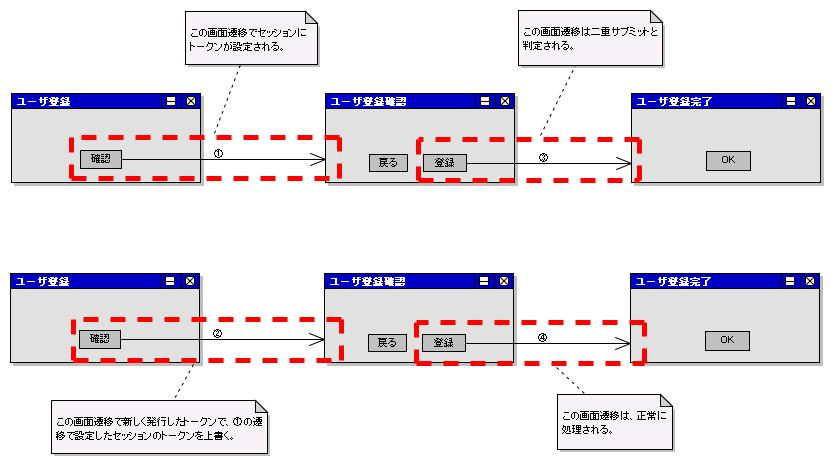

# ボタン又はリンクによるフォームのサブミット

## ボタン又はリンクによるフォームのサブミット

フォームのサブミット用カスタムタグ一覧。name属性はフォーム内で一意な名前、uri属性の指定方法は :ref:`WebView_SpecifyUri` を参照。

| カスタムタグ | 出力するHTMLタグ |
|---|---|
| :ref:`WebView_SubmitTag` | inputタグ(type=submit,button,image) |
| :ref:`WebView_ButtonTag` | buttonタグ |
| :ref:`WebView_SubmitLinkTag` | aタグ |
| :ref:`WebView_PopupSubmitTag` | inputタグ(type=submit,button,image) |
| :ref:`WebView_PopupButtonTag` | buttonタグ |
| :ref:`WebView_PopupLinkTag` | aタグ |
| :ref:`WebView_DownloadSubmitTag` | inputタグ(type=submit,button,image) |
| :ref:`WebView_DownloadButtonTag` | buttonタグ |
| :ref:`WebView_DownloadLinkTag` | aタグ |

- `popup`始まりタグ: 新しいウィンドウをオープンしてサブミット
- `download`始まりタグ: ダウンロード用サブミット

## ポップアップタグ

新しいウィンドウをオープンし、そのウィンドウに対してサブミットを行うタグ。入力項目のパラメータ名変更も可能。JavaScriptの`window.open`関数を使用する。

提供タグ:
- :ref:`WebView_PopupSubmitTag`
- :ref:`WebView_PopupButtonTag`
- :ref:`WebView_PopupLinkTag`

| 属性 | 説明 |
|---|---|
| popupWindowName | ポップアップのウィンドウ名（`window.open`第2引数）。未指定時は :ref:`WebView_CustomTagConfig` のデフォルト値を使用。デフォルト値もない場合は現在時刻（ミリ秒）をウィンドウ名に使用する。 |
| popupOption | ポップアップのオプション情報（`window.open`第3引数）。未指定時は :ref:`WebView_CustomTagConfig` のデフォルト値を使用（デフォルト値が設定されていない場合は何も指定しない）。 |

> **重要**: `popupWindowName` のデフォルト値を指定した場合は常に同じウィンドウ名を使用するため開かれるウィンドウが1つになる。デフォルト値を指定しない場合は常に異なるウィンドウ名を使用するため毎回新しいウィンドウが開く。

## changeParamNameタグ

ポップアップタグは元画面のフォームの全input要素を動的に追加してサブミットする。ポップアップ先のアクションと元画面のアクションでパラメータ名が一致しない場合に :ref:`WebView_ChangeParamNameTag` を使用してパラメータ名を変更する。

| 属性 | 必須 | 説明 |
|---|---|---|
| paramName | ○ | サブミット時に使用するパラメータの名前 |
| inputName | ○ | 変更元となる元画面のinput要素のname属性 |

JSPの例（郵便番号検索ポップアップ）:
```jsp
<n:popupButton name="searchAddress" uri="/action/SearchAction/RW11AB0101">
    検索
    <n:changeParamName inputName="users.postalCode" paramName="condition.postalCode" />
    <n:param paramName="condition.max" value="10" />
</n:popupButton>
```

上記ボタン選択時のリクエスト（郵便番号に"1234567"入力時）:
```
URI: <コンテキストパス>/action/SearchAction/RW11AB0101
condition.postalCode=1234567  # users.postalCode → パラメータ名変更
condition.max=10
users.xxxxx=xxxxx  # 元画面の他のinput要素（users.postalCodeは含まれない）
```

## オープンしたウィンドウへのアクセス

フレームワークはオープンしたウィンドウへの参照をJavaScriptグローバル変数に保持する（keyはウィンドウ名）:

```javascript
var nablarch_opened_windows = {};
```

元画面遷移時（onunload）に不要ウィンドウを閉じる実装例:
```javascript
onunload = function() {
  for (var key in nablarch_opened_windows) {
    var openedWindow = nablarch_opened_windows[key];
    if (openedWindow && !openedWindow.closed) {
      openedWindow.close();
    }
  }
  return true;
};
```

JavaScriptを使用して二重送信を防止する。以下のカスタムタグが対応している:
- :ref:`WebView_SubmitTag` (input type=submit,button,image)
- :ref:`WebView_DownloadSubmitTag` (input type=submit,button,image)
- :ref:`WebView_ButtonTag`
- :ref:`WebView_DownloadButtonTag`
- :ref:`WebView_SubmitLinkTag`
- :ref:`WebView_DownloadLinkTag`

## allowDoubleSubmission属性

| 属性 | 説明 |
|---|---|
| allowDoubleSubmission | 二重サブミットを許可するか（true=許可、false=防止）。デフォルト: true |

- falseを指定すると、1回目のサブミット時に対象要素のonclick属性を書き換え、2回目以降のサブミット要求はサーバに送信しない。
- ボタンの場合はdisabled属性を設定し、クリック不可状態にする。

```jsp
<n:submit cssClass="buttons" type="button" name="back" value="戻る"
          uri="./USERS00301" />
<n:submit cssClass="buttons" type="button" name="register" value="登録"
          uri="./USERS00302" allowDoubleSubmission="false" />
```

> **注意**: ブラウザの中止ボタン押下後はdisabled状態が続き再サブミット不可となる。他のボタン/リンクで処理を継続すること。

## コールバック関数

2回目以降のサブミット時、コールバック関数 `nablarch_handleDoubleSubmission` が存在すれば呼び出される。

```javascript
/**
 * @param element 二重サブミットが行われた対象要素（ボタン/リンク）
 */
function nablarch_handleDoubleSubmission(element) {
  // ここに処理を記述する。
}
```

<details>
<summary>keywords</summary>

n:submit, n:button, n:submitLink, n:popupSubmit, n:popupButton, n:popupLink, n:downloadSubmit, n:downloadButton, n:downloadLink, フォームサブミット, カスタムタグ一覧, WebView_SubmitTag, WebView_ButtonTag, WebView_SubmitLinkTag, WebView_PopupSubmitTag, WebView_PopupButtonTag, WebView_PopupLinkTag, WebView_DownloadSubmitTag, WebView_DownloadButtonTag, WebView_DownloadLinkTag, PopupSubmitTag, PopupButtonTag, PopupLinkTag, ChangeParamNameTag, popupWindowName, popupOption, paramName, inputName, nablarch_opened_windows, 複数ウィンドウ, ポップアップ, パラメータ名変更, window.open, WebView_ChangeParamNameTag, allowDoubleSubmission, nablarch_handleDoubleSubmission, 二重サブミット防止, disabled属性

</details>

## サブミット先の指定方法

uri属性にはコンテキストからの相対パスを指定する。

```jsp
<n:submit cssClass="buttons" type="button" name="back" value="戻る"
          uri="/action/management/user/UserAction/USERS00301" />
<n:submit cssClass="buttons" type="button" name="register" value="登録"
          uri="/action/management/user/UserAction/USERS00302" />
```

サブミット先URIはコンテキストパスを付加したパスになる。

> **警告**: 現在のURIからの相対パスを使用すると、想定外の画面遷移により不正なURIが組み立てられる場合がある。必ずコンテキストからの相対パスを指定すること。

## ダウンロードタグ

> **重要**: 通常の`submitタグ`でダウンロードを行うと、同じフォーム内の他のサブミットが機能しなくなる。ダウンロードを行うボタンやリンクには必ずダウンロードタグを使用すること。

ダウンロードタグは新しいフォームを作成してサブミットするため、画面内の既存フォームに影響を与えない。元画面のフォームの全input要素を動的に追加してサブミットする。パラメータ名変更（ :ref:`WebView_ChangeParamNameTag` ）も使用可能。

提供タグ:
- :ref:`WebView_DownloadSubmitTag`
- :ref:`WebView_DownloadButtonTag`
- :ref:`WebView_DownloadLinkTag`

## ダウンロードユーティリティ

| クラス名 | 説明 |
|---|---|
| `StreamResponse` | ストリームからHTTPレスポンスを生成。`java.io.File`または`java.sql.Blob`のダウンロードに使用。 |
| `DataRecordResponse` | データレコードからHTTPレスポンスを生成。`Map<String, ?>`型データ（`SqlRow`など）のダウンロードに使用。フォーマット定義ファイルでフォーマットされる。 |

**ファイルのダウンロード（StreamResponse使用例）:**

JSP:
```jsp
<n:downloadButton uri="./TempFile" name="tempFile">ダウンロード</n:downloadButton>
```

アクション:
```java
public HttpResponse doTempFile(HttpRequest request, ExecutionContext context) {
    File file = getTempFile();
    // 第2引数true: リクエスト処理終了時にファイルを削除（フレームワークが実施）
    StreamResponse response = new StreamResponse(file, true);
    response.setContentType("text/plain; charset=UTF-8");
    response.setContentDisposition(file.getName());
    return response;
}
```

**BLOB型カラムのダウンロード（StreamResponse使用例）:**

JSP:
```jsp
<n:downloadLink uri="./BlobColumn" name="blobColumn_${status.index}">
    <n:write name="record.fileName" />(<n:write name="fileId" />)
    <n:param paramName="fileId" name="fileId" />
</n:downloadLink>
```

アクション:
```java
public HttpResponse doBlobColumn(HttpRequest request, ExecutionContext context) {
    SqlRow record = getRecord(request);
    StreamResponse response = new StreamResponse((Blob) record.get("FILE_DATA"));
    response.setContentType("image/jpeg");
    response.setContentDisposition(record.getString("FILE_NAME"));
    return response;
}
```

**データレコードのダウンロード（DataRecordResponse使用例）:**

フォーマット定義（`N11AA001.fmt`というファイル名でプロジェクトで規定された場所に配置する）:
```
file-type:        "Variable"
text-encoding:    "Shift_JIS" # 文字列型フィールドの文字エンコーディング
record-separator: "\n"        # レコード区切り文字
field-separator:  ","         # フィールド区切り文字

[header]
1   messageId    N "メッセージID"
2   lang         N "言語"
3   message      N "メッセージ"

[data]
1   messageId    X # メッセージID
2   lang         X # 言語
3   message      N # メッセージ
```

JSP:
```jsp
<n:downloadSubmit type="button" uri="./CsvDataRecord"
                  name="csvDataRecord" value="ダウンロード" />
```

アクション:
```java
public HttpResponse doCsvDataRecord(HttpRequest request, ExecutionContext context) {
    SqlResultSet records = getRecords(request);
    // コンストラクタ引数: フォーマット定義のベースパス論理名, フォーマット定義のファイル名
    DataRecordResponse response = new DataRecordResponse("format", "N11AA001");
    // ヘッダー書き込み（フォーマット定義のデフォルト値使用のため空マップを指定）
    response.write("header", Collections.<String, Object>emptyMap());
    for (SqlRow record : records) {
        response.write("data", record);
    }
    response.setContentType("text/csv; charset=Shift_JIS");
    response.setContentDisposition("メッセージ一覧.csv");
    return response;
}
```

ブラウザの戻るボタン押下時に前画面を表示させないようにするには、:ref:`WebView_NoCacheTag` を使用する。キャッシュを防止したい画面のJSPのheadタグ内で指定する。

```jsp
<%-- headタグ内にnoCacheタグを指定する。 --%>
<head>
  <n:noCache/>
</head>
```

以下のレスポンスヘッダが返される:

```
Expires Thu, 01 Jan 1970 00:00:00 GMT
Cache-Control no-store, no-cache, must-revalidate, post-check=0, pre-check=0
Pragma no-cache
```

以下のHTMLが生成される（古いブラウザ対応のためmetaタグも含む）:

```html
<head>
  <meta http-equiv="pragma" content="no-cache">
  <meta http-equiv="cache-control" content="no-cache">
  <meta http-equiv="expires" content="0">
</head>
```

> **警告**: noCacheタグは `<n:include>(<jsp:include>)` でincludeされるJSPでは指定不可。必ずforwardされるJSPで指定すること。これはServlet API（`javax.servlet.RequestDispatcher#include`）の仕様で、「includeされたServlet（JSP）でヘッダへの値設定などは行えない」と定められているためである。

> **注意**: IE6/7/8でHTTP/1.0かつSSL(https)が適用されない通信では有効にならない。本機能を使用する画面は必ずSSL通信を適用すること。

> **警告**: システム全体でキャッシュ防止する場合は、実装漏れを防ぐためハンドラで一律設定すること（レスポンスヘッダに上記内容を設定する）。

<details>
<summary>keywords</summary>

uri属性, コンテキスト相対パス, サブミット先URI, 画面遷移, WebView_SpecifyUri, DownloadSubmitTag, DownloadButtonTag, DownloadLinkTag, StreamResponse, DataRecordResponse, ファイルダウンロード, BLOBダウンロード, CSVダウンロード, changeParamName, setContentDisposition, setContentType, WebView_DownloadSubmitTag, WebView_DownloadButtonTag, WebView_DownloadLinkTag, SqlRow, SqlResultSet, WebView_ChangeParamNameTag, WebView_NoCacheTag, noCacheタグ, キャッシュ防止, ブラウザの戻るボタン防止, Cache-Control, Pragma no-cache, SSL通信

</details>

## サブミットを制御するJavaScript関数

カスタムタグはJavaScriptでURIを組み立ててサブミットを実現する。画面内で1回だけ `nablarch_submit` 関数を出力する。

```javascript
/**
 * @param event イベントオブジェクト
 * @param element イベント元の要素(ボタン又はリンク)
 * @return 常にfalse（イベント伝搬停止）
 */
function nablarch_submit(event, element)
```

データベースコミットを伴う処理を要求する画面で使用する。クライアント側とサーバ側の2つの防止方法を**併用することを推奨**する。

| 防止方法 | 説明 | 単独使用時の問題 |
|---|---|---|
| リクエストの二重送信防止（クライアント側） | ダブルクリックやレスポンス待ち中の再クリックによる2回以上のリクエスト送信を防止 | 処理済みリクエストを重複して処理する恐れがある |
| 処理済みリクエストの受信防止（サーバ側） | ブラウザの戻るボタンなどで完了画面から確認画面に遷移して再サブミットした場合など、処理済みリクエストの受け付けを防止 | ダブルクリックで2回リクエストが送信された場合、ユーザに2回目（エラー）レスポンスのみ返され、1回目の処理結果が返らない |

サーバ側(セッション)とクライアント側(hiddenタグ)に一意なトークンを保持し、サーバ側で突合することで実現する。トークンは1回のチェックのみ有効。

> **注意**: 同一業務を複数ウィンドウで並行操作した場合、後に確認画面に遷移したウィンドウのみ有効。先に確認画面に遷移したウィンドウはトークンが古いため二重サブミット判定される。別々の業務を複数ウィンドウで並行操作する場合は問題なし。



## a) トークンの設定

### a.1) useToken属性

:ref:`WebView_FormTag` のuseToken属性でトークンを発行・設定する。

```jsp
<n:form useToken="true">
```

| 属性 | 説明 |
|---|---|
| useToken | トークンを設定するか（true/false）。デフォルト: false。confirmationPageタグが指定された場合はデフォルトがtrueとなる（:ref:`WebView_InputConfirmationCommon` 参照）。 |

同一画面内の複数formタグでuseToken=trueを指定した場合、最初に発行されたトークンを全formタグで使用する。

### a.2) TokenGeneratorのカスタマイズ

`TokenGenerator` インタフェースを実装してリポジトリに"tokenGenerator"という名前で登録することで変更可能。デフォルト実装: `RandomTokenGenerator`（16文字のランダム文字列）。

## b) トークンのチェック

### b.1) OnDoubleSubmissionアノテーション

**アノテーション**: `@OnDoubleSubmission`

```java
@OnDoubleSubmission(path = "forward://MENUS00103", messageId = "MSG00022")
public HttpResponse doUSERS00302(HttpRequest req, ExecutionContext ctx) {
    // 省略。
}
```

| 属性 | デフォルト | 説明 |
|---|---|---|
| path | | 二重サブミット判定時の遷移先リソースパス |
| messageId | | 遷移先画面に表示するエラーメッセージのメッセージID |
| statusCode | 400 | レスポンスステータス |

### b.2) DoubleSubmissionHandlerのカスタマイズ

`DoubleSubmissionHandler` インタフェースを実装してリポジトリに"doubleSubmissionHandler"という名前で登録することでアノテーションの振る舞いを変更可能。デフォルト実装: `nablarch.common.web.token.BasicDoubleSubmissionHandler`。

アプリケーション全体のデフォルト値を設定する場合は、`BasicDoubleSubmissionHandler` をリポジトリに登録する:

```xml
<component name="doubleSubmissionHandler"
           class="nablarch.common.web.token.BasicDoubleSubmissionHandler">
    <property name="messageId" value="MSG00022" />
    <property name="statusCode" value="200" />
</component>
```

| プロパティ名 | 説明 |
|---|---|
| path | 二重サブミット判定時の遷移先リソースパス（アノテーション個別指定がない場合に使用） |
| messageId | 遷移先画面のエラーメッセージID（アノテーション個別指定がない場合に使用） |
| statusCode | レスポンスステータス（デフォルト: 400）（アノテーション個別指定がない場合に使用） |

> **警告**: アノテーションとBasicDoubleSubmissionHandlerのどちらにもpath属性の指定がない場合、遷移先不明でシステムエラーになる。トークンを使用した二重サブミット防止機能を使用する場合、必ずどちらか一方でpath属性を指定すること。

<details>
<summary>keywords</summary>

nablarch_submit, JavaScript関数, サブミット制御, フォームサブミットJavaScript, 二重サブミット防止, リクエストの二重送信防止, 処理済みリクエストの受信防止, ダブルクリック防止, prevent_double_submission, 二重サブミット, OnDoubleSubmission, useToken, TokenGenerator, RandomTokenGenerator, BasicDoubleSubmissionHandler, DoubleSubmissionHandler, path, messageId, statusCode, トークン, WebView_FormTag, nablarch.common.web.token.BasicDoubleSubmissionHandler, confirmationPageタグ

</details>

## アプリケーションでonclick属性を指定する場合の制約

onclick属性の指定有無による動作の違い:
- **onclick未指定**: カスタムタグが自動でonclick属性に `nablarch_submit` を設定
- **onclick指定**: カスタムタグは `nablarch_submit` を設定しない → アプリ側のJavaScript内で明示的に呼び出す必要あり

onclick指定時の実装例（サブミット前に確認ダイアログ表示）:

```javascript
function popUpConfirmation(event, element) {
    if (window.confirm("登録します。よろしいですか？")) {
        // OK: フレームワークのJavaScript関数を明示的に呼び出す
        return nablarch_submit(event, element);
    } else {
        // キャンセル
        return false;
    }
}
```

```jsp
<n:submit cssClass="buttons" type="button" name="register" value="登録"
          uri="./USERS00302" onclick="return popUpConfirmation(event, this);" />
```

<details>
<summary>keywords</summary>

onclick属性, nablarch_submit呼び出し, 確認ダイアログ, popUpConfirmation, onclick制約

</details>

## アプリケーションでformタグのname属性を指定する場合の制約

`nablarch_submit` はformタグのname属性でサブミット対象フォームを特定する。

- **name属性未指定時**: `nablarch_form<連番>` 形式で自動生成（連番は画面内でformタグの出現順に1から付番）
- **name属性指定時**: 画面内で一意な名前を指定すること

> **警告**: formタグのname属性はJavaScriptの変数名構文に従うこと。
> - 先頭は英字
> - 先頭以降は英数字またはアンダーバー

<details>
<summary>keywords</summary>

formタグname属性, nablarch_form, JavaScript変数名構文, フォーム識別, name属性自動生成

</details>

## ボタン又はリンク毎にパラメータを変更する方法

一覧→詳細遷移など、同一フォーム内の複数ボタン/リンクで異なるパラメータを送信する場合は :ref:`WebView_ParamTag` を使用する。

**n:paramタグの属性**:
- `paramName`: リクエスト送信時のパラメータ名
- `value`: 直接値を指定
- `name`: リクエストスコープなどのオブジェクトを参照

```jsp
<n:form>
    <c:forEach var="user" items="${searchResult}" varStatus="status">
    <tr>
        <td>
            <n:submitLink uri="./R0001" name="R0001_${status.index}">
                <n:write name="user.id"/>
                <n:param paramName="sampleId" name="user.id" />
            </n:submitLink>
        </td>
    </tr>
    </c:forEach>
</n:form>
```

変更パラメータは `nablarch_hidden` パラメータに格納され、NablarchTagHandlerが処理する。**変更パラメータ使用時はNablarchTagHandlerの設定が必須**（設定方法は :ref:`WebView_NablarchTagHandler` を参照）。

> **警告**: 変更パラメータ数に応じてリクエストデータ量が増大する。一覧→詳細遷移ではプライマリキーのみにするなど、変更パラメータは必要最小限にすること。

<details>
<summary>keywords</summary>

n:param, 変更パラメータ, NablarchTagHandler, paramName, nablarch_hidden, WebView_ParamTag, WebView_NablarchTagHandler, ボタン毎パラメータ変更, WebView_ChangeableParams

</details>

## 認可判定と開閉局判定の結果に応じた表示切り替え

サブミットタグに指定されたリクエストIDに対して認可判定と開閉局判定を行い、結果に応じてボタン/リンクの表示を切り替える。対応するハンドラ（[認可](libraries-04_Permission.md)、:ref:`開閉局<serviceAvailable>`）がハンドラ構成に含まれる場合のみ有効。

**表示方法（3パターン）**:

| 表示方法 | 説明 |
|---|---|
| NODISPLAY（非表示） | タグを表示しない |
| DISABLED（非活性） | ボタン: disabled属性を有効化。リンク: ラベルのみ表示（aタグなし）または非活性リンク描画用JSPをインクルード（:ref:`WebView_CustomTagConfig` の `submitLinkDisabledJsp` で指定した場合。プロジェクト毎に表示方法をカスタマイズ可能） |
| NORMAL（通常表示） | 表示切り替えを行わない |

- デフォルトの表示方法は :ref:`WebView_CustomTagConfig` で設定
- 個別に変更する場合は各タグの `displayMethod` 属性に指定

```jsp
<%-- このタグは常に表示する。 --%>
<n:submit displayMethod="NORMAL" type="button" name="login"
          value="ログイン" uri="/LoginAction/LOGIN001" />
```

> **注意**: アプリ全体を非活性/非表示設定にした場合、ログインボタンなど認可前に使用するボタンも制御される。常に表示したいボタンには個別に `displayMethod="NORMAL"` を指定すること。

**判定処理の変更**: `nablarch.common.web.tag.DisplayControlChecker` インタフェースを実装し、:ref:`WebView_CustomTagConfig` の `displayControlCheckers` プロパティに設定する。

```xml
<list name="displayControlCheckers">
    <component class="nablarch.common.web.tag.ServiceAvailabilityDisplayControlChecker" />
    <component class="nablarch.common.web.tag.PermissionDisplayControlChecker" />
</list>

<component name="customTagConfig"
           class="nablarch.common.web.tag.CustomTagConfig">
    <property name="displayControlCheckers" ref="displayControlCheckers" />
</component>
```

<details>
<summary>keywords</summary>

displayMethod, NODISPLAY, DISABLED, NORMAL, DisplayControlChecker, ServiceAvailabilityDisplayControlChecker, PermissionDisplayControlChecker, CustomTagConfig, 認可判定, 開閉局判定, displayControlCheckers, submitLinkDisabledJsp

</details>
