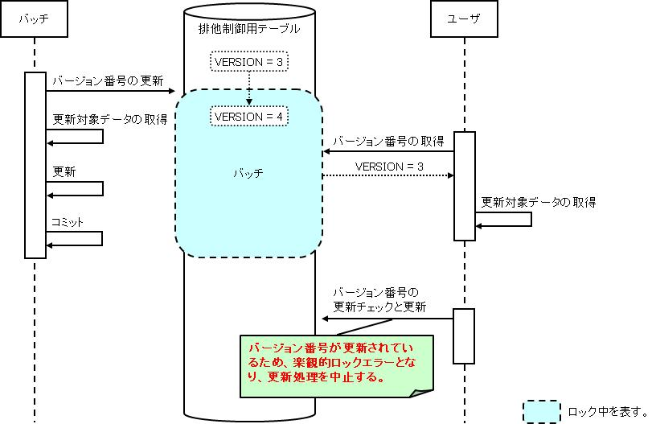
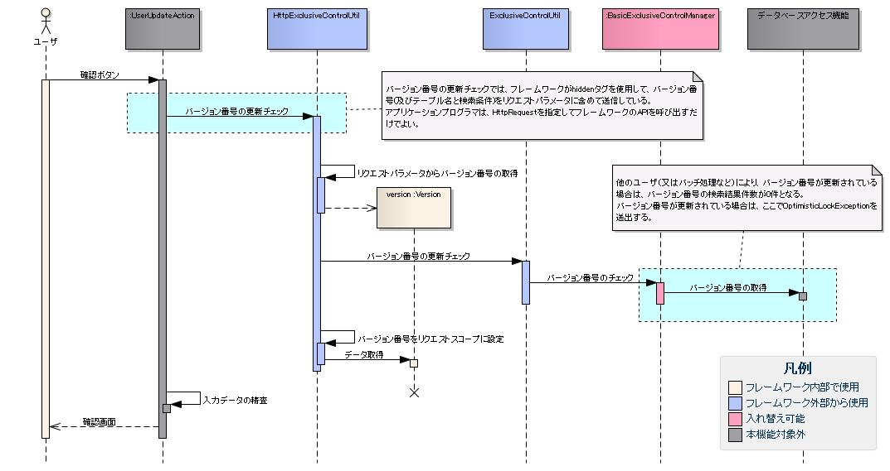

# 排他制御機能

## 概要

データベースに格納したデータに対する排他制御機能。複数ユーザ（または複数バッチ）が同一データを同時更新することを防止する。

悲観的ロックと楽観的ロックの2種類を提供する。

| 手法 | 説明 | 使用場面 |
|---|---|---|
| 悲観的ロック | データ検索から更新までロックを取得し続け、更新完了でロックを解除する。ロック取得時間は長いが更新処理は確実に成功する | 検索から更新が1トランザクション（バッチ処理など）、または更新処理を失敗させたくない場合 |
| 楽観的ロック | 検索時はロックを取得せず、更新時に他処理による更新をチェックし、更新済みなら更新を中止する | 検索時にロックを取得したくない画面処理（ユーザの操作待ち時間を少なくしたい場合） |

排他制御の実装は `HttpExclusiveControlUtil` を使用する。

**バージョン番号の準備 (`prepareVersion`)**

**メソッド**:
- `boolean prepareVersion(ExecutionContext context, ExclusiveControlContext exclusiveControlContext)`
- `boolean prepareVersions(ExecutionContext context, List<? extends ExclusiveControlContext> exclusiveControlContexts)`

取得したバージョン番号は、フレームワークにより、指定された `ExecutionContext` に自動的に設定される。これにより、後続の更新チェック処理でリクエストからバージョン番号を取り出せるようになる。

> **注意**: 排他制御用テーブルに主キーに合致するデータが存在しない場合（排他制御対象のデータが物理削除された場合など）はfalseを返す。バージョン番号が存在しない場合の処理を共通化する場合は、`HttpExclusiveControlUtil` のラッパクラスを作成する。

バージョン番号が存在しない場合に共通メッセージを表示させる `CommonExclusiveControlUtil` ラッパクラスの実装例:

```java
public final class CommonExclusiveControlUtil {

    public static void prepareVersion(ExecutionContext context, ExclusiveControlContext exclusiveControlContext) {

        if (HttpExclusiveControlUtil.prepareVersion(context, exclusiveControlContext)) {
            // バージョン番号を準備できた場合は何もしない。
            return;
        }

        // バージョン番号を準備できなかった場合は共通メッセージを指定したApplicationExceptionを送出する。
        Message message = MessageUtil.createMessage(MessageLevel.ERROR, "M001101");
        throw new ApplicationException(message);
    }
}
```

```java
HttpExclusiveControlUtil.prepareVersion(context, new UsersExclusiveControl(user.getUserId()));
```

**バージョン番号の更新チェック (`checkVersions`)**

バージョン番号はフレームワークにより指定された `HttpRequest` から自動的に取得される。バージョン番号が更新されている場合は `OptimisticLockException` が送出される。`@OnErrors` / `@OnError(type = OptimisticLockException.class, path = "...")` で遷移先を指定する。

```java
HttpExclusiveControlUtil.checkVersions(request, context);
```

**バージョン番号の更新チェックと更新 (`updateVersionsWithCheck`)**

バージョン番号はフレームワークにより指定された `HttpRequest` から自動的に取得される。

```java
HttpExclusiveControlUtil.updateVersionsWithCheck(request);
```

**一括更新処理における更新チェック（単一主キー）**

更新対象レコードのみに更新チェックを行う場合、チェックボックスのリクエストパラメータ名を引数に指定する。

> **注意**: チェックボックスのvalue値には更新対象レコードの主キーを指定する。

```java
// 更新チェック
HttpExclusiveControlUtil.checkVersions(request, context, "user.deactivate");
// 更新チェックと更新
HttpExclusiveControlUtil.updateVersionsWithCheck(request, "user.deactivate");
```

**一括更新処理における更新チェック（複合主キー）**

複合主キーの場合は `checkVersion()` / `updateVersionWithCheck()`（sなし・主キークラスを引数に取る）をレコードごとに繰り返し呼び出す。`ExclusiveControlContext` を継承した主キークラスを定義する。

主キークラス（`UsersExclusiveControl`）の実装例:

```java
// ExclusiveControlContextを継承する。
public class UsersExclusiveControl extends ExclusiveControlContext {

    // 排他制御用テーブルの主キーは列挙型で定義する。
    private enum PK { USER_ID, PK2, PK3 }

    // 主キーの値をとるコンストラクタを定義する。
    public UsersExclusiveControl(String userId, String pk2, String pk3) {

        setTableName("USERS");

        setVersionColumnName("VERSION");

        setPrimaryKeyColumnNames(PK.values());

        // 親クラスのappendConditionメソッドで主キーの値を追加する。
        appendCondition(PK.USER_ID, userId);
        appendCondition(PK.PK2, pk2);
        appendCondition(PK.PK3, pk3);
    }
}
```

> **注意**: チェックボックスのvalue値には主キーを区切り文字（主キーの値にはなり得ない任意の文字）で結合した文字列を指定する。formクラスには、リクエストパラメータから主キーを取り出す処理を実装する。

```java
// 更新チェック
for (User deletedUser : deletedUsers) {
    HttpExclusiveControlUtil.checkVersion(request, context,
        new UsersExclusiveControl(deletedUser.getUserId(), deletedUser.getPk2(), deletedUser.getPk3()));
}
// 更新チェックと更新
for (User deletedUser : deletedUsers) {
    HttpExclusiveControlUtil.updateVersionWithCheck(request,
        new ExclusiveUserCondition(deletedUser.getUserId(), deletedUser.getPk2(), deletedUser.getPk3()));
}
```

<details>
<summary>keywords</summary>

排他制御, 悲観的ロック, 楽観的ロック, 同時更新防止, 複数ユーザ, バッチ処理, HttpExclusiveControlUtil, ExclusiveControlContext, UsersExclusiveControl, OptimisticLockException, ApplicationException, @OnError, @OnErrors, prepareVersion, checkVersions, updateVersionsWithCheck, checkVersion, updateVersionWithCheck, CommonExclusiveControlUtil, ExclusiveUserCondition, バージョン番号準備, 一括更新処理, 複合主キー

</details>

## 特徴

排他制御に必要なDBアクセスや、楽観的ロックに使用するバージョン番号の画面間引き継ぎ処理をフレームワークが担当する。排他制御機能の実装はフレームワークAPIの呼び出しのみに集約され、実装負荷が軽減される。

排他制御機能を使用するには、リポジトリに `exclusiveControlManager` というコンポーネント名で `ExclusiveControlManager` インタフェースを実装したクラスを登録する。

**クラス**: `nablarch.common.exclusivecontrol.BasicExclusiveControlManager`（デフォルト実装）

`OptimisticLockException` は `ApplicationException` を継承しており、`n:errors` タグを使用して画面上にエラーメッセージを表示できる。

> **注意**: 楽観ロックエラーメッセージはアプリケーションで1つのみ指定可能。機能ごとにメッセージを変えたい場合は、アクションで `OptimisticLockException` をキャッチして例外処理を実装する。

```xml
<component name="exclusiveControlManager"
           class="nablarch.common.exclusivecontrol.BasicExclusiveControlManager">
    <property name="optimisticLockErrorMessageId" value="CUST0001" />
</component>
```

**ExclusiveControlManager 設定属性**

| 属性値 | 必須 | 設定内容 |
|---|---|---|
| name | ○ | `"exclusiveControlManager"`（変更不可） |
| class | ○ | `nablarch.common.exclusivecontrol.BasicExclusiveControlManager`。独自実装の場合は `ExclusiveControlManager` を実装したクラスを指定。 |

**BasicExclusiveControlManager プロパティ**

| プロパティ名 | 必須 | 説明 |
|---|---|---|
| optimisticLockErrorMessageId | ○ | 楽観ロックエラーメッセージID |

<details>
<summary>keywords</summary>

排他制御, 実装負荷軽減, バージョン番号, フレームワーク自動処理, BasicExclusiveControlManager, ExclusiveControlManager, optimisticLockErrorMessageId, exclusiveControlManager, OptimisticLockException, ApplicationException, n:errors, 排他制御設定, 楽観ロックエラーメッセージ

</details>

## 要求

実装済みの要求:
- 複数ユーザ（画面）が同一データを同時更新することを防ぐ
- 複数バッチが同一データを同時更新することを防ぐ
- バッチとユーザ（画面）が同一データを同時更新することを防ぐ

<details>
<summary>keywords</summary>

排他制御, 複数ユーザ, 複数バッチ, 同時更新防止

</details>

## 排他制御用テーブル

排他制御対象データにバージョン番号カラムを追加することで実現する。バージョン番号カラムが定義されたテーブルを「排他制御用テーブル」と呼ぶ。

- 悲観的ロックと楽観的ロックは同じ排他制御用テーブルを使用するため、並行使用しても同一データの同時更新を防止できる
- 排他制御用テーブルは排他制御を行う単位ごとに定義する
- 競合が許容される最大の単位で定義することを推奨。ロック範囲を広げると更新処理が競合しやすくなり、処理遅延や更新失敗（楽観的ロック）を招く

設計指針:
- 業務的観点: 関連する処理（例: 売上処理と入金処理）をまとめた単位で定義する
- テーブル設計の観点: 親子関係が明確な場合（ヘッダ部と明細部など）は親の単位で定義する

バージョン番号カラム付きテーブルの例（カラム名・データ型は任意）:

```sql
CREATE TABLE USERS (
    USER_ID CHAR(6) NOT NULL,
    VERSION NUMBER(10) NOT NULL,
    PRIMARY KEY (USER_ID)
)
```

> **注意**: 排他制御専用テーブル（業務データテーブルと別テーブル）を使用する場合、業務データの追加・物理削除時に専用テーブルへの同様の操作も必要。`ExclusiveControlUtil` クラスがデータ追加・物理削除のAPIを提供する。

## 更新順序の設計

デッドロック防止のため各テーブルのロック順序を定める。RDBMSはレコード更新時に自動的にロックをかけるため、更新順序を定めないとデッドロックが発生しやすい。

> **注意**: 排他制御用テーブルに限らず個別テーブルも更新順序を決める。複数の排他制御を行う場合は排他制御の実行順序も決める（例: ユーザ排他制御→残高排他制御）。

一括削除など複数件を順次更新する場合は主キーのソート順を決めること（デッドロック防止）。ただし、コミット間隔が1件であることが保証されていて、かつソート処理の性能影響が大きい場合はソート不要。

<details>
<summary>keywords</summary>

排他制御用テーブル, バージョン番号カラム, デッドロック防止, 更新順序, ExclusiveControlUtil, 排他制御専用テーブル, ロック範囲

</details>

## 悲観的ロックと楽観的ロックの動作イメージ

**悲観的ロック**: 更新対象データ取得前に排他制御用テーブルのバージョン番号を更新することでロックを取得する。トランザクションのコミット/ロールバックまでロックが継続し、他の処理はロック解除まで待機する。

**楽観的ロック**: データ取得時にバージョン番号を取得し、更新時に事前取得のバージョン番号が変更されていないかチェックする。変更されていた場合は更新を中止する。

> **注**: 以下の図では、バッチは悲観的ロック、ユーザは楽観的ロックを使用して更新処理を行うものとする。


並行使用時の動作イメージ:




<details>
<summary>keywords</summary>

悲観的ロック動作, 楽観的ロック動作, バージョン番号更新, ロック取得, 動作イメージ, 排他制御用テーブル, 並行使用

</details>

## 構造

クラス図:


**クラス**: `nablarch.common.exclusivecontrol.ExclusiveControlManager`, `nablarch.common.exclusivecontrol.BasicExclusiveControlManager`, `nablarch.common.exclusivecontrol.ExclusiveControlUtil`, `nablarch.common.exclusivecontrol.ExclusiveControlContext`, `nablarch.common.exclusivecontrol.OptimisticLockException`, `nablarch.common.exclusivecontrol.Version`, `nablarch.common.exclusivecontrol.ExclusiveControlTable`, `nablarch.common.web.exclusivecontrol.HttpExclusiveControlUtil`

<details>
<summary>keywords</summary>

クラス図, ExclusiveControlManager, ExclusiveControlUtil, HttpExclusiveControlUtil, ExclusiveControlContext

</details>

## インタフェース定義

**インタフェース**: `nablarch.common.exclusivecontrol.ExclusiveControlManager`

排他制御（悲観的ロック・楽観的ロック）を管理するインタフェース。排他制御用テーブルを使用した排他制御機能、および排他制御用テーブルへの行データ追加・削除機能を提供する。各プロジェクトで独自の実装が必要な場合（SQL文を変更するなど）は本インタフェースを実装することで実現できる。

<details>
<summary>keywords</summary>

ExclusiveControlManager, nablarch.common.exclusivecontrol.ExclusiveControlManager, 排他制御インタフェース, カスタム実装

</details>

## クラス定義

| クラス名 | 概要 |
|---|---|
| `nablarch.common.exclusivecontrol.BasicExclusiveControlManager` | `ExclusiveControlManager` の基本実装クラス |
| `nablarch.common.exclusivecontrol.ExclusiveControlUtil` | 排他制御機能のユーティリティクラス。バッチ処理での悲観的ロック、および排他制御用テーブルへのデータ追加・物理削除に使用する。操作は `ExclusiveControlManager` に委譲する |
| `nablarch.common.exclusivecontrol.ExclusiveControlContext` | 排他制御の実行に必要な情報（テーブルスキーマ情報と主キー条件）を保持するクラス |
| `nablarch.common.exclusivecontrol.OptimisticLockException` | 楽観的ロックでバージョン番号が更新されている場合に発生する例外クラス |
| `nablarch.common.exclusivecontrol.Version` | 排他制御用テーブルのバージョン番号を保持するクラス |
| `nablarch.common.exclusivecontrol.ExclusiveControlTable` | 排他制御用テーブルのスキーマ情報とSQL文を保持するクラス。アクセスした情報をメモリ上にキャッシュする際に使用する |
| `nablarch.common.web.exclusivecontrol.HttpExclusiveControlUtil` | 画面処理における排他制御（楽観的ロック）のユーティリティクラス |

**主キークラス（`ExclusiveControlContext` のサブクラス）**: 排他制御用テーブルに対応して作成するクラス（設計書からの自動生成を想定）。バージョン番号検索に必要な情報を提供する。

```java
public class UsersExclusiveControl extends ExclusiveControlContext {
    private enum PK { USER_ID }

    public UsersExclusiveControl(String userId) {
        setTableName("USERS");                 // テーブル名
        setVersionColumnName("VERSION");        // バージョン番号カラム名
        setPrimaryKeyColumnNames(PK.values()); // 主キー列挙型
        appendCondition(PK.USER_ID, userId);   // 主キー値
    }
}
```

<details>
<summary>keywords</summary>

BasicExclusiveControlManager, ExclusiveControlUtil, ExclusiveControlContext, OptimisticLockException, Version, ExclusiveControlTable, HttpExclusiveControlUtil, 主キークラス, UsersExclusiveControl, nablarch.common.exclusivecontrol, nablarch.common.web.exclusivecontrol

</details>

## 悲観的ロック

`ExclusiveControlUtil.updateVersion()` を呼び出すことで実現する。更新対象データを取得する前に呼び出し、排他制御用テーブルの対象データをロックする。

```java
ExclusiveControlUtil.updateVersion(new UsersExclusiveControl("U00001"));
```

> **注意**: バッチ処理で複数件更新する場合は、ロック時間を最小化して並列処理への影響を極小化すること。具体的には、前処理でロック対象の主キーのみを取得し、本処理で1件ずつ「ロック取得→データ取得→更新」の順に実装する。

<details>
<summary>keywords</summary>

ExclusiveControlUtil, updateVersion, 悲観的ロック実装, 排他制御, バッチ処理

</details>

## 楽観的ロック

楽観的ロックは以下の3メソッドで実現する（`HttpExclusiveControlUtil` クラス）:

1. **`prepareVersion()`**: バージョン番号の準備。排他制御用テーブルのバージョン番号を取得する。
2. **`checkVersions()`**: バージョン番号の更新チェック。画面間でバージョン番号を引き継ぐために必要。
3. **`updateVersions()`**: バージョン番号の更新チェックと更新。

> **注意**: `checkVersions()` を呼び出さないと画面間でバージョン番号が引き継がれない。

シーケンス図:





<details>
<summary>keywords</summary>

HttpExclusiveControlUtil, prepareVersion, checkVersions, updateVersions, 楽観的ロック実装, バージョン番号, シーケンス

</details>
