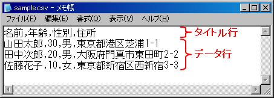

## 汎用データフォーマット機能

本機能は、EDI等で利用される多様なデータ形式に対応する汎用の入出力ライブラリである。
本フレームワークの中で、システム間通信、バッチ処理におけるデータファイルの読み書き、ファイルアップロード処理など、
様々な場面で使用される。

-----

-----

-----

### 基本構造

本機能では、データ形式の定義情報を **フォーマット定義ファイル** と呼ばれるファイルに記述する。
フレームワークはそれをもとにデータソースに対するレコードの読み書きを行う。

このファイルには、レコード内のフィールドのレイアウトやデータ型に関する情報だけでなく、
パディング・トリミング処理など、入出力の際の事前処理の実行定義についても指定できる。
これにより、データ入出力に係わるほとんどの処理をフレームワーク側で行うことができる。

プログラム側では、パース/シリアライズ処理はじめとする定型処理の一切を記述する必要は無く、
データソース上のレコードを単なるMapオブジェクトとして扱うことができる。

> **Note:**
> なお、別添のツールを使用することで、 データファイルや電文の形式を定義した各種仕様書から
> **フォーマット定義ファイル** を生成することが可能である。

以下は、本機能のおおまかな構造を表した図である。


この図が示すように、本機能は3つの要素から成り立つ。

**1. フォーマット定義ファイル**

その名の通り、データのフォーマット定義を記述したファイルである。
アプリケーションプログラマが作成するのは基本的にこのファイルだけである。

**2. レコードフォーマッター**

フォーマット定義ファイルの内容に沿って、実際にデータの読み書きを行うオブジェクトである。
入力ストリームからのレコードの読み込みと、出力ストリームに対するレコードの出力が可能である。
読み込んだレコードは、各フィールド名をキーとするMapオブジェクトとして取得できる。
また逆に、Mapインターフェースを実装した任意のオブジェクトをレコードとして出力できる。

**3. レコードフォーマッターファクトリ**

フォーマット定義ファイルを解析し、その内容に従ってレコードフォーマッターを生成するクラス。
フレームワークによって提供される。
レコードフォーマッターの機能を拡張する場合は、このファクトリに対して拡張機能を実装したクラスを設定する。

### 使用例

本機能を利用するには、まずフォーマット定義ファイルを作成する (もしくは、定義書から自動生成する) 必要がある。
以下は、フォーマット定義ファイルの例である。

```bash
#
# ディレクティブ定義部
#
file-type:     "Fixed"  # 固定長ファイル
text-encoding: "ms932"  # 文字列型フィールドの文字エンコーディング
record-length:  120     # 各レコードbyte長

#
# データレコード定義部
#
[Default]
1    dataKbn       X(1)  "2"      # 1. データ区分
2    FIcode        X(4)           # 2. 振込先金融機関コード
6    FIname        X(15)          # 3. 振込先金融機関名称
21   officeCode    X(3)           # 4. 振込先営業所コード
24   officeName    X(15)          # 5. 振込先営業所名
39  ?tegataNum     X(4)  "9999"   # (手形交換所番号)
43   syumoku       X(1)           # 6. 預金種目
44   accountNum    X(7)           # 7. 口座番号
51   recipientName X(30)          # 8. 受取人名
81   amount        X(10)          # 9. 振込金額
91   isNew         X(1)           # 10.新規コード
92   ediInfo       X(20)          # 11.EDI情報
112  transferType  X(1)           # 12.振込区分
113  withEdi       X(1)  "Y"      # 13.EDI情報使用フラグ
114 ?unused        X(7)  pad("0") # (未使用領域)
```

この定義に沿って実際にデータの読み書きを行うには、
レコードフォーマッター ([DataRecordFormatter](../../javadoc/nablarch/core/dataformat/DataRecordFormatter.html)) のインスタンスを作成する。

```java
// 上掲のフォーマットファイルがワーキングディレクトリ直下に、
// ファイル名 "test.fmt" で保存されているとする。
File formatFile = new File("./test.fmt");

// フォーマットファイルをファクトリに設定し、レコードフォーマッターを作成する。
DataRecordFormatter formatter = FormatterFactory
                               .getInstance()
                               .createFormatter(formatFile);
```

以下では、作成したフォーマッターを利用し、データファイルの内容を読み込んでいる。

```java
// データソース(この場合はファイル) からの入力ストリームを取得する。
InputStream in = new FileInputStream("./data.dat");

// 入力ストリームをフォーマッターに接続する。
formatter.setInputStream(in)
         .initialize();

List<Map<String, Object>> records = new ArrayList<Map<String, Object>>();

while (formatter.hasNext()) {
  // 入力ストリームから1レコード分を読み込む。
  records.add(formatter.readRecord());
}
```

次の例では、同じフォーマッターを使用して、データファイルにレコードを出力(追加)している。

```java
// データソース(この場合はファイル) に対する出力ストリームを取得する。
OutputStream out = new FileOutputStream("./data.dat");

// 出力ストリームをフォーマッターに接続する。
formatter.setOutputStream(out)
         .initialize();

// 新規レコードを出力ストリームに書き込む。
formatter.writeRecord(new HashMap() {{
    put("FIcode",     "9999");
    put("FIname",     "ﾅﾌﾞﾗｰｸｷﾞﾝｺｳ");
    put("officeCode", "111");
    /*
     * (後略)
     */
}});
```

### フォーマット定義ファイルの書式

この節では、フォーマット定義ファイルの構文定義と、機能について解説する。

**1. 全体構造**

フォーマット定義ファイルは、以下の2つの部分で構成される。

1. ディレクティブ宣言部

使用するデータ形式(固定長 or 可変長)、文字列フィールドが使用するエンコーディングといった、
共通設定を記述する。

1. レコードフォーマット定義部

レコード内の各フィールドの開始位置やデータ型、変換処理などの定義を記述する。
後述するマルチフォーマット形式では、複数のレコードフォーマットを定義し、
条件に従って使用するフォーマットを動的に切り替えることができる。

**2. 行末コメント**

フォーマット定義ファイル中の **#** から行末までの文字列はコメントとして扱われる。
**(以下の構文解説において行末コメントに関する記述は省略するが、任意の行で使用できる。)**

**3. 文字コード**

デフォルト設定では、フォーマット定義ファイルの文字コードはUTF-8である。
特段の理由が無ければUTF-8で作成すること。
他の文字コードを使用する場合は、 **フォーマッターファクトリ** に対して設定を追加すること。

**4. リテラル表記**

設定値として、リテラル定数を指定する場合は、以下の記法に従う。

| リテラル型 | 例 | 備考 |
|---|---|---|
| 文字列 | "Nablarch", "ナブラーク", "\\r\\n" | Javaの文字リテラルと同じ仕様。 ただし、\\Uxxxx のUnicodeエスケープについてはサポートしない。 |
| 10進整数 | 0, 123, -456, +78 | 小数は不可。 |
| 真偽値 | true, false, TRUE, FALSE |  |

**5. 任意識別子**

後述する [レコードタイプ名]、[フィールド名]等の名称には、以下の正規表現に合致する文字列を使用する必要がある。
(ASCII範囲でのJavaの識別子定義と同じ)

```javascript
/[a-zA-Z_$][a-zA-Z0-9_$]*/
```

**6. ディレクティブ宣言部**

ディレクティブ宣言部には、データ形式全体に影響を及ぼす設定(ディレクティブ)を記述する。

(ディレクティブ定義例の記述例)

```bash
#
# ディレクティブ定義部
#
file-type:     "Fixed"  # 固定長ファイル
text-encoding: "ms932"  # 文字列型フィールドの文字エンコーディング
record-length:  120     # 各レコードbyte長
```

各ディレクティブの書式は以下で定義される。

```bash
[ディレクティブ定義] = [ディレクティブ名] + ":" + [ディレクティブ値(リテラル)]  + [改行]
```

指定可能なディレクティブの一覧は以下の通り。

**(共通ディレクティブ)**

| ディレクティブ名 | 内容 |
|---|---|
| **file-type** | データ形式を指定する。以下のいずれかを指定する。(必須指定)  固定長データ形式  可変長データ形式 |
| **text-encoding** | 文字列フィールドの読み書きで使用するエンコーディング。(必須指定) JDKで利用可能な文字エンコーディング名を指定する。 ("UTF-8"、"SJIS"、"MS932" など) |
| **record-separator** | レコード終端文字列を指定する。 可変長データ形式では必須指定であり、レコードの終端を判断する為の文字列として使用する。 固定長データ形式で指定した場合は、各レコードの直後に付加される文字列として扱う。 (コード終端文字列のバイト長は **record-length** に含まれない。) |

**(固定長データ形式でのみ指定可能なディレクティブ)**

| ディレクティブ名 | 内容 |
|---|---|
| **record-length** | 1レコードのバイト長を指定する。(必須指定) |
| **positive-zone-sign-nibble** | 符号付きゾーン数値の符号Nibbleの値。 デフォルトでは **text-encoding** の値に応じて以下の設定となる。  **ASCII互換の文字エンコーディング(UTF-8、SJISなど)**  * (正) 0x3 * (負) 0x7  **EBCDIC互換の文字エンコーディング**  * (正) 0xC * (負) 0xD |
| **negative-zone-sign-nibble** |  |
| **positive-pack-sign-nibble** | 符号付きパック数値の符号Nibbleの値。 デフォルトでは **text-encoding** の値に応じて以下の設定となる。  **ASCII互換の文字エンコーディング(UTF-8、SJISなど)**  * (正) 0x3 * (負) 0x7  **EBCDIC互換の文字エンコーディング**  * (正) 0xC * (負) 0xD |
| **negative-pack-sign-nibble** |  |
| **required-decimal-point** | 符号無し数値、符号付き数値の小数点の要否を指定する。 小数点を必要(true)と指定した場合、書き込むデータに小数点が付与される。 デフォルトは true である。 |
| **fixed-sign-position** | 符号無し数値、符号付き数値の符号位置の固定/非固定を指定する。 符号位置を固定(true)と指定した場合、符号はフィールドの左端に固定される。 また、符号位置を非固定(false)と指定した場合、符号は数値の直前に付与される。 デフォルトは true である。 |
| **required-plus-sign** | 符号無し数値、符号付き数値の正の符号の要否を指定する。 正の符号を必要(true)と指定した場合、読み込むデータに正の符号が存在しなければエラーとし、 書き込むデータに正の符号を出力する。 デフォルトは false である。 |

**(可変長データ形式でのみ指定可能なディレクティブ)**

| ディレクティブ名 | 内容 |
|---|---|
| **field-separator** | フィールドの区切り文字を指定する。(必須指定) |
| **quoting-delimiter** | フィールド値をクォートする際に使用する文字を指定する。 デフォルトではダブルクウォート(") を使用する。 |
| **ignore-blank-lines** | 空行を無視するかどうかを設定する。(任意指定) 　 空行を無視する(true)と指定した場合、空行の読み込みはスキップされる。 デフォルトは true である。 |
| **requires-title** | 最初の行をタイトルとして読み書きするかどうかを設定する。(任意指定) 最初の行をタイトルとして読み書きする(true)と指定した場合、最初の行をタイトル固有の レコードタイプ名 **[Title]** で読み書きできる。 デフォルトは false である。 |
| **max-record-length** | 読み込みを許容する1行の文字列数を指定する。(任意指定) 　 デフォルトは 1000000 である。 |
| **title-record-type-name** | タイトルのレコードタイプ名。(任意指定) 　 デフォルトは **[Title]** である。 |

**7. レコードフォーマット定義部**

レコードフォーマット定義部には、レコードを構成する各フィールドの定義情報
(レコード内での開始位置、データ型、データ長 など) を記述する。

以下は、固定長ファイルのレコードフォーマット定義部の記述例である。

```bash
#
# 固定長ファイルのレコードフォーマット定義部
#
[Default]
1    dataKbn       X(1)  "2"      # 1. データ区分
2    FIcode        X(4)           # 2. 振込先金融機関コード
6    FIname        X(15)          # 3. 振込先金融機関名称
21   officeCode    X(3)           # 4. 振込先営業所コード
24   officeName    X(15)          # 5. 振込先営業所名
39  ?tegataNum     X(4)  "9999"   # (手形交換所番号)
43   syumoku       X(1)           # 6. 預金種目
44   accountNum    X(7)           # 7. 口座番号
51   recipientName X(30)          # 8. 受取人名
81   amount        X(10)          # 9. 振込金額
91   isNew         X(1)           # 10.新規コード
92   ediInfo       X(20)          # 11.EDI情報
112  transferType  X(1)           # 12.振込区分
113  withEdi       X(1)  "Y"      # 13.EDI情報使用フラグ
114 ?unused        X(7)  pad("0") # (未使用領域)
```

レコードフォーマット定義の書式は、以下のように定義される。(シングルフォーマットの場合)

```bash
[レコードフォーマット定義] = "[" + [レコードタイプ名(任意識別子)] + "]"+ (改行)
                           + [フィールド定義] + (改行)
                        (  + [フィールド定義] + (改行) ) ← 任意回繰り返し
```

フィールド定義の書式は以下の通り

```bash
[フィールド定義] = [フィールド開始位置]
                 + [フィールド名]
                 + [フィールドタイプ定義]
               ( + [フィールドコンバータ定義] ) ← 任意回繰り返し
```

| 要素名 | 内容 |
|---|---|
| フィールド開始位置 (必須) | レコード内での開始位置を表す整数。固定長と可変長で定義が異なる。  **固定長データ形式の場合**  当該フィールドの開始バイト数 (1起算)  **可変長データ形式の場合**  当該フィールドのカラム通番 |
| フィールド名 (必須) | フィールドの名称となる任意識別子。 レコードフォーマッターによる入出力で使用するMapのキーとなる。 先頭に "?"を付与した場合、入力時にその項目はMapに 格納されなくなる。(FILLER項目)  記述例を以下に示す。  ```bash officeName    # フィールド名 ?unused       # FILLER項目 ```  > **Note:** > 数字のみのフィールド名を定義することはできない(定義すると、 > 実行時に例外が発生する)ので注意すること。 |
| フィールドタイプ定義 (必須) | フィールドのデータ型を定義する。 その指定内容は固定長と可変長とで若干異なる。 詳細は [フィールドタイプ・フィールドコンバータ定義一覧](../../component/libraries/libraries-record-format.md#types-and-converters) を参照すること。  記述例を以下に示す。  ```bash X(20)   # シングルバイト文字列(20バイト) B(1024) # バイナリ(1024バイト) SP(11)  # 符号付きゾーン10進(11バイト=5桁) ``` |
| フィールドコンバータ定義 (任意、複数指定可) | フィールドタイプに対するオプションの指定やデータ変換など、 入出力の事前処理の内容を定義する。 その指定内容は固定長と可変長とで若干異なる。 詳細は [フィールドタイプ・フィールドコンバータ定義一覧](../../component/libraries/libraries-record-format.md#types-and-converters) を参照すること。  記述例を以下に示す。  ```bash pad(" ")   # 半角スペースによるトリム・パディングを行う "00"       # デフォルト値"00"の指定 number "1" # 複数のコンバータを指定 ``` |

-----

### マルチフォーマット形式の利用

ここで解説する **マルチフォーマット形式** では、定義ファイル上に複数のレコードフォーマットを定義し、
特定のフィールドの値に応じてフォーマットを動的に切り替えて利用できる。
ヘッダーレコードとデータレコードでフォーマットが異なるようなデータ形式では、
マルチフォーマット形式でフォーマット定義を記述する必要がある。

以下は、マルチフォーマット形式を利用したフォーマット定義の例である。

```bash
#-------------------------------------------------------------------------------
# ユーザ一覧の固定長ファイルフォーマット
#-------------------------------------------------------------------------------

file-type:        "Fixed" # 固定長
text-encoding:    "MS932" # 文字列型フィールドの文字エンコーディング
record-length:    420     # 各レコードの長さ
record-separator: "\r\n"  # 改行コード(crlf)

[Classifier] # レコードタイプ識別フィールド定義
1   dataKbn   X(1)   #       データ区分
                     #    1: ヘッダー、2: データレコード
                     #    8: トレーラー、9: エンドレコード

[header]  # ヘッダーレコード
dataKbn = "1"  # フォーマットの適用条件
1   dataKbn     X(1)  "1"   # データ区分
2   sysDate     X(8)        # システム日付
10  ?filler     X(411)      # 空白領域

[data] # データレコード
dataKbn  =  "2"  # フォーマットの適用条件
1   dataKbn                     X(1)  "2"   # データ区分
2   userId                      X(10)       # ユーザID
12  loginId                     X(20)       # ログインID
32  kanjiName                   N(100)      # 漢字氏名
132 kanaName                    N(100)      # カナ氏名
232 ?filler1                    X(50)       # 空白領域
282 mailAddress                 X(100)      # メールアドレス
382 extensionNumberBuilding     X(2)        # 内線番号（ビル番号）
384 extensionNumberPersonal     X(4)        # 内線番号（個人番号）
388 mobilePhoneNumberAreaCode   X(3)        # 携帯番号（市外）
391 mobilePhoneNumberCityCode   X(4)        # 携帯電話番号(市内)
395 mobilePhoneNumberSbscrCode  X(4)        # 携帯電話番号(加入)
399 ?filler2                    X(22)       # 空白領域

[trailer] # トレーラレコード
dataKbn = "8"  # フォーマットの適用条件
1   dataKbn                     X(1)  "8"   # データ区分
2   totalCount                  Z(19)       # 総件数
21  ?filler                     X(400)      # 空白領域

[end] # エンドレコード
dataKbn = "9"  # フォーマットの適用条件
1   dataKbn                     X(1)  "9"    # データ区分
2   ?filler                     X(419)       # 空白領域
```

**レコードタイプ識別フィールド定義**

マルチフォーマット形式では、レコード中の特定のフィールドの内容をもとに使用するフォーマットを決定する。
このフィールドを **レコードタイプ識別フィールド** と呼ぶ。
レコードタイプ識別フィールドを定義するには、 **レコードタイプ識別フィールド定義** と呼ばれる
特別なレコードフォーマット定義を追加する必要がある。

レコードタイプ識別フィールド定義の記法は、レコードタイプ名を **Classifier** とすることを除き、
通常のレコードフォーマット定義の記法と同じである。
上述の例では、レコードタイプ識別フィールドを次のように定義していた。

```bash
[Classifier] # レコードタイプ識別フィールド定義
1   dataKbn   X(1)   #  データ区分
                     #  1: ヘッダー、  2: データレコード
                     #  8: トレーラー、9: エンドレコード
```

この場合、各レコードの先頭1バイトの文字列の値を使用して、レコードタイプを識別することを宣言している。

また、レコードタイプ識別フィールドを定義する場合、
各レコードフォーマット定義内のレコードタイプ名の直後に、レコードタイプ識別フィールドの適用条件となる値を記述する。
上述の例では、レコードタイプ識別フィールドの適用条件を次のように定義していた。

```bash
[header]  # ヘッダーレコード
dataKbn = "1"  # フォーマットの適用条件
1   dataKbn     X(1)  "1"   # データ区分
2   sysDate     X(8)        # システム日付
10  ?filler     X(411)      # 空白領域
```

この例では、レコードタイプ識別フィールド **"dataKbn"** の値が **"1"** であった場合、
ヘッダーレコードのフォーマットを使用することを意味している。

なお、この例では、レコードタイプ識別フィールドの定義が、実際のレコード定義の内容と一致していたが、
必ずしも一致させる必要は無い。

-----

### フィールドタイプ・フィールドコンバータ定義一覧

**(固定長データ形式での設定)**

**フィールドタイプ**

| タイプ識別子 | Java型 | 内容 |
|---|---|---|
| X | String | シングルバイト文字列 (バイト長=文字数) デフォルトでは、半角空白による右トリム・パディングを行う。 **デフォルト実装クラス:** nablarch.core.dataformat.convertor.datatype.SingleByteCharacterString **引数:** バイト長(数値, 必須指定) 出力対象の値が `null` の場合、値を空文字に変換してから処理を行う。 |
| N | String | ダブルバイト文字列 (バイト長 = 文字数 ÷ 2) デフォルトでは、全角空白による右トリム・パディングを行う。 **デフォルト実装クラス:** nablarch.core.dataformat.convertor.datatype.DoubleByteCharacterString **引数:** バイト長(数値、必須指定) ※  バイト長が2の倍数でない場合は構文エラーとなる。 出力対象の値が `null` の場合、値を空文字に変換してから処理を行う。 |
| XN | String | マルチバイト文字列 UTF-8のようにバイト長の異なる文字が混在するフィールドを扱う場合に、このフィールドタイプを指定する。 また、全角文字列（ダブルバイト文字列）のパディングに半角スペースを使用する場合にも本フィールドタイプを使用する。 デフォルトでは、半角空白による右トリム・パディングを行う。 **デフォルト実装クラス:** nablarch.core.dataformat.convertor.datatype.ByteStreamDataString **引数:** バイト長(数値、必須指定) 出力対象の値が `null` の場合、値を空文字に変換してから処理を行う。 |
| Z | BigDecimal | ゾーン10進数値 (バイト長 = 桁数) デフォルトでは、'0'による左トリム・パディングを行う。 **デフォルト実装クラス:** nablarch.core.dataformat.convertor.datatype.ZonedDecimal **引数1:** バイト長(数値、必須指定) **引数2:** 少数点以下桁数(数値、任意指定、デフォルト=0) 出力対象の値が `null` の場合、値を `0` に変換してから処理を行う。 |
| SZ | BigDecimal | 符号付ゾーン10進数値 (バイト長 = 桁数) デフォルトでは、'0'による左トリム・パディングを行う。 **デフォルト実装クラス:** nablarch.core.dataformat.convertor.datatype.SignedZonedDecimal **引数1:** バイト長(数値、必須指定) **引数2:** 少数点以下桁数(数値、任意指定、デフォルト=0) **引数3:** 正数時の最小桁バイトの上位4ビットパターン (16進表記の文字列[0-9A-F]、任意指定) **引数4:** 負数時の最小桁バイトの上位4ビットパターン (16進表記の文字列[0-9A-F]、任意指定) 出力対象の値が `null` の場合、値を `0` に変換してから処理を行う。 |
| P | BigDecimal | パック10進数値 (バイト長 = 桁数 ÷ 2 [端数切り上げ]) デフォルトでは、'0'による左トリム・パディングを行う。 **デフォルト実装クラス:** nablarch.core.dataformat.convertor.datatype.PackedDecimal **引数1:** バイト長(数値、必須指定) **引数2:** 少数点以下桁数(数値、任意指定、デフォルト=0) 出力対象の値が `null` の場合、値を `0` に変換してから処理を行う。 |
| SP | BigDecimal | 符号付パック10進数値 (バイト長 = (桁数 + 1) ÷ 2 [端数切り上げ]) デフォルトでは、'0'による左トリム・パディングを行う。 **デフォルト実装クラス:** nablarch.core.dataformat.convertor.datatype.SignedPackedDecimal **引数1:** バイト長(数値、必須指定) **引数2:** 少数点以下桁数(数値、任意指定、デフォルト=0) **引数3:** 正数時の最下位4ビットパターン (16進表記の文字列[0-9A-F]、任意指定) **引数4:** 負数時の最下位4ビットパターン (16進表記の文字列[0-9A-F]、任意指定) 出力対象の値が `null` の場合、値を `0` に変換してから処理を行う。 |
| B | byte[] | バイナリ列 パディングは行わない。 **デフォルト実装クラス:** nablarch.core.dataformat.convertor.datatype.Bytes **引数:** バイト長(数値、必須指定) 出力対象の値が `null` の場合の変換仕様はアプリケーションごとに様々である。 そのため、本フィールドタイプではその場合でも値の変換は行わず、 InvalidDataFormatExceptionを送出する。 本フィールドタイプを使用する場合、要件に合わせてアプリケーション側で明示的に値を設定すること。 |
| X9 | BigDecimal | 符号無し数値文字列 (バイト長 = 文字数) フィールド中のシングルバイト文字列(X)を数値として扱う。 デフォルトでは、'0'による左トリム・パディングを行う。 文字列中に小数点記号(".")を含めることできる。 **デフォルト実装クラス:** nablarch.core.dataformat.convertor.datatype.NumberStringDecimal **引数1:** バイト長(数値、必須指定) **引数2:** フィールド中に小数点記号が含まれなかった場合の少数点以下桁数(数値、任意指定、デフォルト=0) 出力対象の値が `null` の場合、値を `0` に変換してから処理を行う。 |
| SX9 | BigDecimal | 符号付き数値文字列 (バイト長 = 文字数) フィールド中のシングルバイト文字列(X)を符号付き数値として扱う。 デフォルトでは、'0'による左トリム・パディングを行う。 **デフォルト実装クラス:** nablarch.core.dataformat.convertor.datatype.NumberStringDecimal **引数1:** バイト長(数値、必須指定) **引数2:** フィールド中に小数点記号が含まれなかった場合の少数点以下桁数(数値、任意指定、デフォルト=0) 出力対象の値が `null` の場合、値を `0` に変換してから処理を行う。 |

**フィールドコンバータ**

| コンバータ名 | Java型(変換前後) | 内容 |
|---|---|---|
| pad | N/A | データコンバータが使用するパディング・トリムの対象とする値を設定する。 パディング・トリムの向きはフィールドタイプ毎に以下のように決定される。  **X、N、XN :** 右トリム・パディング **Z、SZ、P、SP、X9、SX9 :** 左トリム・パディング **B :** (トリム・パディングは行わないため、無効)  **デフォルト実装クラス:** nablarch.core.dataformat.convertor.value.Padding **引数:** パディング・トリムの対象となる値 (必須指定) |
| encoding | N/A | データコンバータが使用する文字エンコーディングを指定する。 X、N、XN 以外のフィールドに設定した場合は単に無視される。  **デフォルト実装クラス:** nablarch.core.dataformat.convertor.value.UseEncoding **引数:** エンコーディング名(文字列、必須指定) |
| リテラル値 | Object <-> Object | **入力時:** (なにもしない) **出力時:** 出力する値が未設定であった場合に指定されたリテラル値を出力する。 **デフォルト実装クラス:** nablarch.core.dataformat.convertor.value.DefaultValue **引数:** なし |

**(可変長データ形式での設定)**

**フィールドタイプ**

| タイプ識別子 | Java型 | 内容 |
|---|---|---|
| X、N、XN、X9、SX9 | String | 可変長データ形式では、すべてのフィールドを文字列（String）として読み書きする。 よって、どのタイプ識別子を指定しても動作は変わらない。 また、フィールド長の概念が無いので、引数は不要である。 もしNumber型（BigDecimalなど）のデータを読み書きしたい場合は、後述のnumber/signed_numberコンバータを使用すること。 出力対象の値が `null` の場合、値を空文字に変換してから処理を行う。 |

**フィールドコンバータ**

| コンバータ名 | Java型(変換前後) | 内容 |
|---|---|---|
| encoding | N/A | データコンバータが使用する文字エンコーディングを指定する。 X、N 以外のフィールドに設定した場合は単に無視される。 **デフォルト実装クラス:** nablarch.core.dataformat.convertor.value.UseEncoding **引数:** エンコーディング名(文字列、必須指定) |
| リテラル値 | Object <-> Object | **入力時:** (なにもしない) **出力時:** 出力する値が未設定であった場合に指定されたリテラル値を出力する。 **デフォルト実装クラス:** nablarch.core.dataformat.convertor.value.DefaultValue **引数:** なし |
| number | String <-> BigDecimal | **入力時:** 入力された値が符号なし数値であることを形式チェックした上でBigDecimal型に変換して、返却する。 もし入力された値がnullまたは空文字の場合、nullを返却する。 **出力時:** 出力する値を文字列に変換し、符号なし数値であることを形式チェックした上で出力する。 もし出力する値がnullの場合、空文字を出力する。  **デフォルト実装クラス:** nablarch.core.dataformat.convertor.value.NumberString **引数:** なし |
| signed_number | String <-> BigDecimal | 符号が許可される点以外は **number** コンバータと同じ仕様。 **デフォルト実装クラス:** nablarch.core.dataformat.convertor.value.SignedNumberString **引数:** なし |

### 可変長ファイルにおけるタイトル行の読み書き

この節では、可変長ファイルにおける最初の行をタイトル行として、通常のレコードタイプとは別に取り扱う機能について解説する。

タイトル行とは例えば以下のようなファイルのことを示す。



requires-titleディレクティブにtrueを設定することで、タイトル行を読み書きする機能が有効となり、最初の行をタイトル行として通常のレコードタイプとは別に取り扱うことができるようになる。
この場合、最初の行はタイトル固定のレコードタイプ名[Title]で読み書きできるようになる。

通常、タイトル行・データ行のような2つのレコードタイプが存在するファイルを読み込むためには以下のようにマルチフォーマットの定義を行う必要がある。

```bash
[Classifier]
1  Kubun X               # レコードタイプ識別フィールド

[TitleRecord]            # タイトル固有のレコードタイプ
  Kubun = "データ区分"   # タイトルのフォーマットの適用条件
1   Kubun      N
2   Name       N
3   Publisher  N
4   Authors    N
5   Price      N

[DataRecord]             # データのレコードタイプ
  Kubun = "1"            # データのフォーマットの適用条件
1   Kubun      X
2   Name       N
3   Publisher  N
4   Authors    N
5   Price      N
```

タイトル行とデータ行に対してフォーマットの適用条件となるフィールドが存在する場合は、上記のようなマルチフォーマットの定義で読み込むことができるが、そのようなフィールドが存在しない場合は読み込むことができない。

しかし、本機能を使用すれば、最初の行はタイトル固有のレコードタイプが、最初の行以降はそれ以外のレコードタイプが適用されるので、
タイトル行とデータ行を識別するためのフィールドが存在しなくても、以下のとおりシングルフォーマットの定義で読み込むことができる。

```bash
requires-title: true  # requires-titleがtrueの場合、最初の行をタイトルとして読み書きできる。

[Title]               # タイトル固有のレコードタイプ。最初の行はこのレコードタイプで読み書きされる。
1   Kubun      N
2   Name       N
3   Publisher  N
4   Authors    N
5   Price      N

[DataRecord]          # データのレコードタイプ。最初の行以降の行はこのレコードタイプで読み書きされる。
1   Kubun      X
2   Name       N
3   Publisher  N
4   Authors    N
5   Price      N
```

また、本機能を使用する場合、最初の行がタイトル行であることが保証されるので、ファイルレイアウトの精査を省略できるといったメリットもある。

以上の点より、最初の行にタイトルが存在するファイルを読み込む場合は、本機能を使用することを推奨する。

本機能を使用する場合、以下の制約が発生する。

* レコードタイプ [Title] を必ずフォーマット定義しなければならない。
* 最初の行を書き込む際に指定するレコードタイプは [Title] でなければならない。
* 最初の行以降を書き込む際に指定するレコードタイプは  [Title] 以外でなければならない。
* レコードタイプ  [Title] にフォーマットの適用条件が定義されている場合、読み書きする最初の行は必ずその適用条件を満たさなければならない。また、最初の行以降の行はその適用条件を満たしてはいけない。

以下に、最初の行をタイトルとして読み書きする場合のシングルフォーマット・マルチフォーマット定義の例を示す。

**シングルフォーマット定義の例**

```bash
#-------------------------------------------------------------------------------
# 書籍一覧の可変長ファイルフォーマット（シングルフォーマット）
#-------------------------------------------------------------------------------

file-type:    "Variable"     # 可変長
text-encoding:     "ms932"   # ファイルエンコーディング
record-separator:  "\r\n"    # CRLFで改行
field-separator:   ","       # フィールド区切り文字
quoting-delimiter: "\""      # 囲み文字
requires-title: true         # 最初の行をタイトルとして読み書きする

[Title]                      # タイトル固有のレコードタイプ
1   Name       N  "書籍名"
2   Publisher  N  "出版社"
3   Authors    N  "著者"
4   Price      N  "価格"

[Books]                      # データのレコードタイプ
1   Name       X             # 書籍名
2   Publisher  X             # 出版社
3   Authors    X             # 著者
4   Price      X  Number     # 価格
```

**マルチフォーマット定義の例**

```bash
#-------------------------------------------------------------------------------
# 書籍一覧の可変長ファイルフォーマット（マルチフォーマット）
#-------------------------------------------------------------------------------

file-type:    "Variable"     # 可変長
text-encoding:     "ms932"   # ファイルエンコーディング
record-separator:  "\r\n"    # CRLFで改行
field-separator:   ","       # フィールド区切り文字
quoting-delimiter: "\""      # 囲み文字
requires-title: true         # 最初の行をタイトルとして読み書きする

[Classifier]
1  Kubun X                   # レコードタイプ識別フィールド（データ区分）
                             # 1: データ、2: トレイラ

[Title]                      # タイトル固有のレコードタイプ。マルチフォーマットでもフォーマットの適用条件は不要。
1   Kubun      N  "データ区分"
2   Name       N  "書籍名"
3   Publisher  N  "出版社"
4   Authors    N  "著者"
5   Price      N  "価格"

[DataRecord]                 # データのレコードタイプ
  Kubun = "1"                # データのフォーマットの適用条件
1   Kubun      X             # データ区分
2   Name       N             # 書籍名
3   Publisher  N             # 出版社
4   Authors    N             # 著者
5   Price      N             # 価格

[TrailerRecord]              # トレイラのレコードタイプ
  Kubun = "2"                # トレイラのフォーマットの適用条件
1   Kubun      X             # データ区分
2   RecordNum  X             # 総件数
```

タイトル固有のレコードタイプ名はデフォルトでは [Title] だが、title-record-type-nameディレクティブでタイトル固有のレコードタイプ名を個別に指定することも可能である。
