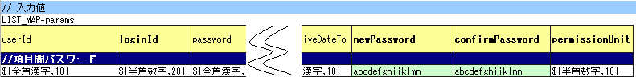
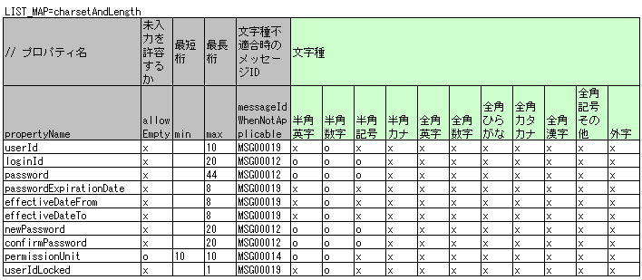
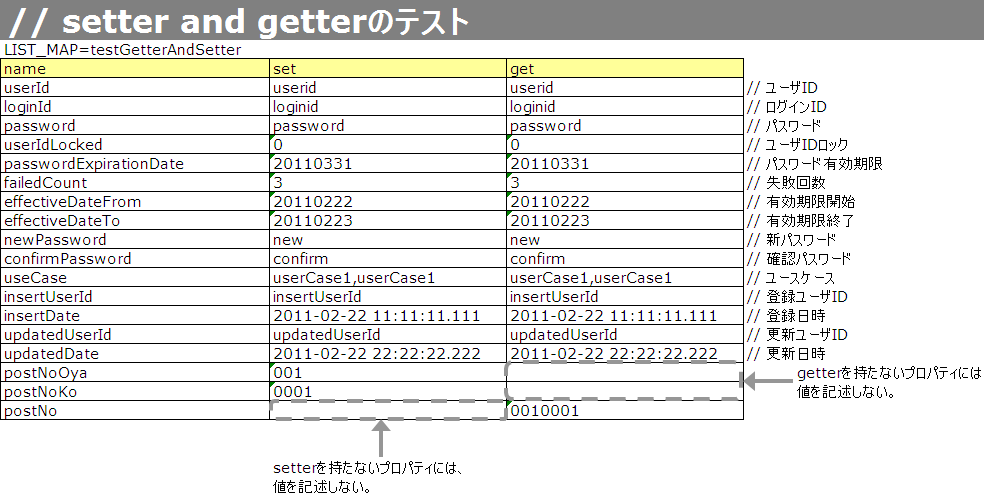

# Form/Entityのクラス単体テスト

## 

> **注意**: Entityとはテーブルのカラムと1対1に対応するプロパティを持つFormのことである。

テストケース表 (ID: `testShots` 固定):

| カラム名 | 記載内容 |
|---|---|
| title | テストケースのタイトル |
| description | テストケースの簡単な説明 |
| expectedMessageId*n* | 期待するメッセージ（*n* は1からの連番） |
| propertyName*n* | 期待するプロパティ（*n* は1からの連番） |

複数メッセージを期待する場合: `expectedMessageId2`, `propertyName2` のように数値を増やして右に追加。

入力パラメータ表 (ID: `params` 固定): テストケース表に対応する入力パラメータを1行ずつ記載。:ref:`special_notation_in_cell` の記法で効率的に入力値を作成可能。


※Entityの保有するプロパティ名のExcelへの記述手順は [property-name-copy-label](#) を参照。

**クラス**: `nablarch.test.core.entity.EntityTestConfiguration`

コンポーネント設定ファイルで以下を設定（全項目必須）:

| プロパティ名 | 説明 |
|---|---|
| maxMessageId | 最大文字列長超過時のメッセージID |
| maxAndMinMessageId | 最長最小文字列長範囲外のメッセージID（可変長） |
| fixLengthMessageId | 最長最小文字列長範囲外のメッセージID（固定長） |
| underLimitMessageId | 文字列長不足時のメッセージID |
| emptyInputMessageId | 未入力時のメッセージID |
| characterGenerator | 文字列生成クラス（`nablarch.test.core.util.generator.CharacterGenerator`の実装クラスを指定） |

`characterGenerator`には通常`nablarch.test.core.util.generator.BasicJapaneseCharacterGenerator`を使用する。

設定するメッセージIDはバリデータの設定値と合致させること。

<details>
<summary>keywords</summary>

Entity定義, Form単体テスト, Entity単体テスト, Formクラス単体テスト, testShots, params, expectedMessageId, propertyName, テストケース表, 入力パラメータ表, special_notation_in_cell, EntityTestConfiguration, nablarch.test.core.entity.EntityTestConfiguration, CharacterGenerator, nablarch.test.core.util.generator.CharacterGenerator, BasicJapaneseCharacterGenerator, nablarch.test.core.util.generator.BasicJapaneseCharacterGenerator, maxMessageId, maxAndMinMessageId, fixLengthMessageId, underLimitMessageId, emptyInputMessageId, characterGenerator, エンティティテスト設定, メッセージID設定, バリデーション設定

</details>

## Form/Entity単体テストの書き方

テストクラスの作成ルール: (1) パッケージはテスト対象のForm/Entityと同じ (2) クラス名は`{Form/Entity名}Test` (3) `nablarch.test.core.db.EntityTestSupport`を継承

テストデータは、テストソースコードと同じディレクトリに同じ名前のExcelファイル（拡張子のみ異なる）として格納する。精査テストケース・コンストラクタテストケース・setter/getterテストケースの各テストがそれぞれ1シートを使用する。メッセージデータやコードマスタ等の静的マスタデータはプロジェクト管理のデータが投入済みであることを前提とし、個別のテストデータとして作成しない。

**文字種と文字列長の単項目精査テスト制約**: プロパティとして別のFormを保持するFormには使用不可（その場合は独自に実装すること）。「別のFormを保持するForm」とは`<親Form>.<子Form>.<子フォームのプロパティ名>`形式でアクセスする親Formのこと。

**その他の単項目精査テスト**: 文字種・文字列長以外の精査（例：数値範囲精査）に使用。各プロパティに1入力値と期待メッセージIDのペアを記述することで任意の値で精査テストが可能。プロパティとして別のFormを保持するFormには使用不可（その場合は独自に実装すること）。

**バリデーションメソッドのテストケース**: 単項目精査テスト（文字種・文字列長テスト、その他精査テスト）はセッターメソッドに付与されたアノテーションのみをテストし、エンティティに実装した`@ValidateFor`アノテーション付きstaticメソッドは実行されない。独自バリデーションメソッドを実装した場合は別途テストを作成すること。

## 精査対象確認

精査対象プロパティを指定（:ref:`validation_specifyProperty` 参照）した場合、その指定が正しいかを確認するケースを作成する。全プロパティに単項目精査エラーとなるデータを用意し、精査対象プロパティのみが単項目精査エラーとなることを確認する。

- テストケース表: 全精査対象プロパティのプロパティ名と単項目精査エラーメッセージIDを記載
- 入力パラメータ表: 全プロパティに対して単項目精査エラーとなる値を記載

> **注意**: 精査対象プロパティが誤って漏れていた場合、期待メッセージが出力されずメッセージIDのアサートが失敗する。精査対象外のプロパティが誤って精査対象となった場合、不正入力値で単項目精査が失敗し予期しないメッセージが出力される。これにより精査対象の誤りを検知できる。


**プロパティに保持している別のFormのプロパティを指定する方法:**

```java
public class SampleForm {
    private SystemUserEntity systemUser;
    private UserTelEntity[] userTelArray;
    // プロパティ以外は省略
}
```

- ネストされたFormのプロパティ: `sampleForm.systemUser.userId`
- Form配列要素のプロパティ: `sampleForm.userTelArray[0].telNoArea`

## 項目間精査など

:ref:`entityUnitTest_ValidationMethodSpecifyNormal` で行った精査対象指定以外の動作確認ケース（項目間精査など）を作成する。



**【精査クラスのコンポーネント設定ファイル】**

```xml
<property name="validators">
  <list>
    <component class="nablarch.core.validation.validator.RequiredValidator">
      <property name="messageId" value="MSG00010"/>
    </component>
    <component class="nablarch.core.validation.validator.LengthValidator">
      <property name="maxMessageId" value="MSG00011"/>
      <property name="maxAndMinMessageId" value="MSG00011"/>
      <property name="fixLengthMessageId" value="MSG00023"/>
    </component>
    <!-- 中略 -->
</property>
```

**【テストのコンポーネント設定ファイル】**

```xml
<component name="entityTestConfiguration" class="nablarch.test.core.entity.EntityTestConfiguration">
  <property name="maxMessageId"        value="MSG00011"/>
  <property name="maxAndMinMessageId"  value="MSG00011"/>
  <property name="fixLengthMessageId"  value="MSG00023"/>
  <property name="underLimitMessageId" value="MSG00011"/>
  <property name="emptyInputMessageId" value="MSG00010"/>
  <property name="characterGenerator">
    <component name="characterGenerator"
               class="nablarch.test.core.util.generator.BasicJapaneseCharacterGenerator"/>
  </property>
</component>
```

<details>
<summary>keywords</summary>

EntityTestSupport, nablarch.test.core.db.EntityTestSupport, テストクラス作成ルール, テストデータExcel, 単項目精査テスト, @ValidateFor, バリデーションメソッド, 精査対象確認, 項目間精査, 単項目精査エラー, ネストされたFormのプロパティ指定, sampleForm.systemUser.userId, sampleForm.userTelArray[0].telNoArea, バリデーション確認ケース, SampleForm, SystemUserEntity, UserTelEntity, RequiredValidator, nablarch.core.validation.validator.RequiredValidator, LengthValidator, nablarch.core.validation.validator.LengthValidator, entityTestConfiguration, BasicJapaneseCharacterGenerator, コンポーネント設定ファイル, エンティティテストXML設定例

</details>

## テストケース表の作成方法

| カラム名 | 記載内容 |
|---|---|
| propertyName | テスト対象のプロパティ名 |
| allowEmpty | 未入力を許容するか |
| min | 最小文字列長（省略可） |
| max | 最大文字列長 |
| messageIdWhenNotApplicable | 文字種不適合時に期待するメッセージID |
| 半角英字 | 半角英字を許容するか |
| 半角数字 | 半角数字を許容するか |
| 半角記号 | 半角記号を許容するか |
| 半角カナ | 半角カナを許容するか |
| 全角英字 | 全角英字を許容するか |
| 全角数字 | 全角数字を許容するか |
| 全角ひらがな | 全角ひらがなを許容するか |
| 全角カタカナ | 全角カタカナを許容するか |
| 全角漢字 | 全角漢字を許容するか |
| 全角記号その他 | 全角記号その他を許容するか |
| 外字 | 外字を許容するか |

許容する場合は`o`（半角英小文字オー）、許容しない場合は`x`（半角英小文字エックス）を設定する。



変数内容を変更するだけで、異なるEntityの精査テストに対応できる。

**クラス**: `EntityTestSupport`

```java
private static final Class<SystemAccountEntity> ENTITY_CLASS = SystemAccountEntity.class;

@Test
public void testValidateForRegisterUser() {
    String sheetName = "testValidateForRegisterUser";
    String validateFor = "registerUser";
    testValidateAndConvert(ENTITY_CLASS, sheetName, validateFor);
}
```

<details>
<summary>keywords</summary>

propertyName, allowEmpty, min, max, messageIdWhenNotApplicable, 文字種テスト, 文字列長テスト, テストケース表, testValidateAndConvert, EntityTestSupport, validateFor, テストメソッド作成, バリデーションテスト

</details>

## テストメソッドの作成方法

**クラス**: `nablarch.test.core.db.EntityTestSupport`

```java
void testValidateCharsetAndLength(Class entityClass, String sheetName, String id)
```

| 観点 | 入力値 | 備考 |
|---|---|---|
| 文字種（半角英字〜外字 計12種） | 各文字種で`max`欄の長さの文字列 | |
| 未入力 | 空文字（長さ0） | |
| 最小文字列長 | 最小文字列長の文字列 | `o`印の文字種で構成 |
| 最長文字列長 | 最大文字列長の文字列 | `o`印の文字種で構成 |
| 文字列長不足 | 最小文字列長−1の文字列 | `o`印の文字種で構成 |
| 文字列長超過 | 最大文字列長+1の文字列 | `o`印の文字種で構成 |

コンストラクタのテスト対象はEntityに定義されている全プロパティ。テストデータにはプロパティ名・設定値・期待値（getterで取得した値）を用意する。

> **注意**: Entityは自動生成されるためアプリで使用されないコンストラクタが生成される可能性がある。リクエスト単体テストではテストできないため、Entity単体テストでコンストラクタのテストを必ず行うこと。一般的なFormはリクエスト単体テストでコンストラクタテストが可能なため、クラス単体テストでのテストは不要。


※Entityの保有するプロパティ名のExcelへの記述手順は [property-name-copy-label](#) を参照。

| プロパティ | コンストラクタに設定する値 | 期待値（getterから取得される値） |
|---|---|---|
| userId | userid | userid |
| loginId | loginid | loginid |
| password | password | password |

**クラス**: `EntityTestSupport`

```java
public class SystemAccountEntityTest extends EntityTestSupport {
    @Test
    public void testConstructor() {
        Class<?> entityClass = SystemAccountEntity.class;
        String sheetName = "testAccessor";
        String id = "testConstructor";
        testConstructorAndGetter(entityClass, sheetName, id);
    }
}
```

> **注意**: `testConstructorAndGetter` でテスト可能な型に制限がある。対象外の型は各テストクラスでコンストラクタとgetterを明示的に呼び出してテストすること。テスト可能な型: `String`・`String[]`、`BigDecimal`・`BigDecimal[]`、`valueOf(String)` メソッドを持つクラスとその配列（`Integer`、`Long`、`java.sql.Date`、`java.sql.Timestamp` など）

型制限に該当しない場合の個別テスト例:


```java
// 共通にテストが実施出来る項目は testConstructorAndGetter でテスト
testConstructorAndGetter(entityClass, sheetName, id);

// 共通にテストが実施出来ない項目は個別にテスト
// getParamMap でテストデータ取得（テスト対象のプロパティが複数ある場合は getListParamMap を使用する）
Map<String, String[]> data = getParamMap(sheetName, "testConstructorOther");
Map<String, Object> params = new HashMap<String, Object>();
params.put("users", Arrays.asList(data.get("set")));
SystemAccountEntity entity = new SystemAccountEntity(params);
assertEquals(entity.getUsers(), Arrays.asList(data.get("get")));
```

<details>
<summary>keywords</summary>

testValidateCharsetAndLength, EntityTestSupport, nablarch.test.core.db.EntityTestSupport, 文字種テスト, 文字列長テスト, testConstructorAndGetter, SystemAccountEntityTest, コンストラクタテスト, getParamMap, getListParamMap, testConstructorOther, valueOf(String)

</details>

## テストケース表の作成方法

| カラム名 | 記載内容 |
|---|---|
| propertyName | テスト対象のプロパティ名 |
| case | テストケースの簡単な説明 |
| input1 | 入力値（複数パラメータ時はinput2, input3...とカラムを追加） |
| messageId | 期待するメッセージID（精査エラーなしの場合は空欄） |

入力値には :ref:`special_notation_in_cell` の記法を使用することで効率的に入力値を作成できる。


setter/getterのテスト対象はEntityに定義されている全プロパティ。各プロパティにsetterへ渡すデータと期待値（getterで取得した値）を用意する。

> **注意**: Entityは自動生成されるためアプリで使用されないsetter/getterが生成される可能性がある。リクエスト単体テストではテストできないため、Entity単体テストでsetter/getterのテストを必ず行うこと。一般的なFormはリクエスト単体テストでsetter/getterテストが可能なため、クラス単体テストでのテストは不要。


**クラス**: `EntityTestSupport`

```java
public class SystemAccountEntityTest extends EntityTestSupport {
    @Test
    public void testSetterAndGetter() {
        Class<?> entityClass = SystemAccountEntity.class;
        String sheetName = "testAccessor";
        String id = "testGetterAndSetter";
        testSetterAndGetter(entityClass, sheetName, id);
    }
}
```

> **注意**: `testGetterAndSetter` でテスト可能な型の制限は :ref:`entityUnitTest_ConstructorCase` を参照。

> **注意**: setterやgetterにロジックを記述した場合（例: setterは郵便番号上3桁・下4桁に分かれているがgetterは7桁でまとめて取得）は、そのロジックを確認するテストケースを作成すること。



<details>
<summary>keywords</summary>

propertyName, case, messageId, input1, 単項目精査, テストケース表, special_notation_in_cell, testSetterAndGetter, testGetterAndSetter, EntityTestSupport, SystemAccountEntityTest, setter/getterテスト, ロジック付きsetter/getter

</details>

## テストメソッドの作成方法

**クラス**: `nablarch.test.core.db.EntityTestSupport`

```java
void testSingleValidation(Class entityClass, String sheetName, String id)
```

s1・s4・s5 で参照されている `[property-name-copy-label](#)` の手順。EclipseのOutline機能を使ってEntityのプロパティ名一覧を効率的にExcelへ記述する方法。

**手順:**

①EclipseでテストターゲットのEntityクラスをオープンし、Outline（アウトライン）を表示する。

②コピーしたいプロパティを選択する。

③マウスの右クリックで表示されるメニューから **Copy Qualified Name（修飾名のコピー）** を選択する。

④コピーしたプロパティ名のリストをExcelに貼り付ける。貼り付けた値は「クラス名 + プロパティ名」の完全修飾名の形式になっているため、Excelの置き換え機能を使用して不要なクラス名を削除する。

Entityクラスが `nablarch.sample.management.user.SystemAccountEntity` の場合の置き換え例:

| 項目 | 値 |
|---|---|
| 検索する文字列 | `nablarch.sample.management.user.SystemAccountEntity.` |
| 置き換え後の文字列 | （空のまま） |

<details>
<summary>keywords</summary>

testSingleValidation, EntityTestSupport, nablarch.test.core.db.EntityTestSupport, 単項目精査テスト, property-name-copy-label, Copy Qualified Name, 修飾名のコピー, Outline, アウトライン, Eclipse, プロパティ名取得, 完全修飾名, Excelの置き換え, SystemAccountEntity

</details>
