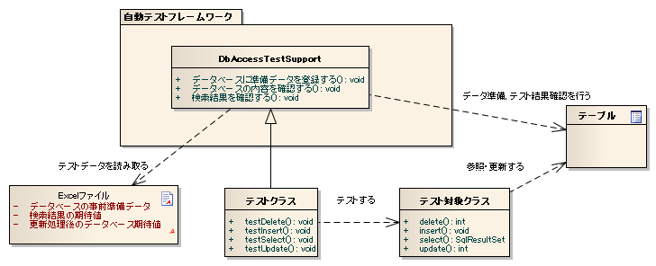

# データベースを使用するクラスのテスト

**公式ドキュメント**: [データベースを使用するクラスのテスト]()

## 主なクラス, リソース

| 名称 | 役割 | 作成単位 |
|---|---|---|
| テストクラス | `DbAccessTestSupport`を継承してテストロジックを実装 | テスト対象クラスにつき1つ |
| テストデータ（Excelファイル） | 準備データ・期待値を記載 | テストクラスにつき1つ |
| テスト対象クラス | テスト対象クラス | — |
| `DbAccessTestSupport` | 準備データ投入などDB使用テストに必要な機能を提供。テスト実行前後にDBトランザクションの開始・終了処理を行う（[using_transactions](testing-framework-03_Tips.md)） | — |

期待値の記述では、`EXPECTED_TABLE` の代わりに `EXPECTED_COMPLETE_TABLE` を使用する。テストケースに関係するカラムのみを記述することで可読性・保守性が向上し、テーブル定義変更時も無関係なカラムの影響を受けない。

**準備データ例 (SETUP_TABLE=SAMPLE_TABLE)**:

| PK_1 | PK_2 | 有効期限 | 削除フラグ |
|------|------|----------|------------|
| 01   | 0001 | 20101231 | 0          |
| 02   | 0002 | 20110101 | 0          |

**期待値例 (EXPECTED_COMPLETE_TABLE=SAMPLE_TABLE)**:

| PK_1 | PK_2 | 有効期限 | 削除フラグ |
|------|------|----------|------------|
| 01   | 0001 | 20101231 | 1          |
| 02   | 0002 | 20110101 | 0          |

<details>
<summary>keywords</summary>

DbAccessTestSupport, テストクラス継承, 準備データ投入, トランザクション管理, テストリソース構成, EXPECTED_COMPLETE_TABLE, SETUP_TABLE, 関係カラムのみ記述, 期待値, 準備データ, 可読性, 保守性

</details>

## 

テストクラスは`DbAccessTestSupport`を継承することで、準備データ投入とデータ確認の操作が可能になる。



**クラス**: `nablarch.test.core.db.BasicDefaultValues`

| 設定項目名 | 説明 | 設定値 |
|---|---|---|
| charValue | 文字列型のデフォルト値 | 1文字のASCII文字 |
| numberValue | 数値型のデフォルト値 | 0または正の整数 |
| dateValue | 日付型のデフォルト値 | JDBCタイムスタンプエスケープ形式 (yyyy-mm-dd hh:mm:ss.fffffffff) |

<details>
<summary>keywords</summary>

DbAccessTestSupport, データベーステスト, テストデータ投入, データ確認, 全体構成, BasicDefaultValues, nablarch.test.core.db.BasicDefaultValues, charValue, numberValue, dateValue, デフォルト値設定, JDBCタイムスタンプ

</details>

## 基本的なテスト方法

参照系テストで使用するAPIメソッド:

- `setUpDb(シート名)`: 指定シートの準備データをDBに登録
- `assertSqlResultSetEquals(シート名, 期待値ID, actual)`: ExcelのLIST_MAP期待値と`SqlResultSet`を比較

```xml
<!-- TestDataParser -->
<component name="testDataParser" class="nablarch.test.core.reader.BasicTestDataParser">
  <!-- データベースデフォルト値 -->
  <property name="defaultValues">
    <component class="nablarch.test.core.db.BasicDefaultValues">
      <property name="charValue" value="a"/>
      <property name="dateValue" value="2000-01-01 12:34:56.123456789"/>
      <property name="numberValue" value="1"/>
    </component>
  </property>
</component>
```

<details>
<summary>keywords</summary>

setUpDb, assertSqlResultSetEquals, 参照系テスト, SqlResultSet, APIメソッド, BasicTestDataParser, nablarch.test.core.reader.BasicTestDataParser, testDataParser, BasicDefaultValues, XML設定, defaultValues

</details>

## シーケンス

参照系テストの実行フロー:

1. `setUpDb()` → DBへ準備データ登録
2. テスト対象メソッド起動
3. `assertSqlResultSetEquals()` → 結果確認


コンポーネント設定ファイルで明示的に指定していない場合、以下のデフォルト値が使用される。

| カラム | デフォルト値 |
|---|---|
| 数値型 | 0 |
| 文字列型 | 半角スペース |
| 日付型 | 1970-01-01 00:00:00.0 |

<details>
<summary>keywords</summary>

参照系テスト, シーケンス図, テスト実行フロー, setUpDb, assertSqlResultSetEquals, デフォルト値, 数値型デフォルト, 文字列型デフォルト, 日付型デフォルト, 省略カラム, 1970-01-01

</details>

## テストソースコード実装例

テストクラスは`DbAccessTestSupport`を継承する。

```java
public class DbAccessTestSample extends DbAccessTestSupport {
    @Test
    public void testSelectAll() {
        setUpDb("testSelectAll");  // 引数: シート名
        EmployeeDbAcess target = new EmployeeDbAccess(); 
        SqlResultSet actual = target.selectAll();
        // 引数: シート名, 期待値ID(LIST_MAP), 実際の値
        assertSqlResultSetEquals("testSelectAll", "expected", actual);
    }
}
```

**setUpDbメソッド**:
- Excelファイルに全カラムを記述する必要はない。省略されたカラムにはデフォルト値が設定される。
- 1シート内に複数テーブルを記述可能。`setUpDb(String sheetName)` 実行時、指定シート内のデータタイプ `SETUP_TABLE` 全てが登録対象となる。

**assertTableEqualsメソッド**:
- 期待値で省略されたカラムは比較対象外となる。
- レコードの順番が異なっていても主キーを突合して正しく比較できる。順序を意識した期待データ作成は不要。
- 1シート内に複数テーブル記述可能。`assertTableEquals(String sheetName)` 実行時、指定シート内のデータタイプ `EXPECTED_TABLE` が全て比較される。
- `java.sql.Timestamp` 型のフォーマットは `yyyy-mm-dd hh:mm:ss.fffffffff`（fffffffffはナノ秒）。ナノ秒が設定されていない場合でも0ナノ秒として表示される。Excelシートに期待値を記載する場合は末尾に小数点＋ゼロを付与する必要がある（例: `2010-01-01 12:34:56.0`）。

**assertSqlResultSetEqualsメソッド**:
- SELECT文で指定された全カラム名（別名）が比較対象。特定カラムを比較対象外にすることはできない。
- レコードの順序が異なる場合は等価でないとみなす（アサート失敗）。理由: (1) SELECTカラムに主キーが含まれるとは限らない (2) ORDER BY指定がある場合が多く順序も厳密に比較する必要がある。

**クラス単体テスト登録・更新系テスト**:
- 自動設定項目を使用したDB登録・更新時、ThreadContextにリクエストIDとユーザIDが設定されている必要がある。テスト対象クラス起動前に設定すること（:ref:`using_ThreadContext`）。
- デフォルト以外のトランザクションを使用する場合、本フレームワークにトランザクション制御を行わせる必要がある（[using_transactions](testing-framework-03_Tips.md)）。

<details>
<summary>keywords</summary>

DbAccessTestSupport, setUpDb, assertSqlResultSetEquals, 参照系テスト, SqlResultSet, testSelectAll, assertTableEquals, ThreadContext, Timestamp, EXPECTED_TABLE, using_ThreadContext, using_transactions, 自動設定項目

</details>

## テストデータ記述例

準備データ（SETUP_TABLE形式）:
- 1行目: `SETUP_TABLE=<テーブル名>`
- 2行目: カラム名
- 3行目以降: 登録レコード

期待値（LIST_MAP形式）:
- 1行目: `LIST_MAP=<期待値ID>`（シート内で一意の任意文字列）
- 2行目: SELECTで指定したカラム名または別名
- 3行目以降: 検索結果期待値

`assertSqlResultSetEquals`の第2引数にこの期待値IDを指定する。

<details>
<summary>keywords</summary>

SETUP_TABLE, LIST_MAP, Excelテストデータ, 準備データ形式, 期待値形式, 参照系, assertSqlResultSetEquals

</details>

## シーケンス

更新系テストの実行フロー:

1. `setUpDb()` → DBへ準備データ登録
2. テスト対象メソッド起動
3. `commitTransactions()` → トランザクションコミット
4. `assertTableEquals()` → DB更新結果確認

> **警告**: Nablarch Application Frameworkでは複数種類のトランザクションを併用することが前提となっている。そのため、テスト対象クラス実行後にDBの内容を確認する際は、`commitTransactions()`でトランザクションをコミットしなければならない。コミットしない場合、テスト結果の確認が正常に行われない。

> **注意**: 参照系テストの場合はコミット不要。


<details>
<summary>keywords</summary>

更新系テスト, シーケンス図, commitTransactions, テスト実行フロー, assertTableEquals

</details>

## テストソースコード実装例

```java
public class DbAccessTestSample extends DbAccsessTestSupport {
    @Test
    public void testDeleteExpired() {
        setUpDb("testDeleteExpired");  // 引数: シート名
        EmployeeDbAcess target = new EmployeeDbAccess(); 
        SqlResultSet actual = target.deleteExpired();
        commitTransactions();  // トランザクションをコミット（必須）
        // 引数: シート名, 実際の値
        assertTableEquals("testDeleteExpired", actual);
    }
}
```

<details>
<summary>keywords</summary>

commitTransactions, assertTableEquals, 更新系テスト, DbAccessTestSupport, testDeleteExpired

</details>

## テストデータ記述例

準備データ（SETUP_TABLE形式）は参照系と同じ。

期待値（EXPECTED_TABLE形式）:
- 1行目: `EXPECTED_TABLE=<テーブル名>`
- 2行目: 確認対象テーブルのカラム名
- 3行目以降: 期待する値

<details>
<summary>keywords</summary>

SETUP_TABLE, EXPECTED_TABLE, 更新系テストデータ, 期待値形式

</details>

## 

準備データ（SETUP_TABLE）のカラム省略ルール:

- 省略されたカラムには:ref:`default_values_when_column_omitted`が設定される
- **主キーカラムは省略不可**

<details>
<summary>keywords</summary>

カラム省略, 準備データ省略, 主キー省略不可, デフォルト値, SETUP_TABLE

</details>

## データベーステストデータの省略記述方法

省略記述機能により、テストに関係のないカラムを省略することでテストデータの可読性と保守性が向上する。この機能は特に更新系テストケースに有効である。多くのカラムのうち1カラムだけが更新される場合、不要なカラムを記述する必要がなくなる。

> **警告**: DB**検索結果**の期待値を記述する際は、検索対象カラム全てを記述しなければならない（主キーのみ確認は不可）。**登録系**テストの場合も、新規登録レコードの全カラム確認が必要なため、省略不可。

`EXPECTED_TABLE`と`EXPECTED_COMPLETE_TABLE`の使い分け:

| データタイプ | 省略カラムの扱い |
|---|---|
| `EXPECTED_TABLE` | 比較対象外 |
| `EXPECTED_COMPLETE_TABLE` | :ref:`デフォルト値<default_values_when_column_omitted>`が格納されているものとして比較 |

`EXPECTED_COMPLETE_TABLE`は、無関係なカラムが更新されていないことも確認したい場合に使用する。

<details>
<summary>keywords</summary>

EXPECTED_TABLE, EXPECTED_COMPLETE_TABLE, カラム省略, デフォルト値, 更新系テスト, 省略記述

</details>

## テストケース例

テストケース: 「有効期限を過ぎたレコードは削除フラグが1に更新されること」（テスト実施日: 2011/01/01）

SAMPLE_TABLEのカラム構成:

| カラム名 | 説明 |
|---|---|
| PK1, PK2 | 主キー |
| COL_A〜COL_D | テスト対象機能では使用しないカラム |
| 有効期限 | 有効期限を過ぎたデータが処理対象 |
| 削除フラグ | 有効期限を過ぎたレコードの値を'1'に変更 |

<details>
<summary>keywords</summary>

SAMPLE_TABLE, 削除フラグ, 有効期限, テストケース, カラム省略具体例

</details>

## 省略せずに全カラムを記載した場合（悪い例）

全カラム記載の問題点:
- テストに無関係なCOL_A〜COL_Dが含まれ、可読性に劣る
- テーブル定義変更時に無関係なカラムも修正が必要になる

準備データ（悪い例）:
```
SETUP_TABLE=SAMPLE_TABLE
PK_1  PK_2  COL_A  COL_B  COL_C  COL_D  有効期限  削除フラグ
01    0001  1a     1b     1c     1d     20101231  0
02    0002  2a     2b     2c     2d     20110101  0
```

期待値（悪い例）:
```
EXPECTED_TABLE=SAMPLE_TABLE
PK_1  PK_2  COL_A  COL_B  COL_C  COL_D  有効期限  削除フラグ
01    0001  1a     1b     1c     1d     20101231  1
02    0002  2a     2b     2c     2d     20110101  0
```

<details>
<summary>keywords</summary>

悪い例, 全カラム記載, 可読性, SETUP_TABLE, EXPECTED_TABLE, カラム省略の必要性

</details>
