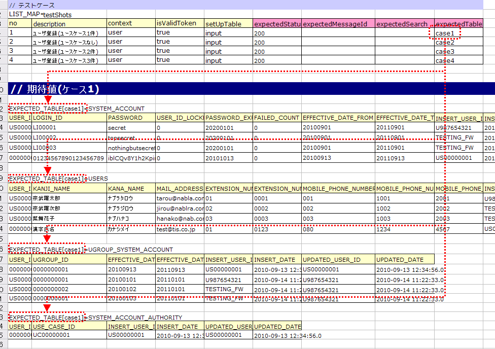

# リクエスト単体テストの実施方法

## テストクラスの書き方

テストクラス作成ルール: (1) テスト対象Actionクラスと同一パッケージ (2) クラス名は`{Action名}RequestTest` (3) `nablarch.test.core.http.BasicHttpRequestTestTemplate`を継承

**クラス**: `nablarch.test.core.http.BasicHttpRequestTestTemplate`

> **注意**: `BasicHttpRequestTestTemplate`はリクエスト単体テストに必要な各種メソッドを用意している。`DbAccessTestSupport`の機能も兼ね備えているため、データベースの設定などもクラス単体テストと同じように実行できる。

<details>
<summary>keywords</summary>

BasicHttpRequestTestTemplate, DbAccessTestSupport, テストクラス作成, リクエスト単体テスト, クラス命名規則

</details>

## テストメソッド分割

テストメソッド分割ルール:
1. リクエストID（Actionのメソッド）毎に正常系・異常系に分類し、それぞれテストメソッドを作成する
2. 異常系ケースがない場合（メニューからの単純な画面遷移など）は正常系のテストメソッドのみ作成する
3. 画面表示検証項目は正常系または異常系メソッドに含める。同一シートで条件分岐が煩雑になる場合のみ画面表示検証用のテストメソッドを別途作成する

**分割例（正常系・異常系・画面表示検証用で分割した場合）:**

| リクエストID | Actionメソッド名 | 正常系 | 異常系 | 画面表示検証用 |
|---|---|---|---|---|
| USERS00101 | doUsers00101 | testUsers00101Normal | testUsers00101Abnormal | testUsers00101View |

<details>
<summary>keywords</summary>

テストメソッド分割, 正常系, 異常系, 画面表示検証, テストシート分割

</details>

## テストデータの書き方

テストデータを記載したExcelファイルはテストソースコードと同じディレクトリに同じ名前（拡張子のみ異なる）で格納する。テストデータの記述方法詳細は`:ref:`how_to_write_excel``を参照。

<details>
<summary>keywords</summary>

テストデータ記述, Excelファイル, how_to_write_excel, テストデータ格納場所

</details>

## テストクラスで共通のデータベース初期値（setUpDb）

`setUpDb`という名前のシートに共通のデータベース初期値を記載する。テストメソッド実行時に自動テストフレームワークにより投入される。

<details>
<summary>keywords</summary>

setUpDb, 共通データベース初期値, テストデータ共通設定, データベース初期化

</details>

## テストケース一覧（testShots）

LIST_MAPのデータタイプで記載し、IDは`testShots`とする。

| カラム名 | 必須 | 説明 |
|---|---|---|
| no | ○ | テストケース番号（1からの連番） |
| description | ○ | テストケースの説明 |
| context | ○ | リクエストIDとユーザ情報（詳細は:ref:`request_test_user_info`参照） |
| cookie | | Cookie情報（詳細は:ref:`request_test_cookie_info`参照） |
| isValidToken | | トークンを設定する場合はtrueを設定（詳細は:ref:`double_submit_use_Token`参照） |
| setUpTable | | テストケース実行前にDBへ登録するデータの:ref:`グループID<tips_groupId>` |
| expectedStatusCode | ○ | 期待するHTTPステータスコード |
| expectedMessageId | | 期待するメッセージID（複数はカンマ区切り。空欄=メッセージなしとしてアサート。空欄なのにメッセージが出力されるとテスト失敗） |
| expectedSearch | | 期待する検索結果のLIST_MAP ID（リクエストスコープのキーは`searchResult`） |
| expectedTable | | 期待するDBテーブルの:ref:`グループID<tips_groupId>` |
| forwardUri | | 期待するフォワード先URI（空欄=JSPへのフォワードなし。システムエラー画面等への遷移時はそのJSPのURIを記載。例: デフォルト設定でシステムエラー画面に遷移する場合は`/jsp/systemError.jsp`） |
| expectedContentLength | | コンテンツレングスヘッダの期待値（ファイルダウンロード用） |
| expectedContentType | | コンテンツタイプヘッダの期待値（ファイルダウンロード用） |
| expectedContentFileName | | コンテンツディスポジションヘッダのファイル名期待値（ファイルダウンロード用） |
| expectedMessage | | メッセージ同期送信の要求電文:ref:`グループID<tips_groupId>`（メッセージの作成は自動テストフレームワークにより行われる） |
| responseMessage | | メッセージ同期送信の応答電文:ref:`グループID<tips_groupId>`（メッセージの作成は自動テストフレームワークにより行われる） |

> **注意**: 画面オンライン処理のリクエスト単体テストでは、HTTPステータスコード302と303を同一視してアサートする。期待値が302で実行結果が303、またはその逆でもアサート正常終了となる。

<details>
<summary>keywords</summary>

testShots, LIST_MAP, テストケース一覧, context, cookie, isValidToken, setUpTable, expectedStatusCode, expectedMessageId, expectedSearch, expectedTable, forwardUri, expectedContentLength, expectedContentType, expectedContentFileName, expectedMessage, responseMessage, HTTPステータスコード302 303

</details>

## ユーザ情報（context）

LIST_MAPのデータタイプで、どのリクエストIDにどのようなユーザでリクエストを送るかを記載する。複数のユーザ情報を使い分けることで、権限によって処理が異なる機能をテストできる（:ref:`request_test_user_info`参照）。

<details>
<summary>keywords</summary>

context, ユーザ情報, LIST_MAP, リクエストID, ユーザ権限テスト

</details>

## Cookie情報

LIST_MAPのデータタイプで記載する（任意）。Cookieが不要なケースは値を空白とする（:ref:`request_test_cookie_info`参照）。ケースによってCookieの値を変更する必要がある場合に使用する。

<details>
<summary>keywords</summary>

cookie, Cookie情報, LIST_MAP, Cookieテスト

</details>

## リクエストパラメータ（requestParams）

各テストケースで送信するHTTPパラメータをLIST_MAPのデータタイプで記載し、IDは`requestParams`とする。テストケース一覧と行単位で関連付けられる。`:ref:`http_dump_tool``を使用して初期画面表示以外のリクエストパラメータデータを作成する。

> **注意**: リクエストパラメータは必ず記載する。リクエストパラメータが不要な場合でも`LIST_MAP=requestParams`に列を定義し、テストケース数分の行を定義する（列はテストケース番号の:ref:`marker_column`のみで可）。

<details>
<summary>keywords</summary>

requestParams, LIST_MAP, http_dump_tool, リクエストパラメータ, marker_column, HTTPパラメータ

</details>

## ひとつのキーに対して複数の値を設定する場合

HTTPリクエストパラメータで1つのキーに複数の値を設定する場合、**値をカンマ区切りで記述**する。

エスケープルール:
- 値にカンマ自体を含める場合: `\`マークでエスケープ（`\,`と記述）
- 値に`\`マーク自体を含める場合: `\\`と記述

例: `\1,000`という値を表す場合は`\\1\,000`と記述する。

<details>
<summary>keywords</summary>

リクエストパラメータ複数値, カンマ区切り, エスケープ, requestParams

</details>

## 期待する検索結果

期待する検索結果をLIST_MAPのデータタイプで記載し、テストケース一覧（testShots）の`expectedSearch`カラムにそのIDを記載することでリンクさせる。検索結果はリクエストスコープのキー`searchResult`で取得される。


<details>
<summary>keywords</summary>

expectedSearch, searchResult, 検索結果アサート, LIST_MAP

</details>

## 期待するデータベースの状態

更新系テストケースでは、期待するデータベースの状態をLIST_MAPで記載し、テストケース一覧（testShots）の`expectedTable`カラムに:ref:`グループID<tips_groupId>`を記載することでリンクさせる。



<details>
<summary>keywords</summary>

expectedTable, グループID, データベース更新検証, 更新系テスト

</details>

## テストメソッドの書き方

`BasicHttpRequestTestTemplate`を継承する。スーパクラスは以下の順序でリクエスト単体テストを実行する:

1. データシートからテストケースリスト（testShots LIST_MAP）を取得
2. テストケース数分繰り返し:
   - データベース初期化
   - ExecutionContext・HTTPリクエストを生成
   - `beforeExecuteRequest`メソッド呼出（業務テストコード用拡張ポイント）
   - トークンが必要な場合、トークンを設定
   - テスト対象のリクエスト実行
   - 実行結果の検証（HTTPステータスコード・メッセージID、HTTPレスポンス値、検索結果、テーブル更新結果）
   - `afterExecuteRequest`メソッド呼出（業務テストコード用拡張ポイント）

以下のメソッドをオーバーライドする（スーパクラスで抽象メソッドとして定義）:

```java
@Override
protected String getBaseUri() {
    return "/action/management/user/UserSearchAction/";
}
```

テストメソッド内でスーパクラスの以下のいずれかのメソッドを呼び出す（通常は`execute(String sheetName)`を使用）:
- `void execute(String sheetName)`
- `void execute(String sheetName, Advice advice)`

```java
@Test
public void testUsers00101Normal() {
    execute("testUsers00101Normal");
}
```

<details>
<summary>keywords</summary>

BasicHttpRequestTestTemplate, getBaseUri, execute, beforeExecuteRequest, afterExecuteRequest, テストメソッド実装, Advice

</details>
