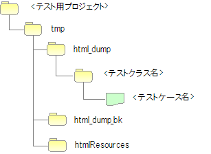

# リクエスト単体テスト（画面オンライン処理）

## 主なクラスとリソース

リクエスト単体テスト（画面オンライン処理）で使用する主なクラスとリソースは以下の通り。

| 名称 | 役割 | 作成単位 |
|------|------|----------|
| テストクラス | テストロジックを実装する | テスト対象クラス(Action)につき１つ |
| テストデータ（Excelファイル） | テーブルへの準備データ、期待結果、HTTPパラメータ等を記載 | テストクラスにつき１つ |
| テスト対象クラス(Action) | テスト対象のクラス（Action以降の業務ロジックを実装する各クラスを含む） | 取引につき1クラス |
| DbAccessTestSupport | 準備データ投入などデータベースを使用するテストに必要な機能を提供する | － |
| HttpServer | 内蔵サーバ。サーブレットコンテナとして動作し、HTTPレスポンスをファイル出力する機能を持つ | － |
| HttpRequestTestSupport | 内蔵サーバの起動やリクエスト単体テストで必要となる各種アサートを提供する | － |
| AbstractHttpRequestTestSupport / BasicHttpRequestTestSupport | リクエスト単体テストをテンプレート化するクラス。テストソース・テストデータを定型化する | － |
| TestCaseInfo | データシートに定義されたテストケース情報を格納するクラス | |

これらのクラス群は、**内蔵サーバも含め全て同一のJVM上で動作する**。このため、リクエストやセッション等のサーバ側のオブジェクトを加工できる。

<details>
<summary>keywords</summary>

主なクラス, リソース, HttpServer, 内蔵サーバ, サーブレットコンテナ, HTTPレスポンスファイル出力, HttpRequestTestSupport, DbAccessTestSupport, AbstractHttpRequestTestSupport, BasicHttpRequestTestSupport, TestCaseInfo, 同一JVM, サーバ側オブジェクト加工, セッション加工, リクエスト加工

</details>

## 前提事項

リクエスト単体テスト（画面オンライン処理）は、内蔵サーバを利用してHTMLダンプを出力する方式であり、**１リクエスト１画面遷移のシンクライアント型Webアプリケーション**を対象としている。

Ajaxやリッチクライアントを利用したアプリケーションの場合、**HTMLダンプによるレイアウト確認は使用できない**。

> **注意**: 本書ではViewテクノロジにJSPを用いているが、サーブレットコンテナ上で画面全体をレンダリングする方式であれば、JSP以外のViewテクノロジでもHTMLダンプの出力が可能である。

<details>
<summary>keywords</summary>

前提事項, シンクライアント, HTMLダンプ制約, Ajax不可, リッチクライアント不可, １リクエスト１画面遷移, JSP以外のViewテクノロジ, サーブレットコンテナ

</details>

## BasicHttpRequestTestTemplate

`BasicHttpRequestTestTemplate`は各テストクラスのスーパクラスである。

本クラスを使用することで、リクエスト単体テストのテストソース・テストデータを定型化でき、**テストソース記述量を大きく削減できる**。

具体的な使用方法は、リクエスト単体テストガイドを参照。

<details>
<summary>keywords</summary>

BasicHttpRequestTestTemplate, スーパクラス, テストソース定型化, テストデータ定型化, テストソース記述量削減

</details>

## AbstractHttpRequestTestTemplate

`AbstractHttpRequestTestTemplate`は、**アプリケーションプログラマが直接使用することはない**。

テストデータの書き方を変えたい場合など、**自動テストフレームワークを拡張する際に用いる**クラスである。

<details>
<summary>keywords</summary>

AbstractHttpRequestTestTemplate, 自動テストフレームワーク拡張, テストデータ書き方変更, アプリケーションプログラマ直接使用不可

</details>

## TestCaseInfo

`TestCaseInfo`はデータシートに定義されたテストケース情報を格納するクラスである。

テストデータの書き方を変えたい場合は、**本クラス及び`AbstractHttpRequestTestTemplate`の両方を継承する**。

<details>
<summary>keywords</summary>

TestCaseInfo, テストケース情報, データシート, AbstractHttpRequestTestTemplate継承, テストデータ書き方変更

</details>

## データベース関連機能

`HttpRequestTestSupport`はDBアクセス機能を`DbAccessTestSupport`に委譲しているが、以下のメソッドはリクエスト単体テストでは不要なため意図的に委譲していない（呼び出し不可）:

- `public void beginTransactions()`
- `public void commitTransactions()`
- `public void endTransactions()`
- `public void setThreadContextValues(String sheetName, String id)`

<details>
<summary>keywords</summary>

HttpRequestTestSupport, DbAccessTestSupport, beginTransactions, commitTransactions, endTransactions, setThreadContextValues, データベース関連機能, 委譲除外メソッド

</details>

## 事前準備補助機能

`HttpRequestTestSupport`は内蔵サーバへのリクエスト送信に必要なオブジェクト生成メソッドを提供する。

**HttpRequest生成**:
```java
HttpRequest createHttpRequest(String requestUri, Map<String, String[]> params)
```
リクエストURIとパラメータからHTTPメソッドPOSTの`HttpRequest`インスタンスを生成する。URI・パラメータ以外のデータを設定する場合は、返却インスタンスに直接設定する。

**ExecutionContext生成**:
```java
ExecutionContext createExecutionContext(String userId)
```
引数のユーザIDをセッションに格納し、そのユーザIDでログインした状態を作る。

**トークン発行（二重サブミット防止）**:

二重サブミット防止を施しているURIのテストでは、テスト実行前にトークンを発行しセッションに設定しておく必要がある。

```java
void setValidToken(HttpRequest request, ExecutionContext context)
```
トークンを発行してセッションに格納する。

```java
void setToken(HttpRequest request, ExecutionContext context, boolean valid)
```
- `valid=true`: `setValidToken`と同じ動作（トークンを発行・格納）
- `valid=false`: セッションからトークン情報を除去

テストデータからトークン設定の要否を制御する場合に使用する。テストクラスにif/else分岐を書かずに済む:

```java
// テストデータから取得したものとする。
String isTokenValid;

// "true"の場合はトークンが設定される。
setToken(req, ctx, Boolean.parseBoolean(isTokenValid));
```

<details>
<summary>keywords</summary>

HttpRequestTestSupport, createHttpRequest, createExecutionContext, setValidToken, setToken, トークン発行, 二重サブミット防止, 事前準備補助, Boolean.parseBoolean, isTokenValid

</details>

## 実行

`HttpRequestTestSupport`にある下記のメソッドを呼び出すことで、内蔵サーバが起動されリクエストが送信される。

```java
HttpResponse execute(String caseName, HttpRequest req, ExecutionContext ctx)
```

引数:
- `caseName`: テストケース名（HTMLダンプ出力時のファイル名に使用。`[dump-dir-label](testing-framework-02_RequestUnitTest.md)` 参照）
- `req`: HttpRequest
- `ctx`: ExecutionContext

`execute`メソッド内部でリポジトリの再初期化を行う。クラス単体テストとリクエスト単体テストで設定を分けずに連続実行できる。

処理順序:
1. 現在のリポジトリの状態をバックアップ
2. テスト対象のWebアプリケーションのコンポーネント設定ファイルを用いてリポジトリを再初期化
3. `execute`メソッド終了時に、バックアップしたリポジトリを復元

テスト対象Webアプリの設定については `:ref:`howToConfigureRequestUnitTestEnv`` を参照。

<details>
<summary>keywords</summary>

HttpRequestTestSupport, execute, HttpResponse, リポジトリ初期化, howToConfigureRequestUnitTestEnv, dump-dir-label, 内蔵サーバ実行

</details>

## メッセージ

`HttpRequestTestSupport.assertApplicationMessageId`でアプリケーション例外のメッセージIDを検証する。

```java
void assertApplicationMessageId(String expectedCommaSeparated, ExecutionContext actual)
```

引数:
- `expectedCommaSeparated`: 期待するメッセージID（複数の場合はカンマ区切り）
- `actual`: ExecutionContext

例外が発生しなかった場合、またはアプリケーション例外以外の例外が発生した場合はアサート失敗となる。

> **注意**: メッセージIDの比較はIDをソートして行うため、テストデータの記載順序は問わない。

<details>
<summary>keywords</summary>

HttpRequestTestSupport, assertApplicationMessageId, ExecutionContext, アプリケーション例外, メッセージID検証, メッセージアサート

</details>

## HTMLダンプ出力ディレクトリ

テスト実行時、プロジェクトルートの`tmp/html_dump`ディレクトリにHTMLダンプを出力する。

- `tmp/html_dump/{テストクラス名}/{テストケース名}.html` の形式でファイルが出力される
- スタイルシート・画像などのリソースも同ディレクトリに出力されるため、ディレクトリごと保存すると他環境でも参照可能
- `html_dump`が既に存在する場合は`html_dump_bk`としてバックアップされる



<details>
<summary>keywords</summary>

HTMLダンプ, tmp/html_dump, html_dump_bk, ダンプ出力ディレクトリ, バックアップ

</details>
