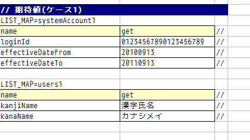

# リクエスト単体テスト

## 固有の処理を追加する場合

シート固有の準備・結果確認処理が必要な場合は `execute(String sheetName, Advice advice)` を使用する。`BasicAdvice` をオーバーライドしてリクエスト送信前後に処理を挿入する。

> **注意**: `beforeExecute` と `afterExecute` の両方をオーバーライドする必要はない。必要なものだけをオーバーライドする。長い処理やテストメソッド間で共通する処理はプライベートメソッドに切り出す。

**クラス**: `BasicAdvice`

| メソッド | タイミング |
|---|---|
| `void beforeExecute(TestCaseInfo testCaseInfo, ExecutionContext context)` | リクエスト送信前 |
| `void afterExecute(TestCaseInfo testCaseInfo, ExecutionContext context)` | リクエスト送信後 |

```java
execute("sheetName", new BasicAdvice() {
    @Override
    public void beforeExecute(TestCaseInfo testCaseInfo, ExecutionContext context) {
        // 準備処理
    }
    @Override
    public void afterExecute(TestCaseInfo testCaseInfo, ExecutionContext context) {
        // 結果確認処理
    }
});
```

**TestCaseInfo API**:
- `getTestCaseName()` - 比較失敗時メッセージ
- `getSheetName()` - シート名
- `getTestCaseNo()` - テストケース番号
- `getHttpRequest()` - テスト実行後の `HttpRequest`

**アサーションメソッド**:
- `assertSqlResultSetEquals(message, sheetName, expectedId, actual)` - `SqlResultSet` 比較
- `assertSqlRowEquals(message, sheetName, expectedId, actual)` - `SqlRow` 比較
- `assertEntity(sheetName, expectedId, actual)` - エンティティ・Form比較。期待値書式は :ref:`entityUnitTest_SetterGetterCase` と同様（setterの欄不要）。
- `assertListMapEquals(expected, actual)` - `List<Map<String, String>>` 比較
- `getListMap(sheetName, id)` - ExcelからList<Map>取得（[how_to_get_data_from_excel](testing-framework-03_Tips.md) 参照）

`context.getRequestScopedVar("name")` でリクエストスコープから値を取得する。FormがリクエストスコープにあるCase: 別のFormのプロパティも、そのFormを取得して `assertEntity` でテスト可能。

リクエストパラメータ検証: `testCaseInfo.getHttpRequest()` で `HttpRequest` を取得し、`request.getParam("name")` でパラメータ値を検証できる。

**クラス**: `nablarch.test.core.http.HttpTestConfiguration`

| 設定項目名 | 説明 | デフォルト値 |
|---|---|---|
| `htmlDumpDir` | HTMLダンプファイルを出力するディレクトリ | `./tmp/http_dump` |
| `webBaseDir` | Webアプリケーションのルートディレクトリ | `../main/web` |
| `xmlComponentFile` | リクエスト単体テスト実行時に使用するコンポーネント設定ファイル | （なし） |
| `userIdSessionKey` | ログイン中ユーザIDを格納するセッションキー | `user.id` |
| `exceptionRequestVarKey` | ApplicationExceptionが格納されるリクエストスコープのキー | `nablarch_application_error` |
| `dumpFileExtension` | ダンプファイルの拡張子 | `html` |
| `httpHeader` | HttpRequestにHTTPリクエストヘッダとして格納される値 | `Content-Type: application/x-www-form-urlencoded`、`Accept-Language: ja JP` |
| `sessionInfo` | セッションに格納される値 | （なし） |
| `htmlResourcesExtensionList` | ダンプディレクトリへコピーされるHTMLリソースの拡張子 | `css`、`jpg`、`js` |
| `jsTestResourceDir` | JavaScriptの自動テスト実行時に使用するリソースのコピー先ディレクトリ名 | `../test/web` |
| `backup` | ダンプディレクトリのバックアップOn/Off | `true` |
| `htmlResourcesCharset` | CSSファイルの文字コード | `UTF-8` |
| `checkHtml` | HTMLチェックの実施On/Off | `true` |
| `htmlChecker` | HTMLチェックを行うオブジェクト（`nablarch.test.tool.htmlcheck.HtmlChecker`インタフェース実装が必要）。詳細は :ref:`customize_html_check` を参照。 | `nablarch.test.tool.htmlcheck.Html4HtmlChecker` |
| `htmlCheckerConfig` | HTMLチェックツールの設定ファイルパス（`htmlChecker`未設定時のみ有効） | `test/resources/httprequesttest/html-check-config.csv` |
| `ignoreHtmlResourceDirectory` | HTMLリソースの中でコピー対象外とするディレクトリ名のリスト | （なし） |
| `tempDirectory` | JSPのコンパイル先ディレクトリ | jettyのデフォルト動作に依存 |
| `uploadTmpDirectory` | アップロードファイルを一時的に格納するディレクトリ | `./tmp` |
| `dumpVariableItem` | HTMLダンプ出力時に可変項目（JSESSIONID・2重サブミット防止トークン）を出力するか否か | `false` |

> **注意**: `xmlComponentFile`を設定した場合、リクエスト送信直前に指定されたコンポーネント設定ファイルで初期化が行われる。クラス単体テストとリクエスト単体テストとで設定を変える必要がある場合のみ設定する。

> **注意**: `ignoreHtmlResourceDirectory`にバージョン管理用ディレクトリ（`.svn`や`.git`）を設定するとHTMLリソースコピー時のパフォーマンスが向上する。

> **注意**: `tempDirectory`のjettyデフォルト動作では`./work`がコンパイル先ディレクトリ。`./work`が存在しない場合はTempフォルダ（Windowsの場合はユーザのホームディレクトリ/Local Settings/Temp）が出力先となる。

> **注意**: `uploadTmpDirectory`について、テスト時に準備したアップロード対象のファイルは本ディレクトリにコピー後に処理される。アクションでファイルの移動を行った場合でも、本ディレクトリ配下のファイルが移動されるだけであり、実態が移動されることを防ぐことができる。

`dumpVariableItem`の動作:
- `false`（デフォルト）: JSESSIONID・2重サブミット防止トークンを非出力。毎回同じHTMLダンプ結果を得たい場合に設定。
- `true`: 可変項目をそのままHTMLに出力。

```xml
<component name="httpTestConfiguration" class="nablarch.test.core.http.HttpTestConfiguration">
    <property name="htmlDumpDir" value="./tmp/http_dump"/>
    <property name="webBaseDir" value="../main/web"/>
    <property name="xmlComponentFile" value="http-request-test.xml"/>
    <property name="userIdSessionKey" value="user.id"/>
    <property name="httpHeader">
        <map>
            <entry key="Content-Type" value="application/x-www-form-urlencoded"/>
            <entry key="Accept-Language" value="ja JP"/>
        </map>
    </property>
    <property name="sessionInfo">
        <map>
            <entry key="commonHeaderLoginUserName" value="リクエスト単体テストユーザ"/>
            <entry key="commonHeaderLoginDate" value="20100914" />
        </map>
    </property>
    <property name="htmlResourcesExtensionList">
        <list>
            <value>css</value>
            <value>jpg</value>
            <value>js</value>
        </list>
    </property>
    <property name="backup" value="true" />
    <property name="htmlResourcesCharset" value="UTF-8" />
    <property name="ignoreHtmlResourceDirectory">
        <list>
            <value>.svn</value>
        </list>
    </property>
    <property name="tempDirectory" value="webTemp" />
    <property name="htmlCheckerConfig" value="test/resources/httprequesttest/html-check-config.csv" />
</component>
```

<details>
<summary>keywords</summary>

BasicAdvice, TestCaseInfo, ExecutionContext, beforeExecute, afterExecute, assertSqlResultSetEquals, assertSqlRowEquals, assertEntity, assertListMapEquals, HttpRequest, getListMap, SqlResultSet, SqlRow, getRequestScopedVar, リクエストスコープの検証, 固有処理の追加, HttpTestConfiguration, nablarch.test.core.http.HttpTestConfiguration, Html4HtmlChecker, nablarch.test.tool.htmlcheck.Html4HtmlChecker, HtmlChecker, nablarch.test.tool.htmlcheck.HtmlChecker, htmlDumpDir, webBaseDir, xmlComponentFile, userIdSessionKey, exceptionRequestVarKey, dumpFileExtension, httpHeader, sessionInfo, htmlResourcesExtensionList, jsTestResourceDir, backup, htmlResourcesCharset, checkHtml, htmlChecker, htmlCheckerConfig, ignoreHtmlResourceDirectory, tempDirectory, uploadTmpDirectory, dumpVariableItem, コンポーネント設定ファイル, リクエスト単体テスト設定, HTMLダンプ設定, セッション設定

</details>

## ダウンロードファイルのテスト

:ref:`batch_request_test` と同じ方法でExcelシートにファイルパス（ダンプファイル）を指定して期待値を記載する。

ダンプファイル命名規則: `Excelシート名_テストケース名_ダウンロードされたファイル名`


ダンプ出力先の詳細は [html_dump_dir](testing-framework-02_RequestUnitTest-02_RequestUnitTest.md) を参照。

**クラス**: `FileSupport`

`FileSupport.assertFile(message, testCaseName)` でダウンロードファイルのアサートを行う。

```java
private FileSupport fileSupport = new FileSupport(getClass());
// afterExecute内で使用:
fileSupport.assertFile("失敗時メッセージ", "testRW11AC0104Download");
```

性能が低いPC（Pentium4、Pentium Dual-Core等）でリクエスト単体テストの実行速度を向上させるためのJVMオプション設定。これら以降のCPUを搭載したマシンでは効果は限定的。

- `-Xms256m -Xmx256m`: 最大・最小ヒープサイズを同一値に設定し、ヒープサイズ拡張のオーバヘッドを回避する。
- `-Xverify:none`: クラスファイルの検証を省略して実行速度を向上する。

<details>
<summary>keywords</summary>

FileSupport, assertFile, ダウンロードファイルのテスト, ダンプファイル, JVMオプション, ヒープサイズ設定, 実行速度向上, -Xms256m, -Xmx256m, -Xverify:none, リクエスト単体テスト実行速度

</details>

## テスト起動方法

リクエスト単体テストの起動はクラス単体テストと同様。通常のJUnitテストと同じように実行する。

JavaSE5のJDKで開発している場合、テスト実行時のみJavaSE6のJREを使用することで実行速度（特に起動速度）が向上する。

> **注意**: 事前にJavaSE6のJDKまたはJREをインストールし、Eclipseに「インストール済みのJRE」として登録しておく必要がある。

<details>
<summary>keywords</summary>

テスト起動方法, JUnit実行, テスト実行方法, 代替JRE, JavaSE6, 起動速度向上, テスト実行速度, JRE切り替え

</details>

## テスト結果確認（目視）

1リクエストごとにHTMLダンプファイルが出力される。ファイルをブラウザで開き目視確認する。

> **注意**: リクエスト単体テストで生成されたHTMLファイルは、自動テストフレームワークにより [../../08_TestTools/03_HtmlCheckTool/index](../toolbox/toolbox-03-HtmlCheckTool.md) を使用して自動チェックされる。HTMLファイル内に構文エラー等の違反があった場合、例外が発生しそのテストケースは失敗となる。

リクエスト単体実行時にシステムプロパティ`-Dnablarch.test.skip-resource-copy=true`を指定すると、[HTMLダンプ出力](#)時にHTMLリソースコピーを抑止できる。CSSや画像ファイルなど静的なHTMLリソースを頻繁に編集しない場合に有効。

> **警告**: 本システムプロパティを指定した場合、HTMLリソースのコピーが行われなくなるため、CSSなどのHTMLリソースを編集しても[HTMLダンプ出力](#)に反映されない。

> **注意**: HTMLリソースディレクトリが存在しない場合は、システムプロパティの設定有無に関わらずHTMLリソースのコピーが実行される。

<details>
<summary>keywords</summary>

HTMLダンプ, テスト結果確認, HtmlCheckTool, 目視確認, HTMLリソースコピー抑止, nablarch.test.skip-resource-copy, システムプロパティ, 静的リソース

</details>

## HTMLダンプ出力結果

テスト実行時、テスト用プロジェクトのルートディレクトリに `tmp/html_dump` ディレクトリが作成され、その配下にHTMLダンプファイルが出力される。

格納ディレクトリの詳細は [dump-dir-label](#) を参照。


<details>
<summary>keywords</summary>

html_dump_dir, tmp/html_dump, HTMLダンプ出力結果, ダンプ出力先

</details>

## リクエスト単体テストクラス作成時の注意点

リクエスト単体テストではWeb Frameworkのハンドラを経由して呼び出されるため、クラス単体テストと以下の点が異なる。

## ThreadContextへの値設定は不要

ThreadContextへの値設定はハンドラで実施される。**テストクラスからThreadContextへの値を設定する必要はない。**

ユーザID設定方法については :ref:`request_test_user_info` を参照。

## テストクラスでのトランザクション制御は不要

トランザクション制御はハンドラで行われる。**テストクラス内で明示的にトランザクションコミットを行う必要はない。**

<details>
<summary>keywords</summary>

ThreadContext, トランザクション制御, テストクラス作成注意点, ThreadContextへの値設定不要, トランザクションコミット不要, ハンドラ

</details>
