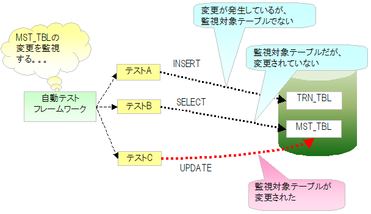

# マスタデータ復旧機能

## 概要

マスタメンテナンス機能等のテストでマスタデータを変更した場合、以降のテストクラスでマスタデータが意図しない状態になりテストが失敗することがある。自動テスト中にマスタデータが更新された場合、テストメソッド終了時点でマスタデータを元の状態に自動復旧する機能。

<details>
<summary>keywords</summary>

マスタデータ復旧機能, 自動復旧, テスト失敗防止, マスタデータ変更, テストメソッド終了時

</details>

## 特徴

- テスト実行順序に依存せず、常に正しい状態のマスタデータでテスト可能
- マスタデータ復旧は自動実行されるため、各テストクラスで復旧処理・復旧用データの準備が不要
- バックアップスキーマからテーブル単位で一括復旧するため、1件ずつINSERTより高速

<details>
<summary>keywords</summary>

バックアップスキーマ, 一括復旧, 高速復旧, テスト実行順序, 自動復旧

</details>

## 動作イメージ

動作フロー:

1. コンポーネント設定ファイルから監視対象テーブル名一覧を取得
2. テスト実行中、SQLログを監視して監視対象テーブルを変更するSQL文の発行を検出
3. 変更SQL発行が検出された場合、テストメソッド終了後に該当テーブルを復旧:
   1. テーブル内レコードを全件DELETE
   2. バックアップスキーマのテーブルからレコードを全件INSERT




<details>
<summary>keywords</summary>

SQLログ監視, 変更検出, 全件DELETE, 全件INSERT, 監視対象テーブル, MasterDataRestorer

</details>

## 環境構築: バックアップ用スキーマの作成・データ投入

マスタデータ復旧用スキーマを作成し、自動テスト用スキーマと同じテーブルを作成して復旧用データを投入する。

> **注意**: 復旧対象テーブルのみ作成すればよい（全テーブル作成不要。復旧対象外のテーブルが存在しても問題ない）。

<details>
<summary>keywords</summary>

バックアップスキーマ作成, マスタデータ復旧用スキーマ, 復旧用データ投入, テーブル作成

</details>

## 環境構築: コンポーネント設定ファイルへの監視対象テーブル記載

自動テスト用コンポーネント設定ファイルに監視対象テーブルを設定する。

| プロパティ名 | 説明 | デフォルト値 |
|---|---|---|
| backupSchema | マスタデータ復旧用スキーマ名 | なし |
| tablesTobeWatched | 監視対象テーブル名（リスト形式） | なし |
| testEventListeners | テストイベントリスナー一覧。`nablarch.test.core.db.MasterDataRestorer` を登録するとテストメソッド終了時にマスタデータ復旧が実行される | なし |

```xml
<component name="masterDataRestorer"
           class="nablarch.test.core.db.MasterDataRestorer">
  <property name="backupSchema" value="nablarch_test_master"/>
  <property name="tablesTobeWatched">
    <list>
      <value>MESSAGE</value>
      <value>ID_GENERATE</value>
      <value>BUSINESS_DATE</value>
      <value>PERMISSION_UNIT</value>
      <value>REQUEST</value>
      <value>PERMISSION_UNIT_REQUEST</value>
    </list>
  </property>
</component>
```

<details>
<summary>keywords</summary>

MasterDataRestorer, backupSchema, tablesTobeWatched, testEventListeners, コンポーネント設定, 監視対象テーブル

</details>

## 環境構築: ログ出力設定

SQLログを監視してマスタデータへの変更を検出するため、以下のログ設定が必要。

**app-log.properties**: `sqlLogFormatter.className` に本機能のクラスを指定する。

```
sqlLogFormatter.className=nablarch.test.core.db.MasterDataRestorer$SqlLogWatchingFormatter
```

**log.properties**: SQLログをDEBUGレベル以上で出力する設定が必要。

```
loggerFactory.className=nablarch.core.log.basic.BasicLoggerFactory
writerNames=stdout,nop
writer.stdout.className=nablarch.core.log.basic.StandardOutputLogWriter
writer.nop.className=nablarch.test.core.log.NopLogWriter
availableLoggersNamesOrder=sql,root
loggers.root.nameRegex=.*
loggers.root.level=DEBUG
loggers.root.writerNames=stdout
loggers.sql.nameRegex=SQL
loggers.sql.level=DEBUG
loggers.sql.writerNames=nop
```

> **注意**: `loggers.sql.level` はDEBUGレベル以上に設定すること。

<details>
<summary>keywords</summary>

SqlLogWatchingFormatter, NopLogWriter, BasicLoggerFactory, StandardOutputLogWriter, sqlLogFormatter, ログ出力設定, app-log.properties, log.properties

</details>
