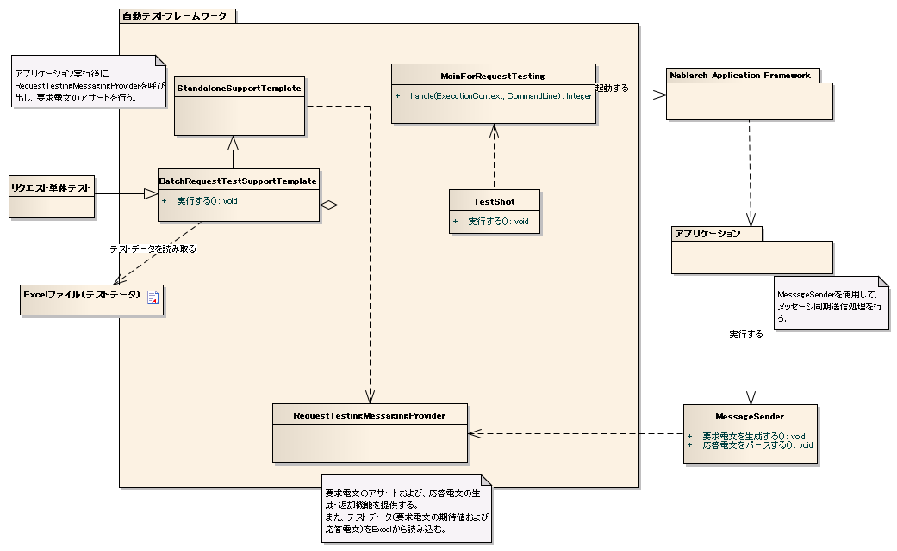

# リクエスト単体テスト（同期応答メッセージ送信処理）

## 概要・全体像

## 概要・全体像

要求電文1件をキューに送信し、結果を同期的に受信する際の動作を擬似的に再現してテストを行う。

> **注意**: 同期応答メッセージ送信処理のリクエスト単体テストを行う場合、テストケースの親クラスは以下の２クラスのうちのいずれかを継承する必要がある。
> - `StandaloneTestSupportTemplate`
> - `AbstractHttpRequestTestTemplate`

keywords

StandaloneTestSupportTemplate, AbstractHttpRequestTestTemplate, 同期応答メッセージ送信処理, 親クラス選択, バッチ処理, 要求電文送信

## 主なクラス・リソース

## 主なクラス・リソース

| 名称 | 役割 | 作成単位 |
|---|---|---|
| リクエスト単体テストクラス | テストロジックを実装する | テスト対象クラス(Action)につき１つ |
| Excelファイル（テストデータ） | 要求電文の期待値および応答電文などのテストデータを記載する | テストクラスにつき１つ |
| `StandaloneTestSupportTemplate` | Action実行後に`MockMessagingContext`を用いて要求電文のアサートを実行する | － |
| `AbstractHttpRequestTestTemplate` | Action実行後に`MockMessagingContext`を用いて要求電文のアサートを実行する | － |
| `MessageSender` | 同期応答メッセージ送信処理で使用するコンポーネント | － |
| `RequestTestingMessagingProvider` | 要求電文のアサート機能および応答電文の生成・返却機能を提供する | － |

keywords

StandaloneTestSupportTemplate, AbstractHttpRequestTestTemplate, MessageSender, RequestTestingMessagingProvider, MockMessagingContext, テストクラス, Excelファイル

## StandaloneTestSupportTemplate

## StandaloneTestSupportTemplate

Action実行後に`MockMessagingContext`を用いて要求電文のアサートを行う機能を持つクラス。

同期応答メッセージ送信処理のリクエスト単体テストを行う場合、処理の形態に合わせて本クラスまたは`AbstractHttpRequestTestTemplate`を実装したテストケースを使用する必要がある。

keywords

StandaloneTestSupportTemplate, MockMessagingContext, 要求電文アサート, 同期応答メッセージ送信テスト

## AbstractHttpRequestTestTemplate

## AbstractHttpRequestTestTemplate

Action実行後に`MockMessagingContext`を用いて要求電文のアサートを行う機能を持つクラス。

同期応答メッセージ送信処理のリクエスト単体テストを行う場合、処理の形態に合わせて本クラスまたは`StandaloneTestSupportTemplate`を実装したテストケースを使用する必要がある。

keywords

AbstractHttpRequestTestTemplate, MockMessagingContext, 要求電文アサート, 同期応答メッセージ送信テスト

## RequestTestingMessagingProvider

## RequestTestingMessagingProvider

要求電文のアサートおよび応答電文の生成・返却機能を提供するクラス。Excelに記載された要求電文の期待値と応答電文の読み込みも実行する。

| 準備処理 | 結果確認 |
|---|---|
| 応答電文の生成 | 要求電文のアサート |

> **注意**: 要求電文のアサートは、要求電文が送信されるたびに行うのではなく、Action実行後に一括で行う。

keywords

RequestTestingMessagingProvider, 要求電文アサート, 応答電文生成, MockMessagingContext, 一括アサート, Excelテストデータ読み込み

## MessageSender

## MessageSender

同期応答メッセージ送信処理で使用するコンポーネント。主な機能:

1. 呼び出し元から渡されたパラメータから要求電文を生成する
2. 要求電文を元に`MockMessagingContext`を実行する
3. `MockMessagingContext`から返却された応答電文をパースする
4. パース結果のオブジェクトを呼び出し元に返却する

keywords

MessageSender, 要求電文生成, MockMessagingContext, 応答電文パース, 同期応答メッセージ

## テストデータ

## テストデータ - 同期応答メッセージ送信処理

基本的な記述方法は、同期応答メッセージ送信処理のテストデータ記述方法に関するドキュメントを参照。

> **注意**: パディングおよびバイナリデータの扱いは、固定長ファイルの取り扱いと同様である。

keywords

テストデータ, 同期応答メッセージ送信処理, パディング, バイナリデータ, 固定長

