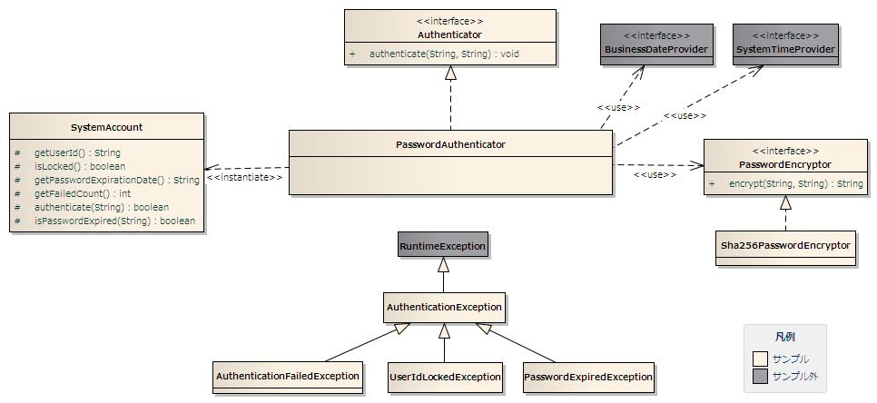

# データベースを用いたパスワード認証機能サンプル

本サンプルは、データベースに保存されたアカウント情報(ユーザID、パスワード)を使用して認証処理を行う実装サンプルである。

## 提供パッケージ

本サンプルは、以下のパッケージで提供される。

*please.change.me.* **common.authentication**

## 概要

Webアプリケーションにおけるユーザの認証(ユーザIDとパスワードによる認証)を行う機能の実装サンプルを提供する。

本サンプルは、ログイン処理を実行する業務処理 [1] の中で使用することを想定している。

> **Note:**
> Nablarch導入プロジェクトでは、要件を満たすよう本サンプル実装を修正し使用すること。

本機能では、ログイン処理を実行する業務処理は提供しない。
Nablarch導入プロジェクトにて、要件に応じてログイン処理を作成すること。

## 構成

本サンプルの構成を示す。

### クラス図



#### 各クラスの責務

##### インタフェース定義

| インタフェース名 | 概要 |
|---|---|
| Authenticator | ユーザの認証を行うインタフェース。 |
| PasswordEncryptor | パスワードの暗号化を行うインタフェース。 |

##### クラス定義

a) Authenticatorの実装クラス

| クラス名 | 概要 |
|---|---|
| PasswordAuthenticator | データベースに保存されたアカウント情報に対してパスワード認証を行うクラス。 |

b) PasswordEncryptorの実装クラス

| クラス名 | 概要 |
|---|---|
| Sha256PasswordEncryptor | SHA256を使用してパスワードの暗号化を行うクラス。 |

c) その他のクラス

| クラス名 | 概要 |
|---|---|
| SystemAccount | ユーザのアカウント情報を保持するクラス。 |

d) 例外クラス

| クラス名 | 概要 |
|---|---|
| AuthenticationException | ユーザの認証に失敗した場合に発生する例外。  認証処理に関する例外の基底クラス。 認証方式に応じて、本クラスを継承した例外クラスを作成する。 本クラス及びサブクラスでは、ユーザへ提示するメッセージの作成に 必要な情報を保持し、メッセージの作成は行わない。 |
| AuthenticationFailedException | アカウント情報の不一致により認証に失敗した場合に発生する例外。  対象ユーザのユーザIDを保持する。 |
| PasswordExpiredException | ユーザの認証時にパスワードの有効期限が切れている場合に発生する例外。  対象ユーザのユーザID、パスワード有効期限とチェックに使用した業務日付を保持する。 |
| UserIdLockedException | ユーザの認証時にユーザIDがロックされている場合に発生する例外。  対象ユーザのユーザIDとユーザIDをロックする認証失敗回数を保持する。 |

##### テーブル定義

本サンプルで使用しているアカウントテーブルの定義を以下に示す。
本サンプルを導入プロジェクトに取り込む際には、導入プロジェクトのテーブル定義に従いSQLファイル及びソースコードの修正を行うこと。

**システムアカウント(SYSTEM_ACCOUNT)**

システムアカウントテーブルには、アカウント情報を格納する。

| 論理名 | 物理名 | Javaの型 | 制約 |
|---|---|---|---|
| ユーザID | USER_ID | java.lang.String | 主キー |
| パスワード | PASSWORD | java.lang.String |  |
| ユーザIDロック | USER_ID_LOCKED | java.lang.String | ロックしていない場合は"0"、ロックしている場合は"1" |
| パスワード有効期限 | PASSWORD_EXPIRATION_DATE | java.lang.String | 書式 yyyyMMdd  指定しない場合は"99991231" |
| 認証失敗回数 | FAILED_COUNT | int |  |
| 有効日(From) | EFFECTIVE_DATE_FROM | java.lang.String | 書式 yyyyMMdd  指定しない場合は"19000101" |
| 有効日(To) | EFFECTIVE_DATE_TO | java.lang.String | 書式 yyyyMMdd  指定しない場合は"99991231" |
| 最終ログイン日時 | LAST_LOGIN_DATE_TIME | java.sql.Timestamp |  |

> **Note:**
> 上記テーブル定義には、本サンプルで必要となる属性のみを列挙している。
> Nablarch導入プロジェクトでは、必要なユーザ属性を本テーブルに追加したり、本テーブルと1対1で紐づくユーザ情報テーブルなどを作成し要件を満たすようテーブル設計を行うこと。

## 使用方法

データベースに保存したアカウント情報を使用したパスワード認証の使用方法について解説する。

パスワード認証の特徴を下記に示す。

* 認証時にアカウント情報の有効日（From/To）をチェックする。
* 認証時にパスワードの有効期限をチェックする。
* 連続で指定回数認証に失敗するとユーザIDにロックをかける。指定回数に達するまでに認証に成功すると失敗回数をリセットする。
* 暗号化されたパスワードを使用して認証を行う。本機能は、デフォルトでSHA256を使用したパスワードの暗号化を提供する。
* 最終ログイン日時を記録する。認証に成功した場合のみシステム日時を使用して最終ログイン日時を更新する。

### PasswordAuthenticatorの使用方法

PasswordAuthenticatorの使用方法について解説する。

```xml
<component name="authenticator" class="please.change.me.common.authentication.PasswordAuthenticator">

  <!-- ユーザIDをロックする認証失敗回数 -->
  <property name="failedCountToLock" value="3"/>

  <!-- パスワードを暗号化するPasswordExcryptor -->
  <property name="passwordEncryptor">
    <component class="please.change.me.common.authentication.Sha256PasswordEncryptor"/>
  </property>

  <!-- データベースへのトランザクション制御を行うクラス -->
  <property name="dbManager">
    <component class="nablarch.core.db.transaction.SimpleDbTransactionManager">
      <property name="dbTransactionName" value="authenticator"/>
      <property name="connectionFactory" ref="connectionFactory"/>
      <property name="transactionFactory" ref="transactionFactory"/>
    </component>
  </property>

  <!-- 業務日付 -->
  <property name="businessDateProvider" ref="businessDateProvider" />
  <!-- システム日付 -->
  <property name="systemTimeProvider" ref="systemTimeProvider" />
</component>

<component name="businessDateProvider" class="nablarch.core.date.BasicBusinessDateProvider" />
<component name="systemTimeProvider" class="nablarch.core.date.BasicSystemTimeProvider" />
```

プロパティの説明を下記に示す。

| property名 | 設定内容 |
|---|---|
| failedCountToLock | ユーザIDをロックする認証失敗回数。  指定しない場合は0となり、ユーザIDのロック機能を使用しないことになる。 |
| passwordEncryptor | パスワードの暗号化に使用するPasswordExcryptor。  指定しない場合はSha256PasswordEncryptorを使用する。 |
| dbManager(必須) | データベースへのトランザクション制御を行うSimpleDbTransactionManager。  nablarch.core.db.transaction.SimpleDbTransactionManagerクラスのインスタンスを指定する。  > **Warning:** > PasswordAuthenticatorのトランザクション制御が個別アプリケーションの処理に影響を与えないように、個別アプリケーションとは別のトランザクションを使用するように設定すること。 > 設定例では、dbTransactionNameに"authenticator"という名前を指定しているので、個別アプリケーションでは同じ名前を使用しないようにトランザクションの設定を行う。 |
| systemTimeProvider(必須) | システム日時の取得に使用するSystemTimeProvider。  nablarch.core.date.SystemTimeProviderインタフェースを実装したクラスのインスタンスを指定する。 システム日時は最終ログイン日時の更新に使用する。 |
| businessDateProvider(必須) | 業務日付の取得に使用するBusinessDateProvider。  nablarch.core.date.BusinessDateProviderインタフェースを実装したクラスのインスタンスを指定する。 業務日付は、有効日（From/To）とパスワード有効期限のチェックに使用する。 |

#### PasswordAuthenticatorの使用例

本サンプルを使用した場合の認証処理の実装例を示す。

導入プロジェクトでは、本実装例を参考にし要件を満たす認証処理を実装すること。

```java
// 事前に認証を行うためのユーザID及びパスワードを取得する。
String userId = ・・・;
Strign password = ・・・;

try {

    // PasswordAuthenticatorは、SystemRepositoryから事前に取得すること。
    authenticator.authenticate(userId, password);

} catch (AuthenticationFailedException e) {

    // 認証に失敗した場合の処理

} catch (UserIdLockedException e) {

    // ユーザIDがロックされていた場合の処理

} catch (PasswordExpiredException e) {

    // パスワードの有効期限が切れていた場合の処理

}
```

> **Note:**
> 上記の例では、認証エラーの状態により細かく処理を分けているが、
> 細かく処理を分ける必要がない場合には、以下のように上位の例外クラスを補足して処理を行えば良い。

> ```java
> try {
> 
>     authenticator.authenticate(credentials);
> 
> } catch (AuthenticationException e) {
>     // 例外の処理
> }
> ```
