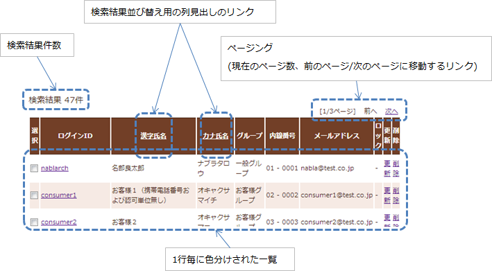
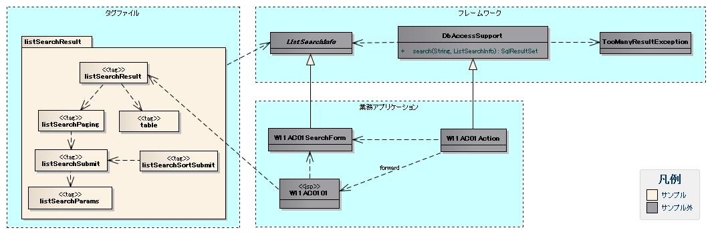
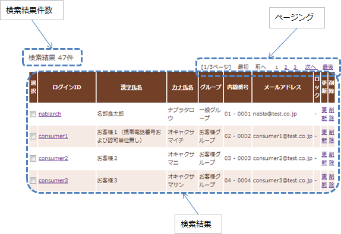

# 検索結果の一覧表示

## 提供パッケージ

提供パッケージ: `resources/META-INF/tags/listSearchResult`

## nbs:listSearchResult の検索結果関連属性

| 属性名 | 必須 | 説明 |
|---|---|---|
| resultSetName | ○ | 検索結果をリクエストスコープから取得する際に使用する名前 |
| headerRowFragment | ○ | ヘッダ行のJSPフラグメント（:ref:`ListSearchResult_TableElement` 参照） |
| bodyRowFragment | ○ | ボディ行のJSPフラグメント（:ref:`ListSearchResult_TableElement` 参照） |

## 検索結果件数

`useResultCount`属性が`true`（デフォルト: `true`）かつ検索結果がリクエストスコープに存在する場合に表示される。

デフォルト書式:

```jsp
検索結果 <%-- ListSearchInfoのresultCountプロパティ --%>件
```

`resultCountFragment`属性にJSPフラグメントを指定することでカスタム書式に変更可能。フラグメント内では`listSearchInfoName`属性で指定した名前でListSearchInfoオブジェクトにアクセス可能。

```jsp
<nbs:listSearchResult listSearchInfoName="11AC_W11AC01"
                    searchUri="/action/ss11AC/W11AC01Action/RW11AC0102"
                    resultSetName="searchResult">
    <jsp:attribute name="resultCountFragment">
       [サーチ結果 <n:write name="searchCondition.resultCount" />頁]
    </jsp:attribute>
</nbs:listSearchResult>
```

## ページング

`usePaging`属性が`true`（デフォルト: `true`）の場合に表示される。ページング全体は検索結果件数が1件以上の場合に表示される。

| ページング要素 | 表示ルール |
|---|---|
| 現在のページ番号 | 常に表示 |
| 最初、前へ、次へ、最後 | 遷移可能な場合はサブミット可能な状態で表示。遷移不可の場合はリンクならラベル、ボタンなら使用不可状態で表示 |
| ページ番号（1..n） | 総ページ数が2以上の場合のみ全ページ番号を表示 |

カスタマイズ可能な設定（全属性は :ref:`ListSearchResult_Tag` 参照）:
- 各画面要素の使用有無
- 各画面要素のラベル（最初、前へ、次へ、最後など）。現在のページ番号はJSPフラグメントで変更可能。ページ番号のラベルは変更不可。
- 各サブミット要素に使用するタグ（n:submitLink、n:submit、n:buttonのいずれか）

**ページング時の検索条件の注意点**

ページング時は前回検索時の条件（現在表示の検索結果を取得した条件）を使用する。検索条件を変更後にページングした場合、変更した検索条件の値は破棄される。

検索条件の維持にはウィンドウスコープを使用するため、検索条件と検索結果一覧を同一画面に配置する場合は、それぞれのフォームを分けて実装する必要がある。

**検索結果が減少した場合の動作**

指定されたページ番号に基づき検索を実施してページング表示を行う。検索結果減少時でも現在のページ番号とサブミット要素の対応が保たれ、操作不能な状態にはならない。

例（取得件数20件/ページで3ページ目表示中に検索結果が44件→10件に減少し、2ページ目を選択した場合）:

| ページング要素 | 表示内容 |
|---|---|
| 現在のページ番号 | 2/1ページ（2ページ目が指定され、検索結果20件以下のため） |
| 最初、前へ | リンク表示（前ページへ遷移可能） |
| 次へ、最後 | ラベル表示（次ページへ遷移不可） |
| ページ番号 | 非表示（総ページ数が1のため） |

この状態からさらに「前へ」を選択すると、現在のページ番号と総ページ数の対応が正常な状態に戻る。なお、検索フォームから検索しなおした場合は1ページ目からの検索結果となる。

## 検索結果テーブル

検索結果はリクエストスコープに存在する場合は常に表示される。0件の場合はヘッダ行のみ表示される。

ヘッダ行は`headerRowFragment`属性、ボディ行は`bodyRowFragment`属性にJSPフラグメントで指定する。ボディ行のJSPフラグメントはJSTLの`c:forEach`タグのループ内で呼び出される。

ボディ行フラグメントで行データとステータスにアクセスするための属性:

| 属性名 | デフォルト値 | 説明 |
|---|---|---|
| varRowName | `"row"` | 行データ（c:forEachのvar属性）を参照する変数名 |
| varStatusName | `"status"` | ステータス（c:forEachのstatus属性）を参照する変数名 |
| varCountName | `"count"` | ステータスのcountプロパティを参照する変数名 |
| varRowCountName | `"rowCount"` | 検索結果のカウント（取得開始位置＋ステータスカウント）を参照する変数名 |

> **注意**: `n:write`タグでステータスにアクセスするとエラーが発生する。`n:set`タグを使用すること。
> ```jsp
> <n:set var="rowCount" value="${status.count}" />
> <n:write name="rowCount" />
> ```

1行おきに背景色を変えるためのclass属性関連:

| 属性名 | デフォルト値 | 説明 |
|---|---|---|
| varOddEvenName | `"oddEvenCss"` | ボディ行のclass属性を参照する変数名 |
| oddValue | `"nablarch_odd"` | 奇数行のclass属性値 |
| evenValue | `"nablarch_even"` | 偶数行のclass属性値 |

ユーザ検索の実装例:

```jsp
<nbs:listSearchResult listSearchInfoName="11AC_W11AC01"
                      searchUri="/action/ss11AC/W11AC01Action/RW11AC0102"
                      resultSetName="searchResult">
    <jsp:attribute name="headerRowFragment">
        <tr>
            <th>ログインID</th>
            <th>漢字氏名</th>
            <th>カナ氏名</th>
            <th>グループ</th>
            <th>内線番号</th>
            <th>メールアドレス</th>
        </tr>
    </jsp:attribute>
    <jsp:attribute name="bodyRowFragment">
        <tr class="<n:write name='oddEvenCss' />">
            <td>[<n:write name="count" />]<br/>[<n:write name="rowCount" />]<br/><n:write name="row.loginId" /></td>
            <td><n:write name="row.kanjiName" /></td>
            <td><n:write name="row.kanaName" /></td>
            <td><n:write name="row.ugroupId" />:<n:write name="row.ugroupName" /></td>
            <td><n:write name="row.extensionNumberBuilding" />-<n:write name="row.extensionNumberPersonal" /></td>
            <td><n:write name="row.mailAddress" /></td>
        </tr>
    </jsp:attribute>
</nbs:listSearchResult>
```

## 検索処理の実装方法

検索結果の並び替えは、:ref:`ListSearchResult_ListSearchSortSubmitTag` と可変ORDER BY構文（ORDER BY句を動的に変更）を組み合わせて実現する。

`$sort (sortId)` 構文により、検索条件オブジェクトの`sortId`フィールドの値に応じてORDER BY句が動的に決まる。例えば`sortId`が`kanaName_asc`の場合、ORDER BY句は`ORDER BY USR.KANA_NAME, SA.LOGIN_ID`に変換される。

```sql
SELECT ... FROM ... WHERE ...
$sort (sortId) {
    (kanjiName_asc  USR.KANJI_NAME, SA.LOGIN_ID)
    (kanjiName_desc USR.KANJI_NAME DESC, SA.LOGIN_ID)
    (kanaName_asc   USR.KANA_NAME, SA.LOGIN_ID)
    (kanaName_desc  USR.KANA_NAME DESC, SA.LOGIN_ID) }
```

`ListSearchInfo`は`sortId`プロパティを持つ。並び替えを使用する場合は`sortId`を入力精査に含める。

`ListSearchInfo`継承クラスの実装例（`W11AC01SearchForm`）:

```java
public class W11AC01SearchForm extends ListSearchInfo {
    public W11AC01SearchForm(Map<String, Object> params) {
        // 検索条件のプロパティ設定は省略。
        setSortId((String) params.get("sortId"));
    }
    @PropertyName("ソートID")
    @Required
    public void setSortId(String sortId) {
        super.setSortId(sortId);
    }
    private static final String[] SEARCH_COND_PROPS = new String[] { ..., "sortId"};
    public String[] getSearchConditionProps() {
        return SEARCH_COND_PROPS;
    }
}
```

検索処理の設定（最大件数・1ページ取得件数）はリポジトリ機能の環境設定ファイルで指定する。ListSearchInfo生成時にリポジトリから取得され、設定値がない場合は以下のデフォルト値が適用される。

| プロパティ名 | 設定内容 | デフォルト値 |
|---|---|---|
| nablarch.listSearch.maxResultCount | 検索結果の最大件数（上限） | 200 |
| nablarch.listSearch.max | 1ページの表示件数 | 20 |

個別機能のみ設定値を変更する場合:
- 画面表示設定: JSP上で :ref:`ListSearchResult_Tag` の属性を指定
- ページング検索設定: ActionメソッドでListSearchInfoを継承したクラスに値を設定

最大件数50・表示件数10に変更する実装例:

```java
public class W11AC01Action extends DbAccessSupport {
    private static final int MAX_ROWS = 10;
    private static final int MAX_RESULT_COUNT = 50;

    @OnError(type = ApplicationException.class, path = "/ss11AC/W11AC0101.jsp")
    public HttpResponse doRW11AC0102(HttpRequest req, ExecutionContext ctx) {
        W11AC01SearchForm condition = ... ;
        condition.setMax(MAX_ROWS);
        condition.setMaxResultCount(MAX_RESULT_COUNT);
    }
}
```

<details>
<summary>keywords</summary>

listSearchResult, META-INF/tags, 提供パッケージ, タグファイル, nbs:listSearchResult, ListSearchResult, listSearchInfoName, resultSetName, headerRowFragment, bodyRowFragment, useResultCount, resultCountFragment, usePaging, varRowName, varStatusName, varCountName, varRowCountName, varOddEvenName, oddValue, evenValue, ListSearchInfo, 検索結果件数, ページング, 検索条件維持, ウィンドウスコープ, 検索結果テーブル, W11AC01SearchForm, sortId, @PropertyName, @Required, getSearchConditionProps, setSortId, 並び替え, ソート, 可変ORDER BY, nablarch.listSearch.maxResultCount, nablarch.listSearch.max, 検索結果最大件数, ページング表示件数, setMax, setMaxResultCount, DbAccessSupport, ApplicationException, OnError

</details>

## 概要

listSearchResultタグファイルは、フレームワークの一覧検索機能と連携して以下を提供:

- 検索結果件数の表示
- 全件一覧表示
- ページング（指定件数毎の表示）
- 検索結果の並び替え



なし

## listSearchSortSubmitタグ

並び替え用のサブミット要素を出力するタグ。

| 属性 | 必須 | デフォルト値 | 説明 |
|---|---|---|---|
| sortCss | | nablarch_sort | サブミットのclass属性（常に出力） |
| ascCss | | nablarch_asc | 昇順時に付加するCSSクラス（出力例: class="nablarch_sort nablarch_asc"） |
| descCss | | nablarch_desc | 降順時に付加するCSSクラス（出力例: class="nablarch_sort nablarch_desc"） |
| ascSortId | ○ | | 昇順ソートID |
| descSortId | ○ | | 降順ソートID |
| defaultSort | | asc | デフォルトのソート方向（asc/desc） |
| label | ○ | | サブミットのラベル |
| name | ○ | | タグのname属性（画面内で一意にすること） |
| listSearchInfoName | ○ | | ListSearchInfoをリクエストスコープから取得する名前 |

JSP実装例:

```jsp
<nbs:listSearchResult listSearchInfoName="11AC_W11AC01"
                    searchUri="/action/ss11AC/W11AC01Action/RW11AC0102"
                    resultSetName="searchResult"
                    usePageNumberSubmit="true"
                    useLastSubmit="true">
    <jsp:attribute name="headerRowFragment">
        <tr>
            <th>
                <nbs:listSearchSortSubmit ascSortId="kanjiName_asc" descSortId="kanjiName_desc"
                                        label="漢字氏名"
                                        uri="/action/ss11AC/W11AC01Action/RW11AC0102"
                                        name="kanjiNameSort"
                                        listSearchInfoName="11AC_W11AC01" />
            </th>
        </tr>
    </jsp:attribute>
</nbs:listSearchResult>
```

> **重要**: 並び替えのサブミット要素は常に先頭ページ（ページ番号: 1）を検索する。並び替えが変更された場合、変更前のページ番号は新しい並び順で意味のある位置ではないため。

並び替えのサブミット要素はウィンドウスコープを使用して検索条件を維持する（ページング使用時と同様）。

**現在の並び替え状態に応じたタグの動作**（`ascSortId="kanjiName_asc"`, `descSortId="kanjiName_desc"` の場合）:

| 検索に使用されたソートID | リクエスト送信するソートID | 使用されるCSSクラス |
|---|---|---|
| kanjiName_asc | descSortId の値（kanjiName_desc）を使用 | ascCss（nablarch_asc） |
| kanjiName_desc | ascSortId の値（kanjiName_asc）を使用 | descCss（nablarch_desc） |
| 他の列のソートID | defaultSort に応じて ascSortId（kanjiName_asc）を使用 | なし |

昇順・降順のCSS実装例（CSSクラス名はデフォルト名）:

```css
a.nablarch_sort {
    padding-right: 15px;
    background-position: 100% 0%;
    background-repeat: no-repeat;
}
a.nablarch_asc {
    background-image: url("../img/asc.jpg");
}
a.nablarch_desc {
    background-image: url("../img/desc.jpg");
}
```

タグファイルの配置:
- コピー元: `META-INF/tags/listSearchResult`
- コピー先: 業務アプリケーションの `/WEB-INF/tags` ディレクトリ

`/WEB-INF/tags/listSearchResult` に配置した場合のプレフィックス修正:

修正前:
```jsp
<%@ taglib prefix="nbs" uri="http://tis.co.jp/nablarch-biz-sample" %>
```
プレフィックス: `nbs`

修正後:
```jsp
<%@ taglib prefix="listSearchResult" tagdir="/WEB-INF/tags/listSearchResult" %>
```
プレフィックス: `listSearchResult`

<details>
<summary>keywords</summary>

listSearchResult, 検索結果件数表示, ページング, 並び替え, 一覧表示, ListSearchResult_Sort, ソート, listSearchSortSubmit, ascSortId, descSortId, sortCss, ascCss, descCss, defaultSort, label, name, listSearchInfoName, nablarch_sort, nablarch_asc, nablarch_desc, listSearchResultタグファイル, タグファイル配置, プレフィックス修正, taglib, WEB-INF/tags

</details>

## 構成

ページングを実現したい場合、フレームワークが提供するクラスとサンプル提供のタグファイルがページングに必要な処理を行うため、アプリケーションプログラマはページングを作り込みせずに実現できる。

**フレームワーク提供クラス**:

| クラス名 | 概要 |
|---|---|
| `DBAccessSupport` | 一覧検索用の検索を行うsearchメソッドを提供する |
| `ListSearchInfo` | 一覧検索用の情報を保持するクラス |
| `TooManyResultException` | 検索結果件数が上限を超えた場合に発生する例外 |

**タグファイル**:

| タグ名 | 概要 |
|---|---|
| `listSearchResult` | 検索結果の一覧表示タグ |
| `listSearchPaging` | ページング出力タグ |
| `listSearchSubmit` | ページングのサブミット要素出力タグ |
| `listSearchParams` | ページングのサブミット要素用変更パラメータ出力タグ |
| `table` | テーブル出力タグ |
| `listSearchSortSubmit` | ソート用サブミット要素出力タグ |



## 1画面にすべての検索結果を一覧表示する場合の実装方法

ページングなしで全件表示する場合の実装はページング使用時と基本的に同じ。ただし下記の変更が必要。

**Actionクラスでの必須設定**: 検索結果の最大件数（上限）を取得件数として設定する。ページングを使用しないためこの設定が必須となる。

```java
public class W11AC01Action extends DbAccessSupport {
    public HttpResponse doRW11AC0102(HttpRequest req, ExecutionContext ctx) {
        W11AC01SearchForm condition = searchConditionCtx.createObject();
        // 検索結果の取得件数(1ページの表示件数)に検索結果の最大件数(上限)を設定する。
        // ページングを使用しないため下記の設定が必須となる。
        condition.setMax(condition.getMaxResultCount());
        // 検索処理省略
    }
}
```

`W11AC01SearchForm`では`pageNumber`プロパティの設定は不要（初期値1のため常に1ページ目）。

```java
public class W11AC01SearchForm extends ListSearchInfo {
    public W11AC01SearchForm(Map<String, Object> params) {
        // pageNumberプロパティの設定は不要（初期値1）
    }
    private static final String[] SEARCH_COND_PROPS = new String[] { ... };
    public String[] getSearchConditionProps() {
        return SEARCH_COND_PROPS;
    }
}
```

JSPでは`usePaging="false"`を指定し、`searchUri`属性は不要。

```jsp
<nbs:listSearchResult listSearchInfoName="11AC_W11AC01"
                    usePaging="false"
                    resultSetName="searchResult">
</nbs:listSearchResult>
```

| タグ | 機能 |
|---|---|
| :ref:`ListSearchResult_Tag` | 検索結果の一覧表示 |
| :ref:`ListSearchResult_ListSearchSortSubmitTag` | 検索結果の一覧表示で並び替え対応の列見出しを出力 |

## listSearchSortSubmitタグ属性

| 属性 | 必須 | デフォルト値 | 説明 |
|---|---|---|---|
| tag | | submitLink | 並び替えサブミットに使用するNablarchタグ（submitLink/submit/button） |
| type | | | タグのtype属性（submit/button）。submitLinkの場合は使用しない |
| sortCss | | nablarch_sort | 並び替えサブミットのclass属性（常に出力） |
| ascCss | | nablarch_asc | 昇順時に付加するclass属性（例: class="nablarch_sort nablarch_asc"） |
| descCss | | nablarch_desc | 降順時に付加するclass属性（例: class="nablarch_sort nablarch_desc"） |
| ascSortId | ○ | | 昇順ソートID |
| descSortId | ○ | | 降順ソートID |
| defaultSort | | asc | デフォルトのソート（asc/desc） |
| label | ○ | | サブミットのラベル |
| name | ○ | | タグのname属性（画面内で一意にすること） |
| listSearchInfoName | ○ | | ListSearchInfoをリクエストスコープから取得する際の名前 |

<details>
<summary>keywords</summary>

DBAccessSupport, ListSearchInfo, TooManyResultException, listSearchResult, listSearchPaging, listSearchSubmit, listSearchParams, listSearchSortSubmit, table, クラス構成, 一覧検索, W11AC01SearchForm, W11AC01Action, DbAccessSupport, setMax, getMaxResultCount, usePaging, ページングなし, 全件表示, 1画面表示, listSearchResultタグ, listSearchSortSubmitタグ, タグリファレンス, 並び替え列見出し, ascSortId, descSortId, listSearchInfoName, sortCss, ascCss, descCss

</details>

## 使用方法

**クラス**: `DBAccessSupport`

`search`メソッドはSQL_IDと`ListSearchInfo`を受け取り以下を実行:
1. SQL_IDとListSearchInfoで検索結果件数を取得
2. 件数が上限を超える場合は`TooManyResultException`を送出
3. 超えない場合は検索実行し結果を返す（件数はListSearchInfoに設定）

SQL文はSELECT文のみ指定する。COUNT処理・ページング（開始位置・取得件数）はフレームワークが実行する。

`TooManyResultException`は検索結果の最大件数（上限）と実際の取得件数を保持する。

```java
W11AC01SearchForm condition = ...;
SqlResultSet searchResult = null;
try {
    searchResult = search("SELECT_USER_BY_CONDITION", condition);
} catch (TooManyResultException e) {
    throw new ApplicationException(
        MessageUtil.createMessage(MessageLevel.ERROR, "MSG00024", e.getMaxResultCount()));
}
```

## デフォルトの検索条件で検索した結果を初期表示する場合の実装方法

初期表示でデフォルト検索条件を使用する場合、検索条件がリクエストパラメータとして送信されないため、ページングで使用するウィンドウスコープに検索条件が存在しない。このため、アクションの初期表示処理でデフォルト検索条件をウィンドウスコープに設定する必要がある。

デフォルト検索条件のウィンドウスコープ設定には`ListSearchInfoUtil.setDefaultCondition()`を使用する（共通処理のためユーティリティとして提供）。JSPなどアクション初期表示処理以外は、通常のページングと実装方法は同じ。

**Actionクラスの初期表示処理の実装例**:

```java
public HttpResponse doRW11AC0101(HttpRequest req, ExecutionContext ctx) {
    W11AC01SearchForm condition = new W11AC01SearchForm();
    condition.setUserIdLocked("0");
    condition.setSortId("kanjiName_asc");
    condition.setDate("20130703");
    condition.setMoney(BigDecimal.valueOf(123456789.12d));

    // デフォルトの検索条件をリクエストスコープに設定（入力フォーム表示用）
    ctx.setRequestScopedVar("11AC_W11AC01", condition);

    // デフォルトの検索条件をウィンドウスコープに設定（ページング用）
    ListSearchInfoUtil.setDefaultCondition(req, "11AC_W11AC01", condition);

    SqlResultSet searchResult;
    try {
        searchResult = selectByCondition(condition);
    } catch (TooManyResultException e) {
        throw new ApplicationException(MessageUtil.createMessage(MessageLevel.ERROR, "MSG00035", e.getMaxResultCount()));
    }

    ctx.setRequestScopedVar("searchResult", searchResult);
    ctx.setRequestScopedVar("resultCount", condition.getResultCount());

    return new HttpResponse("/ss11AC/W11AC0101.jsp");
}
```

listSearchResultタグの全体属性:

| 属性 | 必須 | デフォルト値 | 説明 |
|---|---|---|---|
| listSearchInfoName | | | ListSearchInfoをリクエストスコープから取得する際の名前。未指定の場合は「検索結果件数」および「ページング」を表示しない（一括削除確認画面など一覧表示のみの場合は指定しない） |
| listSearchResultWrapperCss | | nablarch_listSearchResultWrapper | ページング付きテーブル全体（検索結果件数・ページング・検索結果）をラップするdivのclass属性 |

<details>
<summary>keywords</summary>

DBAccessSupport, search, ListSearchInfo, TooManyResultException, SQL_ID, ApplicationException, SqlResultSet, MessageUtil, 一覧検索, ページング検索, 検索上限, ListSearchInfoUtil, setDefaultCondition, W11AC01SearchForm, MessageLevel, デフォルト検索条件, 初期表示, ウィンドウスコープ, listSearchInfoName, listSearchResultWrapperCss, listSearchResultタグ全体属性, 一覧表示ラッパー

</details>

## ListSearchInfoクラス

**クラス**: `ListSearchInfo`

検索条件を保持するクラスは`ListSearchInfo`を継承して作成する。

継承クラスの必須実装:
- `pageNumber`（取得対象のページ番号）を他の検索条件と同様に入力精査に含める

アクションの必須実装:
- 検索結果表示時、ListSearchInfoを継承したクラスのオブジェクトをリクエストスコープに設定する

```java
public class W11AC01SearchForm extends ListSearchInfo {
    public W11AC01SearchForm(Map<String, Object> params) {
        setPageNumber((Integer) params.get("pageNumber"));
    }

    @PropertyName("ページ番号")
    @Required
    @NumberRange(max = 10, min = 1)
    @Digits(integer = 2)
    public void setPageNumber(Integer pageNumber) {
        super.setPageNumber(pageNumber);
    }

    private static final String[] SEARCH_COND_PROPS = new String[] { ..., "pageNumber"};

    public String[] getSearchConditionProps() {
        return SEARCH_COND_PROPS;
    }
}
```

```java
public class W11AC01Action extends DbAccessSupport {
    @OnError(type = ApplicationException.class, path = "/ss11AC/W11AC0101.jsp")
    public HttpResponse doRW11AC0102(HttpRequest req, ExecutionContext ctx) {
        ValidationContext<W11AC01SearchForm> searchConditionCtx = ...;
        searchConditionCtx.abortIfInvalid();

        UserSearchCondition condition = searchConditionCtx.createObject();
        ctx.setRequestScopedVar("11AC_W11AC01", condition);

        SqlResultSet searchResult = null;
        try {
            searchResult = search("SELECT_USER_BY_CONDITION", condition);
        } catch (TooManyResultException e) {
            throw new ApplicationException(
                MessageUtil.createMessage(MessageLevel.ERROR, "MSG00024", e.getMaxResultCount()));
        }

        ctx.setRequestScopedVar("searchResult", searchResult);
        return new HttpResponse("/ss11AC/W11AC0101.jsp");
    }
}
```

| 属性 | デフォルト値 | 説明 |
|---|---|---|
| useResultCount | true | 検索結果件数を表示するか否か |
| resultCountCss | nablarch_resultCount | 検索結果件数をラップするdivのclass属性 |
| resultCountFragment | "検索結果 <PagingInfoのresultCountプロパティ>件" | 検索結果件数を出力するJSPフラグメント |

<details>
<summary>keywords</summary>

ListSearchInfo, pageNumber, W11AC01SearchForm, W11AC01Action, DbAccessSupport, @PropertyName, @Required, @NumberRange, @Digits, @OnError, リクエストスコープ, 入力精査, 検索条件, ValidationContext, HttpRequest, HttpResponse, ExecutionContext, UserSearchCondition, useResultCount, resultCountCss, resultCountFragment, 検索結果件数表示

</details>

## listSearchResultタグ

**タグ**: `listSearchResult`

検索結果のリスト表示を行うタグ。`resultSetName`属性で指定した検索結果がリクエストスコープに存在しない場合は何も出力しない（検索画面の初期表示で該当）。



| 属性 | 必須 | デフォルト値 | 説明 |
|---|---|---|---|
| usePaging | | true | ページングを表示するか否か |
| searchUri | ○(ページング表示時) | | ページングのサブミット要素に使用するURI。ページングを表示する場合は必ず指定すること |
| pagingPosition | | top | ページングの表示位置（top/bottom/both/none） |
| pagingCss | | nablarch_paging | ページングのサブミット要素全体をラップするdivのclass属性 |

<details>
<summary>keywords</summary>

listSearchResult, resultSetName, 一覧表示, 初期表示, ページング, usePaging, searchUri, pagingPosition, pagingCss, ページング表示

</details>

## 全体

`listSearchResult`タグの全体設定属性:

| 属性 | 説明 |
|---|---|
| `listSearchInfoName` | ListSearchInfoをリクエストスコープから取得する際に使用する名前。指定がない場合は「検索結果件数」および「ページング」を表示しない。一括削除確認画面など一覧表示のみを行う場合は指定しない。 |

| 属性 | デフォルト値 | 説明 |
|---|---|---|
| useCurrentPageNumber | true | 現在のページ番号を使用するか否か |
| currentPageNumberCss | nablarch_currentPageNumber | 現在のページ番号をラップするdivのclass属性 |
| currentPageNumberFragment | "[<PagingInfoのcurrentPageNumberプロパティ>/<PagingInfoのpageCountプロパティ>ページ]" | 現在のページ番号を出力するJSPフラグメント |

<details>
<summary>keywords</summary>

listSearchInfoName, listSearchResult属性, 検索結果件数非表示, ページング非表示, useCurrentPageNumber, currentPageNumberCss, currentPageNumberFragment, 現在ページ番号表示

</details>

## 検索結果件数

`listSearchResult`タグの検索結果件数表示属性:

| 属性 | デフォルト | 説明 |
|---|---|---|
| `useResultCount` | `true` | 検索結果件数を表示するか否か |

| 属性 | デフォルト値 | 説明 |
|---|---|---|
| useFirstSubmit | false | 最初のページに遷移するサブミットを使用するか否か |
| firstSubmitTag | submitLink | Nablarchタグ（submitLink/submit/button） |
| firstSubmitType | | タグのtype属性（submit/button）。submitLinkの場合は使用しない |
| firstSubmitCss | nablarch_firstSubmit | ラップするdivのclass属性 |
| firstSubmitLabel | 最初 | ラベル |
| firstSubmitName | firstSubmit | name属性。表示位置サフィックスが付加される（上側: _top、下側: _bottom）。例: firstSubmit_top |

<details>
<summary>keywords</summary>

useResultCount, 検索結果件数表示, listSearchResult属性, useFirstSubmit, firstSubmitTag, firstSubmitType, firstSubmitCss, firstSubmitLabel, firstSubmitName, 最初ページ遷移

</details>

## ページング

`listSearchResult`タグのページング属性:

| 属性 | 必須 | デフォルト | 説明 |
|---|---|---|---|
| `usePaging` | | `true` | ページングを表示するか否か |
| `searchUri` | ○ | | ページングのサブミット要素に使用するURI。ページングを表示する場合は必ず指定すること |

| 属性 | デフォルト値 | 説明 |
|---|---|---|
| usePrevSubmit | true | 前のページに遷移するサブミットを使用するか否か |
| prevSubmitTag | submitLink | Nablarchタグ（submitLink/submit/button） |
| prevSubmitType | | タグのtype属性（submit/button）。submitLinkの場合は使用しない |
| prevSubmitCss | nablarch_prevSubmit | ラップするdivのclass属性 |
| prevSubmitLabel | 前へ | ラベル |
| prevSubmitName | prevSubmit | name属性。表示位置サフィックスが付加される（例: prevSubmit_top） |

<details>
<summary>keywords</summary>

usePaging, searchUri, ページング表示, listSearchResult属性, usePrevSubmit, prevSubmitTag, prevSubmitType, prevSubmitCss, prevSubmitLabel, prevSubmitName, 前ページ遷移

</details>

## ページ番号(ページ番号をラベルとして使用するためラベル指定がない)

| 属性 | デフォルト値 | 説明 |
|---|---|---|
| usePageNumberSubmit | false | ページ番号のページに遷移するサブミットを使用するか否か |
| pageNumberSubmitTag | submitLink | Nablarchタグ（submitLink/submit/button） |
| pageNumberSubmitType | | タグのtype属性（submit/button）。submitLinkの場合は使用しない |
| pageNumberSubmitCss | nablarch_pageNumberSubmit | ラップするdivのclass属性 |
| pageNumberSubmitName | pageNumberSubmit | name属性。ページ番号と表示位置サフィックスが付加される（例: pageNumberSubmit3_top） |

<details>
<summary>keywords</summary>

usePageNumberSubmit, pageNumberSubmitTag, pageNumberSubmitType, pageNumberSubmitCss, pageNumberSubmitName, ページ番号遷移

</details>

## 次へ

| 属性 | デフォルト値 | 説明 |
|---|---|---|
| useNextSubmit | true | 次のページに遷移するサブミットを使用するか否か |
| nextSubmitTag | submitLink | Nablarchタグ（submitLink/submit/button） |
| nextSubmitType | | タグのtype属性（submit/button）。submitLinkの場合は使用しない |
| nextSubmitCss | nablarch_nextSubmit | ラップするdivのclass属性 |
| nextSubmitLabel | 次へ | ラベル |
| nextSubmitName | nextSubmit | name属性。表示位置サフィックスが付加される（例: nextSubmit_top） |

<details>
<summary>keywords</summary>

useNextSubmit, nextSubmitTag, nextSubmitType, nextSubmitCss, nextSubmitLabel, nextSubmitName, 次ページ遷移

</details>

## 最後

| 属性 | デフォルト値 | 説明 |
|---|---|---|
| useLastSubmit | false | 最後のページに遷移するサブミットを使用するか否か |
| lastSubmitTag | submitLink | Nablarchタグ（submitLink/submit/button） |
| lastSubmitType | | タグのtype属性（submit/button）。submitLinkの場合は使用しない |
| lastSubmitCss | nablarch_lastSubmit | ラップするdivのclass属性 |
| lastSubmitLabel | 最後 | ラベル |
| lastSubmitName | lastSubmit | name属性。表示位置サフィックスが付加される（例: lastSubmit_top） |

<details>
<summary>keywords</summary>

useLastSubmit, lastSubmitTag, lastSubmitType, lastSubmitCss, lastSubmitLabel, lastSubmitName, 最後ページ遷移

</details>

## 検索結果

| 属性 | 必須 | デフォルト値 | 説明 |
|---|---|---|---|
| resultSetName | ○ | | 検索結果をリクエストスコープから取得する際の名前 |
| resultSetCss | | nablarch_resultSet | 検索結果テーブルのclass属性 |
| headerRowFragment | ○ | | ヘッダ行のJSPフラグメント |
| bodyRowFragment | ○ | | ボディ行のJSPフラグメント |
| varRowName | | row | ボディ行のフラグメントで行データ（c:forEachのvar）を参照する変数名 |
| varStatusName | | status | ボディ行のフラグメントでステータス（c:forEachのstatus）を参照する変数名 |
| varCountName | | count | ステータスのcountプロパティを参照する変数名 |
| varRowCountName | | rowCount | 検索結果のカウント（取得開始位置＋ステータスのカウント）を参照する変数名 |
| varOddEvenName | | oddEvenCss | ボディ行のclass属性を参照する変数名（1行おきにclass変更する場合に使用） |
| oddValue | | nablarch_odd | 奇数行のclass属性 |
| evenValue | | nablarch_even | 偶数行のclass属性 |

> **注意**: `varStatusName`で指定した変数にn:writeタグでアクセスするとエラーになる。n:setタグを使用してアクセスすること。

```jsp
<n:set var="rowCount" value="${status.count}" />
<n:write name="rowCount" />
```

<details>
<summary>keywords</summary>

resultSetName, resultSetCss, headerRowFragment, bodyRowFragment, varRowName, varStatusName, varCountName, varRowCountName, varOddEvenName, oddValue, evenValue, 検索結果テーブル表示

</details>
