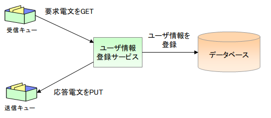

# ユーザ情報登録サービスの仕様

## 機能概要

外部システムからの送信電文を受信し、ユーザ情報テンポラリテーブルにレコードを登録するサービス。

ユーザ情報テンポラリテーブルは後続の常駐バッチが一定時間間隔で監視し、未処理データが存在する場合にユーザ情報を登録する。

**ユーザ情報登録処理**:
- INPUT: ユーザ情報登録電文
- OUTPUT: ユーザ情報テンポラリ、応答電文
- 精査仕様:
  - 要求電文レイアウト: フレームワーク制御ヘッダ（ヘッダレコード）→ ユーザ情報データレコードの順
  - ヘッダレコード・データレコードのレイアウト仕様は要求電文仕様を参照
  - データレコード各項目のドメイン精査は要求電文仕様を参照

keywords

MOMメッセージング, ユーザ情報登録, メッセージ受信処理, ユーザ情報テンポラリ, 常駐バッチ連携, 応答電文

## 要求電文仕様

【ヘッダレコード：50バイト】

| 項目名 | データタイプ | 開始位置 | バイト数 | 説明 |
|---|---|---|---|---|
| リクエストID | X | 1 | 20 | 'RM11AC0101'固定 |
| 再送要求フラグ | X | 21 | 1 | '0': 初回送信 / '1': 再送要求 / 空白: 再送不要 |
| ステータスコード | X | 22 | 8 | 空白（半角スペース）。応答電文用の領域 |
| (未使用) | X | 30 | 21 | 空白（半角スペース） |

【データレコード：420バイト】

| 項目名 | データタイプ | 開始位置 | バイト数 | 説明 |
|---|---|---|---|---|
| ログインID | X | 1 | 20 | 半角:20桁以下:必須 |
| 漢字氏名 | N | 21 | 100 | 全角:50桁以下:必須 |
| カナ氏名 | N | 121 | 100 | 全角カナ:50桁以下:必須 |
| FILLER1 | X | 221 | 50 | 空白（半角スペース） |
| メールアドレス | X | 271 | 100 | 半角:100桁以下:必須 |
| 内線番号(ビル番号) | 9 | 371 | 2 | 半角数字:2桁以下:必須 |
| 内線番号(個人番号) | 9 | 373 | 4 | 半角数字:4桁以下:必須 |
| 携帯電話番号(市外) | 9 | 377 | 3 | 半角数字:3桁以下 |
| 携帯電話番号(市内) | 9 | 380 | 4 | 半角数字:4桁以下。携帯電話番号(市外)が入力された場合は必須、未入力の場合は未入力であること |
| 携帯電話番号(加入) | 9 | 384 | 4 | 半角数字:4桁以下。携帯電話番号(市外)が入力された場合は必須、未入力の場合は未入力であること |
| FILLER2 | X | 388 | 33 | 空白（半角スペース） |

keywords

ヘッダレコード, データレコード, リクエストID, 再送要求フラグ, ステータスコード, ログインID, 漢字氏名, カナ氏名, メールアドレス, 内線番号, 携帯電話番号, 電文レイアウト, フレームワーク制御ヘッダ

## 応答電文仕様

【ヘッダレコード：50バイト】

| 項目名 | データタイプ | 開始位置 | バイト数 | 説明 |
|---|---|---|---|---|
| リクエストID | X | 1 | 20 | 'RM11AC0101'固定 |
| 再送要求フラグ | X | 21 | 1 | '0': 初回送信 / '1': 再送要求 / 空白: 再送不要 |
| ステータスコード | X | 22 | 8 | 本サービス側の処理結果を表すコード。詳細はステータスコード/障害コード仕様を参照 |
| (未使用) | X | 30 | 21 | 空白（半角スペース） |

【データレコード：50バイト】

| 項目名 | データタイプ | 開始位置 | バイト数 | 説明 |
|---|---|---|---|---|
| 障害事由コード | X | 1 | 20 | 障害事由を表すコード値。詳細はステータスコード/障害コード仕様を参照 |
| 問い合わせID | X | 21 | 20 | ユーザ情報テンポラリ.ユーザ情報IDに登録した値 |
| FILLER | X | 41 | 10 | 空白（半角スペース） |

keywords

応答電文, ステータスコード, 再送要求フラグ, 障害事由コード, 問い合わせID, レスポンス電文, ヘッダレコード

## ステータスコード/障害コード仕様

| No | ステータスコード | 障害コード | 原因 |
|---|---|---|---|
| 1 | 200 | (空白) | 正常終了 |
| 2 | 400 | NR11AA4001 | 要求電文データレコード部項目精査エラー |
| 3 | 500 | NR11AA5001 | 要求電文のデータレコード部レイアウト不正 |
| 4 | 500 | NB11AA5000 | その他の意図しないエラーにより業務処理が失敗した場合 |

keywords

ステータスコード, 障害コード, エラーコード, NR11AA4001, NR11AA5001, NB11AA5000, 正常終了, 精査エラー

## エンティティ情報

エンティティ論理名：ユーザ情報テンポラリ

| カラム論理名 | 入力データ |
|---|---|
| ユーザ情報ID | ユーザ情報IDで採番した値 |
| ログインID | 要求電文.データレコード.ログインID |
| 漢字氏名 | 要求電文.データレコード.漢字氏名 |
| カナ氏名 | 要求電文.データレコード.カナ氏名 |
| メールアドレス | 要求電文.データレコード.メールアドレス |
| 内線番号(ビル番号) | 要求電文.データレコード.内線番号(ビル番号) |
| 内線番号(個人番号) | 要求電文.データレコード.内線番号(個人番号) |
| 携帯電話番号(市外) | 要求電文.データレコード.携帯電話番号(市外) |
| 携帯電話番号(市内) | 要求電文.データレコード.携帯電話番号(市内) |
| 携帯電話番号(加入) | 要求電文.データレコード.携帯電話番号(加入) |
| ステータス | 未処理('0') |

keywords

ユーザ情報テンポラリ, エンティティ, ユーザ情報ID, ステータス未処理, カラム定義

