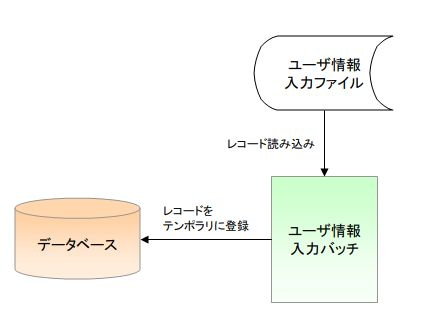

# ユーザ情報入力バッチの仕様

## 機能概要

ユーザ情報ファイルを入力として、ユーザ情報テンポラリテーブルを作成する。

> **Note:**
> 本サンプルアプリケーションでは、ファイル入力バッチのサンプルを示すために
> CSVファイルと固定長ファイルの２種類のファイル入力バッチを提供する。

主な仕様は、以下の通り。

1. ユーザ情報入力処理

ユーザ情報ファイルを読み込み、データレコードの情報をユーザ情報テンポラリに登録する。

【INPUTデータ】

* ユーザ情報入力ファイル

【OUTPUTデータ】

* ユーザ情報テンポラリ

【精査仕様】

ファイルのレイアウトは、ヘッダレコード→データレコード(データレコードは、存在していなくても良い)→トレーラレコード→エンドレコードの順であること。

[レイアウト精査]

1. １レコード目はヘッダーレコードであること。
2. ２レコード目以降にデータレコードが複数存在していること。ただし、データレコードが存在しない場合は、トレーラレコードであること。
3. データレコードの次のレコードは、トレーラレコードであること。
4. 最終レコードはエンドレコードであること。

[トレーラレコードの精査]

1. トレーラレコードの総レコード数が、データレコードのレコード数と一致すること。

上記以外の精査仕様については、下記のファイル情報を参照。

## エンティティ情報

エンティティ論理名：ユーザ情報テンポラリ

| カラム論理名 | 入力データ |
|---|---|
| ユーザ情報ID | ユーザ情報IDで採番した値 |
| ログインID | ユーザ情報ファイル.ログインID |
| 漢字氏名 | ユーザ情報ファイル.漢字氏名 |
| カナ氏名 | ユーザ情報ファイル.カナ氏名 |
| メールアドレス | ユーザ情報ファイル.メールアドレス |
| 内線番号(ビル番号) | ユーザ情報ファイル.内線番号(ビル番号) |
| 内線番号(個人番号) | ユーザ情報ファイル.内線番号(個人番号) |
| 携帯電話番号(市外) | ユーザ情報ファイル.携帯電話番号(市外) |
| 携帯電話番号(市内) | ユーザ情報ファイル.携帯電話番号(市内) |
| 携帯電話番号(加入) | ユーザ情報ファイル.携帯電話番号(加入) |

## ファイル情報

【ヘッダレコード】

| 項目名 | データタイプ | 開始位置 | バイト数 | 説明 |
|---|---|---|---|---|
| レコード区分 | X | 1 | 1 | ヘッダレコードを示す区分値 ('1'固定) |
| 日付 | X | 2 | 8 | 業務日付と一致していること。 |
| FIRREL | X | 9 | 411 | 空白（半角スペース） |

【データレコード】

| 項目名 | データタイプ | 開始位置 | バイト数 | 説明 |
|---|---|---|---|---|
| レコード区分 | X | 1 | 1 | データレコードを示す区分値 ('2'固定) |
| ログインID | X | 2 | 20 | 半角:20桁以下:必須 |
| 漢字氏名 | N | 22 | 100 | 全角:50桁以下:必須 |
| カナ氏名 | N | 122 | 100 | 全角カナ:50桁以下:必須 |
| FILLER1 | X | 222 | 50 |  |
| メールアドレス | X | 272 | 100 | 半角:100桁以下:必須 |
| 内線番号(ビル番号) | 9 | 372 | 2 | 半角数字:2桁以下:必須 |
| 内線番号(個人番号) | 9 | 374 | 4 | 半角数字:4桁以下:必須 |
| 携帯電話番号(市外) | 9 | 376 | 3 | 半角数字:3桁以下 |
| 携帯電話番号(市内) | 9 | 379 | 4 | 半角数字:4桁以下 ※携帯電話番号(市外)が入力された場合は必須 　携帯電話番号(市外)が未入力の場合は、未入力であること |
| 携帯電話番号(加入) | 9 | 384 | 4 | 半角数字:4桁以下:必須 ※携帯電話番号(市外)が入力された場合は必須 　携帯電話番号(市外)が未入力の場合は、未入力であること |
| FILLER2 | X | 389 | 32 | 空白（半角スペース） |

【トレーラレコード】

| 項目名 | データタイプ | 開始位置 | バイト数 | 説明 |
|---|---|---|---|---|
| レコード区分 | X | 1 | 1 | トレーラレコードを示す区分値 ('8'固定) |
| 総件数 | 9 | 2 | 19 | データレコードの総件数と一致すること。 |
| FILLER | X | 21 | 400 | 空白（半角スペース） |

【エンドレコード】

| 項目名 | データタイプ | 開始位置 | バイト数 | 説明 |
|---|---|---|---|---|
| レコード区分 | X | 1 | 1 | エンドレコードを示す区分値 ('9'固定) |
| FILLER | X | 2 | 419 | 空白（半角スペース） |

## 障害通知仕様

| No | 終了コード | 障害コード | 原因 |
|---|---|---|---|
| 1 | 100 | NB11AA0102 | ファイルのレイアウトが不正な場合 |
| 2 | 101 | NB11AA0103 | トレーラレコードの総件数とデータレコードのレコード数が不一致の場合 |
| 3 | 102 | NB11AA0104 | ヘッダーレコードの日付が業務日付と不一致の場合 |
